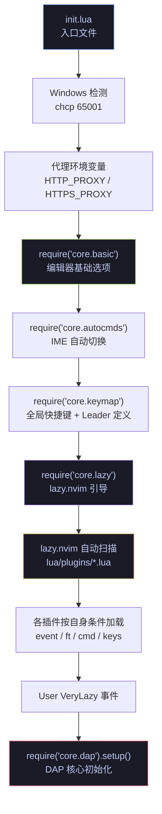
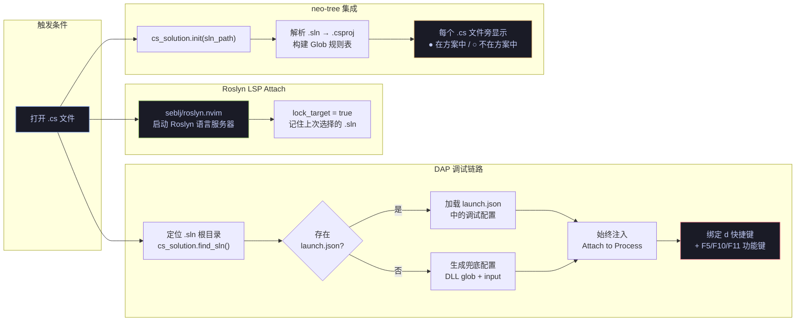

这是一套运行在 **Windows** 平台上、以 **C# / .NET 开发**为核心场景的 Neovim 配置。它不依赖 LazyVim 等发行版框架，而是从零搭建了一套精简而完整的模块化结构——涵盖 Roslyn LSP 智能补全、netcoredbg 断点调试、`.sln` 文件归属状态可视化、Git 工作流、以及 Windows 专属的 Shell / 代理 / IME 适配。本文将带你鸟瞰整个项目的目录布局、模块加载流程与功能域划分，为后续深入阅读各模块文档提供导航地图。

Sources: [init.lua](init.lua#L1-L23), [lua/core/lazy.lua](lua/core/lazy.lua#L24-L31)

---

## 项目目录结构

项目的顶层结构遵循 Neovim 标准配置目录约定——入口文件 `init.lua` 位于根目录，所有 Lua 模块收纳在 `lua/` 下。核心配置与插件配置被清晰地分为两个层次：

```
.
├── init.lua                 ← Neovim 入口：代理设置 + 加载核心模块
├── lua/
│   ├── core/                ← 核心基础设施（不依赖具体插件）
│   │   ├── basic.lua        ←   编辑器选项：行号、缩进、编码、Shell
│   │   ├── autocmds.lua     ←   自动命令：IME 自动切换
│   │   ├── keymap.lua       ←   全局快捷键：Leader 定义、窗口、搜索
│   │   ├── lazy.lua         ←   lazy.nvim 引导与插件加载入口
│   │   └── dap.lua          ←   DAP 核心：适配器注册、启动配置、调试快捷键
│   ├── cs_solution.lua      ← 自定义模块：.sln / .csproj 解析与 Glob 匹配
│   └── plugins/             ← 插件声明（一个文件 = 一个功能域）
│       ├── roslyn.lua       ←   C# LSP（Roslyn）
│       ├── dap-cs.lua       ←   DAP 插件声明（lazy=true 延迟加载）
│       ├── blink.lua        ←   自动补全框架（blink.cmp）
│       ├── mason.lua        ←   LSP 包管理与通用 LSP 配置
│       ├── telescope.lua    ←   模糊查找器
│       ├── neo-tree.lua     ←   文件浏览器（含 .cs 归属状态显示）
│       ├── treesitter.lua   ←   语法高亮与折叠
│       ├── lspsaga.lua      ←   LSP 操作增强
│       ├── lazygit.lua      ←   Git 图形界面
│       ├── gitsigns.lua     ←   行级 Git 变更标记
│       ├── diffview.lua     ←   差异查看
│       ├── lualine.lua      ←   状态栏
│       ├── noice.lua        ←   消息/命令行 UI 重构
│       ├── whichkey.lua     ←   快捷键提示
│       ├── toggleterm.lua   ←   浮动终端
│       ├── tokyonight.lua   ←   主题
│       ├── bufferline.lua   ←   Buffer 标签页
│       ├── flash.lua        ←   快速跳转
│       ├── hop.lua          ←   单词跳转
│       ├── aerial.lua       ←   代码大纲
│       ├── yazi.lua         ←   文件管理器
│       ├── grug-far.lua     ←   项目级搜索替换
│       ├── nvim-ufo.lua     ←   代码折叠
│       ├── nvim-autopairs.lua←  自动配对
│       ├── nvim-surround.lua←   环绕编辑
│       ├── snacks.lua       ←   Dashboard 启动页
│       ├── fidget.lua       ←   LSP 进度显示
│       ├── render-markdown.lua← Markdown 渲染
│       ├── smear-cursor.lua ←   光标拖影动效
│       ├── obsidian.lua     ←   Obsidian 笔记集成
│       └── ...              ←   其他插件
├── openspec/                ← OpenSpec 设计文档与变更记录
├── stylua.toml              ← Lua 格式化规则
├── .neoconf.json            ← neoconf 配置（lua_ls 集成）
└── nvim_edit.ps1            ← PowerShell 远程编辑脚本
```

**设计要点**：`lua/core/` 与 `lua/plugins/` 的分野至关重要——前者是**不依赖任何插件**的基础设施层（编辑器选项、快捷键、lazy.nvim 引导），后者是**每个文件对应一个插件**的声明式配置层。`cs_solution.lua` 则是一个独立的工具模块，同时服务于 neo-tree 的文件归属显示和 DAP 的项目根目录定位。

Sources: [lua/core/basic.lua](lua/core/basic.lua#L1-L62), [lua/core/keymap.lua](lua/core/keymap.lua#L1-L68), [lua/core/lazy.lua](lua/core/lazy.lua#L1-L33), [lua/cs_solution.lua](lua/cs_solution.lua#L1-L18)

---

## 模块加载流程

Neovim 启动时，配置的加载遵循一条清晰的线性链条。理解这条链条是掌握整个配置行为的关键：



**加载顺序的关键细节**：

1. **`init.lua`** 最先执行，在 Windows 环境下将控制台代码页设为 UTF-8（防止子进程如 lazygit 出现中文乱码），随后设置 HTTP 代理环境变量。
2. **`core/basic.lua`** 配置编辑器选项：相对行号、4 空格缩进、PowerShell 7 作为默认 Shell、系统剪贴板集成，以及 SSH 环境下的 OSC 52 剪贴板转发。
3. **`core/lazy.lua`** 引导 lazy.nvim 并通过 `{ import = "plugins" }` 自动扫描 `lua/plugins/` 目录下的所有模块。注意：LazyVim 的 import 已被**注释掉**，说明这是一个纯手写的配置，不依赖 LazyVim 发行版。
4. **`core/dap.lua`** 的初始化被延迟到 `VeryLazy` 事件，确保所有插件加载完毕后才注册 DAP 适配器、加载 `launch.json`、绑定调试快捷键。

Sources: [init.lua](init.lua#L1-L23), [lua/core/lazy.lua](lua/core/lazy.lua#L24-L31), [lua/core/dap.lua](lua/core/dap.lua#L101-L110)

---

## 功能域总览

以下表格按功能域分组，汇总了本项目集成的所有插件及其核心职责。表格中的 **加载时机** 列表示 lazy.nvim 何时激活该插件——`lazy` 表示手动延迟加载，`VeryLazy` 表示在 Neovim 完成基本初始化后自动加载，`ft=cs` 表示仅在打开 C# 文件时加载。

### C# / .NET 开发环境

| 插件 | 职责 | 加载时机 | 配置文件 |
|------|------|----------|----------|
| **roslyn.nvim** | C# 语言服务器（Roslyn LSP），提供智能补全、诊断、代码操作 | `ft=cs` | [roslyn.lua](lua/plugins/roslyn.lua) |
| **nvim-dap** + **netcoredbg** | 基于 Debug Adapter Protocol 的 .NET 断点调试 | VeryLazy 后由 DAP 核心 | [dap-cs.lua](lua/plugins/dap-cs.lua), [core/dap.lua](lua/core/dap.lua) |
| **nvim-dap-ui** | 调试时的变量、调用栈、断点可视化面板 | lazy (DAP 启动时) | [dap-cs.lua](lua/plugins/dap-cs.lua) |
| **nvim-dap-virtual-text** | 在代码行旁以内联文本显示变量值 | lazy (DAP 启动时) | [dap-cs.lua](lua/plugins/dap-cs.lua) |
| **cs_solution** | 自定义 `.sln` / `.csproj` 解析器，Glob 匹配引擎 | 需要时 require | [cs_solution.lua](lua/cs_solution.lua) |
| **neo-tree** (集成) | 文件浏览器中显示 `.cs` 文件是否被解决方案编译的 ●/○ 图标 | VeryLazy | [neo-tree.lua](lua/plugins/neo-tree.lua) |

Sources: [lua/plugins/roslyn.lua](lua/plugins/roslyn.lua#L1-L67), [lua/core/dap.lua](lua/core/dap.lua#L101-L148), [lua/cs_solution.lua](lua/cs_solution.lua#L142-L171)

### 代码补全与语言智能

| 插件 | 职责 | 加载时机 | 配置文件 |
|------|------|----------|----------|
| **blink.cmp** | 高性能自动补全框架（替代 nvim-cmp），支持 LSP / snippet / buffer / path 源 | InsertEnter / CmdlineEnter | [blink.lua](lua/plugins/blink.lua) |
| **mason.nvim** | LSP / DAP / Linter 的包管理器，含自定义 registry（roslyn） | VeryLazy | [mason.lua](lua/plugins/mason.lua) |
| **nvim-treesitter** | 增量语法解析，提供高亮、缩进、折叠；预装 `c_sharp`、`razor` 等解析器 | 首次打开对应文件 | [treesitter.lua](lua/plugins/treesitter.lua) |
| **lspsaga.nvim** | LSP 操作增强：浮动重命名、代码操作面板、诊断跳转 | cmd = "Lspsaga" | [lspsaga.lua](lua/plugins/lspsaga.lua) |
| **fidget.nvim** | LSP 后台分析进度可视化（旋转动画 + 完成提示） | LspAttach | [fidget.lua](lua/plugins/fidget.lua) |

Sources: [lua/plugins/blink.lua](lua/plugins/blink.lua#L1-L116), [lua/plugins/mason.lua](lua/plugins/mason.lua#L22-L83), [lua/plugins/treesitter.lua](lua/plugins/treesitter.lua#L1-L24)

### 文件查找与导航

| 插件 | 职责 | 加载时机 | 配置文件 |
|------|------|----------|----------|
| **telescope.nvim** | 模糊查找器：文件、Grep、Git、Diagnostics、DAP 集成 | cmd = "Telescope" / keys | [telescope.lua](lua/plugins/telescope.lua) |
| **flash.nvim** | 快速跳转与 Treesitter 增量选择 | VeryLazy | [flash.lua](lua/plugins/flash.lua) |
| **neo-tree.nvim** | 侧栏文件浏览器，含自定义 `.cs` 归属状态组件 | keys (`<leader>e`) | [neo-tree.lua](lua/plugins/neo-tree.lua) |
| **yazi.nvim** | 浮动式文件管理器集成 | VeryLazy | [yazi.lua](lua/plugins/yazi.lua) |
| **aerial.nvim** | 代码大纲与符号导航（LSP + Treesitter 后端） | VeryLazy | [aerial.lua](lua/plugins/aerial.lua) |
| **hop.nvim** | 单词级别快速跳转 | keys (`<leader>hp`) | [hop.lua](lua/plugins/hop.lua) |

Sources: [lua/plugins/telescope.lua](lua/plugins/telescope.lua#L1-L109), [lua/plugins/flash.lua](lua/plugins/flash.lua#L1-L26), [lua/plugins/neo-tree.lua](lua/plugins/neo-tree.lua#L37-L108)

### Git 工作流

| 插件 | 职责 | 加载时机 | 配置文件 |
|------|------|----------|----------|
| **lazygit.nvim** | 终端内 Git 图形界面（LazyGit） | cmd / keys (`<leader>gg`) | [lazygit.lua](lua/plugins/lazygit.lua) |
| **gitsigns.nvim** | 行级增删改标记、Hunk 预览、行内 Blame | VeryLazy | [gitsigns.lua](lua/plugins/gitsigns.lua) |
| **diffview.nvim** | 全文件差异视图与文件历史 | cmd / keys | [diffview.lua](lua/plugins/diffview.lua) |

Sources: [lua/plugins/lazygit.lua](lua/plugins/lazygit.lua#L1-L12), [lua/plugins/gitsigns.lua](lua/plugins/gitsigns.lua#L1-L31), [lua/plugins/diffview.lua](lua/plugins/diffview.lua#L1-L11)

### 编辑体验增强

| 插件 | 职责 | 加载时机 | 配置文件 |
|------|------|----------|----------|
| **nvim-autopairs** | 自动配对括号、引号 | InsertEnter | [nvim-autopairs.lua](lua/plugins/nvim-autopairs.lua) |
| **nvim-surround** | 环绕编辑（添加/修改/删除引号、括号等） | VeryLazy | [nvim-surround.lua](lua/plugins/nvim-surround.lua) |
| **nvim-ufo** | 基于Treesitter/LSP 的现代代码折叠 | 手动 require | [nvim-ufo.lua](lua/plugins/nvim-ufo.lua) |
| **grug-far.nvim** | 项目级搜索替换（支持正则、文件过滤） | cmd / keys (`<leader>sr`) | [grug-far.lua](lua/plugins/grug-far.lua) |
| **render-markdown.nvim** | Markdown 文件美化渲染 | VeryLazy | [render-markdown.lua](lua/plugins/render-markdown.lua) |

Sources: [lua/plugins/nvim-surround.lua](lua/plugins/nvim-surround.lua#L1-L6), [lua/plugins/grug-far.lua](lua/plugins/grug-far.lua#L1-L24), [lua/plugins/nvim-ufo.lua](lua/plugins/nvim-ufo.lua#L1-L25)

### 界面与终端

| 插件 | 职责 | 加载时机 | 配置文件 |
|------|------|----------|----------|
| **tokyonight.nvim** | 配色主题（Moon 变体） | 启动时 | [tokyonight.lua](lua/plugins/tokyonight.lua) |
| **lualine.nvim** | 状态栏：模式、分支、文件名、诊断、DAP 状态、Lazy 更新 | VeryLazy | [lualine.lua](lua/plugins/lualine.lua) |
| **bufferline.nvim** | Buffer 标签页：诊断图标、快速切换/关闭 | 启动时（lazy=false） | [bufferline.lua](lua/plugins/bufferline.lua) |
| **noice.nvim** | 消息/命令行/弹窗 UI 全面重构 | VeryLazy | [noice.lua](lua/plugins/noice.lua) |
| **toggleterm.nvim** | 浮动终端（默认 PowerShell 7） | keys (`Ctrl+\`) | [toggleterm.lua](lua/plugins/toggleterm.lua) |
| **which-key.nvim** | 快捷键分组提示面板（Helix 风格） | VeryLazy | [whichkey.lua](lua/plugins/whichkey.lua) |
| **smear-cursor.nvim** | 光标移动拖影动效 | VeryLazy | [smear-cursor.lua](lua/plugins/smear-cursor.lua) |
| **snacks.nvim** | Dashboard 启动页 | 启动时 | [snacks.lua](lua/plugins/snacks.lua) |

Sources: [lua/plugins/tokyonight.lua](lua/plugins/tokyonight.lua#L1-L11), [lua/plugins/lualine.lua](lua/plugins/lualine.lua#L39-L131), [lua/plugins/whichkey.lua](lua/plugins/whichkey.lua#L1-L75)

### 工程化与辅助工具

| 文件 | 职责 |
|------|------|
| **stylua.toml** | Lua 代码格式化规则：2 空格缩进、120 列宽 |
| **.neoconf.json** | neoconf 配置：为 lua_ls 提供项目级补全与类型注解 |
| **nvim_edit.ps1** | PowerShell 脚本：检测 Neovim Server 模式，支持远程标签页打开 |
| **openspec/** | OpenSpec 规范驱动的设计文档、变更提案与任务跟踪 |

Sources: [stylua.toml](stylua.toml#L1-L3), [.neoconf.json](.neoconf.json#L1-L16), [nvim_edit.ps1](nvim_edit.ps1#L1-L12)

---

## C# / .NET 开发的核心链路

本配置最核心的价值在于将 C# 开发体验的三大支柱——**语言智能**、**调试能力**、**项目感知**——通过 `LspAttach` 事件串联为一条自动化链路：



**链路要点**：

- 当你打开一个 `.cs` 文件时，**roslyn.nvim** 通过 `ft = "cs"` 条件加载，启动 Roslyn 语言服务器。`lock_target = true` 配置确保每次不会重复弹出解决方案选择器。
- **`core/dap.lua`** 在 `LspAttach` 事件中检查 `client.name == "roslyn"` 后，沿目录树向上搜索 `.sln` 文件（最多 6 层），以此为根目录定位 `launch.json` 或生成兜底 DLL 路径。
- **neo-tree** 同样监听 `LspAttach`，在 Roslyn 首次附加时调用 `cs_solution.init()` 解析解决方案结构，随后在文件树中为每个 `.cs` 文件显示归属状态图标。

Sources: [lua/plugins/roslyn.lua](lua/plugins/roslyn.lua#L7-L13), [lua/core/dap.lua](lua/core/dap.lua#L162-L203), [lua/plugins/neo-tree.lua](lua/plugins/neo-tree.lua#L15-L35), [lua/cs_solution.lua](lua/cs_solution.lua#L142-L171)

---

## 设计哲学与约束

本配置有几个贯穿始终的设计决策值得在总览层面说明：

**不依赖 LazyVim 发行版**。虽然 `lazy.lua` 中保留了 LazyVim import 的注释行，但它在实际加载中不起作用。所有配置均为手写，避免了 LazyVim 的隐式默认值干扰，但代价是需要自行维护所有插件间的协调逻辑。

**Windows 优先适配**。从 Shell 设置（`pwsh`）、代理环境变量、IME 输入法自动切换（退出插入模式切英文 1033，进入插入模式切中文 2052）、到文件编码兼容（`gbk`/`gb18030`），整个配置深度适配了 Windows 中文开发环境。

**Leader 键为空格**。`vim.g.mapleader = " "` 意味着空格键是所有自定义快捷键的入口前缀。`<leader>d` 管调试、`<leader>c` 管代码操作、`<leader>f` 管文件查找、`<leader>g` 管 Git——这些分组在 which-key 中有完整的提示定义。

**lazy.nvim 按需加载**。每个插件通过 `event`、`ft`、`cmd`、`keys` 等触发条件实现懒加载，避免启动时加载所有插件。`dap.lua` 的初始化进一步延迟到 `VeryLazy` 事件，确保依赖的插件（如 telescope-dap、dap-ui）已就绪。

Sources: [lua/core/keymap.lua](lua/core/keymap.lua#L1-L2), [lua/core/basic.lua](lua/core/basic.lua#L29-L35), [lua/core/autocmds.lua](lua/core/autocmds.lua#L6-L23), [lua/core/lazy.lua](lua/core/lazy.lua#L24-L31)

---

## 推荐阅读路线

根据你的需求，可以按以下路径深入探索本配置的各个层面：

**入门路径**（建议按顺序阅读）：
1. [环境搭建与首次启动](2-huan-jing-da-jian-yu-shou-ci-qi-dong) — 了解前置依赖、安装步骤与首次启动预期
2. [快捷键体系速览（Leader 键与核心操作）](3-kuai-jie-jian-ti-xi-su-lan-leader-jian-yu-he-xin-cao-zuo) — 掌握空格 Leader 键的分组逻辑和常用操作

**架构理解**：
3. [整体架构与模块加载流程](4-zheng-ti-jia-gou-yu-mo-kuai-jia-zai-liu-cheng) — 深入理解 `core/` 与 `plugins/` 的分层设计与加载时序

**C# / .NET 开发专题**（核心价值链）：
4. [Roslyn LSP 集成与解决方案管理](7-roslyn-lsp-ji-cheng-yu-jie-jue-fang-an-guan-li) — Roslyn 语言服务器的配置细节
5. [cs_solution 模块：.sln / .csproj 解析与 Glob 匹配引擎](10-cs_solution-mo-kuai-sln-csproj-jie-xi-yu-glob-pi-pei-yin-qing) — 自定义解析器的实现原理
6. [C# DAP 调试器：从适配器注册到启动配置](8-c-dap-diao-shi-qi-cong-gua-pei-qi-zhu-ce-dao-qi-dong-pei-zhi) — 调试适配器与启动配置的完整链路
7. [DAP 调试操作：断点、单步、变量修改与热重载](11-dap-diao-shi-cao-zuo-duan-dian-dan-bu-bian-liang-xiu-gai-yu-re-zhong-zai) — 实际调试操作与快捷键