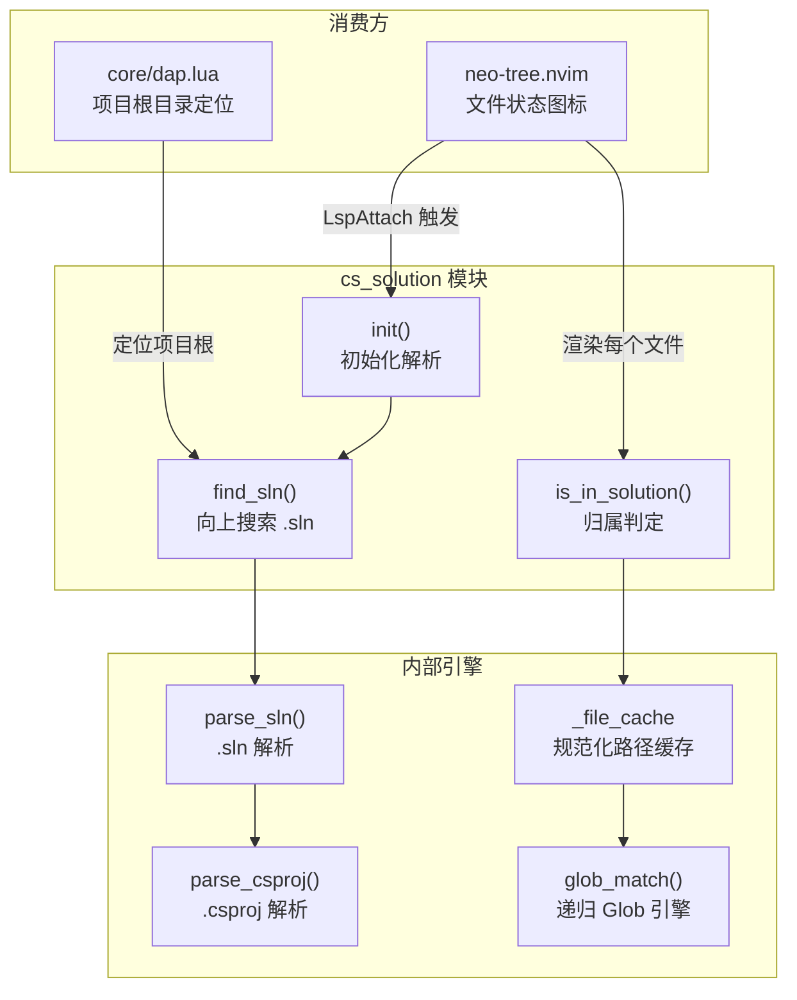
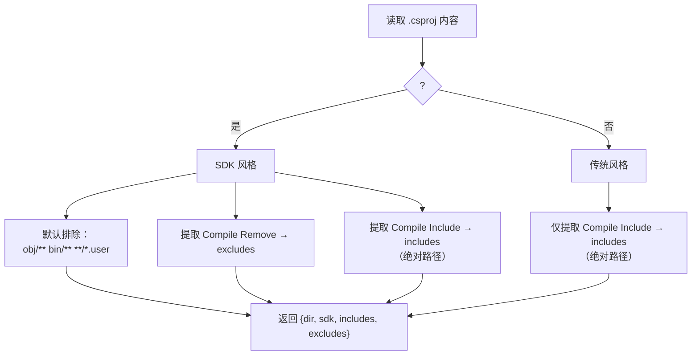

`cs_solution` 是本项目中最具工程深度的独立模块之一——一个 227 行的纯 Lua 实现，承担着"判断任意 .cs 文件是否被当前解决方案编译"这一核心职责。它包含一套完整的 `.sln` → `.csproj` 两级解析管线、一个支持 `*` / `?` / `**` 的递归 Glob 匹配引擎、以及基于规范化路径的 O(1) 缓存层。该模块被 [neo-tree 文件浏览器](18-neo-tree-wen-jian-liu-lan-qi-pei-zhi)和 [DAP 调试器](8-c-dap-diao-shi-qi-cong-gua-pei-qi-zhu-ce-dao-qi-dong-pei-zhi)共同依赖，是 C# / .NET 开发体验中"可视化归属状态"和"定位项目根目录"两项能力的基石。

Sources: [cs_solution.lua](lua/cs_solution.lua#L1-L227)

## 模块定位与依赖关系

`cs_solution` 是一个零插件依赖的纯 Lua 模块，仅依赖 Neovim 内置的 `vim.fn` 和 `vim.api`。它不注册任何 autocmd 或 keymap，而是作为被动服务被其他模块在需要时 `require` 调用。这种设计使得模块可以在任何上下文中独立使用，无需关心触发时机。



Sources: [cs_solution.lua](lua/cs_solution.lua#L1-L7), [neo-tree.lua](lua/plugins/neo-tree.lua#L14-L35), [dap.lua](lua/core/dap.lua#L10-L14)

## 公共 API：三个函数，一个状态标志

模块暴露的公共接口极为精简，仅包含三个函数和一个可读的状态标志：

| API | 签名 | 用途 | 返回值 |
|-----|------|------|--------|
| `find_sln(start_dir)` | `string? → string?` | 从指定目录向上搜索 .sln 文件 | 首个 .sln 绝对路径或 `nil` |
| `init(sln_path)` | `string? → boolean` | 解析 .sln 并构建项目列表 | 是否初始化成功 |
| `is_in_solution(file_path)` | `string → boolean?` | 判断 .cs 文件是否被解决方案编译 | `true` / `false` / `nil`（非 .cs 或未初始化） |
| `_initialized` | `boolean` | 只读状态标志 | 外部用于判断是否已初始化 |

`find_sln` 是唯一一个不依赖初始化状态即可调用的函数——它不修改模块内部状态，仅执行文件系统搜索。`init` 接受可选的 `sln_path` 参数，为 `nil` 时自动调用 `find_sln()` 查找。`is_in_solution` 在模块未初始化时静默返回 `nil`，这一三值语义被 [neo-tree](9-neo-tree-zhong-de-sln-wen-jian-gui-shu-zhuang-tai-xian-shi) 利用为"不显示图标"的信号。

Sources: [cs_solution.lua](lua/cs_solution.lua#L142-L224)

## 路径规范化：跨平台一致性的基石

`normalize` 函数是整个模块中最频繁调用的内部工具，确保所有路径比较在统一坐标系下进行：

```lua
local function normalize(path)
  if not path then return nil end
  local abs = vim.fn.fnamemodify(path, ":p")
  abs = abs:gsub("\\", "/"):gsub("/$", "")
  if has_win32 then abs = abs:lower() end
  return abs
end
```

它执行三个关键变换：**①** `:p` 修饰符将相对路径转为绝对路径；**②** 反斜杠统一为正斜杠并移除尾部斜杠；**③** Windows 平台下强制小写以匹配大小写不敏感的文件系统。这一策略保证了 `C:\Project\Src\App.cs` 和 `c:/project/src/app.cs` 被视为同一路径——这对于后续的缓存命中率和前缀匹配至关重要。

Sources: [cs_solution.lua](lua/cs_solution.lua#L8-L16)

## .sln 解析：提取 .csproj 路径链

`parse_sln` 函数采用正则匹配而非 XML 解析器来提取 `.sln` 中的项目引用，这是基于 `.sln` 格式的特殊考量——它是 Microsoft 自定义的半结构化文本，不是标准 XML：

```lua
for rel_path in content:gmatch('"([^"]*%.csproj)"') do
  rel_path = rel_path:gsub("\\", "/")
  local full_path = normalize(sln_dir .. "/" .. rel_path)
  local proj = parse_csproj(full_path)
  if proj then table.insert(projects, proj) end
end
```

解析流程为：**读取 .sln 内容** → **正则提取所有 `.csproj` 相对路径** → **拼接为绝对路径** → **逐一调用 `parse_csproj` 深度解析**。值得注意的是，`parse_sln` 对无法解析的 .csproj 采取容错策略——`parse_csproj` 返回 `nil` 时直接跳过，不中断整体流程。`find_sln` 的搜索策略则是从指定目录向上最多遍历 6 层父目录，每层用 `vim.fn.glob` 查找 `*.sln`，命中第一个即返回。

Sources: [cs_solution.lua](lua/cs_solution.lua#L123-L155)

## .csproj 解析：SDK 风格检测与编译项提取

`parse_csproj` 的核心任务是区分 **SDK 风格** 和 **传统风格** 的 .csproj，并据此采用不同的包含/排除策略：



**SDK 风格项目**（`<Project Sdk="...">`）是 .NET Core / .NET 5+ 的标准格式，其核心特征是"约定优于配置"——所有 .cs 文件默认被编译，除非被显式排除。因此解析器预设 `obj/**`、`bin/**`、`**/*.user` 三条排除规则，再追加用户在 .csproj 中声明的 `<Compile Remove="...">` 项。显式的 `<Compile Include>` 被单独收集为绝对路径，用于在后续判定中匹配那些虽然不在项目目录下但被显式引用的文件。

**传统风格项目**没有"默认包含"语义，只有显式列出的 `<Compile Include>` 文件才参与编译。解析器将其全部规范化为绝对路径存储。

Sources: [cs_solution.lua](lua/cs_solution.lua#L93-L121)

## Glob 匹配引擎：递归回溯与 `**` 展开

模块中最具算法深度的部分是手工实现的 Glob 匹配引擎，它支持三种通配符：

| 通配符 | 含义 | 匹配范围 |
|--------|------|----------|
| `*` | 任意数量的非路径分隔符字符 | 单个路径分量内 |
| `?` | 恰好一个非路径分隔符字符 | 单个路径分量内 |
| `**` | 零个或多个完整路径分量 | 跨目录层级 |

引擎采用三函数分层架构：**`part_to_pattern`** 将单分量 glob 转为 Lua 正则（转义特殊字符后替换 `*` → `[^/]*`、`?` → `[^/]`）；**`split_parts`** 按 `/` 将路径切分为分量数组；**`glob_match`** 是核心递归函数，以 `(path_parts, path_index, pattern_parts, pattern_index)` 四参数驱动匹配过程。

`**` 的处理是递归回溯的经典实现：

```lua
if gp == "**" then
  for skip = 0, #path_parts - pi + 1 do
    if glob_match(path_parts, pi + skip, pat_parts, gi + 1) then
      return true
    end
  end
  return false
end
```

当遇到 `**` 时，引擎尝试 **跳过 0 到 N 个路径分量**（N 为剩余路径长度），每种跳过量都递归尝试后续匹配。这等价于将 `**` 展开为空串、单段、两段……直到所有剩余路径的笛卡尔积搜索。路径耗尽时的防御逻辑确保了 `obj/**` 在 `obj/` 目录本身上的正确匹配——当路径已耗尽而模式还有剩余时，所有剩余模式分量必须都是 `**` 才返回 `true`。

Sources: [cs_solution.lua](lua/cs_solution.lua#L27-L91)

## 归属判定算法：SDK 与传统项目的分歧路径

`is_in_solution` 是模块的最终出口函数，它根据项目类型走两条完全不同的判定路径：

**SDK 风格项目**的判定逻辑是"前缀匹配 + 排除过滤 + 显式包含"三段式：首先检查文件的规范化路径是否以项目目录为前缀（`norm:sub(1, #prefix) == prefix`），提取相对路径后逐条检查排除规则——只要命中任一 exclude 模式，该文件即被判定为"不在解决方案中"。若未命中排除且通过了前缀检查，则默认属于解决方案。最后，如果前缀匹配失败，还会检查该文件是否出现在 `includes` 列表中（绝对路径精确匹配），以覆盖项目外被显式引用的文件。

**传统风格项目**没有"默认包含"语义，只有 `includes` 列表的绝对路径精确匹配——一个文件只有在被 .csproj 中的 `<Compile Include>` 显式列出时才被视为"在解决方案中"。

两种路径共享同一个结果缓存机制：首次判定的结果以规范化路径为 key 写入 `_file_cache`，后续对同一文件的查询直接返回缓存值。这使得 neo-tree 在滚动浏览大量文件时的性能开销从 O(P×G)（P=项目数，G=glob 模式数）降至 O(1)。

Sources: [cs_solution.lua](lua/cs_solution.lua#L173-L224)

## 消费方集成模式

模块被两个不同场景消费，各自展示了不同的集成策略：

### neo-tree：事件驱动初始化 + 渲染时查询

neo-tree 通过 `LspAttach` autocmd 监听 Roslyn 的首次连接，以 buffer 文件路径为起点调用 `find_sln` → `init` 完成初始化，随后 `vim.schedule` 刷新文件树。初始化守卫 `if cs_sln._initialized then return end` 确保多次 LspAttach 不会重复解析。自定义组件 `cs_sln_status` 在渲染每个文件节点时调用 `is_in_solution`，根据返回值的三值语义渲染绿色实心圆点（`●` / `DiagnosticOk`）、灰色空心圆圈（`○` / `DiagnosticWarn`）或不显示。

Sources: [neo-tree.lua](lua/plugins/neo-tree.lua#L14-L107)

### DAP 调试器：仅使用 find_sln 定位项目根

DAP 模块只调用 `find_sln`，不使用 `init` 或 `is_in_solution`。它的 `project_root` 函数以当前 buffer 的目录为起点向上查找 .sln，然后取 .sln 所在目录作为项目根——这决定了 DLL 搜索路径和 `cwd` 配置。这种"只取定位能力"的消费模式展示了模块 API 的灵活性：不需要完整的解析管线，只借用目录搜索逻辑。

Sources: [dap.lua](lua/core/dap.lua#L10-L14)

## 设计约束与边界行为

模块的几个重要设计约束值得注意：

**搜索深度限制**：`find_sln` 最多向上搜索 6 层目录，超过此深度将返回 `nil`。这是一个实用性折衷——绝大多数 .NET 仓库的 .sln 都在项目根或一级子目录中。

**单 .sln 策略**：`find_sln` 在找到第一个 .sln 后立即返回，不考虑多解决方案场景。当一个目录下存在多个 .sln 时，排序取决于 `vim.fn.glob` 的返回顺序（通常为文件系统字母序）。

**Windows 大小写敏感**：路径规范化中的 `:lower()` 仅在 `has_win32` 时生效。在 Linux/macOS 上路径比较保持大小写敏感，符合文件系统的实际语义。

**缓存无失效机制**：`_file_cache` 在 `init` 时被清空，但初始化后不会自动刷新。如果用户在编辑会话中修改了 .csproj 的 Compile 项，需要重新触发 `init` 才能更新判定结果。neo-tree 的集成中，这通过 Roslyn 重连间接实现。

**pcall 防护**：Glob 匹配引擎在两处关键位置使用 `pcall` 包裹——`part_to_pattern` 的正则匹配可能因极端模式导致 Lua 正则引擎异常，`glob_match` 本身也可能因递归深度引发栈溢出。两处 `pcall` 确保了引擎不会因恶意或畸形模式而崩溃。

Sources: [cs_solution.lua](lua/cs_solution.lua#L47-L91), [cs_solution.lua](lua/cs_solution.lua#L143-L155), [cs_solution.lua](lua/cs_solution.lua#L160-L171)

## 继续阅读

- [neo-tree 中的 .sln 文件归属状态显示](9-neo-tree-zhong-de-sln-wen-jian-gui-shu-zhuang-tai-xian-shi) — 了解 `cs_sln_status` 组件如何将模块输出可视化为文件树中的图标
- [C# DAP 调试器：从适配器注册到启动配置](8-c-dap-diao-shi-qi-cong-gua-pei-qi-zhu-ce-dao-qi-dong-pei-zhi) — 了解 `find_sln` 如何为调试器提供项目根目录定位
- [Roslyn LSP 集成与解决方案管理](7-roslyn-lsp-ji-cheng-yu-jie-jue-fang-an-guan-li) — 了解 Roslyn 与 `cs_solution` 在解决方案选择上的分工