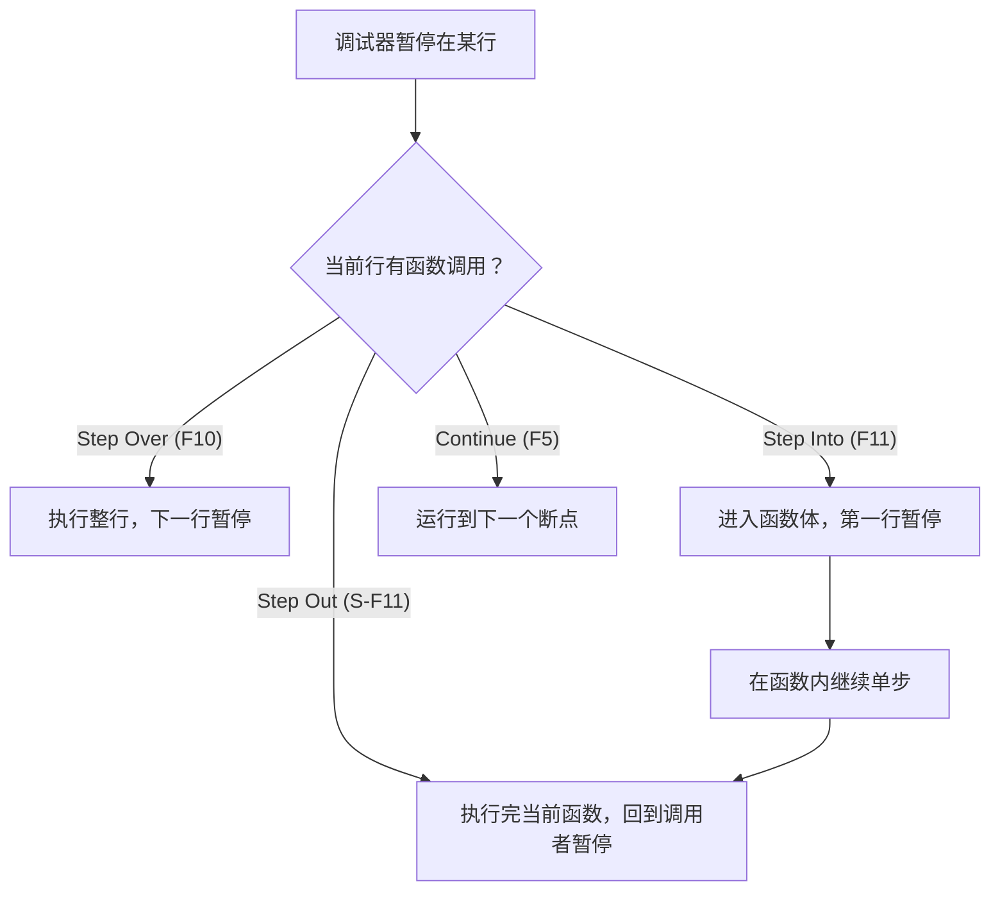
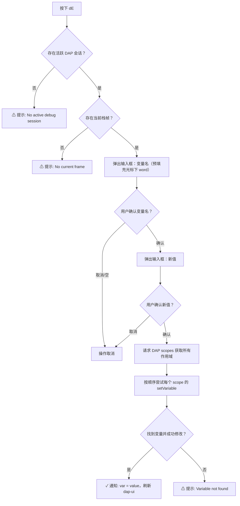
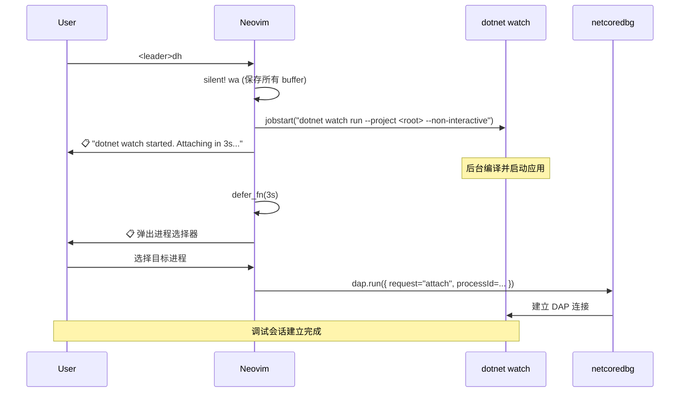
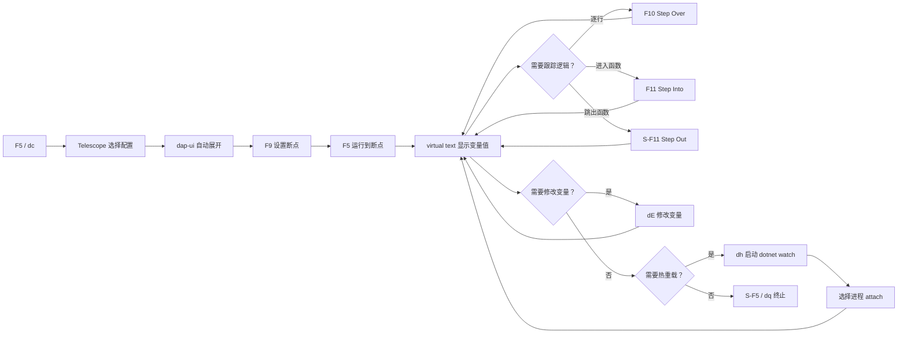

本文档聚焦于 Neovim 中 DAP（Debug Adapter Protocol）调试器的**运行时操作层面**——当你已经启动调试会话后，如何通过断点控制执行流、如何单步跟踪代码路径、如何在暂停状态下交互式修改变量值，以及如何借助 `dotnet watch` 实现 .NET 进程内热重载。关于调试器适配器注册、launch.json 解析与启动配置的底层机制，请参阅 [C# DAP 调试器：从适配器注册到启动配置](8-c-dap-diao-shi-qi-cong-gua-pei-qi-zhu-ce-dao-qi-dong-pei-zhi)。

Sources: [dap.lua](lua/core/dap.lua#L1-L282), [design.md](openspec/changes/dap-keybindings-and-features/design.md#L1-L108)

## 双轨快捷键体系：F 键与 Leader 键并存

本配置采用 **F 键 + `<leader>d` 前缀双轨并存**的设计。F 键（F5/F9/F10/F11/S-F11/S-F5）满足从 Visual Studio 或 VS Code 迁移的肌肉记忆，而 `<leader>d` 前缀键则在终端复用器（tmux、Windows Terminal）可能截获 F 键时提供可靠的后备方案。所有调试快捷键均为 **buffer 局部键位**——仅在附加了 Roslyn LSP 的 `.cs` buffer 上生效，不会污染其他文件类型的键位空间。

Sources: [dap.lua](lua/core/dap.lua#L205-L276), [whichkey.lua](lua/plugins/whichkey.lua#L17)

下表列出了完整的双轨键位映射：

| 操作 | F 键 | Leader 键 | 说明 |
|------|------|-----------|------|
| 启动/继续 | `F5` | `<leader>dc` | 无会话时弹出 Telescope 配置选择器；有会话时直接 Continue |
| 切换断点 | `F9` | `<leader>db` | 当前行有断点则移除，无则添加 |
| 条件断点 | — | `<leader>dB` | 弹出输入框设置命中条件 |
| 单步跳过 | `F10` | `<leader>do` | 执行当前行，停在下一行 |
| 单步进入 | `F11` | `<leader>di` | 进入当前行的函数调用 |
| 单步跳出 | `S-F11` | `<leader>dO` | 执行至当前函数返回 |
| 终止调试 | `S-F5` | `<leader>dq` | 终止会话并关闭 dap-ui |
| 修改变量 | — | `<leader>dE` | 交互式修改当前作用域变量 |
| 热重载 | — | `<leader>dh` | dotnet watch + attach |
| 打开 REPL | — | `<leader>dr` | DAP REPL 交互式求值 |
| 切换 UI | — | `<leader>du` | 打开/关闭 dap-ui 面板 |
| 列出断点 | — | `<leader>dl` | Telescope 断点列表 |
| 调用栈帧 | — | `<leader>df` | Telescope 帧列表 |
| 变量浏览 | — | `<leader>dv` | Telescope 变量列表 |

Sources: [dap.lua](lua/core/dap.lua#L228-L276)

Which-Key 会将 `<leader>d` 注册为 `debug` 分组，按下 `<leader>d` 后会自动弹出可用的子命令提示，降低记忆负担。

Sources: [whichkey.lua](lua/plugins/whichkey.lua#L17)

## 断点管理

### 普通断点

按下 `F9` 或 `<leader>db` 即可在当前光标行切换断点。nvim-dap 会在行号左侧显示红色圆点标记（`●`）表示断点位置。再次按下同一键位则移除断点。

Sources: [dap.lua](lua/core/dap.lua#L243-L244)

### 条件断点

`<leader>dB`（大写 B）触发条件断点设置。按下后弹出 `vim.ui.input` 输入框，输入一个 C# 布尔表达式作为命中条件（例如 `i > 10` 或 `user.Name == "admin"`）。调试器每次执行到该行时会求值此表达式，仅当结果为 `true` 时才暂停执行。若直接提交空字符串，则退化为普通无条件断点。

Sources: [dap.lua](lua/core/dap.lua#L246-L248)

### 断点列表浏览

通过 `<leader>dl` 可调出 Telescope 断点列表，在模糊查找器中浏览当前会话的所有断点位置，选中后跳转到对应文件的对应行。这在大型项目中快速定位散落在多个文件中的断点时尤为实用。

Sources: [dap.lua](lua/core/dap.lua#L273)

## 单步执行控制

单步操作是逐行跟踪代码执行路径的核心手段。本配置提供了三种标准的单步模式：

**Step Over**（`F10` / `<leader>do`）执行当前行的全部代码，如果当前行包含函数调用，则将整个函数执行完毕而不进入函数体，在下一行暂停。这是日常调试中最常用的单步操作——当你确定被调用函数没有问题时，用它跳过函数内部细节。

**Step Into**（`F11` / `<leader>di`）执行当前行代码，如果当前行包含函数调用，则暂停在被调用函数的第一行，允许你进入函数体逐行跟踪。当你怀疑问题出在被调用函数内部时使用。

**Step Out**（`S-F11` / `<leader>dO`）继续执行当前函数的剩余代码，在函数返回到调用者时暂停。当你已经 Step Into 一个函数，但发现不需要继续跟踪其剩余逻辑时，用它快速跳出。

Sources: [dap.lua](lua/core/dap.lua#L233-L240)

三种操作的逻辑关系如下：

Sources: [dap.lua](lua/core/dap.lua#L229-L240)

## 变量修改

### 设计动机

dap-ui 的变量面板虽然内置了按 `e` 键修改变量的功能，但这要求用户先将焦点切换到 dap-ui 的 variables 面板窗口，操作链路较长。本配置通过自定义的 `set_variable()` 函数，允许用户**直接在代码编辑 buffer 中**触发变量修改，无需离开当前上下文。

Sources: [dap.lua](lua/core/dap.lua#L28-L76), [design.md](openspec/changes/dap-keybindings-and-features/design.md#L50-L62)

### 操作流程

按下 `<leader>dE`（大写 E）后，系统执行以下流程：

Sources: [dap.lua](lua/core/dap.lua#L30-L76)

### 关键实现细节

**变量名预填充**：函数使用 `vim.fn.expand("<cword>")` 获取光标下的单词作为变量名默认值。如果光标恰好不在目标变量上（例如停在复杂表达式中间），用户可以在输入框中手动修改变量名。

**多作用域遍历**：调试帧通常包含多个 scope（Locals、Parameters、Globals 等）。`set_variable()` 会依次尝试每个 scope 的 `variablesReference` 发送 `setVariable` 请求，直到某个 scope 返回成功。如果所有 scope 都拒绝修改，则提示用户变量未找到。

**类型兼容性**：新值以字符串形式传入，由 DAP adapter（netcoredbg）负责类型转换。例如输入 `"42"` 会被正确转为整数值。如果类型不匹配，DAP server 会返回错误，函数通过 `vim.notify` 展示错误信息而不抛出异常。

Sources: [dap.lua](lua/core/dap.lua#L42-L75), [spec.md](openspec/changes/dap-keybindings-and-features/specs/dap-set-variable/spec.md#L1-L33)

### 使用场景对照

| 场景 | 操作 | 预期结果 |
|------|------|----------|
| 修改循环计数器 | 光标放在 `i` 上 → `<leader>dE` → 输入 `20` | `i` 被设为 20，跳过中间迭代 |
| 修改条件标志 | 光标放在 `isValid` 上 → `<leader>dE` → 输入 `true` | 强制进入/跳过条件分支 |
| 变量名不在光标上 | `<leader>dE` → 清空预填充 → 手动输入 `myList.Count` → 输入 `0` | 手动指定变量名修改 |
| 会话未启动 | `<leader>dE` | 提示 "No active debug session" |
| 只读变量 | 尝试修改 | 提示 DAP 返回的错误信息 |

Sources: [spec.md](openspec/changes/dap-keybindings-and-features/specs/dap-set-variable/spec.md#L14-L33)

## 热重载（dotnet watch + attach）

### .NET 热重载的架构约束

本配置不使用 DAP 协议的 `Evaluate` 或 `ApplyChanges`（这些是 Visual Studio 的专有协议），而是借助 .NET 6+ 的 `dotnet watch run` 实现进程内热重载。核心思路是：**先启动一个带有热重载能力的 `dotnet watch` 后台进程，再将调试器 attach 到该进程**。

Sources: [design.md](openspec/changes/dap-keybindings-and-features/design.md#L64-L85)

### 操作流程

按下 `<leader>dh` 后，系统执行以下自动化序列：

Sources: [dap.lua](lua/core/dap.lua#L78-L99), [spec.md](openspec/changes/dap-keybindings-and-features/specs/dap-hot-reload/spec.md#L1-L40)

### 关键实现参数

| 参数 | 值 | 说明 |
|------|-----|------|
| 保存策略 | `silent! wa` | 触发热重载前静默保存所有 buffer |
| 后台启动 | `jobstart({detach=true})` | 进程独立于 Neovim 存活，即使 Neovim 退出进程仍在运行 |
| 交互抑制 | `--non-interactive` | 阻止 `dotnet watch` 弹出交互提示阻塞后台进程 |
| 延迟时间 | 3000ms | 等待 `dotnet watch` 编译并启动应用后再弹出进程选择器 |
| Attach 方式 | `pick_process` | 手动从进程列表中选择，避免自动匹配错误进程 |

Sources: [dap.lua](lua/core/dap.lua#L80-L98)

### 热重载支持范围与限制

**支持的变更**（进程内热重载，PID 不变，调试器连接保持）：
- 修改方法体内部的代码
- 修改 lambda 表达式
- 修改异步方法内部逻辑

**不支持的变更**（`dotnet watch` 重启进程，PID 变化，调试器连接断开）：
- 新增/删除类型或方法
- 修改方法签名
- 修改继承关系或接口实现

**断点偏移风险**：热重载后，被热更新方法内的断点可能发生偏移——因为调试器依赖的 PDB（Program Database）符号文件不会随热更新同步刷新。这是 netcoredbg 的架构限制，无法从 Neovim 端解决。触发 `<leader>dh` 时，系统会通过 `vim.notify` 明确告知用户此风险。

Sources: [dap.lua](lua/core/dap.lua#L79), [design.md](openspec/changes/dap-keybindings-and-features/design.md#L78-L85)

### 进程重启后的重连策略

当 `dotnet watch` 因不支持的热重载变更而重启进程时，原有的调试连接会断开。此时用户可以：

1. 按 `F5` 或 `<leader>dc` 打开 Telescope 配置选择器
2. 选择 `.NET: Attach to Process` 配置（此配置始终存在于 `dap.configurations.cs` 中）
3. 从进程列表中选择新的 `dotnet` 进程重新建立连接

Sources: [dap.lua](lua/core/dap.lua#L188-L203), [spec.md](openspec/changes/dap-keybindings-and-features/specs/dap-hot-reload/spec.md#L23-L32)

## 调试界面与辅助工具

### dap-ui 自动管理

dap-ui 在调试会话生命周期中自动管理其面板状态：

| 事件 | 行为 | 触发时机 |
|------|------|----------|
| `event_initialized` | 自动打开 dap-ui | 调试器成功启动后 |
| `event_terminated` | 自动关闭 dap-ui | 调试进程正常结束时 |
| `event_exited` | 自动关闭 dap-ui | 调试进程退出时 |
| 手动 `<leader>du` | 切换 dap-ui 显示 | 用户主动触发 |

dap-ui 打开时会展示四个核心面板：**变量**（Scopes/Watch）、**调用栈**（Frames/Threads）、**断点列表**（Breakpoints）、**REPL 控制台**（Console）。按 `<leader>du` 可随时切换面板显隐而不影响调试会话。

Sources: [dap.lua](lua/core/dap.lua#L138-L144)

### nvim-dap-virtual-text 内联变量显示

`nvim-dap-virtual-text` 插件在断点暂停时，自动将当前作用域内的变量值以虚拟文本形式显示在代码行右侧。这使得你在阅读代码的同时就能直接看到变量的当前值，无需切换到 dap-ui 面板。调试会话结束后，所有虚拟文本标注会被自动清除。

Sources: [dap.lua](lua/core/dap.lua#L147-L148), [spec.md](openspec/specs/csharp-dap-ui/spec.md#L15-L27)

### Telescope DAP 扩展

除了前文提到的 `<leader>dl`（断点列表）、`<leader>df`（栈帧）、`<leader>dv`（变量浏览）之外，Telescope DAP 扩展还在首次按下 `F5`（无活跃会话时）发挥作用——它会以 Telescope 模糊查找器的形式列出所有可用的 launch 配置，包括从 `launch.json` 加载的配置和内置的兜底配置，用户可以快速选择并启动。

Sources: [dap.lua](lua/core/dap.lua#L152-L153), [dap.lua](lua/core/dap.lua#L211-L221)

### Lualine 调试状态指示

状态栏通过 Lualine 集成了 DAP 状态显示。当 DAP 会话活跃时，状态栏右侧会出现紫色的 ` ` 图标加上调试状态文本（如 `Paused` 或 `Running`），让你在任意窗口布局下都能一眼识别当前调试状态。

Sources: [lualine.lua](lua/plugins/lualine.lua#L85-L89)

### DAP REPL

`<leader>dr` 打开 DAP REPL（Read-Eval-Print Loop）窗口。在 REPL 中可以输入任意表达式进行求值，相当于一个轻量级的即时窗口（Immediate Window）。这在需要动态检查复杂表达式或测试代码片段时非常有用。

Sources: [dap.lua](lua/core/dap.lua#L267)

## 完整调试工作流示例

以下是一个典型的调试工作流，展示从启动到终止的完整操作链：

Sources: [dap.lua](lua/core/dap.lua#L101-L279)

## 已知限制与不可用功能

| 功能 | 状态 | 原因 |
|------|------|------|
| Set Next Statement（`dap.goto_()`） | ❌ 不可用 | netcoredbg 不支持 DAP `supportsGotoTargetsRequest` capability |
| Edit-and-Continue | ❌ 不可用 | Visual Studio 专有协议，开源 DAP 生态不支持 |
| 热重载后断点精确定位 | ⚠ 可能偏移 | PDB 符号不会随 dotnet watch 热更新同步 |
| 3 秒 attach 延迟 | ⚠ 大型项目可能不够 | 大型项目首次编译可能超过 3 秒，需手动用 F5 重新 attach |

Sources: [design.md](openspec/changes/dap-keybindings-and-features/design.md#L8-L11), [design.md](openspec/changes/dap-keybindings-and-features/design.md#L22-L24)

## 延伸阅读

- 调试器适配器的注册机制与 launch.json 解析逻辑，参阅 [C# DAP 调试器：从适配器注册到启动配置](8-c-dap-diao-shi-qi-cong-gua-pei-qi-zhu-ce-dao-qi-dong-pei-zhi)
- 调试过程中 Lualine 状态栏的 DAP 状态显示实现，参阅 [Lualine 状态栏与 DAP/Lazy 状态集成](28-lualine-zhuang-tai-lan-yu-dap-lazy-zhuang-tai-ji-cheng)
- 快捷键提示系统中 `<leader>d` 分组的注册方式，参阅 [Which-Key 快捷键提示系统](31-which-key-kuai-jie-jian-ti-shi-xi-tong)