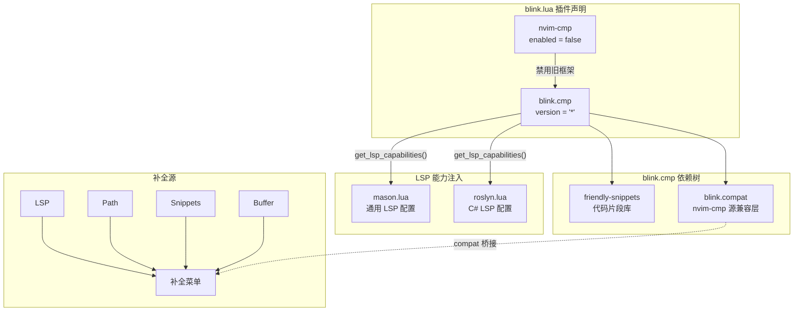
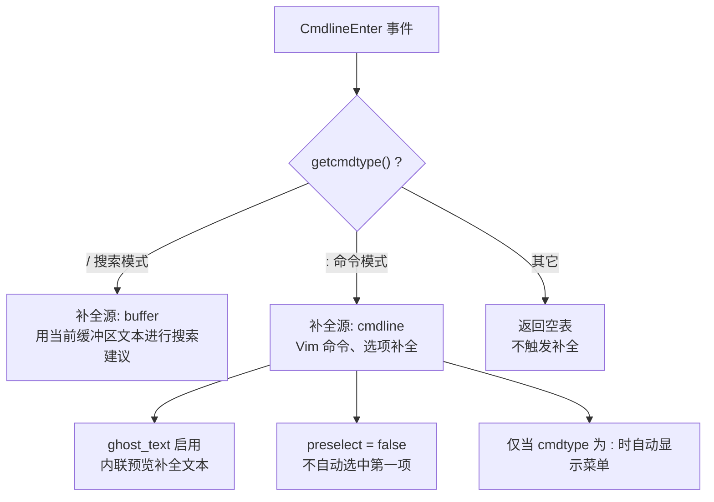

本配置采用 **blink.cmp** 替代传统的 nvim-cmp，作为 Neovim 的自动补全引擎。blink.cmp 是一款用 Rust 编写的高性能补全框架，在补全速度、延迟控制和架构设计上均优于 nvim-cmp。本文档将深入解析该框架在本项目中的配置架构、补全源体系、命令行补全策略，以及与 LSP 的集成方式。

## 架构总览：从 nvim-cmp 到 blink.cmp 的迁移

配置文件 `blink.lua` 采用 lazy.nvim 的多插件声明模式，在同一文件中完成了两件事：**禁用 nvim-cmp** 并 **启用 blink.cmp**。这种"先禁后启"的模式确保不会出现两个补全框架争抢插入模式事件的情况。



首段声明将 `hrsh7th/nvim-cmp` 标记为 `optional = true` 且 `enabled = false`。`optional = true` 表示该插件仅在其它插件显式依赖时才考虑加载，而 `enabled = false` 则彻底阻止其激活。这样做的好处是：如果有其它插件将 nvim-cmp 声明为依赖，lazy.nvim 不会报错，但 nvim-cmp 实际不会被加载。blink.cmp 通过 `event = { "InsertEnter", "CmdlineEnter" }` 实现懒加载——仅在进入插入模式或命令行模式时才触发加载。

Sources: [blink.lua](lua/plugins/blink.lua#L1-L6), [blink.lua](lua/plugins/blink.lua#L24)

## 核心配置项解析

### 外观与代码片段

`appearance.nerd_font_variant = "mono"` 告诉 blink.cmp 当前使用的是 Nerd Font Mono 变体，框架会据此调整补全菜单中图标的间距，确保所有条目的图标列对齐。`snippets.preset = "default"` 选择内置的代码片段引擎，无需额外配置即可与 `friendly-snippets` 配合使用。

Sources: [blink.lua](lua/plugins/blink.lua#L27-L35)

### 补全菜单行为

补全菜单的配置集中在 `completion` 表中，涵盖三个维度：

| 配置项 | 值 | 效果 |
|--------|------|------|
| `accept.auto_brackets.enabled` | `true` | 实验性自动括号补全：选择函数补全项时自动插入 `()` |
| `menu.draw.treesitter` | `{"lsp"}` | 对 LSP 源的补全项使用 Treesitter 进行语法高亮渲染 |
| `documentation.auto_show` | `true` | 选中补全项后自动弹出文档浮动窗口 |
| `documentation.auto_show_delay_ms` | `200` | 文档窗口延迟 200ms 显示，避免快速浏览时的视觉闪烁 |

Treesitter 渲染是 blink.cmp 的一个亮点特性——当 `menu.draw.treesitter` 包含 `"lsp"` 时，LSP 补全菜单中的条目会按照对应语言的语法规则进行高亮，而非纯文本显示，大幅提升可读性。需要注意的是，该功能的正常运作依赖于 [treesitter.lua](lua/plugins/treesitter.lua) 中已安装对应语言的 parser。

Sources: [blink.lua](lua/plugins/blink.lua#L37-L53)

### 补全源声明

```lua
sources = {
    compat = {},
    default = { "lsp", "path", "snippets", "buffer" },
}
```

`default` 定义了四个标准补全源，按优先级排列：

| 源名称 | 触发场景 | 说明 |
|--------|----------|------|
| `lsp` | LSP 服务器提供的语义补全 | 函数、类型、变量等语言级补全 |
| `path` | 输入路径字符串时 | 文件系统路径补全 |
| `snippets` | 输入触发词时 | 来自 friendly-snippets 的代码模板 |
| `buffer` | 当前缓冲区内的文本 | 基于已有文本的词汇补全 |

`compat` 表为空，但它的存在是 `blink.compat` 兼容层工作的关键入口。该机制的设计意图是：当你希望使用 nvim-cmp 生态中的第三方补全源（如 `cmp-nvim-lua`、`cmp-calc` 等）时，只需将其名称添加到 `compat` 数组中，配置阶段的动态注册逻辑会自动处理桥接。

Sources: [blink.lua](lua/plugins/blink.lua#L55-L60)

## 命令行补全：上下文感知策略

命令行补全是本配置中最精巧的部分。不同于插入模式的通用补全，命令行模式根据 `cmdtype` 动态切换补全源：



这种上下文感知设计避免了无关补全的干扰——在搜索模式 (`/`) 下只需要 buffer 源提供已有词汇建议，在命令模式 (`:`) 下则需要 cmdline 源提供命令补全。`ghost_text` 在命令行中以内联灰色文本预览补全内容，而 `preselect = false` 确保用户必须显式选择补全项，防止误触。

键位映射方面，命令行采用 `preset = "cmdline"` 并禁用了 `<Right>` 和 `<Left>` 方向键，强制用户通过 `<Tab>` / `<S-Tab>` 或 `<C-n>` / `<C-p>` 进行补全导航，保持操作的一致性。

Sources: [blink.lua](lua/plugins/blink.lua#L62-L88)

## 键位映射：super-tab 模式

```lua
keymap = {
    preset = "super-tab",
    ["<C-y>"] = { "select_and_accept" },
},
```

`super-tab` 预设定义了一套以 Tab 键为核心的补全交互流程：

| 按键 | 行为 |
|------|------|
| `<Tab>` | 如果有补全菜单则选择下一项，否则插入 Tab |
| `<S-Tab>` | 选择上一项 |
| `<CR>` | 如果已选中补全项则确认，否则插入换行 |
| `<C-y>` | **直接确认**当前选中的补全项（自定义映射） |
| `<C-Space>` | 手动触发补全菜单 |
| `<Esc>` | 关闭补全菜单 |

`<C-y>` 是一个自定义映射，覆盖了 blink.cmp 默认行为中缺少的"直接确认"操作。这在快速编码场景中尤为实用——当你已经通过光标选中了目标补全项，按下 `<C-y>` 即可立即确认并继续输入，无需按 `<CR>` 再担心误触换行。

Sources: [blink.lua](lua/plugins/blink.lua#L90-L93)

## blink.compat 兼容层与动态源注册

`config` 函数实现了一套精巧的**动态源注册机制**，使得向 `compat` 数组添加 nvim-cmp 源名称即可自动完成桥接：

```lua
config = function(_, opts)
    local enabled = opts.sources.default
    for _, source in ipairs(opts.sources.compat or {}) do
        opts.sources.providers = opts.sources.providers or {}
        opts.sources.providers[source] = vim.tbl_deep_extend(
            "force",
            { name = source, module = "blink.compat.source" },
            opts.sources.providers[source] or {}
        )
        if type(enabled) == "table" and not vim.tbl_contains(enabled, source) then
            table.insert(enabled, source)
        end
    end
    opts.sources.compat = nil  -- 移除自定义属性，避免 blink.cmp 校验报错
    require("blink.cmp").setup(opts)
end
```

这段逻辑的工作流程如下：

1. 遍历 `opts.sources.compat` 中的每个源名称
2. 为每个源创建一个 provider 配置，`module = "blink.compat.source"` 将其指向兼容适配器
3. 使用 `vim.tbl_deep_extend("force", ...)` 确保自定义配置覆盖默认值
4. 如果该源不在 `default` 列表中，自动追加进去
5. 最后将 `compat` 设为 `nil`，因为它是自定义属性而非 blink.cmp 的合法配置项，保留会导致框架校验失败

当前 `compat` 为空数组，意味着没有使用任何 nvim-cmp 第三方源。但当你需要添加时（例如 `compat = { "nvim_lua" }`），这段机制会自动将其注册为 blink.cmp 的 provider。

Sources: [blink.lua](lua/plugins/blink.lua#L95-L114)

## LSP 能力注入：blink.cmp 与 LSP 的协作

blink.cmp 通过 `get_lsp_capabilities()` 函数向 LSP 服务器声明客户端的补全能力。本项目中，这一注入发生在两个位置：

**通用 LSP 配置**（[mason.lua](lua/plugins/mason.lua)）在注册每个 LSP 服务器时统一注入：

```lua
config.capabilities = require("blink.cmp").get_lsp_capabilities()
vim.lsp.config(lsp, config)
vim.lsp.enable(lsp)
```

**C# 专用 LSP 配置**（[roslyn.lua](lua/plugins/roslyn.lua)）在 Roslyn 服务器配置中独立注入：

```lua
config = {
    capabilities = require("blink.cmp").get_lsp_capabilities(),
},
```

这种分散注入的模式确保每个 LSP 客户端都能获得 blink.cmp 提供的能力声明（如 snippet 支持、补全项的额外编辑操作等），从而让 LSP 服务器返回更精确的补全结果。同时，blink.cmp 的 `accept.auto_brackets` 功能依赖 LSP 提供的 `additionalTextEdits` 信息来实现括号自动补全。

此外，[noice.lua](lua/plugins/noice.lua) 中通过 `cmp.entry.get_documentation` 的覆盖，使 blink.cmp 的补全文档与 Noice 的 Markdown 渲染管线集成，确保文档浮动窗口中的格式化效果一致。

Sources: [mason.lua](lua/plugins/mason.lua#L47-L48), [roslyn.lua](lua/plugins/roslyn.lua#L11-L12), [noice.lua](lua/plugins/noice.lua#L10)

## 配置速查表

| 维度 | 配置值 | 位置 |
|------|--------|------|
| 加载时机 | `InsertEnter` / `CmdlineEnter` | [blink.lua#L24](lua/plugins/blink.lua#L24) |
| 代码片段引擎 | `default`（内置） | [blink.lua#L28](lua/plugins/blink.lua#L28) |
| 字体变体 | `mono`（Nerd Font Mono） | [blink.lua#L34](lua/plugins/blink.lua#L34) |
| 自动括号 | 已启用（实验性） | [blink.lua#L40-L42](lua/plugins/blink.lua#L40-L42) |
| Treesitter 渲染 | LSP 源 | [blink.lua#L46](lua/plugins/blink.lua#L46) |
| 文档自动显示 | 200ms 延迟 | [blink.lua#L49-L52](lua/plugins/blink.lua#L49-L52) |
| 插入模式补全源 | LSP → Path → Snippets → Buffer | [blink.lua#L59](lua/plugins/blink.lua#L59) |
| 命令行补全源 | 搜索用 buffer，命令用 cmdline | [blink.lua#L78-L87](lua/plugins/blink.lua#L78-L87) |
| 键位预设 | `super-tab` + `<C-y>` 确认 | [blink.lua#L91-L93](lua/plugins/blink.lua#L91-L93) |
| nvim-cmp 兼容 | blink.compat（当前无第三方源） | [blink.lua#L18-L22](lua/plugins/blink.lua#L18-L22) |

## 延伸阅读

- blink.cmp 的 LSP 能力注入直接服务于 [LSP 通用配置与 Mason 包管理](13-lsp-tong-yong-pei-zhi-yu-mason-bao-guan-li) 和 [Roslyn LSP 集成与解决方案管理](7-roslyn-lsp-ji-cheng-yu-jie-jue-fang-an-guan-li) 中的补全体验
- 补全菜单中的 Treesitter 高亮依赖 [Treesitter 语法高亮与折叠](14-treesitter-yu-fa-gao-liang-yu-zhe-die) 中配置的语言 parser
- 自动括号功能与 [自动配对与环绕编辑](24-zi-dong-pei-dui-yu-huan-rao-bian-ji-autopairs-surround) 中的 nvim-autopairs 形成互补的编辑增强层