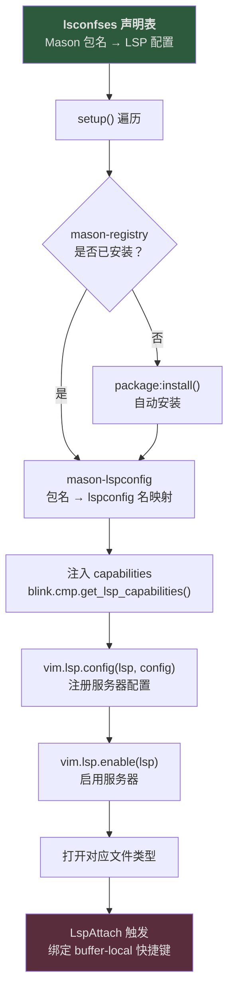
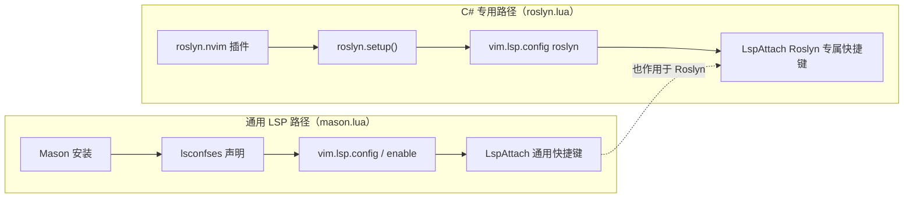

本配置的 LSP 层采用 **Mason 包管理 + Neovim 原生 LSP API** 的双层架构：Mason 负责语言服务器的自动安装与版本管理，Neovim 0.11+ 引入的 `vim.lsp.config()` / `vim.lsp.enable()` 原生 API 负责服务器注册与启用。整个流程在一个插件文件 [mason.lua](lua/plugins/mason.lua) 中完成声明式的闭环——声明服务器、自动安装、注入补全能力、注册配置、绑定快捷键。本文将逐层拆解这一配置的设计思路、核心机制与扩展方法。

Sources: [mason.lua](lua/plugins/mason.lua#L1-L84)

## 架构全景：从安装到生效的四层流水线

在深入代码之前，先建立对整体数据流的理解。下图展示了从一个 LSP 服务器名称声明到最终在编辑器中生效的完整链路：



**关键设计决策**：本配置**未使用**传统的 `lspconfig` 的 `setup()` 方式注册服务器。`nvim-lspconfig` 作为依赖存在，仅提供 Mason 包名到 lspconfig 服务器名的**映射表**（通过 `mason-lspconfig.get_mappings()`）。实际的服务器注册走的是 Neovim 原生 API，这是 0.11+ 版本推荐的新范式，配置更简洁且与 Neovim 内置的 LSP 框架直接集成。

Sources: [mason.lua](lua/plugins/mason.lua#L36-L53)

## 插件依赖与加载时机

Mason 插件的声明采用了 lazy loading 策略，同时依赖了四个关键组件：

| 组件 | 角色 | 加载方式 |
|---|---|---|
| `mason-org/mason.nvim` | 包管理器主体，提供 LSP/DAP/Linter/Formatter 的统一安装界面 | `event = "VeryLazy"` |
| `neovim/nvim-lspconfig` | 提供 Mason 包名 → lspconfig 服务器名的映射 | 随 Mason 加载 |
| `mason-org/mason-lspconfig.nvim` | Mason 与 lspconfig 之间的桥接层 | 随 Mason 加载 |
| `j-hui/fidget.nvim` | LSP 进度通知 UI（独立配置于 [fidget.lua](lua/plugins/fidget.lua)） | 随 Mason 加载 |

`event = "VeryLazy"` 意味着 Mason 及其整个 LSP 配置链会在 Neovim 完成 UI 初始化后、第一次 `BufReadPost` 或 `BufNewFile` 事件时加载。这是一个合理的折中——既不在启动时阻塞，又确保打开文件时 LSP 已就绪。

Sources: [mason.lua](lua/plugins/mason.lua#L22-L35), [fidget.lua](lua/plugins/fidget.lua#L1-L22)

## Mason Registry 配置

Mason 的 registry 配置决定了从哪里获取可安装包的元数据：

```lua
opts = {
    registries = {
        "github:mason-org/mason-registry",
        "github:Crashdummyy/mason-registry", -- 包含 roslyn 的自定义 registry
    },
},
```

默认的 `mason-org/mason-registry` 是官方 registry，覆盖了绝大多数主流语言服务器。第二个 `Crashdummyy/mason-registry` 是**自定义 registry**，原始用途是提供 Roslyn（C# LSP）的安装支持。虽然在当前配置中 C# 开发已改用专用的 [roslyn.nvim](lua/plugins/roslyn.lua) 插件（详见 [Roslyn LSP 集成与解决方案管理](7-roslyn-lsp-ji-cheng-yu-jie-jue-fang-an-guan-li)），但该自定义 registry 仍被保留，可能包含其他有用的包定义。

Sources: [mason.lua](lua/plugins/mason.lua#L30-L35)

## LSP 服务器声明：lsconfses 表

文件顶部的 `lsconfses` 局部变量是**整个 LSP 通用配置的核心声明区**。每个条目的键是 Mason 包名，值是传递给 `vim.lsp.config()` 的配置表：

```lua
local lsconfses = {
  ["lua-language-server"] = {
    settings = {
      Lua = {
        completion = { callSnippet = "Replace" },
        diagnostics = { globals = { "vim" } },
      },
    },
  },
  -- vtsls = {},
  -- html = {},
  -- cssls = {},
}
```

当前仅激活了 `lua-language-server`（即 lua_ls），其配置包含两个关键设定：

| 配置项 | 值 | 作用 |
|---|---|---|
| `completion.callSnippet` | `"Replace"` | 当补全项是函数调用时，直接替换为完整的参数占位符，而非嵌套 snippet |
| `diagnostics.globals` | `{ "vim" }` | 将 `vim` 声明为全局变量，消除 `vim.keymap.set`、`vim.opt` 等调用时的 undefined-global 诊断警告 |

注释中预留了 `vtsls`（TypeScript/JavaScript）、`html`、`cssls` 的占位——这暗示了扩展意图，只需取消注释并添加对应配置即可启用。添加新服务器的完整方法将在本文末尾的实践指南中说明。

Sources: [mason.lua](lua/plugins/mason.lua#L1-L20)

## setup 函数：自动安装与注册的核心引擎

`config` 函数内的 `setup` 局部函数是连接声明与生效的关键枢纽。它对 `lsconfses` 中的每个条目执行以下四步操作：

```lua
local function setup(name, config)
    -- Step 1: 自动安装检测
    local success, package = pcall(registry.get_package, name)
    if success and not package:is_installed() then
        package:install()
    end

    -- Step 2: 包名 → lspconfig 名映射
    local lsp = require("mason-lspconfig").get_mappings().package_to_lspconfig[name]

    -- Step 3: 注入补全能力
    config.capabilities = require("blink.cmp").get_lsp_capabilities()

    -- Step 4: 原生 API 注册
    vim.lsp.config(lsp, config)
    vim.lsp.enable(lsp)
end
```

**Step 1 — 自动安装**：通过 `pcall` 安全地查询 Mason registry，如果服务器未安装则自动触发 `package:install()`。`pcall` 的使用确保了即使某个包名在 registry 中不存在，也不会中断整个配置加载。安装过程是异步的，Mason 会在后台下载并编译，完成后通过 [fidget.nvim](lua/plugins/fidget.lua) 在编辑器右下角显示进度通知。

**Step 2 — 名称映射**：Mason 使用的包名（如 `"lua-language-server"`）与 lspconfig 使用的服务器名（如 `"lua_ls"`）之间存在差异。`mason-lspconfig` 提供的 `package_to_lspconfig` 映射表解决了这一命名鸿沟。

**Step 3 — 能力注入**：通过 [blink.cmp](lua/plugins/blink.lua) 的 `get_lsp_capabilities()` 函数，将自动补全框架所需的 LSP 扩展能力（如 snippet 支持、补全项额外信息等）注入到每个服务器配置中。这确保所有通过此流程注册的服务器都能正确地与 [blink.cmp 自动补全框架配置](12-blink-cmp-zi-dong-bu-quan-kuang-jia-pei-zhi)协作。

**Step 4 — 原生注册**：`vim.lsp.config()` 和 `vim.lsp.enable()` 是 Neovim 0.11+ 引入的原生 LSP 配置 API。前者注册服务器配置（settings、capabilities 等），后者标记该服务器为"已启用"状态。当 Neovim 检测到匹配的文件类型被打开时，会自动启动对应的服务器进程——无需手动调用 `LspStart`。

Sources: [mason.lua](lua/plugins/mason.lua#L40-L53)

## Diagnostic 诊断配置

在服务器注册完成后，配置通过 `vim.diagnostic.config()` 设置了全局诊断行为：

```lua
vim.diagnostic.config({
    virtual_text = true,
    -- virtual_lines = true,
    update_in_insert = false
})
```

| 配置项 | 值 | 效果 |
|---|---|---|
| `virtual_text` | `true` | 在代码行末尾以虚拟文本形式显示诊断信息（如警告、错误描述） |
| `virtual_lines` | 注释状态 | 若启用，诊断信息将以多行虚拟文本形式展示在代码下方，提供更完整的上下文 |
| `update_in_insert` | `false` | 在 Insert 模式下**不更新**诊断，避免编码时的视觉干扰；退出 Insert 后立即刷新 |

当前启用了 `virtual_text` 模式——简洁的行末提示。如果更偏好诊断信息的详细展示，可以将 `virtual_text` 设为 `false` 并取消 `virtual_lines` 的注释。两种模式不能同时生效。

Sources: [mason.lua](lua/plugins/mason.lua#L55-L59)

## LspAttach 通用快捷键：所有 LSP 共享的导航与操作

配置通过 `LspAttach` 自动命令为**所有**成功附加到 buffer 的 LSP 服务器绑定统一的快捷键。这些快捷键具有 `buffer = event.buf` 属性，意味着它们仅在 LSP 实际生效的 buffer 中激活，不会污染其他 buffer。

### 导航快捷键

| 快捷键 | 功能 | Telescope 集成 |
|---|---|---|
| `gd` | 跳转到**定义**（Definition） | ✅ `lsp_definitions` |
| `gr` | 查找**引用**（References） | ✅ `lsp_references` |
| `gI` | 跳转到**实现**（Implementation） | ✅ `lsp_implementations` |
| `gy` | 跳转到**类型定义**（Type Definition） | ✅ `lsp_type_definitions` |
| `gD` | 跳转到**声明**（Declaration） | ❌ 原生 `vim.lsp.buf.declaration` |

导航类快捷键（除 `gD` 外）全部通过 [Telescope 模糊查找器](16-telescope-mo-hu-cha-zhao-qi-wen-jian-grep-yu-git-sou-suo) 实现，这意味着跳转结果会以可搜索、可筛选的列表形式呈现，而非直接跳转到第一个结果。在多定义、多引用的场景下，这种体验显著优于原生跳转。

### 代码操作快捷键

| 快捷键 | 功能 | 说明 |
|---|---|---|
| `K` | 悬停文档（Hover） | 在普通模式下按 `K` 显示光标下符号的类型签名与文档 |
| `<leader>cr` | 重命名（Rename） | 对光标下符号进行项目级重命名 |
| `<leader>ca` | 代码操作（Code Action） | 触发 LSP 代码操作菜单（快速修复、重构建议等） |
| `<leader>cs` | 文档符号（Document Symbols） | 通过 Telescope 列出当前文件的所有符号（函数、变量、类型等） |

**与 Lspsaga 的关系**：本配置同时还加载了 [Lspsaga 代码导航与操作增强](15-lspsaga-dai-ma-dao-hang-yu-cao-zuo-zeng-qiang)，它提供了一组前缀为 `<leader>l` 的替代快捷键（如 `<leader>ld` 跳转定义、`<leader>lr` 重命名）。两套快捷键并存：`g` 前缀系列走 Telescope 原生体验，`<leader>l` 前缀系列走 Lspsaga 的增强 UI（浮动窗口、peek 定义等）。开发者可根据偏好自由选择。

Sources: [mason.lua](lua/plugins/mason.lua#L61-L81), [lspsaga.lua](lua/plugins/lspsaga.lua#L1-L21)

## 与 Roslyn LSP 的分工边界

在本配置中，LSP 管理存在两条独立路径，下图清晰地展示了这种双轨制：



**通用路径**（[mason.lua](lua/plugins/mason.lua)）管理 lua_ls 等通用语言服务器，通过 `setup()` 函数处理安装与注册。**专用路径**（[roslyn.lua](lua/plugins/roslyn.lua)）为 C# 开发提供了完全独立的管理，使用 `seblj/roslyn.nvim` 插件自行处理 Roslyn 的安装、`.sln` 目标选择和重启操作。

两条路径的关键交集在于 **LspAttach 快捷键**：mason.lua 注册的 `user-lsp-attach` autogroup 使用 `{ clear = true }`，而 roslyn.lua 注册的 `roslyn-keymaps` autogroup 也是独立的。但由于 `LspAttach` 事件允许多个监听者共存，两组快捷键**都会**在 C# buffer 中生效——通用导航（`gd`、`gr` 等）来自 mason.lua，Roslyn 专属操作（`<leader>ct` 选择解决方案、`<leader>cl` 重启分析）来自 roslyn.lua。

值得注意的是，两条路径都独立调用了 `require("blink.cmp").get_lsp_capabilities()`，确保补全能力的一致性。

Sources: [mason.lua](lua/plugins/mason.lua#L61-L62), [roslyn.lua](lua/plugins/roslyn.lua#L1-L66)

## 实践指南：添加新的 LSP 服务器

向本配置添加新语言服务器的操作非常轻量——只需修改 `lsconfses` 表。以下以添加 TypeScript 支持（`vtsls`）为例：

**第一步**：在 `lsconfses` 中添加条目，键为 Mason 包名，值为服务器配置：

```lua
local lsconfses = {
  ["lua-language-server"] = { -- 已有
    -- ...
  },
  vtsls = {                   -- 新增
    settings = {
      typescript = {
        inlayHints = {
          parameterNames = { enabled = "all" },
        },
      },
    },
  },
}
```

**第二步**：重启 Neovim。`setup()` 函数会自动检测 `vtsls` 未安装并触发 Mason 安装。安装完成后，打开 `.ts` 或 `.tsx` 文件即可触发 LSP 附加。

**无需额外操作**——自动安装、名称映射、能力注入、快捷键绑定全部由 `setup()` 函数自动处理。如果服务器需要特殊的 `root_dir` 检测逻辑或 `init_options`，同样在 `lsconfses` 对应条目中声明即可，它们会被原样传递给 `vim.lsp.config()`。

### 常见 Mason 包名参考

| 语言 | Mason 包名 | lspconfig 名 |
|---|---|---|
| Lua | `lua-language-server` | `lua_ls` |
| TypeScript / JavaScript | `vtsls` | `vtsls` |
| HTML | `html` | `html` |
| CSS | `cssls` | `cssls` |
| Python | `pyright` | `pyright` |
| Go | `gopls` | `gopls` |
| Rust | `rust-analyzer` | `rust_analyzer` |
| JSON | `json-lsp` | `jsonls` |

包名与 lspconfig 名的完整映射由 `mason-lspconfig` 维护。如需确认某个包的对应关系，可在 Neovim 中执行 `:lua print(vim.inspect(require("mason-lspconfig").get_mappings().package_to_lspconfig))` 查看完整映射表。

Sources: [mason.lua](lua/plugins/mason.lua#L1-L53)

## 下一步阅读

- [blink.cmp 自动补全框架配置](12-blink-cmp-zi-dong-bu-quan-kuang-jia-pei-zhi) — 了解 LSP 能力注入的接收端如何工作
- [Roslyn LSP 集成与解决方案管理](7-roslyn-lsp-ji-cheng-yu-jie-jue-fang-an-guan-li) — 深入 C# 专用的 LSP 路径
- [Lspsaga 代码导航与操作增强](15-lspsaga-dai-ma-dao-hang-yu-cao-zuo-zeng-qiang) — 探索增强版 LSP 操作 UI
- [Telescope 模糊查找器](16-telescope-mo-hu-cha-zhao-qi-wen-jian-grep-yu-git-sou-suo) — 理解导航快捷键背后的查找器实现