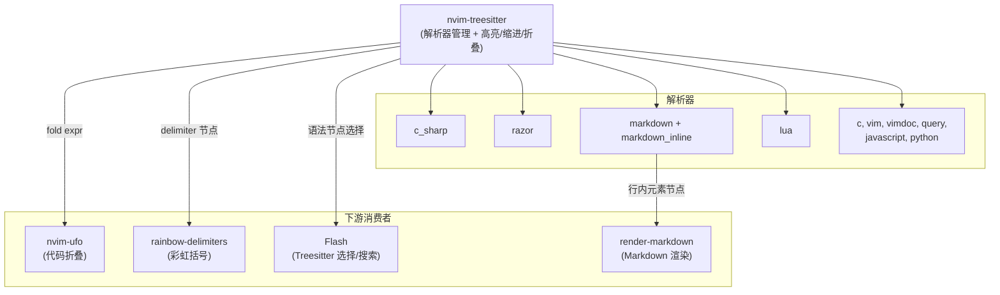
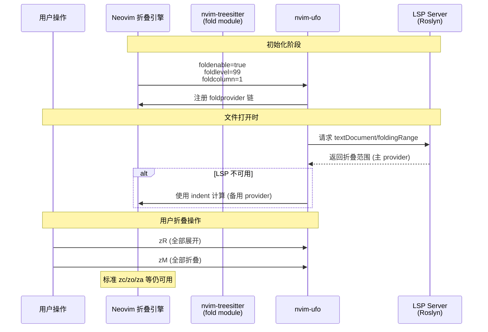

Treesitter 是本 Neovim 配置中语法智能层的基石。它通过增量式语法解析（incremental parsing）替代传统的正则表达式高亮，为编辑器提供精确到语法节点的代码理解能力。本文档聚焦于 `nvim-treesitter` 插件的核心配置——包括高亮引擎的启用、基于缩进的智能补齐、以及作为折叠 provider 为下游插件（nvim-ufo）提供折叠信息的三重职责，同时梳理了围绕 Treesitter 解析器构建的插件生态（rainbow-delimiters、Flash Treesitter 选择、render-markdown）如何共享同一套语法树。

Sources: [treesitter.lua](lua/plugins/treesitter.lua#L1-L24)

## 核心配置解析

配置文件 [treesitter.lua](lua/plugins/treesitter.lua) 采用 lazy.nvim 的按文件组织模式（参见 [插件管理策略：lazy.nvim 与按文件组织模式](6-cha-jian-guan-li-ce-lue-lazy-nvim-yu-an-wen-jian-zu-zhi-mo-shi)），整个插件以一个 table 返回值完成声明：

Sources: [treesitter.lua](lua/plugins/treesitter.lua#L1-L24)

### 插件声明与构建命令

```lua
return {
    "nvim-treesitter/nvim-treesitter",
    branch = "master",
    build = ":TSUpdate",
    config = function()
        -- ...
    end,
}
```

**`branch = "master"`** 锁定到主分支而非默认的 `main`——这是因为 nvim-treesitter 仓库的历史分支策略使然，master 分支包含最新的解析器与模块更新。**`build = ":TSUpdate"`** 是关键的一行：每当插件被 lazy.nvim 更新时，自动执行 `TSUpdate` 命令，确保所有已安装的解析器同步升级到与当前 nvim-treesitter 版本兼容的最新修订版。这避免了因解析器版本滞后导致的语法分析失败或高亮异常。

Sources: [treesitter.lua](lua/plugins/treesitter.lua#L1-L5)

### ensure_installed：解析器清单

```lua
ensure_installed = {
    "c",
    "lua",
    "vim", "vimdoc",
    "query",
    "javascript",
    "python",
    "c_sharp",
    "markdown", "markdown_inline",
    "razor",
},
```

这份清单遵循"按需安装、宁缺毋滥"的原则。每个解析器的选入都有明确的用途定位：

| 解析器 | 用途 |
|---|---|
| `c` | C 语言基础语法，同时也是部分底层 API 文档的阅读需求 |
| `lua` | Neovim 配置语言本身——编辑自身配置时获得精确高亮 |
| `vim` / `vimdoc` | VimScript 与 Vim 帮助文档，兼容旧式插件和 `:help` 页面 |
| `query` | Treesitter 查询语言，用于编写自定义高亮/注入规则 |
| `javascript` | Web 前端及 Node.js 开发场景 |
| `python` | 脚本与数据科学场景 |
| `c_sharp` | **核心业务语言**——配合 Roslyn LSP 提供完整的 C# 开发体验 |
| `markdown` / `markdown_inline` | Markdown 文档编辑，支持行内代码、LaTeX 等注入高亮 |
| `razor` | ASP.NET Core 视图模板（`.cshtml`），C# 与 HTML 混合语法的精确解析 |

值得注意的是 `c_sharp` 和 `razor` 的组合——这是本配置面向 .NET 开发定位的直接体现。`razor` 解析器能正确区分 `.cshtml` 文件中 `@` 指令、C# 代码块与 HTML 标签的边界，而 `markdown_inline` 则为 `render-markdown.nvim` 插件提供了行内元素（如 `**粗体**`、`` `代码` ``）的语法树节点，使得 Markdown 渲染可以精确到每个内联元素。

Sources: [treesitter.lua](lua/plugins/treesitter.lua#L7-L17)

### 三大功能模块

```lua
highlight = { enable = true },
indent = { enable = true },
fold = { enable = true },
```

这三个布尔开关分别控制 Treesitter 的三个核心模块：

| 模块 | 作用 | 机制 |
|---|---|---|
| **highlight** | 替代 Vim 内置的正则语法高亮 | Treesitter 在内存中维护一棵语法树，每个节点携带 `@type`、`@function`、`@string` 等捕获组，Neovim 的 highlight 系统直接读取这些捕获组映射到色彩 |
| **indent** | 在 `=` 操作符（如 `gg=G`）重排缩进时使用 Treesitter 的语法感知缩进计算 | 基于语法树判断每行的语义层级（函数体、if 块、循环体等），比正则方式更准确地还原缩进 |
| **fold** | 将 Treesitter 作为折叠信息的提供者 | 解析语法树中的块级结构（函数、类、命名空间等），生成 `foldmethod=expr` 所需的折叠表达式 |

**`fold` 模块是连接 Treesitter 与 [nvim-ufo 代码折叠](25-nvim-ufo-dai-ma-zhe-die) 的桥梁**。当 `fold = { enable = true }` 时，nvim-treesitter 注册了一个基于语法树的 foldexpr，nvim-ufo 在其 provider 链中可以调用此表达式作为折叠源。在 [nvim-ufo.lua](lua/plugins/nvim-ufo.lua) 的默认配置中，provider 策略为"主用 `lsp`，备用 `indent`"——但 Treesitter 的 fold 模块为 `foldmethod=expr` 提供了更精确的折叠边界检测。

Sources: [treesitter.lua](lua/plugins/treesitter.lua#L18-L21)

## Treesitter 生态集成

Treesitter 的语法树是一个共享资源。在本配置中，多个插件消费同一套解析器输出，形成了一个以语法树为中心的插件协作网络：



Sources: [treesitter.lua](lua/plugins/treesitter.lua#L1-L24), [nvim-ufo.lua](lua/plugins/nvim-ufo.lua#L1-L25), [rainebow.lua](lua/plugins/rainebow.lua#L1-L6), [flash.lua](lua/plugins/flash.lua#L1-L26), [render-markdown.lua](lua/plugins/render-markdown.lua#L1-L10)

### rainbow-delimiters：基于语法树的彩虹括号

[rainebow.lua](lua/plugins/rainebow.lua) 注册了 `HiPhish/rainbow-delimiters.nvim`，它将 Treesitter 语法树中的 delimiter 节点按照嵌套深度着色：

```lua
return{
    "HiPhish/rainbow-delimiters.nvim",
    dependencies = { "nvim-treesitter/nvim-treesitter" },
    event = "BufReadPre",
}
```

**`event = "BufReadPre"`** 确保插件在缓冲区读取之前加载，使第一帧渲染就包含彩色括号。与旧式的正则匹配不同，rainbow-delimiters 直接读取 Treesitter 语法树中的 `@delimiter` 捕获组，因此即使在字符串内部或注释中出现 `()` `{}` `[]`，也不会被错误着色——这是基于语法树的视觉增强相比正则方案的显著优势。

Sources: [rainebow.lua](lua/plugins/rainebow.lua#L1-L6)

### Flash Treesitter 选择：结构化文本对象

[Flash 插件](lua/plugins/flash.lua) 通过 Treesitter 语法树提供了两种结构化选择操作：

| 按键 | 模式 | 函数 | 说明 |
|---|---|---|---|
| `S` | n / o / x | `flash.treesitter()` | 选中光标所在位置的最小 Treesitter 节点，可连续按 `S` 扩展到父节点 |
| `R` | o / x | `flash.treesitter_search()` | 在整个缓冲区中搜索与光标所在节点同类型的所有节点 |
| `<C-Space>` | n / o / x | 自定义 treesitter 配置 | 模拟 nvim-treesitter 的 incremental selection：`<C-Space>` 前进到下一个更大的节点，`<BS>` 回退 |

**增量选择（Incremental Selection）** 的工作原理：Flash 调用 Treesitter 的 `nvim.treesitter.get_node()` 获取光标下的语法节点，然后逐步扩展到其父节点序列。对于 C# 代码，这意味着你可以依次选中：变量名 → 参数列表 → 方法签名 → 方法体 → 类体 → 命名空间块。这种基于语法树的选区比 Vim 原生的 `viw` → `vaw` → `vap` 精确得多，因为它完全理解代码结构。

Sources: [flash.lua](lua/plugins/flash.lua#L10-L24)

### render-markdown：语法树驱动的 Markdown 渲染

[render-markdown.lua](lua/plugins/render-markdown.lua) 声明了 `nvim-treesitter` 作为依赖：

```lua
dependencies = { 'nvim-treesitter/nvim-treesitter', 'nvim-tree/nvim-web-devicons' },
```

`markdown` + `markdown_inline` 解析器为它提供了精确到行内元素级别的语法树。render-markdown 不再依赖正则来猜测 `**粗体**` 的边界，而是直接从 Treesitter 节点获取每个 inline 元素的起止位置，实现零误判的 Markdown 美化渲染。

Sources: [render-markdown.lua](lua/plugins/render-markdown.lua#L1-L10)

## 折叠架构：Treesitter 与 nvim-ufo 的协作

本配置中的代码折叠由两层系统协同完成。理解这个分层对于排查折叠相关问题至关重要：



**第一层**是 [treesitter.lua](lua/plugins/treesitter.lua#L20) 中的 `fold = { enable = true }`，它向 Neovim 注册了 `foldmethod=expr` 和对应的 foldexpr 函数。这是 Treesitter 对 Neovim 原生折叠系统的直接贡献。

**第二层**是 [nvim-ufo](lua/plugins/nvim-ufo.lua)，它在 Neovim 原生折叠系统之上构建了更智能的折叠提供者链。在 [nvim-ufo.lua](lua/plugins/nvim-ufo.lua#L22) 的 `require("ufo").setup()` 中采用默认配置，其 provider 策略为：

- **首选 provider**：`lsp`——通过 `textDocument/foldingRange` 请求从 Roslyn 等 LSP 服务器获取折叠范围
- **备用 provider**：`indent`——当 LSP 未就绪或不支持 foldingRange 时，回退到基于缩进的折叠

nvim-ufo 同时接管了 `zR`（全部展开）和 `zM`（全部折叠）的键映射（[nvim-ufo.lua](lua/plugins/nvim-ufo.lua#L17-L18)），使用其内部实现而非改变 `foldlevel` 的原生行为，确保在 provider 链下的体验一致性。

Sources: [treesitter.lua](lua/plugins/treesitter.lua#L18-L21), [nvim-ufo.lua](lua/plugins/nvim-ufo.lua#L1-L25)

## 版本锁定与依赖关系

从 [lazy-lock.json](lazy-lock.json) 中可以确认当前锁定的版本：

| 插件 | 分支 | Commit |
|---|---|---|
| `nvim-treesitter` | master | `cf12346a34` |
| `nvim-ufo` | main | `ab3eb12406` |
| `rainbow-delimiters.nvim` | master | `aab6caaffd` |
| `promise-async`（nvim-ufo 依赖） | main | `119e896101` |

`promise-async` 是 nvim-ufo 的唯一显式依赖（[nvim-ufo.lua](lua/plugins/nvim-ufo.lua#L3)），提供异步 Promise 支持，使得折叠范围的获取不会阻塞 UI 线程。这个设计选择体现了 nvim-ufo 在大型文件（如几千行的 C# 文件）中保持流畅响应的工程考量。

Sources: [lazy-lock.json](lazy-lock.json#L31-L38), [nvim-ufo.lua](lua/plugins/nvim-ufo.lua#L3)

## 延伸阅读

Treesitter 作为语法智能的基础设施，其输出被本配置中的多个插件消费。如需深入了解相关主题：

- **折叠的完整配置与使用**：参见 [nvim-ufo 代码折叠](25-nvim-ufo-dai-ma-zhe-die)，了解折叠列、填充字符和 provider 策略的详细配置
- **基于 Treesitter 的快速跳转与选区扩展**：参见 [Flash 快速跳转与 Treesitter 选择](17-flash-kuai-su-tiao-zhuan-yu-treesitter-xuan-ze)，了解 `S`/`R`/`<C-Space>` 的完整操作指南
- **Treesitter 解析器与 LSP 的分工**：参见 [LSP 通用配置与 Mason 包管理](13-lsp-tong-yong-pei-zhi-yu-mason-bao-guan-li)，理解语法树（Treesitter）与语义分析（LSP）各自的职责边界