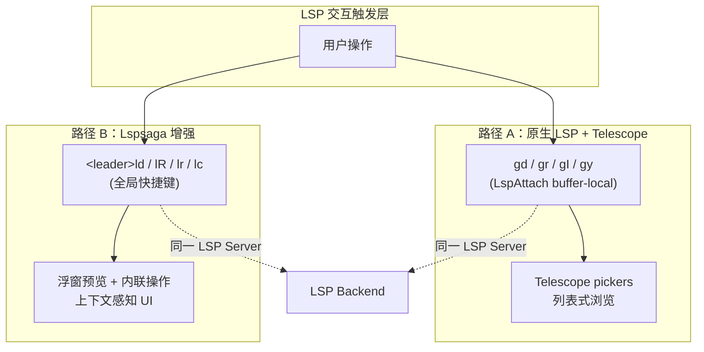

本页解析 `lspsaga.nvim` 在本配置中的角色——作为 Neovim 原生 LSP 功能的可视化增强层，它与 [LSP 通用配置与 Mason 包管理](13-lsp-tong-yong-pei-zhi-yu-mason-bao-guan-li) 中的 Telescope/原生 LSP 快捷键形成**双轨导航体系**。Lspsaga 通过浮窗预览、内联诊断跳转和增强式 Code Action 菜单，为 `<leader>l` 命名空间下的操作提供了更精致的交互体验。

## 架构定位：双轨导航体系

本配置在 LSP 交互层面存在两条并行路径，两者功能重叠但 UI 呈现截然不同：

**路径 A**（原生层）通过 `LspAttach` 自动命令注册 buffer-local 快捷键（`gd`、`gr`、`K` 等），使用 Telescope 的 `lsp_definitions`、`lsp_references` 等 picker 呈现结果——适合需要批量扫描和过滤的场景。**路径 B**（Lspsaga 层）使用全局快捷键（`<leader>l*` 前缀），提供浮窗预览、上下文感知的轻量交互——适合快速查看和即时操作的流程。两条路径共享同一个 LSP 后端，用户可根据场景自由选择。

Sources: [lspsaga.lua](lua/plugins/lspsaga.lua#L1-L20), [mason.lua](lua/plugins/mason.lua#L61-L81)

## 插件加载策略

Lspsaga 采用**命令延迟加载**模式，仅在首次执行 `:Lspsaga` 命令时才加载插件本体。这意味着在纯编辑会话中（不使用任何 Lspsaga 功能），该插件不会占用启动时间或运行时内存。快捷键定义通过 `keys` 字段预先注册，lazy.nvim 会在按键触发时自动加载插件并执行对应命令。

Sources: [lspsaga.lua](lua/plugins/lspsaga.lua#L3)

## 快捷键映射全览

下表列出 Lspsaga 的全部 7 个快捷键绑定，并标注与原生 LSP 层的功能对照关系：

| 快捷键 | Lspsaga 命令 | 功能描述 | 原生 LSP 对照 | UI 差异 |
|---|---|---|---|---|
| `<leader>lr` | `rename` | 重命名符号 | `<leader>cr`（`vim.lsp.buf.rename`） | Lspsaga 提供预览高亮，可即时看到修改影响范围 |
| `<leader>lc` | `code_action` | 代码操作 | `<leader>ca`（`vim.lsp.buf.code_action`） | Lspsaga 提供浮动菜单 + 灯泡提示图标 |
| `<leader>ld` | `goto_definition` | 跳转到定义 | `gd`（Telescope `lsp_definitions`） | Lspsaga 浮窗预览 vs Telescope 列表选择 |
| `<leader>lh` | `hover_doc` | 悬停文档 | `K`（`vim.lsp.buf.hover`） | Lspsaga 带边框的增强浮窗，支持滚动 |
| `<leader>lR` | `finder` | 查找引用 | `gr`（Telescope `lsp_references`） | Lspsaga 内联预览 + `<CR>` 展开 vs Telescope 列表 |
| `<leader>ln` | `diagnostic_jump_next` | 跳转到下一个诊断 | 无原生快捷键对照 | Lspsaga 专有，带浮窗诊断详情 |
| `<leader>lp` | `diagnostic_jump_prev` | 跳转到上一个诊断 | 无原生快捷键对照 | Lspsaga 专有，带浮窗诊断详情 |

Sources: [lspsaga.lua](lua/plugins/lspsaga.lua#L11-L19)

### 快捷键命名空间分析

Lspsaga 绑定全部位于 `<leader>l` 前缀下。值得注意的是，该前缀在 [Which-Key 快捷键提示系统](31-which-key-kuai-jie-jian-ti-shi-xi-tong) 的 `spec` 中**未被显式定义为命名组**（`<leader>c` 被定义为 `code` 组），因此 which-key 不会在 `<leader>l` 上显示组名提示，但仍会在按下 `<leader>l` 后列出所有以该前缀开头的绑定。如果你希望获得更友好的提示体验，可以在 `whichkey.lua` 的 `spec` 中追加 `{ "<leader>l", group = "lspsaga" }`。

Sources: [whichkey.lua](lua/plugins/whichkey.lua#L10-L48)

## 唯一自定义选项：Finder 回车展开

整个 Lspsaga 配置中，仅有一个自定义 `opts` 条目——`finder.keys.toggle_or_open = "<CR>"`。该配置将 Finder（引用查找）窗口中的 **回车键** 行为设为"切换或打开"：当光标所在条目是一个可展开的分组时按 `<CR>` 会展开/折叠该分组，当光标在具体引用条目上时则直接跳转至目标位置。这与 Lspsaga 默认行为（`<CR>` 仅打开，`<C-o>` 展开）不同，将两个高频操作合并到同一个按键上，减少了记忆负担。

Sources: [lspsaga.lua](lua/plugins/lspsaga.lua#L5-L9)

## 与 Roslyn LSP 的协同

由于 Lspsaga 通过标准 LSP 协议与语言服务器通信，它与 [Roslyn LSP 集成与解决方案管理](7-roslyn-lsp-ji-cheng-yu-jie-jue-fang-an-guan-li) 天然兼容。在 C# 文件中，以下操作链尤为流畅：使用 `<leader>lR`（Finder）快速定位符号的所有引用并通过内联预览确认目标，再用 `<CR>` 直接跳转——整个过程无需离开编辑器上下文。Roslyn 提供的 Inlay Hints 和 Code Lens 与 Lspsaga 的浮窗预览互不冲突，可同时使用。

Sources: [roslyn.lua](lua/plugins/roslyn.lua#L1-L66)

## 功能边界与适用场景

为了帮助你在原生层和 Lspsaga 层之间做出选择，下表从操作场景的角度给出建议：

| 场景 | 推荐路径 | 原因 |
|---|---|---|
| 快速查看单个定义的上下文 | Lspsaga `<leader>ld` | 浮窗预览不离开当前位置 |
| 需要从数十个引用中筛选目标 | 原生 `gr`（Telescope） | Telescope 的模糊过滤更适合大批量结果 |
| 重命名前需确认影响范围 | Lspsaga `<leader>lr` | 预览高亮直接展示所有将被修改的位置 |
| 仅需执行一次简单 Code Action | 原生 `<leader>ca` | 原生 `vim.lsp.buf.code_action` 更轻量 |
| 诊断错误逐个排查与修复 | Lspsaga `<leader>ln` / `<leader>lp` | 专有快捷键，无原生对照，浮窗直接展示错误详情 |
| 悬浮查看 API 文档 | Lspsaga `<leader>lh` | 增强浮窗支持滚动和语法高亮 |

Sources: [lspsaga.lua](lua/plugins/lspsaga.lua#L11-L19), [mason.lua](lua/plugins/mason.lua#L64-L80)

## 关联阅读

- **[LSP 通用配置与 Mason 包管理](13-lsp-tong-yong-pei-zhi-yu-mason-bao-guan-li)**：理解原生 LSP 快捷键的注册机制和 Mason 如何管理语言服务器
- **[Roslyn LSP 集成与解决方案管理](7-roslyn-lsp-ji-cheng-yu-jie-jue-fang-an-guan-li)**：C# 场景下 Lspsaga 操作的具体语言服务器后端
- **[Telescope 模糊查找器](16-telescope-mo-hu-cha-zhao-qi-wen-jian-grep-yu-git-sou-suo)**：原生层 `gd`/`gr` 背后的 Telescope picker 工作原理
- **[Which-Key 快捷键提示系统](31-which-key-kuai-jie-jian-ti-shi-xi-tong)**：如何自定义 `<leader>l` 的分组提示以获得更好的发现性