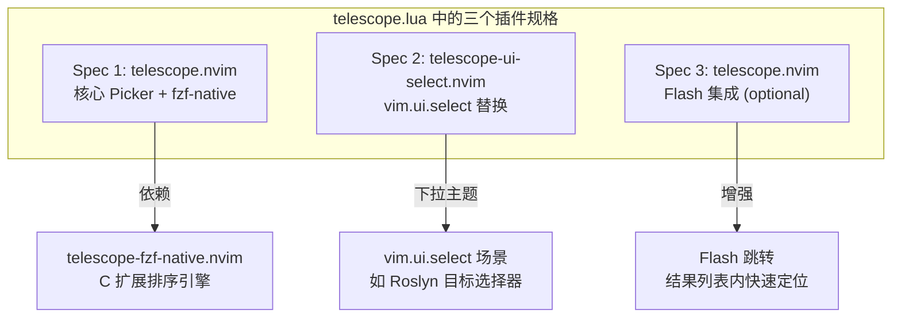
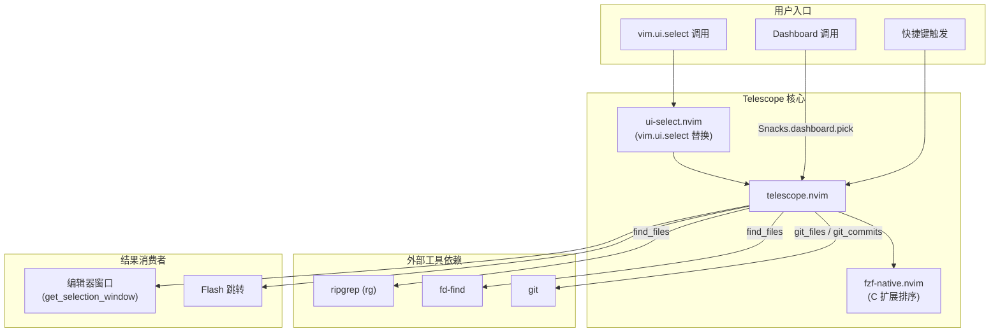

Telescope 是本配置中**最核心的交互入口之一**——从文件查找、内容搜索到 Git 操作、Vim 内部状态检索，几乎所有"找东西"的场景都通过它完成。本文将从插件结构、加载策略、Picker 分组映射、自定义 Grep 策略、UI 行为配置以及扩展集成六个维度，完整解析 [telescope.lua](lua/plugins/telescope.lua) 中的全部实现细节。

Sources: [telescope.lua](lua/plugins/telescope.lua#L1-L226)

## 插件结构与加载策略

整个 Telescope 配置由 `return { ... }` 块内的**三个独立插件规格**组成，它们共享 `nvim-telescope/telescope.nvim` 这一核心但承担不同职责：

**惰性加载**通过两种机制协同实现：`cmd = "Telescope"` 确保只有在用户首次执行 `:Telescope` 命令时才加载插件主体；`keys` 表中的所有快捷键定义则让 lazy.nvim 在对应按键被按下时触发加载。这意味着 Neovim 启动时不会加载 Telescope——直到你真正需要它的那一刻。

其中 `telescope-fzf-native.nvim` 是一个 C 语言编写的扩展，通过 `build` 字段指定编译命令。配置使用了 `build_cmd` 变量进行条件判断——当系统有 `cmake` 时使用 CMake 构建，否则用 `make`。`enabled = build_cmd ~= nil` 则在无编译工具时优雅降级，不会导致插件加载失败。编译完成后通过 `config` 回调以 `pcall` 安全调用 `load_extension("fzf")`，即使加载失败也不会中断启动流程。

Sources: [telescope.lua](lua/plugins/telescope.lua#L1-L20)

## 快捷键体系：四域覆盖

所有快捷键定义集中在 Spec 1 的 `keys` 表中，按功能域分为四个组别。下表完整列出每个映射的按键、Telescope Picker、功能描述及使用场景：

### 快速入口（顶层键位）

| 按键 | Picker | 描述 | 典型场景 |
|------|--------|------|----------|
| `<leader>,` | `buffers sort_mru=true sort_lastused=true` | 切换 Buffer | 快速跳回最近编辑的文件 |
| `<leader>:` | `command_history` | 命令历史 | 重复执行之前的 Ex 命令 |
| `<leader><space>` | `find_files` | 查找文件 | 最常用的文件打开入口 |

这三个顶层键位的设计哲学是"高频操作零层级"——不需要记忆二级前缀，按下 Leader 后一击即达。`<leader>,` 特别加入了 `sort_mru=true`（按最近使用排序）和 `sort_lastused=true`（最后使用的置顶），使得在多个 Buffer 间切换时，最可能需要的永远是第一个候选项。

Sources: [telescope.lua](lua/plugins/telescope.lua#L22-L29)

### 文件查找域（`<leader>f` 前缀）

| 按键 | Picker | 描述 | 说明 |
|------|--------|------|------|
| `<leader>fb` | `buffers sort_mru=true sort_lastused=true ignore_current_buffer=true` | Buffer 列表 | 排除当前 Buffer，聚焦其他已打开文件 |
| `<leader>fB` | `buffers` | Buffer 列表（全部） | 包含当前 Buffer 的完整列表 |
| `<leader>fg` | `git_files` | Git 跟踪文件 | 仅搜索 `git ls-files` 输出 |
| `<leader>fr` | `oldfiles` | 最近文件 | 基于旧会话的 MRU 文件列表 |

`<leader>fb` 与 `<leader>fB` 形成互补对：前者过滤掉当前 Buffer 以避免"选择了自己"的尴尬，后者则提供完整视图。`<leader>fg` 使用 `git_files` 而非 `find_files`，在大型 Git 仓库中能跳过 `node_modules`、`bin`、`obj` 等未跟踪目录，显著提升搜索速度。

Sources: [telescope.lua](lua/plugins/telescope.lua#L31-L42)

### Git 操作域（`<leader>g` 前缀）

| 按键 | Picker | 描述 |
|------|--------|------|
| `<leader>gc` | `git_commits` | 浏览提交历史 |
| `<leader>gl` | `git_commits` | 浏览提交历史（别名） |
| `<leader>gs` | `git_status` | 查看工作区变更文件 |
| `<leader>gS` | `git_stash` | 查看暂存区列表 |

`<leader>gc` 和 `<leader>gl` 映射到同一个 Picker，提供两种直觉路径——`gc` 可理解为"git commits"，`gl` 则是"git log"的助记。`git_status` Picker 会显示每个变更文件的状态标记（新增/修改/删除），且支持直接预览 diff。注意 Git 操作域的更多完整功能（如 LazyGit 集成、行级 blame）在 [LazyGit 集成](21-lazygit-ji-cheng) 和 [Gitsigns 行级变更与 blame](22-gitsigns-xing-ji-bian-geng-yu-blame) 中另有配置。

Sources: [telescope.lua](lua/plugins/telescope.lua#L44-L47)

### 搜索域（`<leader>s` 前缀）

搜索域是整个快捷键体系中**最庞大的分组**，涵盖了从代码内容到 Vim 内部状态的全面检索能力：

| 按键 | Picker | 描述 | 类别 |
|------|--------|------|------|
| `<leader>s"` | `registers` | 寄存器内容 | Vim 状态 |
| `<leader>s/` | `search_history` | 搜索历史 | Vim 状态 |
| `<leader>sa` | `autocommands` | 自动命令 | Vim 状态 |
| `<leader>sb` | `current_buffer_fuzzy_find` | 当前 Buffer 模糊搜索 | 代码内容 |
| `<leader>sc` | `command_history` | 命令历史 | Vim 状态 |
| `<leader>sC` | `commands` | Ex 命令列表 | Vim 状态 |
| `<leader>sd` | `diagnostics` | 项目诊断列表 | 诊断 |
| `<leader>sD` | `diagnostics bufnr=0` | 当前 Buffer 诊断 | 诊断 |
| `<leader>sG` | 自定义 `live_grep`（glob 过滤） | C#/.NET 定向 Grep | 代码内容 |
| `<leader>sg` | 自定义 `live_grep`（cwd 限定） | 当前目录 Grep | 代码内容 |
| `<leader>sh` | `help_tags` | 帮助文档 | 文档 |
| `<leader>sH` | `highlights` | 高亮组 | Vim 状态 |
| `<leader>sj` | `jumplist` | 跳转列表 | 导航 |
| `<leader>sk` | `keymaps` | 快捷键列表 | Vim 状态 |
| `<leader>sl` | `loclist` | Location 列表 | 导航 |
| `<leader>sM` | `man_pages` | Man 手册页 | 文档 |
| `<leader>sm` | `marks` | 标记列表 | 导航 |
| `<leader>so` | `vim_options` | Vim 选项 | Vim 状态 |
| `<leader>sR` | `resume` | 恢复上次搜索 | 元操作 |
| `<leader>sq` | `quickfix` | Quickfix 列表 | 导航 |

**`<leader>sR` (Resume)** 是一个极易被忽视但极其实用的元操作——它重新打开上一次 Telescope 搜索的状态，保留之前的输入和光标位置。当你因为误操作关闭了搜索结果时，这个按键能完整恢复上下文。

Sources: [telescope.lua](lua/plugins/telescope.lua#L49-L85)

## 自定义 Grep 策略：C#/.NET 专精与通用搜索

本配置为 `live_grep` 设计了两个独立变体，针对不同工作场景做了精细调优：

```mermaid
flowchart LR
    subgraph "两个 Grep 变体"
        direction TB
        A["<leader>sG<br/>C# 定向搜索"] --> B["glob_pattern:<br/>*.cs, *.razor, *.css"]
        A --> C["search_dirs: {}<br/>（空表 = 无限制）"]
        D["<leader>sg<br/>通用搜索"] --> E["search_dirs:<br/>{ vim.fn.getcwd() }"]
        D --> F["glob_pattern: 无<br/>（搜索所有文件类型）"]
    end

    B --> G["结果: 仅 .NET 相关文件"]
    E --> H["结果: 限定 cwd 目录下所有文件"]
```

**`<leader>sG`（C# 定向搜索）** 调用 `live_grep` 时传入 `glob_pattern = { "*.cs", "*.razor", "*.css" }`，这意味着 Telescope 只会在 `.cs`、`.razor`、`.css` 三类文件中搜索匹配内容。同时 `search_dirs = {}`（空表）表示不限定搜索目录范围，让 `glob_pattern` 成为唯一的过滤器。在一个包含前端、后端、脚本、文档的混合仓库中，这个组合能有效过滤掉大量无关结果——搜索 `Button` 不会命中 Markdown 文档和 JSON 配置。

**`<leader>sg`（通用搜索）** 传入 `search_dirs = { vim.fn.getcwd() }`，将搜索范围限定到当前工作目录，但不设置 `glob_pattern`，因此会搜索所有文件类型。这是"不确定目标在哪"时的全量搜索入口。

两者都通过 `function()` 回调而非 `<cmd>` 字符串定义——因为需要向 `live_grep()` 传递自定义参数表，纯命令行字符串无法表达这种复杂度。

Sources: [telescope.lua](lua/plugins/telescope.lua#L57-L75)

## 文件发现引擎：跨平台 find_command 降级链

`find_files` Picker 的底层文件发现机制通过 `find_command()` 函数实现了一条**五级降级链**，确保在从 Linux 到 Windows 的各种环境中都能正常工作：

| 优先级 | 命令 | 平台 | 说明 |
|--------|------|------|------|
| 1 | `rg --files` | 全平台 | ripgrep，最快且最广泛安装 |
| 2 | `fd --type f` | 全平台 | fd-find，Rust 实现，用户友好 |
| 3 | `fdfind --type f` | Debian/Ubuntu | fd 在 Debian 系的替代名 |
| 4 | `find . -type f` | Unix only | POSIX 标准，通过 `has("win32") == 0` 排除 Windows |
| 5 | `where /r . *` | Windows only | Windows `where` 命令的递归搜索模式 |

这个降级链的设计要点在于：第 4 级通过 `vim.fn.has("win32") == 0` 显式排除 Windows 环境——因为 Windows 的 `find` 命令是 `findstr` 的别名而非 Unix 的 `find`，会导致错误。第 5 级 `where /r . *` 是 Windows 原生的递归文件搜索方案，虽然性能远不如 `rg` 或 `fd`，但保证了最低可用性。

此外，`pickers.find_files` 配置中还设置了 `hidden = true`，让搜索结果**包含隐藏文件**（如 `.gitignore`、`.neoconf.json` 等）。前三级命令都通过 `-g "!.git"` 或 `-E ".git"` 排除了 `.git` 目录，避免将 Git 内部对象文件污染搜索结果。

Sources: [telescope.lua](lua/plugins/telescope.lua#L127-L179)

## UI 行为与交互映射

### 智能窗口选择

`get_selection_window` 回调函数实现了一个精巧的窗口选择逻辑：当你在 Telescope 中选择一个文件时，它不会盲目地在当前窗口打开，而是遍历所有窗口寻找一个"真正的文件 Buffer"（`buftype == ""`）。搜索顺序将当前窗口插入到列表首位，意味着优先使用当前窗口，但如果当前窗口显示的是侧边栏或文件树等特殊 Buffer，它会自动找到下一个可用的编辑窗口。如果所有窗口都是特殊 Buffer，则回退到当前窗口（返回 `0`）。

Sources: [telescope.lua](lua/plugins/telescope.lua#L147-L157)

### Picker 内快捷键

Telescope 打开后的交互映射分为**插入模式**和**正常模式**两套：

| 模式 | 按键 | 功能 | 说明 |
|------|------|------|------|
| Insert | `<C-t>` / `<A-t>` | Trouble 打开 | 将结果发送到 Trouble 列表 |
| Insert | `<A-i>` | 搜索包含 .gitignore 的文件 | 当前为占位实现 |
| Insert | `<A-h>` | 搜索包含隐藏文件的文件 | 当前为占位实现 |
| Insert | `<C-Down>` | 历史记录下一条 | 在多次搜索间快速切换 |
| Insert | `<C-Up>` | 历史记录上一条 | 在多次搜索间快速切换 |
| Insert | `<C-f>` | 预览窗口向下滚动 | 查看长文件内容 |
| Insert | `<C-b>` | 预览窗口向上滚动 | 查看长文件内容 |
| Normal | `q` | 关闭 Picker | 单键退出，最直觉的关闭方式 |
| Insert | `<C-s>` | Flash 跳转 | 在结果列表中快速定位 |
| Normal | `s` | Flash 跳转 | 同上 |

**历史记录循环**（`<C-Up>` / `<C-Down>`）是一个极易被忽略的高效功能——每次在 Telescope prompt 中输入的搜索词都会被记录，通过这两个键可以在之前的搜索词之间快速循环，避免重复输入。

Sources: [telescope.lua](lua/plugins/telescope.lua#L158-L172)

### 视觉元素

配置中自定义了两个视觉标识符：`prompt_prefix = " " ` 和 `selection_caret = " "`。前者使用 Nerd Font 的三角箭头图标作为输入提示符，后者用反向三角标记当前选中项。这些图标需要终端安装 Nerd Font 才能正确显示。

Sources: [telescope.lua](lua/plugins/telescope.lua#L143-L144)

## 扩展集成

### Flash 跳转增强

第三个插件规格（标记 `optional = true`）为 Telescope 集成了 Flash 跳转功能。当 Telescope 结果列表中有大量匹配项时，按下 `s`（正常模式）或 `<C-s>`（插入模式）可以激活 Flash 跳跃模式——此时每个结果行首会出现标签字符，输入对应字符即可直接跳转到目标行，无需反复按 `<C-n>` / `<C-p>` 上下移动。

其实现原理值得细看：Flash 被配置为仅在 `TelescopeResults` 类型的窗口中激活（通过 `search.exclude` 函数过滤其他窗口），`pattern = "^"` 确保匹配每行的起始位置，而 `action` 回调通过 `picker:set_selection(match.pos[1] - 1)` 直接设置 Telescope 的选中行，将 Flash 的匹配结果映射回 Telescope 的选择状态。

Sources: [telescope.lua](lua/plugins/telescope.lua#L198-L224)

### telescope-ui-select：统一的 UI 选择器

第二个插件规格注册了 `telescope-ui-select.nvim` 扩展，将 `vim.ui.select` 的默认实现替换为 Telescope 的下拉主题（`get_dropdown()`）。这意味着任何使用 `vim.ui.select` 的插件——包括 [Roslyn LSP 集成与解决方案管理](7-roslyn-lsp-ji-cheng-yu-jie-jue-fang-an-guan-li) 中的目标框架选择器——都会自动以 Telescope 的模糊搜索界面呈现，而非 Vim 默认的简陋编号列表。

这个集成使用独立的 `config` 函数而非 `opts` 合并，因为它需要单独调用 `setup()` 和 `load_extension()`——这是一种常见于"全局性扩展"的配置模式，确保无论 Telescope 主配置如何变更，ui-select 的注册始终独立完成。

Sources: [telescope.lua](lua/plugins/telescope.lua#L184-L195)

## 架构关系总图

此图展示了 Telescope 在整个配置中的中枢地位：它同时服务于**三种入口**（快捷键、Dashboard、`vim.ui.select`），依赖**三类外部工具**（ripgrep / fd / git）执行搜索，并将结果通过**两种消费者**（编辑器窗口、Flash 跳转）呈现给用户。

Sources: [telescope.lua](lua/plugins/telescope.lua#L1-L226), [snacks.lua](lua/plugins/snacks.lua#L6-L25), [whichkey.lua](lua/plugins/whichkey.lua#L19-L23)

## 延伸阅读

- [Flash 快速跳转与 Treesitter 选择](17-flash-kuai-su-tiao-zhuan-yu-treesitter-xuan-ze) — 了解 Flash 插件在 Telescope 之外的跳转能力
- [neo-tree 文件浏览器配置](18-neo-tree-wen-jian-liu-lan-qi-pei-zhi) — Telescope 侧重模糊搜索，neo-tree 侧重目录结构浏览
- [Grug-Far 项目级搜索替换](26-grug-far-xiang-mu-ji-sou-suo-ti-huan) — 当搜索需求从"找到"升级为"找到并替换"时
- [Which-Key 快捷键提示系统](31-which-key-kuai-jie-jian-ti-shi-xi-tong) — `<leader>f` 和 `<leader>s` 前缀的即时提示
- [Roslyn LSP 集成与解决方案管理](7-roslyn-lsp-ji-cheng-yu-jie-jue-fang-an-guan-li) — `ui-select` 在 Roslyn 目标选择中的应用