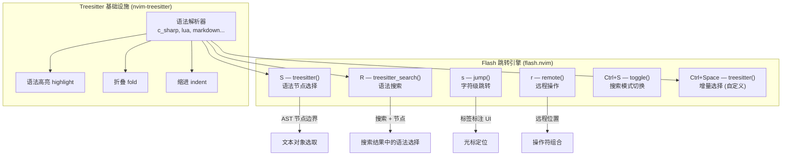

本配置使用 **flash.nvim**（folke 出品）作为核心跳转引擎，同时借助 **nvim-treesitter** 提供的语法分析能力，实现了两种层次的精确导航：**字符级跳转**（快速定位到屏幕上任意可见位置）和 **语法级选择**（基于 Treesitter AST 节点的语义文本对象选取）。两者共享同一套标签标注 UI，形成了一致且高效的操作体验。

Sources: [flash.lua](lua/plugins/flash.lua#L1-L25), [treesitter.lua](lua/plugins/treesitter.lua#L1-L23)

## 整体架构：跳转与选择的分层设计

Flash 插件在本配置中承担了远超"快速移动"的职责。通过组合不同的 API 函数（`jump`、`treesitter`、`remote`、`treesitter_search`、`toggle`），它同时解决了三个问题：光标快速定位、语法感知的文本对象选择、以及在操作符挂起模式（operator-pending mode）下的组合操作能力。Treesitter 则作为底层的语法分析基础设施，为 Flash 提供精确的 AST 节点边界信息。



上图展示了两个核心组件之间的职责划分：Flash 负责交互式 UI 与用户输入，Treesitter 负责语法结构的解析。在 `S`、`R`、`Ctrl+Space` 这三个功能中，Treesitter 的 AST 节点信息被 Flash 消费并转化为可视化的选择区域。

Sources: [flash.lua](lua/plugins/flash.lua#L8-L24), [treesitter.lua](lua/plugins/treesitter.lua#L6-L21)

## 快捷键映射总览

Flash 的所有快捷键直接定义在插件配置的 `keys` 表中，遵循 lazy.nvim 的按需加载规范。下表按使用场景分类列出了全部映射：

| 按键 | 模式 | 调用函数 | 功能描述 | 典型用例 |
|------|------|----------|----------|----------|
| `s` | Normal / Visual / Operator-pending | `flash.jump()` | 字符级跳转，输入模式匹配后标注标签 | `s` + 输入字符 → 跳转 |
| `S` | Normal / Visual / Operator-pending | `flash.treesitter()` | 选择当前光标附近的 Treesitter 语法节点 | `S` → 选择函数/块 |
| `r` | Operator-pending | `flash.remote()` | 在远程位置执行操作，不移动光标 | `dr` → 删除远处目标 |
| `R` | Operator-pending / Visual | `flash.treesitter_search()` | 在搜索模式中用 Treesitter 节点作为匹配目标 | `R` + 输入 → 搜索节点 |
| `Ctrl+S` | Command-line | `flash.toggle()` | 在 `/` 或 `?` 搜索中切换 Flash 跳转标签 | 搜索时按 `Ctrl+S` |
| `Ctrl+Space` | Normal / Visual / Operator-pending | `flash.treesitter()`（自定义配置） | 模拟 nvim-treesitter 的增量选择 | 连续按 `Ctrl+Space` 扩展选择 |

Sources: [flash.lua](lua/plugins/flash.lua#L8-L24)

## 字符级跳转：`s` 键的核心机制

按下 `s` 后，Flash 进入**跳转模式**。此时用户输入的每个字符都会被实时匹配——屏幕上所有符合模式的位置会被标注上短标签（通常是 1-2 个字母），按下对应标签即可瞬间跳转。与传统的 `f`/`F`/`t`/`T` 单字符搜索不同，Flash 支持**多字符模式**匹配，且标签覆盖整个可见视口，不局限于当前行。

这个功能在三种模式下的行为略有不同：Normal 模式下直接移动光标；Visual 模式下扩展选区到目标位置；Operator-pending 模式下将操作范围设定到目标位置（例如 `ds` 表示"删除到 Flash 跳转的目标处"）。

Sources: [flash.lua](lua/plugins/flash.lua#L9)

## Treesitter 语法选择：`S` 键的语义操作

按 `S` 键触发的是 `flash.treesitter()` 函数，这是 Flash 与 Treesitter 深度集成的核心体现。该函数会获取光标所在位置的所有 AST 祖先节点，将每个节点的文本范围标注为一个可选区域。用户通过按标签字母选择想要捕获的语法层级——从最内层的标识符，到参数列表，到整个函数体，再到整个块语句，逐层递进。

这种机制使得以下操作链成为可能：

- **Normal 模式 `S`**：选中一个语法节点后进入 Visual 模式，可直接进行后续编辑
- **Operator-pending `dS`**：删除选中的语法节点（例如删除整个 if 块）
- **Operator-pending `yS`**：复制选中的语法节点（例如复制整个函数调用）
- **Operator-pending `cS`**：替换选中的语法节点（例如替换整个字符串字面量）

Treesitter 解析器在 [treesitter.lua](lua/plugins/treesitter.lua#L7-L17) 中声明了 `ensure_installed` 列表，包括 `c_sharp`、`razor`、`lua`、`markdown` 等语言。这意味着在 C# / .NET 开发场景中，Flash 的语法选择能够精确识别类声明、方法体、Lambda 表达式、属性访问器等 C# 特有的语法结构。

Sources: [flash.lua](lua/plugins/flash.lua#L10), [treesitter.lua](lua/plugins/treesitter.lua#L7-L17)

## 远程操作：`r` 键的无损编辑

`r` 键映射到 `flash.remote()`，仅在 Operator-pending 模式下生效。其独特之处在于：**操作完成后光标不移动**。这在需要"隔空修改"远处代码时极为高效——例如当前正在编辑第 30 行，但发现第 80 行有个变量名需要修改，使用 `cr` 可以直接在那个位置执行修改操作，完成后光标自动回到第 30 行。

与之对照，`R` 键（`treesitter_search()`）结合了搜索和 Treesitter 选择：先输入搜索模式定位到目标区域，然后在匹配结果中以 Treesitter 节点为单位进行选择。这在需要精确操作某个搜索结果中的特定语法结构时非常有用。

Sources: [flash.lua](lua/plugins/flash.lua#L11-L12)

## 增量选择的模拟实现

本配置使用 `<Ctrl+Space>` 映射来**模拟 nvim-treesitter 的增量选择**（incremental selection）功能。原始的 nvim-treesitter 增量选择模块在新版本中已被弃用，这里通过 Flash 的 Treesitter API 巧妙地复刻了这一体验：

```lua
{ "<c-space>", mode = { "n", "o", "x" },
  function()
    require("flash").treesitter({
      actions = {
        ["<c-space>"] = "next",   -- 继续按 Ctrl+Space → 扩展到更大的节点
        ["<BS>"] = "prev"          -- 按 Backspace → 收缩到更小的节点
      }
    })
  end, desc = "Treesitter Incremental Selection" }
```

这段配置的关键在于 `actions` 表：它将 `<Ctrl+Space>` 自定义为"选择下一个（更大的）节点"，将 `<BS>`（Backspace）自定义为"选择上一个（更小的）节点"。连续按 `<Ctrl+Space>` 时，选择范围会从当前最小节点逐层向外扩展到更大的语法结构，形成类似"剥洋葱"反向操作的选择体验。

Sources: [flash.lua](lua/plugins/flash.lua#L15-L23)

## 命令行搜索集成：`Ctrl+S` 切换

在 Neovim 的命令行模式（Command-line mode）中，按下 `Ctrl+S` 会调用 `flash.toggle()`。这个功能用于在使用 `/` 或 `?` 进行搜索时动态切换 Flash 的跳转标签显示——搜索结果中的每个匹配位置都会被标注上 Flash 标签，允许直接跳转到任意匹配项而不需要逐个按 `n`/`N` 遍历。

Sources: [flash.lua](lua/plugins/flash.lua#L13)

## 插件加载策略与兼容性

Flash 插件采用 `VeryLazy` 加载事件，这意味着它不会在 Neovim 启动时立即加载，而是在首次需要时（通常是打开缓冲区后）才初始化，有助于保持快速启动体验。配置中的 `vscode = true` 标记表明这些快捷键在 VSCode Neovim 扩展环境中同样可用。

值得注意的是，本配置同时安装了 **hop.nvim**（`smoka7/hop.nvim`）作为辅助跳转工具，通过 `<Leader>hp` 映射 `HopWord` 命令。Hop 和 Flash 功能有部分重叠，但 Flash 凭借其 Treesitter 集成和更丰富的操作模式（远程操作、搜索集成、增量选择）承担了主要跳转职责，Hop 仅作为单词级跳转的补充入口。

Sources: [flash.lua](lua/plugins/flash.lua#L1-L6), [hop.lua](lua/plugins/hop.lua#L1-L9)

## 操作速查：组合键实战场景

| 目标操作 | 按键序列 | 说明 |
|----------|----------|------|
| 跳到屏幕上某处 | `s` + 字符 + 标签 | 最基本的跳转 |
| 选中一个函数体 | `S` + 节点标签 | 选择后进入 Visual 模式 |
| 删除远处一段代码 | `d` → `r` + 标签 | 光标不移动 |
| 复制整个方法调用 | `y` → `S` + 节点标签 | 复制整个 AST 节点 |
| 替换某个搜索结果中的块 | `c` → `R` + 搜索 + 标签 | 搜索 + 语法选择组合 |
| 增量选中当前表达式 | `Ctrl+Space` → `Ctrl+Space`... | 逐层扩大选择 |
| 搜索时快速定位 | `/pattern` → `Ctrl+S` | 搜索结果标注标签 |
| 单词级跳转 | `<Leader>hp` | 调用 Hop 的替代方案 |

Sources: [flash.lua](lua/plugins/flash.lua#L8-L24), [hop.lua](lua/plugins/hop.lua#L7-L8)

## 延伸阅读

- Flash 的语法选择深度依赖 Treesitter 的解析质量。关于解析器的安装与语言支持配置，请参阅 [Treesitter 语法高亮与折叠](14-treesitter-yu-fa-gao-liang-yu-zhe-die)。
- Flash 的 `jump()` 功能与 [Telescope 模糊查找器](16-telescope-mo-hu-cha-zhao-qi-wen-jian-grep-yu-git-sou-suo) 的文件级搜索形成互补——前者处理缓冲区内跳转，后者处理跨文件导航。
- 配合 [Aerial 代码大纲与符号导航](20-aerial-dai-ma-da-gang-yu-fu-hao-dao-hang) 可以先通过符号列表定位到函数级别，再用 Flash 在函数内部精细跳转。