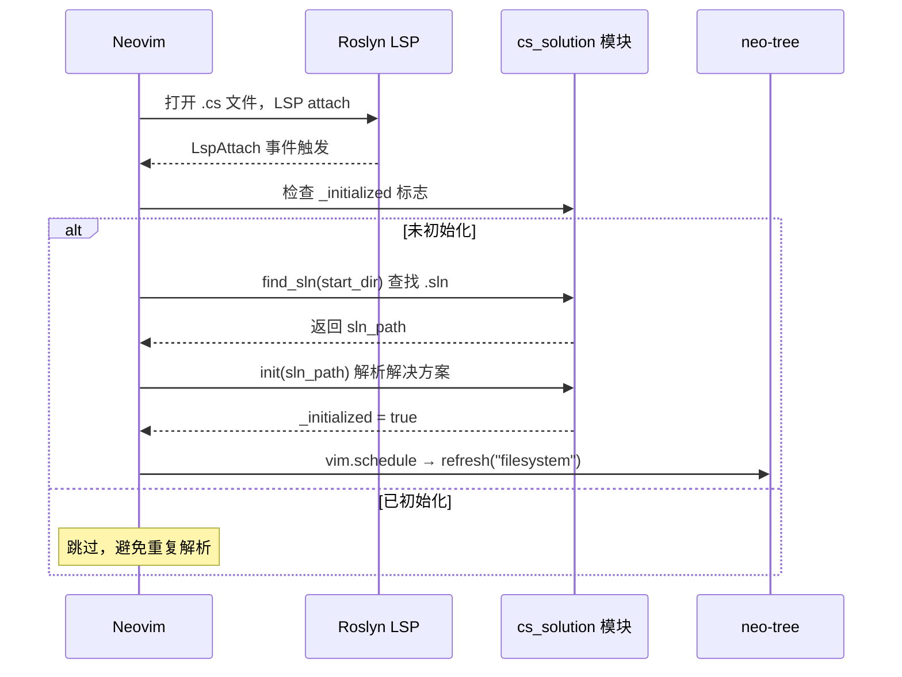

neo-tree.nvim 是本 Neovim 配置中的**侧边栏文件浏览器**，它以树形视图呈现工作目录的完整结构，支持文件导航、创建、删除、重命名等常用文件操作。本配置在标准 neo-tree 功能之上，还深度集成了 `cs_solution` 模块，能够在文件树中直接显示 `.cs` 文件是否属于当前解决方案——这是面向 C# / .NET 开发者的一项独特增强。本文将拆解该插件从加载触发、基础行为、自定义组件到渲染管线的完整配置架构。

## 插件声明与懒加载策略

neo-tree 采用 **lazy.nvim 的 `keys` 懒加载模式**——只有在按下对应快捷键时才会真正加载插件，避免启动时拖慢编辑器。

| 快捷键 | 命令 | 功能说明 |
|--------|------|----------|
| `<leader>e`（Space → e） | `Neotree toggle` | 打开 / 关闭文件浏览器侧边栏 |
| `<leader>o`（Space → o） | `Neotree focus` | 将光标聚焦到文件浏览器（不切换开关状态） |

插件依赖三个库：`plenary.nvim`（Lua 工具函数）、`nvim-web-devicons`（文件图标）、`nui.nvim`（UI 组件构建）。分支锁定为 `v3.x`，确保 API 稳定性。

Sources: [neo-tree.lua](lua/plugins/neo-tree.lua#L1-L12)

## 基础文件系统行为

neo-tree 的核心行为通过 `filesystem` 配置块定义。以下是本配置中各项参数的含义：

| 配置项 | 值 | 效果 |
|--------|----|------|
| `filtered_items.visible` | `true` | 被过滤掉的条目（如隐藏文件）仍然可见，但以灰暗样式显示 |
| `filtered_items.hide_dotfiles` | `false` | **不隐藏**以 `.` 开头的文件（如 `.gitignore`、`.neoconf.json`） |
| `filtered_items.hide_gitignored` | `false` | **不隐藏** `.gitignore` 中排除的文件 |
| `follow_current_file.enabled` | `true` | 自动追踪当前编辑文件，在树中高亮并展开其所在目录 |
| `use_libuv_file_watcher` | `true` | 利用 libuv 文件系统监视器实时检测外部变更，自动刷新树内容 |

这套组合的设计意图是**最大程度保留信息可见性**。在 C# 项目中，`.gitignore`、`.editorconfig`、`.runsettings` 等点文件经常需要直接访问；而 `follow_current_file` 则确保在多文件间切换时，树视图始终指向当前上下文——这对理解代码在项目中的位置至关重要。

Sources: [neo-tree.lua](lua/plugins/neo-tree.lua#L38-L48)

## 窗口布局与缩进样式

窗口配置将 neo-tree 固定在编辑区左侧，宽度为 30 列。`default_component_configs.indent` 配置了可展开的缩进指示器：

- `with_expanders = true`：为包含子项的目录显示展开/折叠图标
- `expander_collapsed` → ` `：折叠状态显示实心三角
- `expander_expanded` → ` `：展开状态显示空心三角

这些 Nerd Font 图标直观地区分了"可展开但已折叠"与"已展开"两种状态，让目录层级关系一目了然。

Sources: [neo-tree.lua](lua/plugins/neo-tree.lua#L49-L59)

## 自定义组件：cs_sln_status

这是本配置中最具特色的扩展——一个名为 `cs_sln_status` 的**自定义渲染组件**，它在每个 `.cs` 文件的图标旁边显示该文件是否被当前解决方案编译。

组件的核心逻辑遵循三条规则：

1. **非文件节点** → 不渲染（直接返回空表）
2. **非 `.cs` 扩展名** → 不渲染
3. **`.cs` 文件** → 调用 `cs_solution.is_in_solution(path)` 判断归属：
   - 返回 `true` → 渲染绿色实心圆点 `● `（高亮组 `DiagnosticOk`）
   - 返回 `false` → 渲染灰色空心圆圈 `○ `（高亮组 `DiagnosticWarn`）
   - 返回 `nil`（未初始化）→ 不渲染任何内容

这个设计精准地解决了一个实际痛点：在大型 .NET 解决方案中，某些 `.cs` 文件可能已被从 `.csproj` 中排除，但仍存在于磁盘上。通过视觉标记，开发者能立即识别哪些文件处于"游离"状态。

Sources: [neo-tree.lua](lua/plugins/neo-tree.lua#L61-L79), [cs_solution.lua](lua/cs_solution.lua#L173-L224)

## 文件渲染管线

`renderers.file` 配置定义了每个文件节点在树中的**完整渲染顺序**。理解这个配置相当于理解 neo-tree 为每个文件绘制了哪些视觉元素、以什么顺序、以及如何对齐：

```
┌──────────────────────────────────────────────────────────┐
│  indent → icon → cs_sln_status → container               │
│                                            ┌──────────┐  │
│  container 内部:                           │ 对齐方式  │  │
│  name · symlink_target · clipboard · bufnr │ 左对齐   │  │
│  modified · diagnostics · git_status       │ 右对齐   │  │
└──────────────────────────────────────────────────────────┘
```

渲染顺序从左到右依次为：

1. **indent**：缩进线与展开器图标
2. **icon**：文件类型图标（由 nvim-web-devicons 提供）
3. **cs_sln_status**：自定义的解决方案归属状态（见上一节）
4. **container**：一个容器组件，内含多个子组件——
   - `name`（文件名，z-index 10，左对齐）
   - `symlink_target`（符号链接目标，z-index 10）
   - `clipboard`（剪贴板操作状态，z-index 10）
   - `bufnr`（缓冲区编号，z-index 10）
   - `modified`（已修改标记，z-index 20，**右对齐**）
   - `diagnostics`（诊断信息图标，z-index 20，**右对齐**）
   - `git_status`（Git 状态图标，z-index 10，**右对齐**）

`z-index` 控制当空间不足时组件的截断优先级——数值越高越不容易被裁切。右对齐的组件（`modified`、`diagnostics`、`git_status`）形成右侧状态栏，与左侧文件名遥相呼应。

Sources: [neo-tree.lua](lua/plugins/neo-tree.lua#L83-L107)

## Roslyn LSP 触发的自动初始化

自定义组件 `cs_sln_status` 依赖 `cs_solution` 模块的数据，而该模块需要在 Roslyn LSP attach 时才能初始化。本配置通过一个 `LspAttach` 自动命令实现了这一衔接：



关键设计细节：

- **守卫条件**：首先检查 `client.name == "roslyn"`，确保只对 Roslyn LSP 响应；然后检查 `cs_sln._initialized`，避免每次打开新 buffer 都重新解析解决方案。
- **`vim.schedule` 延迟刷新**：将 neo-tree 刷新操作推迟到 Neovim 事件循环的下一个周期，确保 `cs_solution.init()` 的状态已完全生效。
- **`pcall` 安全调用**：包裹 `refresh` 调用以防止 neo-tree 尚未加载时报错。

Sources: [neo-tree.lua](lua/plugins/neo-tree.lua#L14-L35)

## 配置全景总结

下表汇总了 neo-tree 在本配置中的所有行为特性，帮助你快速建立全局认知：

| 类别 | 特性 | 配置/实现位置 |
|------|------|--------------|
| 懒加载 | `<leader>e` toggle / `<leader>o` focus | `keys` 表 |
| 隐藏文件 | 全部可见（dotfiles + gitignored） | `filtered_items` |
| 文件追踪 | 自动跟随当前编辑文件 | `follow_current_file` |
| 实时刷新 | libuv 文件监视器 | `use_libuv_file_watcher` |
| 窗口位置 | 左侧，宽度 30 列 | `window` |
| 目录展开器 | Nerd Font 三角图标 | `indent` 组件 |
| C# 归属标记 | ● 在解决方案中 / ○ 不在 | `cs_sln_status` 自定义组件 |
| 渲染管线 | indent → icon → sln_status → container | `renderers.file` |
| 自动初始化 | Roslyn LspAttach 触发解析 | `LspAttach` autocmd |

## 延伸阅读

- [neo-tree 中的 .sln 文件归属状态显示](9-neo-tree-zhong-de-sln-wen-jian-gui-shu-zhuang-tai-xian-shi)——深入解析 `cs_sln_status` 组件的设计动机与视觉效果
- [cs_solution 模块：.sln / .csproj 解析与 Glob 匹配引擎](10-cs_solution-mo-kuai-sln-csproj-jie-xi-yu-glob-pi-pei-yin-qing)——理解 `is_in_solution()` 的底层实现原理
- [Yazi 文件管理器集成](19-yazi-wen-jian-guan-li-qi-ji-cheng)——另一种文件管理视角：终端内的双面板文件管理器
- [快捷键体系速览（Leader 键与核心操作）](3-kuai-jie-jian-ti-xi-su-lan-leader-jian-yu-he-xin-cao-zuo)——全局快捷键一览