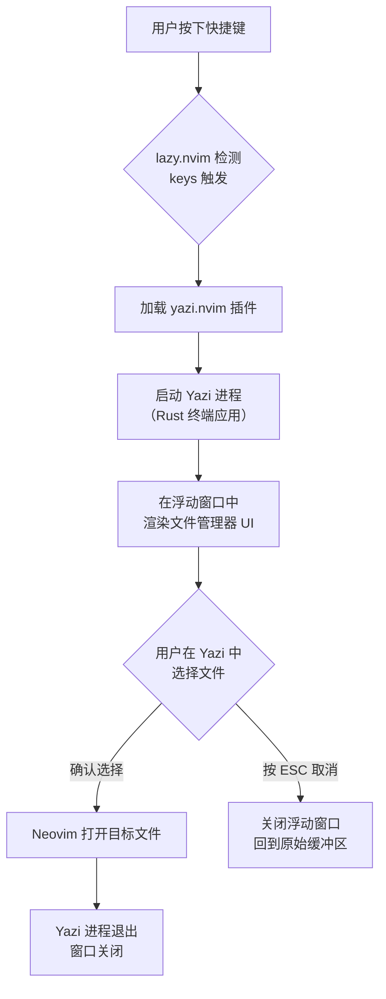

Yazi 是一个用 Rust 编写的极速终端文件管理器，通过 `yazi.nvim` 插件与 Neovim 无缝集成。本配置将 Yazi 作为**浮动窗口式文件浏览器**使用，与常驻侧栏的 [neo-tree 文件浏览器配置](18-neo-tree-wen-jian-liu-lan-qi-pei-zhi) 互为补充——neo-tree 适合持久的目录结构浏览和 `.sln` 归属状态查看，而 Yazi 则适合快速的文件跳转、批量操作和目录导航。

Sources: [yazi.lua](lua/plugins/yazi.lua#L1-L44)

## 架构总览

`yazi.nvim` 采用**延迟加载**策略，仅在首次触发快捷键时才加载插件代码，不对 Neovim 的启动速度产生任何影响。以下流程图展示了从按键到文件打开的完整生命周期：



插件的核心依赖关系如下：

| 组件 | 作用 | 加载方式 |
|------|------|----------|
| `yazi.nvim` | Yazi 的 Neovim 前端封装 | `VeryLazy` 事件 + `keys` 触发 |
| `plenary.nvim` | Lua 工具库（路径处理等） | `lazy = true`，随 yazi 一同加载 |
| `yazi`（外部二进制） | Rust 编写的终端文件管理器本体 | 需用户自行安装，不随插件分发 |

> **前置条件**：Yazi 的 Neovim 集成要求系统已安装 `yazi` 可执行文件。Windows 环境下可通过 `scoop install yazi` 或 `winget install sxyazi.yazi` 安装。

Sources: [yazi.lua](lua/plugins/yazi.lua#L1-L8)

## 快捷键配置

本配置为 Yazi 注册了两个核心快捷键：

| 快捷键 | 模式 | 命令 | 功能说明 |
|--------|------|------|----------|
| `<leader>-` | Normal, Visual | `:Yazi` | 在**当前文件所在目录**打开 Yazi |
| `<leader>cw` | Normal | `:Yazi cwd` | 在**Neovim 工作目录**打开 Yazi |

其中 `<leader>-` 是日常使用频率最高的入口。由于 Yazi 会从当前文件所在目录启动，你可以在编辑任意文件时快速跳转到同目录下的其他文件，非常契合"正在写代码时临时切换文件"的场景。


Sources: [yazi.lua](lua/plugins/yazi.lua#L9-L28)

### 快捷键冲突说明

值得注意的是，全局快捷键配置中 `<leader>-` 原本被映射为**水平分割窗口**（`<C-W>s`）：

```lua
-- lua/core/keymap.lua 第 56 行
map("n", "<leader>-", "<C-W>s", { desc = "Split Window Below", remap = true })
```

由于 `yazi.nvim` 的 `keys` 配置在 lazy.nvim 加载插件时会**覆盖**同键位的全局映射，因此实际效果是 `<leader>-` 打开 Yazi 而非分割窗口。如果你需要水平分割窗口，可以使用原生的 `<C-W>s` 命令。

Sources: [keymap.lua](lua/core/keymap.lua#L56), [yazi.lua](lua/plugins/yazi.lua#L11-L16)

## 插件选项详解

```lua
opts = {
    open_for_directories = false,   -- 不用 Yazi 替代 netrw 打开目录
    keymaps = {
        show_help = "<f1>",         -- Yazi 内部按 F1 显示帮助
    },
},
```

| 选项 | 当前值 | 说明 |
|------|--------|------|
| `open_for_directories` | `false` | 设为 `true` 时，在命令行输入 `:e /some/path` 打开目录会自动启动 Yazi。本配置保持 `false`，将目录打开功能留给 netrw 或 neo-tree |
| `keymaps.show_help` | `<f1>` | 在 Yazi 浮动窗口内按 F1 弹出按键帮助面板 |

### 被注释的 toggle 功能

配置中有一段被注释掉的代码，对应 `Yazi toggle` 命令——它可以**恢复上一次的 Yazi 会话**，保留之前的目录位置和选中状态：

```lua
-- {
--   "<c-up>",
--   "<cmd>Yazi toggle<cr>",
--   desc = "Resume the last yazi session",
-- },
```

如果你经常需要在固定的几个目录之间来回切换，可以取消此注释并按需调整键位。

Sources: [yazi.lua](lua/plugins/yazi.lua#L29-L37)

## netrw 禁用策略

配置的 `init` 函数中有一行关键代码：

```lua
init = function()
    vim.g.loaded_netrwPlugin = 1
end,
```

这行代码将 Neovim 内置的 netrw 插件标记为"已加载"，从而阻止其初始化。即使当前 `open_for_directories` 设为 `false`，这样做也是推荐做法——根据 [yazi.nvim #802](https://github.com/mikavilpas/yazi.nvim/issues/802) 的讨论，禁用 netrw 可以避免 netrw 与 Yazi 之间潜在的缓冲区管理冲突。

Sources: [yazi.lua](lua/plugins/yazi.lua#L38-L43)

## Yazi 与 neo-tree 的定位差异

本配置同时安装了两个文件浏览工具，它们各有侧重：

| 维度 | Yazi | neo-tree |
|------|------|----------|
| **呈现方式** | 全屏浮动窗口，用完即关 | 左侧常驻侧栏面板 |
| **启动方式** | `<leader>-` 按需弹出 | `<leader>e` 切换显示 |
| **核心优势** | 极快的文件跳转、键盘高效操作、批量重命名 | 持久可见的目录树、`.sln` 归属状态显示、Git 状态集成 |
| **适用场景** | 快速跳转到某个文件后关闭 | 长时间保持目录结构可见，边浏览边编辑 |
| **学习曲线** | 需学习 Yazi 自身的操作逻辑 | 直观的树形结构，上手即用 |

建议的**日常工作流**是：编辑代码时用 neo-tree 保持目录结构可见（`<leader>e`），需要快速跳转到远处文件时用 Yazi（`<leader>-`）。

Sources: [yazi.lua](lua/plugins/yazi.lua#L1-L44), [neo-tree.lua](lua/plugins/neo-tree.lua#L1-L110)

## 延伸阅读

- 了解 neo-tree 的详细配置和 C# 解决方案状态显示：[neo-tree 文件浏览器配置](18-neo-tree-wen-jian-liu-lan-qi-pei-zhi)
- 了解 Telescope 模糊查找器如何从另一个维度进行文件搜索：[Telescope 模糊查找器：文件、Grep 与 Git 搜索](16-telescope-mo-hu-cha-zhao-qi-wen-jian-grep-yu-git-sou-suo)
- 了解 Flash 如何在文件内快速跳转：[Flash 快速跳转与 Treesitter 选择](17-flash-kuai-su-tiao-zhuan-yu-treesitter-xuan-ze)