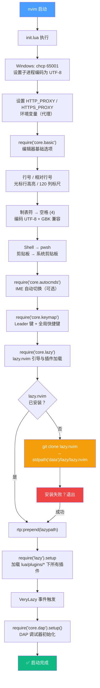

本页是一份面向 **Windows 平台**的实操指南，帮助你从零开始克隆本 Neovim 配置仓库，完成首次启动，并理解启动时自动发生的每一个关键步骤。文档覆盖系统前置要求、安装流程、首次启动的内部加载顺序，以及常见问题的排查方案。

## 系统前置要求

在开始之前，请确认你的环境满足以下条件：

| 依赖项 | 最低版本 | 推荐版本 | 用途 | 验证命令 |
|---|---|---|---|---|
| **Neovim** | 0.10.0 | ≥ 0.10.2 | 编辑器本体 | `nvim --version` |
| **Git** | 2.30+ | 最新 | 插件克隆与 lazy.nvim 引导 | `git --version` |
| **PowerShell 7** (`pwsh`) | 7.0 | ≥ 7.4 | 默认 Shell（`:!` 命令、ToggleTerm） | `pwsh --version` |
| **C# / .NET SDK** | 8.0 | ≥ 9.0 | C# 开发、Roslyn LSP、DAP 调试 | `dotnet --version` |
| **Node.js**（可选） | 18+ | 最新 LTS | 某些 LSP 服务器依赖 | `node --version` |
| **Nerd Font** | — | 任意 Nerd Font | 图标与状态栏正确渲染 | 字体名含 "Nerd Font" |
| **代理服务**（可选） | — | HTTP 代理 | GitHub 克隆加速 | 本文档后续说明 |

**Neovim 安装建议**：推荐使用 `winget install Neovim.Neovim` 或从 [Neovim Releases](https://github.com/neovim/neovim/releases) 下载。本配置使用了 `vim.uv`（Neovim 0.10+ 提供的新 Lua UV API），因此 **Neovim 0.10 是硬性要求**。

**Nerd Font 安装**：本配置大量使用文件图标（`nvim-web-devicons`）、状态栏图标（`lualine`）和补全菜单图标（`blink.cmp`）。如果你的终端不支持 Nerd Font，图标将显示为方框或乱码。推荐安装 [JetBrainsMono Nerd Font](https://www.nerdfonts.com/font-downloads) 并在 Windows Terminal 设置中指定。

Sources: [init.lua](init.lua#L1-L23), [lua/core/basic.lua](lua/core/basic.lua#L29-L35), [lazy-lock.json](lazy-lock.json#L1-L51), [lua/plugins/treesitter.lua](lua/plugins/treesitter.lua#L1-L23), [lua/plugins/toggleterm.lua](lua/plugins/toggleterm.lua#L1-L18)

## 安装步骤

### 第 1 步：克隆配置到正确位置

Neovim 在 Windows 上的默认配置路径为 `~\AppData\Local\nvim`。如果你正在阅读本文档，说明你已经在该目录中。对于全新安装，执行以下 PowerShell 命令：

```powershell
# 备份已有配置（如果存在）
if (Test-Path "$env:LOCALAPPDATA\nvim") {
    Rename-Item "$env:LOCALAPPDATA\nvim" "$env:LOCALAPPDATA\nvim.bak"
}

# 克隆本仓库
git clone https://github.com/<your-repo>/nvim-config.git "$env:LOCALAPPDATA\nvim"
```

**路径验证**：Neovim 使用 `stdpath("config")` 定位配置目录，在 Windows 上固定为 `%LOCALAPPDATA%\nvim`。`init.lua` 作为入口文件必须位于该目录根级别。如果你使用符号链接或 junction，确保目标路径正确。

Sources: [init.lua](init.lua#L1-L6)

### 第 2 步：启动 Neovim

在任意目录下执行 `nvim` 即可。首次启动时，你不需要手动安装任何插件管理器 —— **lazy.nvim 的引导机制会自动完成一切**。

> ⚠️ **代理用户注意**：本配置在 `init.lua` 中硬编码了代理地址 `127.0.0.1:7897`。如果你的代理端口不同，请在启动前修改此文件。如果你不需要代理，请注释掉相关行。

Sources: [init.lua](init.lua#L8-L10)

## 首次启动流程详解

首次启动时，Neovim 会经历以下自动化流程。理解这个流程有助于你排查启动阶段的问题。



### 阶段 1：Windows 编码与代理设置

`init.lua` 的前 10 行处理两个 Windows 特有的问题。首先通过 `chcp 65001` 将子进程的代码页切换到 UTF-8，这避免了 `lazygit`、`dotnet` 等子进程输出中文时出现乱码。接着设置 `HTTP_PROXY` / `HTTPS_PROXY` 环境变量，使 Git 克隆和插件下载走本地代理。`NO_PROXY` 变量排除了 `localhost` 和 `127.0.0.1`，防止本地服务请求被错误代理。

Sources: [init.lua](init.lua#L3-L10)

### 阶段 2：编辑器基础选项

`core.basic` 模块在插件加载之前就设定了编辑器的行为基调。下表列出了所有配置项及其作用：

| 配置分类 | 选项 | 值 | 作用 |
|---|---|---|---|
| **显示** | `number` / `relativenumber` | `true` | 绝对行号 + 相对行号，方便 `5j` 等相对跳转 |
| **显示** | `cursorline` | `true` | 高亮当前光标行 |
| **显示** | `colorcolumn` | `"120"` | 在第 120 列显示竖线参考线 |
| **缩进** | `expandtab` / `tabstop` / `shiftwidth` | `true` / `4` / `0` | Tab 替换为 4 空格；`shiftwidth=0` 表示跟随 `tabstop` |
| **文件** | `autoread` | `true` | 文件在外部被修改时自动重新加载 |
| **窗口** | `splitbelow` / `splitright` | `true` / `true` | 新水平分割在下方，新垂直分割在右方 |
| **搜索** | `ignorecase` / `smartcase` | `true` / `true` | 搜索默认忽略大小写；含大写字母时区分 |
| **剪贴板** | `clipboard` | `"unnamedplus"` | 与系统剪贴板同步（`+` 寄存器） |
| **编码** | `encoding` / `fileencoding` | `'utf-8'` | 默认 UTF-8 编码 |
| **编码** | `fileencodings` | `'utf-8,gbk,gb18030,…'` | 自动检测文件编码，兼容中文 GBK 文件 |
| **Shell** | `shell` | `'pwsh'` | 默认 Shell 为 PowerShell 7 |
| **SSH** | `clipboard` (条件) | OSC 52 | SSH 环境下通过 OSC 52 转发剪贴板 |

**Shell 配置细节**：本配置为 `pwsh` 量身定制了完整的 Shell 选项链 —— `shellcmdflag` 包含 `-NoLogo -NoProfile -ExecutionPolicy RemoteSigned`，`shellredir` / `shellpipe` 使用 `Out-File -Encoding UTF8` 确保输出正确。这些设置影响 Neovim 中一切子进程调用（`:!`、`:make`、`grepprg` 等）。

Sources: [lua/core/basic.lua](lua/core/basic.lua#L1-L61)

### 阶段 3：IME 自动切换（可选）

`core.autocmds` 模块为 Windows 用户提供了**输入法自动切换**功能。当检测到 `~/Tools/im_select.exe` 存在时，会在 `InsertLeave` 时自动切换到英文（代码 `1033`），在 `InsertEnter` 时切换到中文（代码 `2052`）。这是一个可选功能 —— 如果可执行文件不存在，整个模块会被跳过，不会产生任何错误。

如果你需要此功能，请将 `im_select.exe` 放置在 `~/Tools/` 目录下。你可以从 [im-select 项目](https://github.com/daipeihust/im-select) 获取该工具。

Sources: [lua/core/autocmds.lua](lua/core/autocmds.lua#L1-L23)

### 阶段 4：Leader 键与全局快捷键

`core.keymap` 模块在插件加载之前就定义了 Leader 键和一组全局快捷键。**Leader 键被设为空格（Space）**，Local Leader 键为反斜杠（`\`）。这些是你在后续所有操作中会频繁使用的基础映射。

| 快捷键 | 模式 | 功能 | 说明 |
|---|---|---|---|
| `<Space>` | Normal | Leader 前缀键 | 所有自定义快捷键的起始键 |
| `Ctrl+S` | n/i/x/s | 保存文件 | 跨模式统一的保存操作 |
| `Ctrl+Z` / `Ctrl+Shift+Z` | n/i | 撤销 / 重做 | 符合 Windows 习惯的快捷键 |
| `Ctrl+H/J/K/L` | Normal | 窗口导航 | 在分割窗口间移动 |
| `Alt+J` / `Alt+K` | n/i/v | 行移动 | 上下移动当前行（或选中行） |
| `Ctrl+\` | Terminal | 退出终端模式 | 从 ToggleTerm 返回 Normal 模式 |
| `Space+qq` | Normal | 退出所有 | 关闭所有窗口和标签页 |

Sources: [lua/core/keymap.lua](lua/core/keymap.lua#L1-L68)

### 阶段 5：lazy.nvim 引导与插件安装

这是首次启动中最关键的阶段。`core.lazy` 模块实现了 lazy.nvim 的**自动引导（bootstrap）机制**：

1. **检测安装**：检查 `stdpath("data")/lazy/lazy.nvim` 目录是否存在
2. **自动克隆**：如果不存在，执行 `git clone --filter=blob:none --branch=stable` 从 GitHub 克隆 lazy.nvim
3. **错误处理**：克隆失败时显示错误信息并退出
4. **运行时路径**：将 lazy.nvim 路径添加到 `runtimepath` 前端
5. **插件加载**：调用 `require("lazy").setup`，通过 `{ import = "plugins" }` 自动扫描 `lua/plugins/` 目录下的所有 Lua 模块

**重要细节**：本配置 **没有引入 LazyVim 框架**。`lazy.nvim` 仅作为插件管理器使用，`LazyVim` 的导入行已被注释掉。所有插件配置都是完全自定义的，每个插件定义在 `lua/plugins/` 下的独立文件中。

首次启动时，lazy.nvim 会检测到 `lazy-lock.json` 中列出的所有插件均未安装，并自动开始批量克隆和构建。根据网络状况，这个过程可能需要 **2-10 分钟**。在克隆完成后，部分插件还需要执行构建步骤（例如 `treesitter` 执行 `:TSUpdate` 编译语法解析器，`blink.cmp` 编译 Rust 二进制）。请耐心等待所有进度条完成。

Sources: [lua/core/lazy.lua](lua/core/lazy.lua#L1-L31), [lazy-lock.json](lazy-lock.json#L1-L51)

### 阶段 6：VeryLazy 与 DAP 初始化

当所有插件加载完成后，Neovim 触发 `VeryLazy` 事件。`init.lua` 注册了一个一次性回调，在此时调用 `require("core.dap").setup()` 初始化 C# 调试适配器（DAP）。DAP 初始化放在 VeryLazy 之后是为了确保所有依赖插件（`mason`、`dapui`、`nvim-dap-virtual-text`、`telescope`）都已加载完毕。

Sources: [init.lua](init.lua#L17-L22)

## 项目目录结构

理解配置文件的组织方式，有助于你后续自定义和排查问题：

```
%LOCALAPPDATA%\nvim\
├── init.lua                    # 入口文件：编码 → 代理 → 基础配置 → lazy 引导
├── .neoconf.json               # Neodev/Neoconf LSP 辅助配置
├── lazy-lock.json              # 插件版本锁定文件
├── stylua.toml                 # StyLua 格式化规则（2 空格，120 列宽）
├── nvim_edit.ps1               # Neovim Server 模式远程编辑脚本
├── lua/
│   ├── core/                   # 核心模块（启动阶段顺序加载）
│   │   ├── basic.lua           # 编辑器基础选项
│   │   ├── autocmds.lua        # IME 自动切换等自动命令
│   │   ├── keymap.lua          # Leader 键与全局快捷键
│   │   ├── lazy.lua            # lazy.nvim 引导与插件管理
│   │   └── dap.lua             # DAP 调试器核心初始化
│   ├── plugins/                # 插件配置（每文件一插件，lazy.nvim 自动扫描）
│   │   ├── blink.lua           # 自动补全框架
│   │   ├── mason.lua           # LSP 服务器管理
│   │   ├── roslyn.lua          # C# Roslyn LSP
│   │   ├── treesitter.lua      # 语法高亮与解析
│   │   ├── telescope.lua       # 模糊查找
│   │   ├── neo-tree.lua        # 文件浏览器
│   │   └── ...                 # 共 30+ 个插件配置
│   └── cs_solution.lua         # .sln/.csproj 解析引擎
├── docs/                       # 项目文档
└── openspec/                   # OpenSpec 设计文档与变更管理
```

**关键约定**：
- `lua/core/` 下的模块由 `init.lua` 按固定顺序手动加载，控制启动流程
- `lua/plugins/` 下的模块由 lazy.nvim 自动发现，每个文件 `return` 一个插件 spec 表
- `lazy-lock.json` 锁定了所有插件的精确 Git commit，确保跨设备一致性

Sources: [init.lua](init.lua#L12-L15), [lua/core/lazy.lua](lua/core/lazy.lua#L24-L31), [stylua.toml](stylua.toml#L1-L3)

## 安装后验证清单

首次启动完成后，请按以下清单逐项验证环境是否正常：


| 验证项 | 操作方式 | 预期结果 |
|---|---|---|
| 插件安装状态 | `:Lazy` | 所有插件状态为已安装（无红色标记） |
| 文件浏览器 | 按 `Space+e` | 左侧弹出 neo-tree 侧栏 |
| 补全框架 | 在 Insert 模式下输入文字 | 弹出 blink.cmp 补全菜单 |
| C# LSP | 打开任意 `.cs` 文件 | 底部状态栏显示 Roslyn 状态，`:LspInfo` 显示已 attach |
| Treesitter | 打开任意代码文件 | 语法高亮有颜色区分（非纯白文本） |
| 终端 | 按 `Ctrl+\` | 弹出浮动 PowerShell 终端 |
| 快捷键提示 | 按 `Space` 后等待 0.5 秒 | 弹出 Which-Key 菜单列出可用操作 |
| 主题 | 检查界面颜色 | Tokyonight 主题配色正常加载 |

**Mason LSP 服务器安装**：本配置使用 Mason 管理 LSP 服务器。`lua-language-server` 会在首次启动时自动安装。C# 的 Roslyn LSP 会在你首次打开 `.cs` 文件时自动下载安装（由 `roslyn.nvim` 处理），首次下载可能需要 1-2 分钟。你可以通过 `:Mason` 命令查看所有已安装和可用的工具。

Sources: [lua/plugins/mason.lua](lua/plugins/mason.lua#L36-L53), [lua/plugins/roslyn.lua](lua/plugins/roslyn.lua#L1-L13), [lua/plugins/blink.lua](lua/plugins/blink.lua#L1-L24)

## 常见问题排查

| 症状 | 可能原因 | 解决方案 |
|---|---|---|
| 启动时报错 `Failed to clone lazy.nvim` | 网络不通 / Git 未安装 | 检查 Git 是否安装；确认代理端口正确（默认 `7897`）；或注释掉代理行后重试 |
| 插件图标显示为方框 `□` | 未安装 Nerd Font | 安装 Nerd Font 并在终端设置中指定 |
| `:Mason` 中 netcoredbg 未安装 | Mason 首次启动未自动安装 | 在 Mason 界面手动安装：`:MasonInstall netcoredbg` |
| 打开 `.cs` 文件无 LSP | Roslyn 未下载完成 | 等待 Roslyn 自动下载；或执行 `:MasonInstall roslyn` |
| `:w` 或 `:!` 命令报 Shell 错误 | `pwsh` 不在 PATH 中 | 安装 PowerShell 7 并确保 `pwsh` 命令可用 |
| 终端中文乱码 | Windows 代码页未切换 | 确认 `init.lua` 中的 `chcp 65001` 行未被删除 |
| SSH 环境下剪贴板不工作 | 终端不支持 OSC 52 | 确认使用 Windows Terminal 1.18+、iTerm2 或 kitty |
| 快捷键 `Space+e` 无反应 | neo-tree 插件未加载 | 执行 `:Lazy` 检查 neo-tree 安装状态，必要时执行 `:Lazy sync` |

**重新安装所有插件**：如果遇到无法定位的插件问题，可以彻底清理后重新安装：

```powershell
# 删除插件数据目录
Remove-Item -Recurse -Force "$env:LOCALAPPDATA\nvim-data\lazy"
# 重新启动 nvim，lazy.nvim 将重新引导并安装所有插件
nvim
```

Sources: [init.lua](init.lua#L3-L10), [lua/core/basic.lua](lua/core/basic.lua#L29-L35), [lua/core/basic.lua](lua/core/basic.lua#L46-L61)

## 下一步阅读

完成环境搭建后，建议按以下顺序继续探索：

1. **[快捷键体系速览（Leader 键与核心操作）](3-kuai-jie-jian-ti-xi-su-lan-leader-jian-yu-he-xin-cao-zuo)** —— 掌握 Space Leader 键体系，解锁所有核心操作
2. **[整体架构与模块加载流程](4-zheng-ti-jia-gou-yu-mo-kuai-jia-zai-liu-cheng)** —— 理解配置的宏观架构和模块间的依赖关系
3. **[核心基础配置（编辑器行为、Shell、剪贴板与编码）](5-he-xin-ji-chu-pei-zhi-bian-ji-qi-xing-wei-shell-jian-tie-ban-yu-bian-ma)** —— 深入了解 `core.basic` 中每一项配置的设计意图
4. **[插件管理策略：lazy.nvim 与按文件组织模式](6-cha-jian-guan-li-ce-lue-lazy-nvim-yu-an-wen-jian-zu-zhi-mo-shi)** —— 学习如何添加、管理和调试插件

如果你是 C# / .NET 开发者，可以直接跳转到：
- **[Roslyn LSP 集成与解决方案管理](7-roslyn-lsp-ji-cheng-yu-jie-jue-fang-an-guan-li)** —— C# 语言服务的配置与使用
- **[C# DAP 调试器：从适配器注册到启动配置](8-c-dap-diao-shi-qi-cong-gua-pei-qi-zhu-ce-dao-qi-dong-pei-zhi)** —— 配置并使用 C# 调试功能