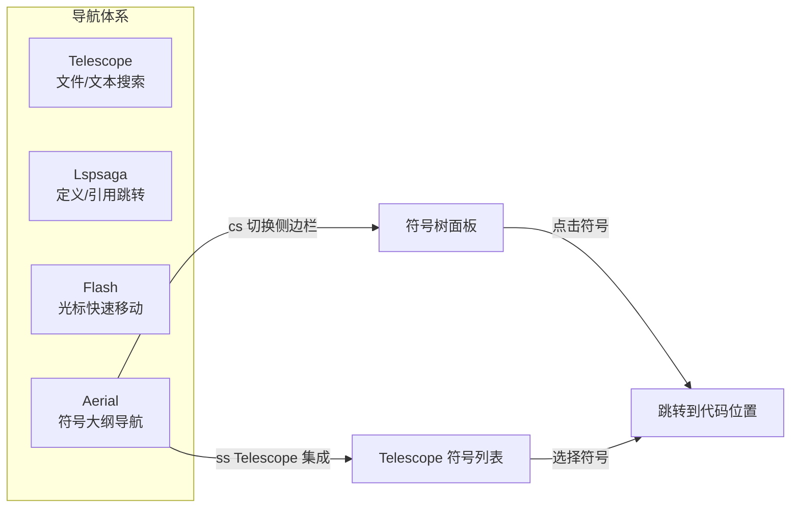
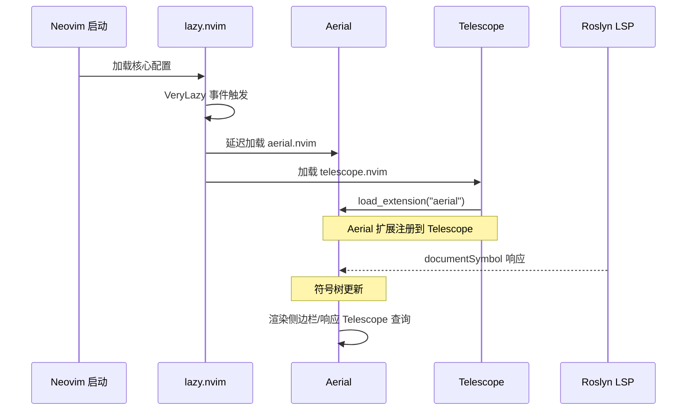

Aerial 是本配置中的 **代码符号浏览器**，它以侧边栏树形结构展示当前缓冲区的类、方法、函数、字段等代码符号，为开发者提供"鸟瞰式"的代码大纲视图。本文将深入解析 Aerial 的后端策略、符号过滤机制、图标定制、布局配置以及与 Telescope 的集成方式，帮助你在大型 C# / Lua 项目中快速定位代码结构。

Sources: [aerial.lua](lua/plugins/aerial.lua#L1-L138)

## 架构定位：符号导航在导航体系中的角色

在本 Neovim 配置的导航体系中，Aerial 与 [Telescope 模糊查找器](16-telescope-mo-hu-cha-zhao-qi-wen-jian-grep-yu-git-sou-suo)、[Lspsaga 代码导航](15-lspsaga-dai-ma-dao-hang-yu-cao-zuo-zeng-qiang)、[Flash 快速跳转](17-flash-kuai-su-tiao-zhuan-yu-treesitter-xuan-ze) 各有分工。如果说 Telescope 解决"文件级搜索"、Lspsaga 解决"定义/引用级跳转"、Flash 解决"屏幕级光标移动"，那么 Aerial 解决的是 **缓冲区级结构概览**——你不需要离开当前文件，就能在侧边栏中看到完整的符号层级关系，并一键跳转到任意符号。



Sources: [aerial.lua](lua/plugins/aerial.lua#L118-L136)

## 核心配置解析

### 后端策略：多源符号提取

Aerial 的符号数据来源于 **后端（backends）**——它按照优先级依次尝试多个后端，首个能提供数据的后端即为当前缓冲区的有效数据源。本配置声明了四个后端：

```lua
backends = { "lsp", "treesitter", "markdown", "man" },
```

| 优先级 | 后端 | 数据来源 | 适用场景 |
|--------|------|----------|----------|
| 1 | `lsp` | LSP 服务器提供的 `textDocument/documentSymbol` | C#（Roslyn）、Lua（lua_ls）等有 LSP 的语言 |
| 2 | `treesitter` | Treesitter 语法树解析 | 无 LSP 但有 Treesitter parser 的语言 |
| 3 | `markdown` | Markdown 标题层级解析 | `.md` 文件的章节大纲 |
| 4 | `man` | man page 章节解析 | Linux/POSIX 手册页浏览 |

这意味着在 C# 开发中，Aerial 主要依赖 Roslyn LSP 提供的精确符号信息（类、方法、属性、枚举等完整层级），而在编辑 Markdown 文档时则自动切换到标题解析模式。

Sources: [aerial.lua](lua/plugins/aerial.lua#L96)

### 附加模式：全局跟踪

```lua
attach_mode = "global",
```

`attach_mode` 设为 `"global"` 意味着 Aerial 面板 **全局唯一**——无论你切换到哪个窗口/缓冲区，Aerial 侧边栏都会自动更新为当前缓冲区的符号内容。这与 `"window"` 模式（每个窗口独立维护一份 Aerial）形成对比。全局模式的体验更轻量：只有一个 Aerial 窗口需要管理，且始终反映你当前正在编辑的文件结构。

Sources: [aerial.lua](lua/plugins/aerial.lua#L95)

## 符号过滤机制：按文件类型筛选

Aerial 的 `filter_kind` 选项控制哪些类型的符号会显示在大纲中。本配置定义了一套精细的 **按文件类型过滤规则**：

```lua
local kind_filter = {
    default = {
        "Class", "Constructor", "Enum", "Field", "Function",
        "Interface", "Method", "Module", "Namespace", "Package",
        "Property", "Struct", "Trait",
    },
    markdown = false,   -- Markdown 禁用过滤（显示所有）
    help = false,       -- 帮助文件禁用过滤
    lua = {
        "Class", "Constructor", "Enum", "Field", "Function",
        "Interface", "Method", "Module", "Namespace",
        -- "Package", -- 排除 Package：lua_ls 对控制流结构（if/for）误标为 Package
        "Property", "Struct", "Trait",
    },
}
```

关键设计决策：

- **`default` 规则** 作为所有未特别指定文件类型的回退过滤列表，覆盖了面向对象编程中最核心的 13 种符号类型。
- **Lua 特殊处理**：排除 `Package` 类型。这是因为 `lua_ls` 存在一个已知行为——它会将 Lua 的控制流结构（`if`/`for`/`while`）标记为 `Package`，导致大纲中出现大量无意义的噪音条目。这个 HACK 注释也明确标注了这一原因。 [aerial.lua](lua/plugins/aerial.lua#L85-L87)
- **Markdown / Help 禁用过滤**（设为 `false`）：这两个文件类型的符号数量通常不多（Markdown 只有标题，Help 只有章节），全量显示反而更实用。

在运行时，配置通过 `filter_kind._ = filter_kind.default` 将默认规则映射到通配符键 `_`，然后删除原 `default` 键，以符合 Aerial 内部的文件类型匹配逻辑。

Sources: [aerial.lua](lua/plugins/aerial.lua#L43-L93)

## 图标体系与树形引导线

### Nerd Font 图标映射

本配置为 Aerial 定义了一套完整的 **Nerd Font 图标映射**，覆盖了 40+ 种符号类型。每个图标与 `filter_kind` 中的类型名称一一对应：

| 符号类型 | 图标 | 符号类型 | 图标 |
|----------|------|----------|------|
| Class |  | Method | 󰊕 |
| Interface |  | Function | 󰊕 |
| Enum |  | Property |  |
| Struct | 󰆼 | Field |  |
| Namespace | 󰦮 | Module |  |
| Constructor |  | Constant | 󰏿 |

值得注意的是，配置中对 Lua 文件做了特殊图标覆盖：

```lua
icons.lua = { Package = icons.Control }
```

这配合前文提到的 `kind_filter` 中 Lua 排除 `Package` 的逻辑——即便日后需要显示 Lua 的 `Package` 类型符号，也会使用 `Control`（）图标而非默认的 `Package`（）图标，以视觉上区分 Lua 的控制流结构。

Sources: [aerial.lua](lua/plugins/aerial.lua#L1-L42), [aerial.lua](lua/plugins/aerial.lua#L83-L87)

### 树形引导线

Aerial 的树形结构使用自定义的 **引导线字符**（guides），而非默认的简单缩进：

```
├╴ Class: UserService
│  ├╴ Method: GetUser
│  ├╴ Method: CreateUser
│  └╴ Property: IsActive
└╴ Class: OrderService
```

配置定义了四种引导线组件：

```lua
guides = {
    mid_item   = "├╴",   -- 同级中间项
    last_item  = "└╴",   -- 同级最后一项
    nested_top = "│ ",   -- 嵌套层级的垂直连线
    whitespace = "  ",   -- 空白占位
}
```

`show_guides = true` 开启引导线显示，配合 `resize_to_content = false` 确保 Aerial 窗口宽度不会随符号层级深度频繁变动，保持视觉稳定性。

Sources: [aerial.lua](lua/plugins/aerial.lua#L97-L114)

## 布局与窗口样式

Aerial 窗口的视觉表现通过 `layout.win_opts` 精细控制：

```lua
layout = {
    resize_to_content = false,
    win_opts = {
        winhl = "Normal:NormalFloat,FloatBorder:NormalFloat,SignColumn:SignColumnSB",
        signcolumn = "yes",
        statuscolumn = " ",
    },
},
```

| 配置项 | 值 | 效果 |
|--------|------|------|
| `resize_to_content` | `false` | 窗口宽度固定，不随内容自适应 |
| `winhl` | `Normal:NormalFloat,...` | 使用浮动窗口样式的高亮组，视觉上与普通编辑区区分 |
| `signcolumn` | `"yes"` | 始终显示符号列，防止宽度抖动 |
| `statuscolumn` | `" "` | 设置空格作为状态列占位 |

这种配置使 Aerial 面板看起来像一个精致的侧边信息面板，而非普通的 Vim 分割窗口。

Sources: [aerial.lua](lua/plugins/aerial.lua#L98-L105)

## 快捷键与 Telescope 集成

### 侧边栏切换

Aerial 侧边栏的切换绑定在 `<leader>cs`（**c**ode **s**ymbols）：

```lua
keys = {
    { "<leader>cs", "<cmd>AerialToggle<cr>", desc = "Aerial (Symbols)" },
},
```

在 [Which-Key 快捷键提示系统](31-which-key-kuai-jie-jian-ti-shi-xi-tong) 中，`<leader>c` 被归入 `code` 分组，因此按下 `<Space>c` 后会看到 `s → Aerial (Symbols)` 的提示。

Sources: [aerial.lua](lua/plugins/aerial.lua#L118-L121), [whichkey.lua](lua/plugins/whichkey.lua#L14)

### Telescope 符号搜索

本配置将 Aerial 作为 Telescope 扩展加载，并提供 `<leader>ss` 快捷键触发 **符号模糊搜索**：

```lua
{
    "nvim-telescope/telescope.nvim",
    optional = true,
    opts = function()
        require("telescope").load_extension("aerial")
    end,
    keys = {
        {
            "<leader>ss",
            "<cmd>Telescope aerial<cr>",
            desc = "Goto Symbol (Aerial)",
        },
    },
},
```

这个 Telescope 集成块采用 lazy.nvim 的 `optional = true` 模式——仅当 Telescope 插件已安装时才生效。它的核心作用有两个：

1. **加载扩展**：在 Telescope 配置阶段通过 `load_extension("aerial")` 注册 Aerial 数据源
2. **注册快捷键**：`<leader>ss` 打开 Telescope 界面，但列表内容来自 Aerial 的符号索引而非 LSP 原生接口

与原生的 `lsp_document_symbols` 相比，Aerial 扩展的优势在于 **统一的符号过滤**——你在 Aerial 侧边栏中看到的符号子集（受 `filter_kind` 控制），与在 Telescope 搜索中看到的是一致的，避免了两个入口展示不同结果集的困惑。

Sources: [aerial.lua](lua/plugins/aerial.lua#L123-L136)

### 快捷键速查表

| 快捷键 | 功能 | 上下文 |
|--------|------|--------|
| `<leader>cs` | 切换 Aerial 侧边栏 | 任意缓冲区 |
| `<leader>ss` | Telescope 符号搜索（Aerial 数据源） | 任意缓冲区 |

Sources: [aerial.lua](lua/plugins/aerial.lua#L118-L136)

## 加载策略

Aerial 使用 `event = "VeryLazy"` 延迟加载——它不会在 Neovim 启动时立即加载，而是在 UI 初始化完成后的首次空闲期加载。这避免了启动阶段的性能开销，同时确保在你真正需要符号导航时插件已经就绪。



Sources: [aerial.lua](lua/plugins/aerial.lua#L81)

## 延伸阅读

- [Lspsaga 代码导航与操作增强](15-lspsaga-dai-ma-dao-hang-yu-cao-zuo-zeng-qiang)：Lspsaga 提供的定义跳转、引用查找等操作，与 Aerial 的符号概览形成互补的导航体验。
- [Telescope 模糊查找器](16-telescope-mo-hu-cha-zhao-qi-wen-jian-grep-yu-git-sou-suo)：了解 Telescope 的整体配置，包括 Aerial 扩展以外的其他搜索功能。
- [Treesitter 语法高亮与折叠](14-treesitter-yu-fa-gao-liang-yu-zhe-die)：Aerial 的 `treesitter` 后端依赖 Treesitter parser，了解 Treesitter 的配置有助于理解符号提取的备选数据路径。