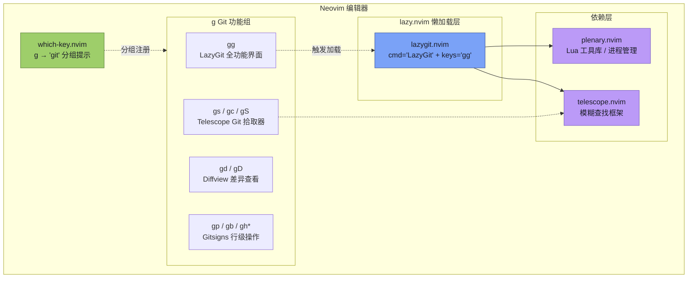

本配置通过 `kdheepak/lazygit.nvim` 插件将 **LazyGit**——一个终端原生的 Git 图形界面工具——无缝嵌入 Neovim 编辑器中。LazyGit 以浮动终端窗口的形式启动，让你在不离开编辑器的情况下完成暂存、提交、分支切换、合并、变基等日常 Git 操作。本文将详细解析该插件的加载策略、快捷键绑定、依赖关系，以及在整体 Git 工作流中的定位。

Sources: [lazygit.lua](lua/plugins/lazygit.lua#L1-L12)

## 插件配置全貌

整个 LazyGit 集成仅用 **12 行代码**完成，采用了 lazy.nvim 的声明式配置范式。配置虽短，但每一行都承载着精确的工程意图：

```lua
return {
    "kdheepak/lazygit.nvim",
    cmd = "LazyGit",
    dependencies = {
        "nvim-lua/plenary.nvim",
        "nvim-telescope/telescope.nvim",
    },
    keys = {
        { "<leader>gg", ":LazyGit<CR>", noremap = true, silent = true }
    }
}
```

下面逐项解析各配置字段的设计意图。

Sources: [lazygit.lua](lua/plugins/lazygit.lua#L1-L12)

### 懒加载策略：按需启动

插件采用了 **双重懒加载** 机制，确保 LazyGit 在你真正需要之前不会消耗任何启动时间：

| 加载触发器 | 配置字段 | 触发行为 |
|---|---|---|
| **命令触发** | `cmd = "LazyGit"` | 在 Neovim 中执行 `:LazyGit` 命令时才加载插件 |
| **快捷键触发** | `keys = { "<leader>gg", ... }` | 按下 `Space → g → g` 时自动加载并执行 |

这意味着如果你的整个编辑会话都无需 Git 操作，该插件将 **完全不被加载**，对 Neovim 的启动速度零影响。这是 lazy.nvim 框架的核心优势之一——通过精细化的加载时机控制，让数百个插件和谐共存而不拖慢编辑器。

Sources: [lazygit.lua](lua/plugins/lazygit.lua#L3-L10), [lazy-lock.json](lazy-lock.json#L16)

### 依赖链：Plenary 与 Telescope

`lazygit.nvim` 声明了两个关键依赖：

- **`nvim-lua/plenary.nvim`**：Lua 工具库，提供了异步执行、路径处理、作业控制等基础设施。LazyGit 插件依赖它来管理底层终端进程的创建与通信。
- **`nvim-telescope/telescope.nvim`**：模糊查找框架。LazyGit 集成 Telescope 后，可以在 LazyGit 界面中使用 Telescope 进行分支筛选、提交历史搜索等增强操作。

这两个依赖同时也是本配置中其他插件的重用组件——Telescope 作为独立的模糊查找器已在 [Telescope 模糊查找器：文件、Grep 与 Git 搜索](16-telescope-mo-hu-cha-zhao-qi-wen-jian-grep-yu-git-sou-suo) 中详细配置，而 Plenary 是众多 Neovim Lua 插件的公共基石。lazy.nvim 会自动处理依赖的加载顺序，确保它们在 `lazygit.nvim` 之前就绪。

Sources: [lazygit.lua](lua/plugins/lazygit.lua#L4-L7)

## 快捷键映射与操作方式

### 核心入口快捷键

本配置将 Leader 键设为 **空格键（Space）**，因此 LazyGit 的启动快捷键 `<leader>gg` 的实际操作为：

> **`Space → g → g`**

在 Which-Key 的分组体系中，`<leader>g` 被注册为 **"git"** 功能组。这意味着按下 `Space → g` 后，Which-Key 会弹出一个提示面板，展示所有 Git 相关的快捷键，其中就包括 LazyGit。

Sources: [lazygit.lua](lua/plugins/lazygit.lua#L8-L10), [keymap.lua](lua/core/keymap.lua#L1), [whichkey.lua](lua/plugins/whichkey.lua#L20)

### Git 工作流快捷键全景

LazyGit 并非孤立的 Git 工具，而是本配置 Git 工作流矩阵中的一个节点。下表展示了 `<leader>g` 前缀下的所有 Git 操作，帮助你理解 LazyGit 在整体工作流中的位置：

| 快捷键 | 功能 | 来源插件 | 适用场景 |
|---|---|---|---|
| `<leader>gg` | 打开 LazyGit 全功能界面 | lazygit.nvim | 需要完整的 Git 交互操作 |
| `<leader>gs` | 查看 Git 状态 | Telescope | 快速浏览变更文件列表 |
| `<leader>gc` / `<leader>gl` | 查看 Git 提交历史 | Telescope | 快速搜索特定提交 |
| `<leader>gS` | 查看 Git Stash 列表 | Telescope | 搜索暂存的内容 |
| `<leader>gd` | 打开 DiffView 差异对比 | Diffview | 详细的文件级 diff 查看 |
| `<leader>gD` | 查看当前文件的修改历史 | Diffview | 追踪单文件的完整变更时间线 |
| `<leader>gq` | 关闭 DiffView | Diffview | 关闭差异对比窗口 |
| `<leader>gp` | 预览当前 Hunk | Gitsigns | 不离开代码查看某处改了什么 |
| `<leader>gb` | 切换行级 Blame 显示 | Gitsigns | 查看每行代码的最后修改者 |
| `<leader>ghs` | 暂存当前 Hunk | Gitsigns | 精细化暂存部分修改 |
| `<leader>ghr` | 重置当前 Hunk | Gitsigns | 撤销局部未暂存的修改 |
| `<leader>ghu` | 撤销 Hunk 暂存 | Gitsigns | 回退最近的 stage 操作 |

**操作指引**：如果你只需要快速查看状态或搜索某个提交，Telescope 的 Git 拾取器（`<leader>gs`、`<leader>gc`）更轻量直接；当你需要进行暂存、提交、分支管理、合并等 **完整的 Git 工作流操作** 时，才需要打开 LazyGit（`<leader>gg`）。更多行级变更操作详见 [Gitsigns 行级变更与 blame](22-gitsigns-xing-ji-bian-geng-yu-blame)，差异查看详见 [Diffview 差异查看与文件历史](23-diffview-chai-yi-cha-kan-yu-wen-jian-li-shi)。

Sources: [lazygit.lua](lua/plugins/lazygit.lua#L8-L10), [telescope.lua](lua/plugins/telescope.lua#L44-L47), [diffview.lua](lua/plugins/diffview.lua#L4-L8), [gitsigns.lua](lua/plugins/gitsigns.lua#L22-L29), [whichkey.lua](lua/plugins/whichkey.lua#L20-L21)

## LazyGit 界面内的基本操作

LazyGit 启动后以浮动终端窗口呈现，其界面由三个面板组成：**状态面板（左上）**、**差异面板（右上）** 和 **操作面板（底部）**。以下是初学者最常用的内置快捷键：

| LazyGit 内置快捷键 | 功能 | 说明 |
|---|---|---|
| `h` / `l` | 切换面板焦点 | 在文件列表与差异面板间跳转 |
| `j` / `k` | 上下移动光标 | 在文件或 Hunk 列表中导航 |
| `Space` | 暂存 / 取消暂存文件 | 将选中文件加入或移出暂存区 |
| `a` | 暂存全部文件 | 一次性将所有变更加入暂存区 |
| `c` | 提交变更 | 弹出提交信息输入框，输入后按 Enter 确认 |
| `P` | 推送到远程 | 将本地提交推送到远端仓库 |
| `p` | 拉取远程更新 | 从远端仓库拉取最新内容 |
| `b` | 查看分支列表 | 显示所有本地和远程分支 |
| `n` | 新建分支 | 创建并切换到新分支 |
| `r` | 变基（Rebase） | 对当前分支执行变基操作 |
| `M` | 合并（Merge） | 将选中分支合并到当前分支 |
| `q` | 退出 LazyGit | 关闭浮动窗口，返回 Neovim |
| `?` | 显示帮助 | 查看所有可用的快捷键列表 |

> **初学者提示**：LazyGit 界面内按 `?` 即可随时查看完整的快捷键列表。当你的光标位于某个面板时，按 `?` 显示的是该面板的专属操作。无需记忆所有快捷键——善用帮助面板即可。

## 架构关系图

以下 Mermaid 图展示了 LazyGit 在 Neovim 编辑环境中的集成架构，以及它与同属 Git 工作流的其他插件之间的协作关系：



从这个架构可以看出：LazyGit 插件本身极为轻量，核心逻辑在于通过 **plenary.nvim** 管理底层终端进程，并可选地借助 **Telescope** 进行增强。而 `<leader>g` 这个 Git 功能前缀由 Which-Key 统一管理，使得 LazyGit、Gitsigns、Diffview、Telescope Git 拾取器形成了一个逻辑一致的 Git 操作矩阵。

Sources: [lazygit.lua](lua/plugins/lazygit.lua#L1-L12), [whichkey.lua](lua/plugins/whichkey.lua#L20-L21), [lazy-lock.json](lazy-lock.json#L16)

## 前置条件与故障排除

LazyGit 插件要求系统已安装 **lazygit 命令行工具本身**。该插件只是一个 Neovim 的界面封装——如果本机没有 lazygit 可执行文件，按下 `<leader>gg` 后将看到错误提示。

**安装 lazygit（Windows）**：

```powershell
# 方式一：通过 winget 安装
winget install --id JesseDuffield.lazygit

# 方式二：通过 scoop 安装
scoop install lazygit
```

**验证安装**：

```powershell
lazygit --version
```

如果命令返回版本号（如 `commit=, build date=, build source=, version=0.44.1, os=windows, arch=amd64`），说明安装成功。之后在 Neovim 中按 `Space → g → g` 即可正常打开 LazyGit 界面。

**常见问题速查**：

| 问题现象 | 可能原因 | 解决方案 |
|---|---|---|
| 按下 `<leader>gg` 无反应 | 未安装 lazygit 可执行文件 | 按上述方式安装 |
| LazyGit 界面中文乱码 | 终端编码不支持 UTF-8 | 确保 PowerShell 使用 UTF-8 编码 |
| 浮动窗口位置或大小异常 | 终端窗口过小 | 最大化终端窗口后重试 |
| `<leader>` 键不是空格 | Leader 键被其他配置覆盖 | 检查 [keymap.lua](lua/core/keymap.lua#L1) 中 `vim.g.mapleader` 的值 |

Sources: [keymap.lua](lua/core/keymap.lua#L1), [lazygit.lua](lua/plugins/lazygit.lua#L8-L10)

## 阅读导航

LazyGit 是本配置 Git 工作流的「一站式操作台」。如果你需要更轻量或更精细的 Git 操作，可以继续阅读以下页面：

- [Gitsigns 行级变更与 blame](22-gitsigns-xing-ji-bian-geng-yu-blame)——了解如何在编码过程中实时查看行级变更、Blame 信息和 Hunk 操作
- [Diffview 差异查看与文件历史](23-diffview-chai-yi-cha-kan-yu-wen-jian-li-shi)——深入了解文件级差异对比和完整变更历史的查看方式
- [Telescope 模糊查找器：文件、Grep 与 Git 搜索](16-telescope-mo-hu-cha-zhao-qi-wen-jian-grep-yu-git-sou-suo)——掌握 Git 状态、提交历史、Stash 的快速搜索方法