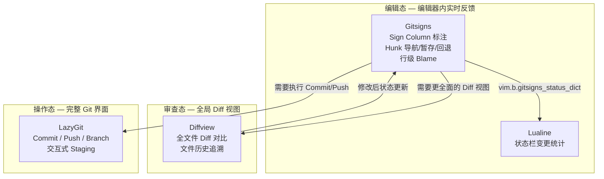

Gitsigns.nvim 是本配置中 **Git 工作流** 的行级变更可视化层——它在 Sign Column（标号栏）中以字符符号标注每一行的增删改状态，并提供 Hunk（变更块）级别的预览、暂存、回退，以及虚拟文本形式的行级 blame 注释。与全局操作工具 [LazyGit 集成](21-lazygit-ji-cheng)和 [Diffview 差异查看与文件历史](23-diffview-chai-yi-cha-kan-yu-wen-jian-li-shi)不同，Gitsigns 专注于 **编辑器内的实时、逐行反馈**，让你在编码过程中无需离开当前 Buffer 即可感知 Git 上下文。

Sources: [gitsigns.lua](lua/plugins/gitsigns.lua#L1-L31)

## 插件加载策略与 Sign Column 配置

Gitsigns 采用 `VeryLazy` 事件触发加载，这意味着它不会阻塞 Neovim 启动，而是在 UI 首次需要渲染时才激活。一旦加载，Gitsigns 会自动监听 Buffer 的文本变更事件，与 Git 索引进行实时比对，将差异结果渲染到 Sign Column 中。

配置中定义了两套 Sign 符号系统——`signs`（工作区变更）和 `signs_staged`（暂存区变更），两者使用相同的视觉符号以保持一致性，但 Gitsigns 会通过高亮组（如 `GitSignsAdd` vs `GitSignsStagedAdd`）对它们进行颜色区分，从而让用户能在同一视图中辨别"已暂存"与"未暂存"的变更：

| 变更类型 | 符号 | 说明 |
|---|---|---|
| `add` | `+` | 新增行 |
| `change` | `~` | 修改行 |
| `delete` | `_` | 删除行（删除行下方的占位标记） |
| `topdelete` | `‾` | 文件首行删除 |
| `changedelete` | `~` | 修改后又删除的行 |
| `untracked`（仅工作区） | `?` | 未追踪文件中的新增行 |

值得注意的是，`signs_staged` 没有定义 `untracked` 类型——这是因为暂存区中不存在"未追踪"的概念，所有暂存内容必然已被 Git 索引追踪。这一差异体现了配置对 Git 语义的精确映射。

Sources: [gitsigns.lua](lua/plugins/gitsigns.lua#L1-L20)

## 快捷键体系：Hunk 导航与操作

所有 Gitsigns 快捷键在插件声明中通过 `keys` 表直接注册，遵循 lazy.nvim 的按需加载规范。键位设计分为两个层次——**Hunk 导航**与 **Hunk 操作**：

### Hunk 导航

```
]h  →  跳转到下一个 Hunk
[h  →  跳转到上一个 Hunk
```

`]+字符` / `[+字符` 是 Neovim 生态中公认的"向前/向后导航"约定（如 `]d` 诊断、`]b` Buffer），`]h` / `[h` 延续了这一模式，让 Hunk 跳转成为肌肉记忆的自然延伸。这两个键位也已在 [Which-Key 快捷键提示系统](31-which-key-kuai-jie-jian-ti-shi-xi-tong)中注册到 `]`（next）和 `[`（prev）分组下。

Sources: [gitsigns.lua](lua/plugins/gitsigns.lua#L22-L23), [whichkey.lua](lua/plugins/whichkey.lua#L26-L27)

### Hunk 操作

Hunk 操作全部挂在 `<leader>gh` 前缀下，其中 `g` 代表 Git，`h` 代表 Hunk。Which-Key 将 `<leader>gh` 注册为独立分组，输入 `<leader>gh` 后会弹出子菜单提示可用操作：

| 快捷键 | 功能 | 说明 |
|---|---|---|
| `<leader>ghs` | Stage Hunk | 将当前 Hunk 暂存到 Git 索引 |
| `<leader>ghu` | Undo Stage Hunk | 撤销最近一次 Hunk 暂存操作 |
| `<leader>ghr` | Reset Hunk | 将当前 Hunk 回退到 HEAD 版本 |
| `<leader>gp` | Preview Hunk | 在浮动窗口中预览当前 Hunk 的完整 diff |
| `<leader>gb` | Toggle Line Blame | 切换当前行的虚拟文本 blame 显示 |

Sources: [gitsigns.lua](lua/plugins/gitsigns.lua#L24-L28), [whichkey.lua](lua/plugins/whichkey.lua#L21)

## 行级 Blame：虚拟文本中的提交溯源

`<leader>gb` 触发的 `toggle_current_line_blame` 是 Gitsigns 最具辨识度的功能之一。开启后，它会在光标所在行的末尾以虚拟文本（virtual text）形式显示该行最后一次修改的提交信息——通常包括提交者、时间和提交摘要。这一功能的核心价值在于 **零上下文切换**：你无需打开 `git blame` 的全屏输出或 LazyGit 界面，只需扫一眼行尾即可了解代码的归属历史。

由于使用的是 toggle 模式，重复按下 `<leader>gb` 即可关闭 blame 显示。这使得它成为一个"按需启用"的临时工具，不会在不需要时造成视觉干扰。

Sources: [gitsigns.lua](lua/plugins/gitsigns.lua#L25)

## Lualine 状态栏中的 Gitsigns 数据集成

Gitsigns 不仅仅是 Sign Column 中的符号标注——它还会将 Buffer 级别的变更统计写入 `vim.b.gitsigns_status_dict` 这个 Buffer 局部变量。本配置中的 [Lualine 状态栏与 DAP/Lazy 状态集成](28-lualine-zhuang-tai-lan-yu-dap-lazy-zhuang-tai-ji-cheng) 直接读取该变量，在状态栏右侧的 `diff` 组件中渲染当前文件的增删改行数：

```lua
source = function()
  local gitsigns = vim.b.gitsigns_status_dict
  if gitsigns then
    return {
      added = gitsigns.added,
      modified = gitsigns.changed,
      removed = gitsigns.removed,
    }
  end
end,
```

这段 `source` 函数充当了 Gitsigns 内部状态到 Lualine 显示层的数据桥梁。值得注意的是字段映射中存在一处语义转换：Gitsigns 内部使用 `changed` 表示修改行数，而 Lualine 的 `diff` 组件期望的字段名是 `modified`，因此代码中显式地将 `gitsigns.changed` 映射到 `modified`。配合自定义图标（` ` 新增、` ` 修改、` ` 删除），状态栏提供了一个全局级别的变更概览，与 Sign Column 的行级标注形成互补视角。

Sources: [lualine.lua](lua/plugins/lualine.lua#L96-L112)

## Git 工作流中的 Gitsigns 定位

在本配置的 Git 工具链中，Gitsigns 扮演的是 **行级实时反馈层** 的角色。理解它与同链路中其他工具的边界，有助于在实际开发中选择正确的工具：



| 工具 | 交互模式 | 粒度 | 典型场景 |
|---|---|---|---|
| **Gitsigns** | Sign Column + 虚拟文本 | 行级 / Hunk 级 | 编码时实时感知变更、快速预览单个 Hunk |
| **Diffview** | 全屏分栏 Diff | 文件级 | Code Review、查看某个文件的完整历史变更 |
| **LazyGit** | 独立 TUI | 仓库级 | Commit、Push、Branch 管理等完整 Git 操作 |

这三者的快捷键前缀也遵循一致的逻辑：`<leader>g` 统一为 Git 操作入口——`<leader>gh` 操作 Hunk，`<leader>gd` 打开 Diffview，`<leader>gg` 启动 LazyGit，通过 Which-Key 的分组提示即可自然发现。

Sources: [gitsigns.lua](lua/plugins/gitsigns.lua#L21-L29), [diffview.lua](lua/plugins/diffview.lua#L4-L8), [lazygit.lua](lua/plugins/lazygit.lua#L8-L10), [whichkey.lua](lua/plugins/whichkey.lua#L20-L21)

## 下一步阅读

- 若需了解全局 Diff 对比和文件历史追溯功能，请阅读 [Diffview 差异查看与文件历史](23-diffview-chai-yi-cha-kan-yu-wen-jian-li-shi)
- 若需了解状态栏中 Gitsigns 数据的渲染细节，请阅读 [Lualine 状态栏与 DAP/Lazy 状态集成](28-lualine-zhuang-tai-lan-yu-dap-lazy-zhuang-tai-ji-cheng)
- 若需了解快捷键分组提示的完整注册方式，请阅读 [Which-Key 快捷键提示系统](31-which-key-kuai-jie-jian-ti-shi-xi-tong)