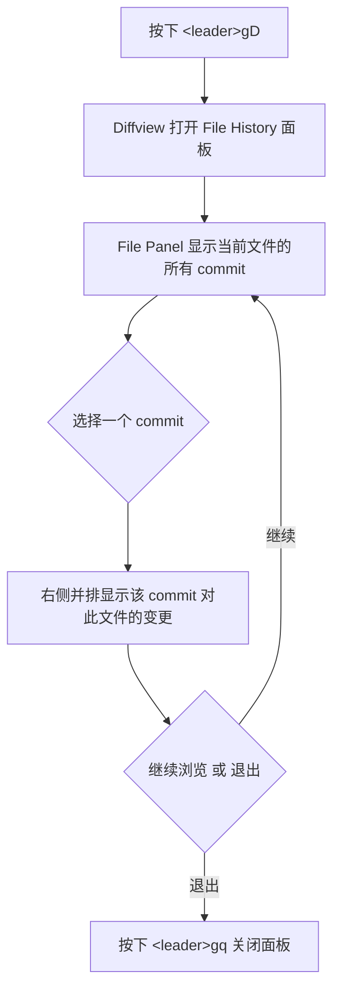

Diffview.nvim 是本配置中 **Git 工作流** 的核心可视化差异工具，提供全屏的 diff 浏览面板和文件级 Git 历史追溯能力。与 [Gitsigns 行级变更与 blame](22-gitsigns-xing-ji-bian-geng-yu-blame) 的行内轻量提示不同，Diffview 面向的是需要**逐文件对比、逐 commit 回溯**的深度审查场景——例如 Code Review 前的自检、历史版本回溯、或定位某次变更的完整影响范围。配合 [LazyGit 集成](21-lazygit-ji-cheng) 的交互式 Git 操作，三者共同构成了从「行级感知 → 全局差异 → 仓库管理」的完整 Git 工具链。

Sources: [diffview.lua](lua/plugins/diffview.lua#L1-L11), [gitsigns.lua](lua/plugins/gitsigns.lua#L1-L31), [lazygit.lua](lua/plugins/lazygit.lua#L1-L11)

## 插件加载策略与声明式配置

Diffview 在本配置中采用了 **`cmd` + `keys` 双重延迟加载**策略。这意味着插件代码仅在用户显式执行 `:DiffviewOpen`、`:DiffviewFileHistory`、`:DiffviewClose` 命令，或按下对应快捷键时才会被加载，不占用 Neovim 启动时间。配置主体极为精简——`opts = {}` 直接使用 Diffview 的全部默认值，不做任何自定义覆盖，体现了"零配置即可用"的设计理念。

```lua
return {
  "sindrets/diffview.nvim",
  cmd = { "DiffviewOpen", "DiffviewFileHistory", "DiffviewClose" },
  keys = {
    { "<leader>gd", "<cmd>DiffviewOpen<cr>",           desc = "Open DiffView" },
    { "<leader>gD", "<cmd>DiffviewFileHistory %<cr>",  desc = "File History" },
    { "<leader>gq", "<cmd>DiffviewClose<cr>",          desc = "Close DiffView" },
  },
  opts = {},
}
```

**加载机制解析**：`cmd` 表中的三个命令会由 lazy.nvim 自动注册为延迟命令桩（command stub），在首次调用时触发插件加载；`keys` 表则在 Normal 模式下即时注册快捷键映射。由于两者共存，无论是通过命令行还是快捷键，都能正确触发加载。

Sources: [diffview.lua](lua/plugins/diffview.lua#L1-L10)

## 快捷键映射总览

所有 Diffview 操作均归属在 `<leader>g`（git 组）下，与 [Which-Key 快捷键提示系统](31-which-key-kuai-jie-jian-ti-shi-xi-tong) 中定义的 `<leader>g` = "git" 组别对应。按下 `<Space>g` 后，Which-Key 会弹出包含所有 git 相关操作的提示面板。

| 快捷键 | 命令 | 功能说明 | 使用场景 |
|--------|------|----------|----------|
| `<leader>gd` | `DiffviewOpen` | 打开 Diffview 差异面板 | 查看工作区/暂存区与 HEAD 的差异 |
| `<leader>gD` | `DiffviewFileHistory %` | 打开当前文件的 Git 历史 | 追溯单个文件的完整变更记录 |
| `<leader>gq` | `DiffviewClose` | 关闭 Diffview 面板 | 审查完毕，恢复原有编辑器布局 |

> **注意**：`<leader>gD` 中的 `%` 是 Vim 的特殊寄存器，代表当前缓冲区的文件路径。这意味着 `DiffviewFileHistory %` 始终针对**当前正在编辑的文件**打开历史视图，而非整个仓库。如果需要查看整个仓库的提交历史，可直接执行 `:DiffviewFileHistory`（不带参数）。

Sources: [diffview.lua](lua/plugins/diffview.lua#L4-L8), [whichkey.lua](lua/plugins/whichkey.lua#L20)

## DiffviewOpen：全屏差异审查面板

按下 `<leader>gd`（即 `Space → g → d`）后，Diffview 会创建一个全屏的标签页式布局，展示当前工作区与 Git 索引之间的差异。面板结构自上而下分为三层：

```
┌─────────────────────────────────────────────┐
│  File Panel（左侧文件列表）                   │
│  ┌──────────┐  ┌──────────┬──────────┐      │
│  │ changed  │  │ a (old)  │ b (new)  │      │
│  │ file1.cs │  │          │          │      │
│  │ file2.cs │  │  diff    │  diff    │      │
│  │ ...      │  │  content │  content │      │
│  └──────────┘  └──────────┴──────────┘      │
└─────────────────────────────────────────────┘
```

**File Panel** 左侧列出所有变更文件，支持 `j`/`k` 上下导航、`<CR>` 打开文件差异、`-` 暂存/取消暂存文件。右侧并排展示旧版本（a）与新版本（b）的完整内容，差异行以颜色高亮标注。

### DiffviewOpen 的命令行扩展

除了默认的 `<leader>gd`（无参数调用等价于查看工作区与 HEAD 的差异），DiffviewOpen 还支持丰富的参数组合：

| 命令 | 效果 |
|------|------|
| `:DiffviewOpen` | 工作区 vs HEAD（默认） |
| `:DiffviewOpen HEAD~2` | 工作区 vs HEAD~2 的提交 |
| `:DiffviewOpen HEAD~3..HEAD` | 仅展示最近 3 个 commit 引入的变更 |
| `:DiffviewOpen main..feature` | feature 分支相对于 main 的所有变更 |
| `:DiffviewOpen --cached` | 仅展示暂存区（staged）的变更 |
| `:DiffviewOpen -- :lua/plugins/` | 仅展示指定目录下的文件差异 |

这些高级用法需要通过命令行手动输入，没有绑定快捷键——这符合本配置"常用操作一键直达，高级操作命令行可达"的设计哲学。

Sources: [diffview.lua](lua/plugins/diffview.lua#L5-L5)

## DiffviewFileHistory：文件变更时间线

`<leader>gD` 触发的 `DiffviewFileHistory %` 是**单文件历史追溯**的核心入口。它会打开一个类似 DiffviewOpen 的面板，但左侧 File Panel 中列出的不是变更文件，而是**当前文件的所有 commit 记录**，按时间倒序排列。

### 操作流程



在 File History 面板中，每个条目展示 commit hash、作者、时间和提交信息。使用 `j`/`k` 在 commit 间导航，按 `<CR>` 展开该 commit 对此文件的具体差异。这比在 [LazyGit 集成](21-lazygit-ji-cheng) 中逐个翻阅 commit 要高效得多，尤其当你知道变更发生在哪个文件但不确定是哪次 commit 时。

### 扩展用法

`:DiffviewFileHistory` 同样支持参数定制，不限于当前文件：

| 命令 | 效果 |
|------|------|
| `:DiffviewFileHistory %` | 当前文件的完整历史（即 `<leader>gD`） |
| `:DiffviewFileHistory` | 整个仓库的提交历史 |
| `:DiffviewFileHistory --follow %` | 跟踪文件重命名的历史 |
| `:DiffviewFileHistory lua/core/` | 指定目录的变更历史 |
| `:DiffviewFileHistory --range=origin/main...HEAD` | 特定分支范围的提交 |

Sources: [diffview.lua](lua/plugins/diffview.lua#L6-L6)

## Git 工具链协作关系

Diffview 并非孤立运作，它在本配置的 Git 工具生态中扮演"深度审查"角色。以下表格对比三个 Git 插件的职责边界与适用场景：

| 维度 | [Gitsigns](22-gitsigns-xing-ji-bian-geng-yu-blame) | **Diffview（本文）** | [LazyGit](21-lazygit-ji-cheng) |
|------|------|----------|----------|
| **定位** | 行级变更感知 | 全屏差异审查 | 终端 Git 交互界面 |
| **触发方式** | 自动（编辑时即时显示） | 手动（快捷键/命令） | 手动（`<leader>gg`） |
| **信息粒度** | 单行/单 Hunk | 单文件/多文件完整 diff | 仓库级操作 |
| **典型场景** | 快速预览当前 Hunk、查看 blame | Code Review 自检、commit 回溯 | 分支管理、commit 修改、push/pull |
| **快捷键前缀** | `<leader>g[pbh]` | `<leader>gd/D/q` | `<leader>gg` |

**典型协作流程**：在编码过程中，Gitsigns 的行级标记让你即时感知哪些行被修改；需要审查完整变更范围时，按 `<leader>gd` 打开 Diffview 全局浏览；确认无误后按 `<leader>gg` 打开 LazyGit 进行 commit 和 push。这三者形成了一个**从感知到审查再到操作**的自然工作流。

Sources: [diffview.lua](lua/plugins/diffview.lua#L1-L11), [gitsigns.lua](lua/plugins/gitsigns.lua#L1-L31), [lazygit.lua](lua/plugins/lazygit.lua#L1-L11)

## Diffview 面板内的实用操作

Diffview 打开后，面板内自有一套独立的键位绑定（由插件自身定义，无需额外配置）。以下是最常用的内置操作：

### File Panel 操作

| 按键 | 功能 |
|------|------|
| `j` / `k` | 上下移动文件光标 |
| `<CR>` | 打开选中文件的差异 |
| `-` | 暂存/取消暂存选中文件（仅 DiffviewOpen 模式） |
| `S` | 暂存所有变更 |
| `U` | 取消暂存所有变更 |
| `X` | 丢弃选中文件的变更（谨慎使用） |
| `gf` | 在新标签页中打开文件 |
| `<Tab>` | 切换 File Panel 显示/隐藏 |
| `q` | 关闭 Diffview（等同于 `<leader>gq`） |

### 差异面板操作

| 按键 | 功能 |
|------|------|
| `]c` / `[c` | 跳转到下一个/上一个差异块 |
| `<leader>co` | 选择 OURS 版本（冲突解决时） |
| `<leader>ct` | 选择 THEIRS 版本（冲突解决时） |
| `<leader>cb` | 选择 BASE 版本（冲突解决时） |
| `<leader>ca` | 选择所有版本（冲突解决时） |

> **提示**：Diffview 在处理**合并冲突**时特别有用——打开冲突文件后，差异面板会以三栏布局展示 OURS / BASE / THEIRS，配合上述冲突解决快捷键可以高效完成冲突处理。

Sources: [diffview.lua](lua/plugins/diffview.lua#L1-L11)

## 设计决策：为什么 opts 为空

本配置中 Diffview 的 `opts = {}` 是一个有意为之的设计选择。Diffview.nvim 的默认配置已经覆盖了绝大多数使用场景——合理的面板布局、直观的快捷键、美观的默认配色。在 Neovim 生态中，**不必要的自定义等同于维护负担**：每当上游插件更新默认值，自定义配置可能需要同步调整。本配置选择信任 Diffview 的默认行为，仅通过快捷键映射定义访问入口，将配置复杂度降至最低。

这种"默认即最佳"的策略也体现在 lazy loading 的设计上：`cmd` 和 `keys` 双触发机制确保了无论用户习惯使用快捷键还是命令行，都能无感加载插件。

Sources: [diffview.lua](lua/plugins/diffview.lua#L9-L10)

## 延伸阅读

- **行级变更感知**：[Gitsigns 行级变更与 blame](22-gitsigns-xing-ji-bian-geng-yu-blame) — 在编辑过程中即时显示 Git 变更标记与行 blame 信息
- **交互式 Git 管理**：[LazyGit 集成](21-lazygit-ji-cheng) — 终端内的完整 Git 操作界面，用于分支管理和 commit 操作
- **快捷键发现**：[Which-Key 快捷键提示系统](31-which-key-kuai-jie-jian-ti-shi-xi-tong) — 理解 `<leader>g` 组的完整键位布局