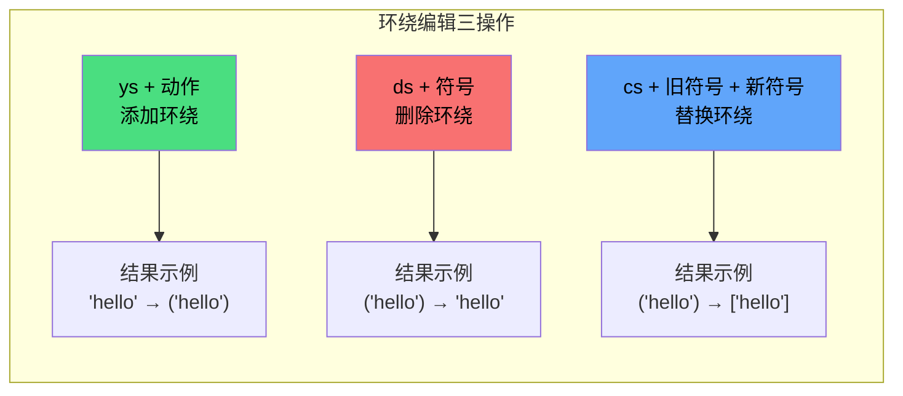
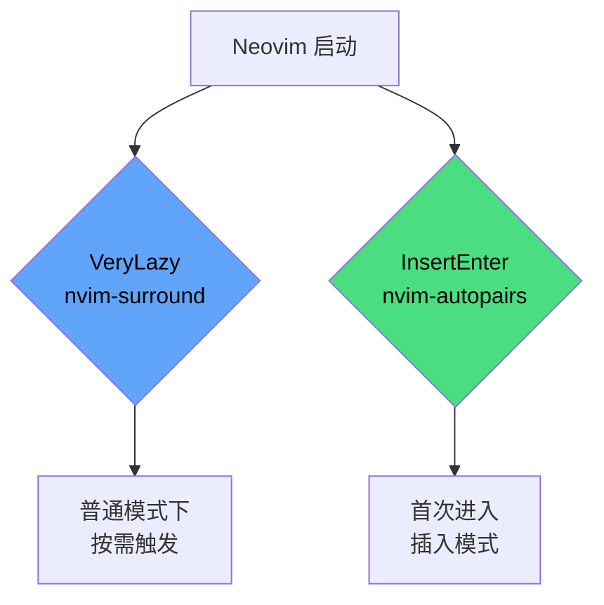

在日常编码中，我们频繁地与**括号、引号等成对符号**打交道——手动输入左括号后补上右括号、把一段文字用引号包起来、或者删除包裹着代码的多余括号。这些操作看似微小，却在整个编辑过程中累积消耗大量注意力。本配置通过 **nvim-autopairs**（自动配对）和 **nvim-surround**（环绕编辑）两个插件，将这类操作自动化和快捷化，让你把精力集中在逻辑本身。

## 两个插件的职责划分

理解这两个插件的关键在于它们**分别覆盖不同的编辑模式**：

| 插件 | 核心职责 | 触发场景 | 编辑模式 |
|------|---------|---------|---------|
| **nvim-autopairs** | 输入左侧符号时自动补全右侧 | 输入 `(`、`{`、`"` 等 | 插入模式（Insert） |
| **nvim-surround** | 对已有文本添加、删除、替换环绕符号 | 对选中文本或光标周围文本操作 | 普通模式（Normal）/ 可视模式（Visual） |

简单来说：**autopairs 防患于未然**（输入时就帮你配好对），**surround 亡羊补牢**（事后修改已有的环绕符号）。两者互补，覆盖了成对符号操作的全部场景。

Sources: [nvim-autopairs.lua](lua/plugins/nvim-autopairs.lua#L1-L6), [nvim-surround.lua](lua/plugins/nvim-surround.lua#L1-L6)

## 自动配对：nvim-autopairs

### 配置解读

```lua
return {
    "windwp/nvim-autopairs",
    opts = {},
    event = "InsertEnter",
}
```

配置极为精简，但每一个字段都有明确的意图：

- **`event = "InsertEnter"`**：采用懒加载策略，仅在首次进入插入模式时才加载插件。这意味着打开文件浏览、查看 git 状态等不需要编辑的场景完全不会触发插件加载，保持启动速度。
- **`opts = {}`**：传入空表表示使用插件的**全部默认配置**。nvim-autopairs 的默认行为已经覆盖了最常见的配对符号（`()`、`{}`、`[]`、`""`、`''`、`` `` ``），开箱即用无需额外调整。

Sources: [nvim-autopairs.lua](lua/plugins/nvim-autopairs.lua#L1-L6)

### 自动配对的实际效果

安装后你会立刻感受到以下行为变化：

| 你输入的字符 | 自动补全的结果 | 光标位置 |
|------------|-------------|---------|
| `(` | `(｜)` | 两个括号之间 |
| `{` | `{｜}` | 两个花括号之间 |
| `"` | `"｜"` | 两个引号之间 |
| `[` | `[｜]` | 两个方括号之间 |

> 表中 `｜` 表示光标位置。

此外，**按退格键（Backspace）删除左侧符号时，右侧符号会被一并删除**，避免留下孤立的右括号。这一智能行为也是默认开启的。

### 与 blink.cmp 的协作

本配置中的补全框架 blink.cmp 开启了一项实验性功能 `auto_brackets`：

```lua
completion = {
    accept = {
        auto_brackets = {
            enabled = true,
        },
    },
},
```

这意味着当你在补全菜单中选择一个函数时，blink.cmp 会**自动在函数名后补上括号**。这与 nvim-autopairs 的行为形成了**双层保障**：autopairs 处理你手动输入括号的场景，auto_brackets 处理补全框架插入函数名时的场景。

Sources: [blink.lua](lua/plugins/blink.lua#L38-L43)

## 环绕编辑：nvim-surround

### 配置解读

```lua
return {
  "kylechui/nvim-surround",
  event = "VeryLazy",
  opts = {},
}
```

- **`event = "VeryLazy"`**：这是 lazy.nvim 提供的一种延迟加载策略，插件会在 Neovim 完成启动后的适当时机（如首次触发某个按键或命令）加载。对于环绕编辑这种非即时需要的功能，这个时机恰到好处。
- **`opts = {}`**：同样使用全部默认配置，默认支持的环绕符号包括括号、引号、XML/HTML 标签等。

Sources: [nvim-surround.lua](lua/plugins/nvim-surround.lua#L1-L6)

### 环绕编辑三大操作

nvim-surround 的核心是三种操作：**添加（Add）**、**删除（Delete）**、**替换（Replace）**。掌握这三个操作就掌握了全部功能。



#### 添加环绕（`ys` — You Surround）

在普通模式下，使用 `ys` 加上 **Vim 动作（motion）** 再加上**目标符号**来添加环绕：

| 按键操作 | 含义 | 效果 |
|---------|------|------|
| `ysiw"` | you surround **inner word** with `"` | `hello` → `"hello"` |
| `ysiw)` | you surround **inner word** with `)` | `hello` → `(hello)` |
| `ysaw(` | you surround **a word** with `(` | `hello` → `( hello )` |
| `ysiW"` | you surround **inner WORD** with `"` | `foo.bar` → `"foo.bar"` |
| `yss"` | you surround **整行** with `"` | 整行内容加上双引号 |

> **小贴士**：使用 `)` 和 `}` 包裹时，符号紧贴内容；使用 `(` 和 `{` 时，符号与内容之间会有空格。

你还可以在**可视模式**下选中文本后，直接按 `S` 加目标符号来环绕选中内容：

| 按键操作 | 含义 |
|---------|------|
| `veS"` | 可视选中当前词，然后按 `S"` 用双引号环绕 |

#### 删除环绕（`ds` — Delete Surround）

使用 `ds` 加上**要删除的符号**即可移除环绕：

| 按键操作 | 效果 |
|---------|------|
| `ds"` | `"hello"` → `hello` |
| `ds)` | `(hello)` → `hello` |
| `ds}` | `{ hello }` → `hello` |

#### 替换环绕（`cs` — Change Surround）

使用 `cs` 加上**旧符号**和**新符号**来替换环绕：

| 按键操作 | 效果 |
|---------|------|
| `cs"'` | `"hello"` → `'hello'` |
| `cs")` | `"hello"` → `(hello)` |
| `cs)]` | `(hello)` → `[hello]` |
| `cs"<q>` | `"hello"` → `<q>hello</q>` |

最后一条示例展示了 **HTML/XML 标签环绕**的能力：用 `t` 或 `<tag>` 形式可以操作标签。例如 `dst` 可删除 HTML 标签，`cst<em>` 可将标签替换为 `<em>`。

Sources: [nvim-surround.lua](lua/plugins/nvim-surround.lua#L1-L6)

## 操作速查表

将两个插件的核心操作整理为一张速查表，方便编辑时快速参考：

### 插入模式（autopairs 生效）

| 操作 | 说明 |
|------|------|
| 输入 `(` | 自动补全为 `(｜)`，光标在中间 |
| 输入 `{` | 自动补全为 `{｜}` |
| 输入 `"` | 自动补全为 `"｜"` |
| 在配对符号间按 `Enter` | 自动换行并缩进 |
| `Backspace` 删除空配对 | 同时删除左右符号 |

### 普通模式（surround 生效）

| 操作 | 说明 |
|------|------|
| `ysiw"` | 给当前单词加上双引号 |
| `ysiw)` | 给当前单词加上圆括号 |
| `yss"` | 给整行加双引号 |
| `ds"` | 删除周围的双引号 |
| `ds)` | 删除周围的圆括号 |
| `cs"'` | 将双引号替换为单引号 |
| `cs)<em>` | 将圆括号替换为 `<em>` 标签 |
| `dst` | 删除 HTML 标签 |

### 可视模式（surround 生效）

| 操作 | 说明 |
|------|------|
| 选中后按 `S"` | 用双引号环绕选中内容 |
| 选中后按 `S)` | 用圆括号环绕选中内容 |

## 懒加载策略对比

两个插件采用了不同的懒加载时机，这里解释其设计考量：



| 插件 | 加载时机 | 理由 |
|------|---------|------|
| nvim-autopairs | `InsertEnter` | 必须在插入模式开始前就位，否则第一个括号就无法配对 |
| nvim-surround | `VeryLazy` | 属于"按需操作"类功能，用户不主动调用时完全不需要加载 |

这种差异化加载体现了懒加载的**精细化策略**：根据功能的使用时机选择最合适的触发点，在不牺牲体验的前提下最大化启动性能。

Sources: [nvim-autopairs.lua](lua/plugins/nvim-autopairs.lua#L4), [nvim-surround.lua](lua/plugins/nvim-surround.lua#L3)

## 推荐的后续阅读

本页介绍的两个插件专注于**符号层面的编辑效率**。如果你想继续提升编辑体验，以下页面是自然的延伸：

- **[快捷键体系速览（Leader 键与核心操作）](3-kuai-jie-jian-ti-xi-su-lan-leader-jian-yu-he-xin-cao-zuo)**：了解整体的快捷键体系，将 surround 操作融入你的肌肉记忆
- **[blink.cmp 自动补全框架配置](12-blink-cmp-zi-dong-bu-quan-kuang-jia-pei-zhi)**：深入了解 auto_brackets 实验性功能与补全系统的整体配置
- **[Flash 快速跳转与 Treesitter 选择](17-flash-kuai-su-tiao-zhuan-yu-treesitter-xuan-ze)**：配合 surround 的可视模式操作，Flash 提供的精准选择能力让环绕编辑更加高效
- **[插件管理策略：lazy.nvim 与按文件组织模式](6-cha-jian-guan-li-ce-lue-lazy-nvim-yu-an-wen-jian-zu-zhi-mo-shi)**：理解本页涉及的 `VeryLazy`、`InsertEnter` 等懒加载策略背后的插件管理框架