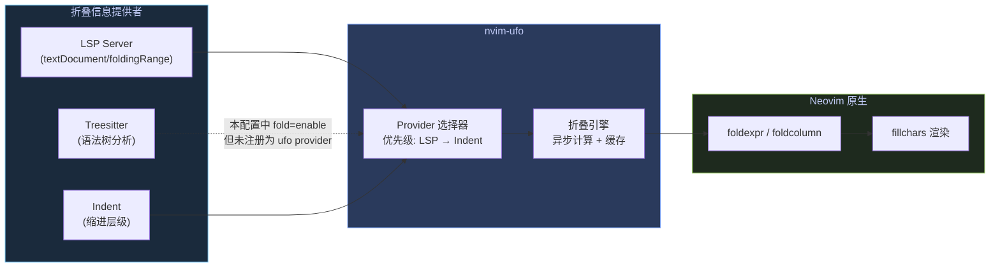
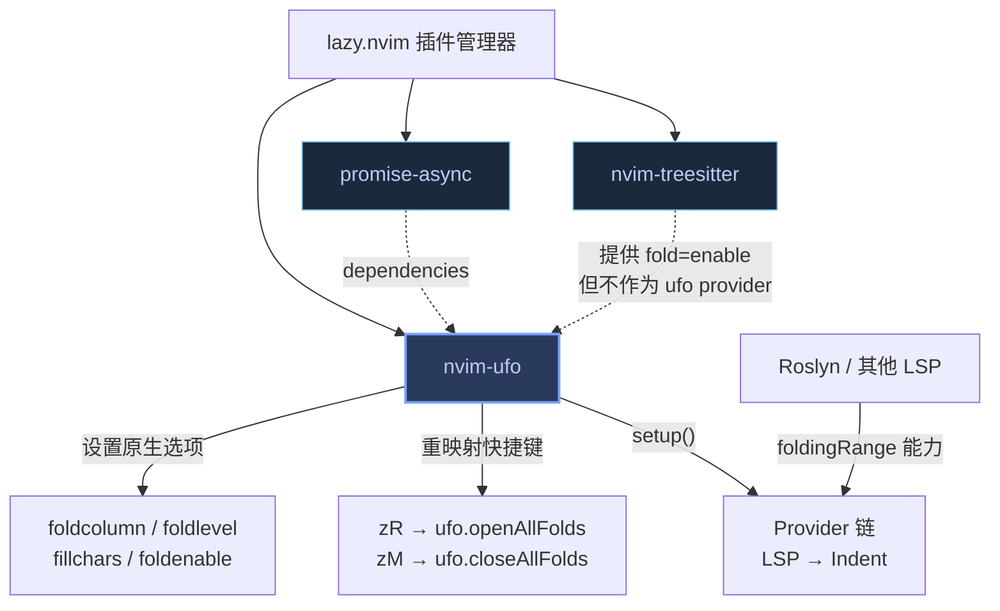

nvim-ufo 是 Neovim 生态中最成熟的异步代码折叠方案，它通过统一的 Provider 接口将 LSP、Treesitter、缩进等多种折叠源抽象为标准折叠信息，再以现代 UI 美化折叠区域的渲染效果。本配置采用 **开箱即用** 的极简策略：零自定义 Provider，直接使用 ufo 的默认行为链（LSP 优先 → 缩进回退），配合精心调校的 Neovim 原生折叠选项与 Nerd Font 图标，在不引入额外复杂度的前提下获得高质量的折叠体验。

## 架构概览：折叠信息的提供与消费链

nvim-ufo 的核心设计思路是 **Provider-Consumer 解耦**——它不自己分析代码结构，而是从外部提供者获取折叠范围，再将其转换为 Neovim 原生 `foldexpr` 能理解的格式。整条链路可以用下图描述：



**关键设计决策**：本配置启用了 Treesitter 的 `fold = { enable = true }`（见 [nvim-treesitter](lua/plugins/treesitter.lua#L20)），但 **并未将其注册为 nvim-ufo 的 Provider**。这意味着 Treesitter 的折叠能力仅作为 Neovim 原生 `foldexpr` 的后备机制存在——当 ufo 的 Provider 链（LSP → Indent）处于活跃状态时，Treesitter 的折叠结果会被覆盖。这是有意为之：LSP 提供的 `textDocument/foldingRange` 在语义精确度上优于 Treesitter 的语法树推断，而 `indent` 作为兜底已经足够应对无 LSP 的场景。

Sources: [nvim-ufo.lua](lua/plugins/nvim-ufo.lua#L1-L24), [treesitter.lua](lua/plugins/treesitter.lua#L18-L21)

## 配置文件逐层解析

### 第 1 层：Neovim 原生折叠选项

nvim-ufo 要求在初始化之前设置一组 Neovim 原生选项，这些选项共同构成了 ufo 正常工作的前提条件：

| 选项 | 值 | 作用 | 设计意图 |
|------|-----|------|----------|
| `foldcolumn` | `"1"` | 左侧显示 1 列宽的折叠指示器 | 视觉锚点：让用户一眼看到折叠区域的位置 |
| `foldlevel` | `99` | 当前缓冲区的折叠展开级别 | **ufo 的硬性要求**：高值确保 ufo 通过自身 API 管理折叠状态，而非依赖 `foldlevel` |
| `foldlevelstart` | `99` | 文件打开时的初始折叠级别 | 新打开的文件默认全部展开，避免"打开即折叠"的困惑体验 |
| `foldenable` | `true` | 全局启用折叠功能 | 显式声明，防止其他插件或配置意外禁用 |

**`foldlevel = 99` 的深层含义**：这个看似随意的数值实际上是 ufo 架构的关键——ufo 希望所有折叠默认展开，然后通过自身的 `openAllFolds` / `closeAllFolds` API 精确控制哪些折叠被关闭。如果 `foldlevel` 设置过低，Neovim 会在 ufo 计算之前就关闭大量折叠，导致行为不一致。

Sources: [nvim-ufo.lua](lua/plugins/nvim-ufo.lua#L7-L10)

### 第 2 层：折叠区域视觉美化

```lua
vim.o.fillchars = [[eob: ,fold: ,foldopen:,foldsep: ,foldclose:]]
```

这行配置对折叠列的每个视觉元素进行了精确控制：

| 元素 | 字符 | 渲染效果 | 说明 |
|------|------|----------|------|
| `eob` | 空格 | 〜 符号消失 | 隐藏缓冲区末尾的波浪线占位符 |
| `fold` | 空格 | 折叠体背景透明 | 折叠体内部不显示额外字符 |
| `foldopen` | `` (Nerd Font 下箭头) | ▾ | 标记已展开的折叠位置 |
| `foldsep` | 空格 | 折叠分隔线透明 | 多行折叠之间的分隔符不可见 |
| `foldclose` | `` (Nerd Font 右箭头) | ▸ | 标记已关闭的折叠位置 |

**字体依赖**：`foldopen` 和 `foldclose` 使用 Nerd Font 专用字符（Unicode Private Use Area）。如果终端字体不支持 Nerd Font，这两个位置会显示为方框或空白。推荐安装 [JetBrains Mono Nerd Font](https://www.nerdfonts.com/) 或 [FiraCode Nerd Font](https://www.nerdfonts.com/)。

Sources: [nvim-ufo.lua](lua/plugins/nvim-ufo.lua#L13)

### 第 3 层：快捷键重映射——ufo 的关键集成点

```lua
vim.keymap.set("n", "zR", require("ufo").openAllFolds)
vim.keymap.set("n", "zM", require("ufo").closeAllFolds)
```

**为什么必须重映射**：这是 ufo 集成中最容易被忽视但最关键的步骤。原生 `zR` 和 `zM` 通过修改 `foldlevel` 来控制折叠——`zM` 将 `foldlevel` 设为 0（关闭所有），`zR` 将其设为最大值（打开所有）。然而 ufo 使用完全不同的折叠管理机制（Provider 驱动），直接操作 `foldlevel` 会绕过 ufo 的内部状态，导致折叠行为异常（如：关闭后无法正确重新打开，或折叠范围计算错误）。

通过将 `zR` / `zM` 重定向到 `ufo.openAllFolds` / `ufo.closeAllFolds`，ufo 能够在自身状态机完全知情的情况下管理折叠的开关，保证行为一致性。

Sources: [nvim-ufo.lua](lua/plugins/nvim-ufo.lua#L17-L18)

### 第 4 层：ufo 初始化

```lua
require("ufo").setup()
```

**零参数调用的默认行为**：不传入任何配置时，ufo 使用以下默认策略：

| 配置项 | 默认值 | 含义 |
|--------|--------|------|
| `provider_selector` | `nil` | 使用内置选择器：**主用 LSP，回退到 Indent** |
| `open_fold_hl_timeout` | `150` (ms) | 打开折叠时的高亮持续时间 |
| `close_fold_kinds` | `{}` | 不自动关闭任何类型的折叠 |

**Provider 选择链**：当 `provider_selector` 为 `nil` 时，ufo 的内置逻辑会按以下顺序尝试：

1. **LSP**：向已附加的 LSP Server 发送 `textDocument/foldingRange` 请求，获取语义级别的折叠范围（如：函数体、类体、`#region` 块等）
2. **Indent**：如果 LSP 不可用（无 Server 附加，或 Server 不支持 `foldingRange` 能力），退回到基于缩进层级的折叠

对于本配置的典型使用场景（C# / .NET 开发），Roslyn LSP 完整支持 `foldingRange`，因此绝大多数情况下使用的是 LSP Provider，折叠精度可达语义级别（按命名空间、类、方法、`#region` 等结构折叠）。

Sources: [nvim-ufo.lua](lua/plugins/nvim-ufo.lua#L22)

## 日常折叠操作速查

以下表格汇总了本配置中所有与折叠相关的快捷键，其中 Which-Key 已将 `z` 键注册为 `fold` 分组（输入 `z` 后会弹出提示面板）：

| 快捷键 | 来源 | 操作 | 使用场景 |
|--------|------|------|----------|
| `zR` | ufo 重映射 | 打开所有折叠 | 快速查看文件全貌 |
| `zM` | ufo 重映射 | 关闭所有折叠 | 获得文件结构鸟瞰视图 |
| `zo` / `zO` | Vim 原生 | 打开当前 / 递归打开折叠 | 查看被隐藏的代码 |
| `zc` / `zC` | Vim 原生 | 关闭当前 / 递归关闭折叠 | 隐藏不需要关注的代码块 |
| `za` | Vim 原生 | 切换当前折叠状态 | 快速开关注释或实现细节 |
| `zr` / `zr` | Vim 原生 | 减少 / 增加折叠级别 | 渐进式展开或收起 |
| `zj` / `zk` | Vim 原生 | 跳转到下 / 上一个折叠 | 在折叠间快速导航 |
| `zn` / `zN` | Vim 原生 | 重置 / 恢复折叠状态 | 临时禁用折叠查看代码 |

> **注意**：`zr` 和 `zm`（小写）仍然是 Vim 原生行为，它们通过调整 `foldlevel` 工作。在 ufo 管理的缓冲区中，建议优先使用 `zR` / `zM`（大写）来获得与 ufo 一致的折叠体验。

Sources: [nvim-ufo.lua](lua/plugins/nvim-ufo.lua#L17-L18), [whichkey.lua](lua/plugins/whichkey.lua#L30)

## 依赖关系与加载时机



**`promise-async`** 是 ufo 的唯一硬依赖，为 ufo 提供基于 Lua 的异步 Promise 实现，使折叠计算不会阻塞 UI 线程。两个插件的锁定版本（来自 `lazy-lock.json`）分别为：

| 插件 | 分支 | 提交哈希 |
|------|------|----------|
| `nvim-ufo` | main | `ab3eb124` |
| `promise-async` | main | `119e8961` |

本配置使用 `version = false`（见 [nvim-ufo.lua](lua/plugins/nvim-ufo.lua#L4)），意味着 lazy.nvim 每次同步时都会拉取最新提交，确保获得最新的折叠引擎改进和 Bug 修复。

Sources: [nvim-ufo.lua](lua/plugins/nvim-ufo.lua#L2-L4), [lazy-lock.json](lazy-lock.json)

## 实战场景：折叠在 C# 开发中的表现

在 C# 文件中，Roslyn LSP 提供的 `foldingRange` 能力覆盖了以下语义结构：

| 折叠类型 | 触发范围 | 典型场景 |
|----------|----------|----------|
| 命名空间 | `namespace { ... }` | 整个文件最外层的折叠 |
| 类 / 结构体 / 接口 | `class { ... }` | 折叠整个类型定义 |
| 方法 | `void Method() { ... }` | 折叠方法实现，保留签名可见 |
| 属性 | `get / set` 访问器 | 折叠简单属性体 |
| `#region` 块 | `#region` ... `#endregion` | 自定义折叠区域 |
| `using` 块 | 连续的 `using` 语句 | 折叠顶部导入区域 |
| XML 文档注释 | `/// <summary>` ... `///` | 折叠方法文档 |
| 嵌套块 | `if / for / while / try` 等 | 折叠控制流内部逻辑 |

Sources: [nvim-ufo.lua](lua/plugins/nvim-ufo.lua#L20-L22)

## 扩展方向与自定义思路

当前配置刻意保持极简，但 nvim-ufo 提供了丰富的扩展点。以下是几种常见的进阶方向，供后续按需引入：

**添加 Treesitter Provider**：如果某些语言没有 LSP 但有 Treesitter 解析器，可以将 `treesitter` 加入 Provider 链作为 LSP 和 Indent 之间的中间层：
```lua
-- 示例（非当前配置内容）
require("ufo").setup({
    provider_selector = function(bufnr, filetype)
        return { "treesitter", "indent" }
    end
})
```

**自定义折叠文本预览**：ufo 的 `fold_virt_text_handler` 回调允许完全自定义折叠行的显示内容，例如显示折叠行数、预览折叠体第一行等。对于需要高密度代码浏览的场景尤为实用。

**按文件类型选择 Provider**：`provider_selector` 接受 `bufnr` 和 `filetype` 参数，可以为不同语言指定不同的折叠策略，例如 Markdown 使用 Treesitter，C# 使用 LSP，纯文本使用 Indent。

Sources: [nvim-ufo.lua](lua/plugins/nvim-ufo.lua#L22)

## 相关页面

- [Treesitter 语法高亮与折叠](14-treesitter-yu-fa-gao-liang-yu-zhe-die) — Treesitter `fold = enable` 与 ufo Provider 的关系详解
- [整体架构与模块加载流程](4-zheng-ti-jia-gou-yu-mo-kuai-jia-zai-liu-cheng) — 插件加载顺序与 lazy.nvim 依赖解析
- [LSP 通用配置与 Mason 包管理](13-lsp-tong-yong-pei-zhi-yu-mason-bao-guan-li) — LSP Server 的 `foldingRange` 能力注册
- [Which-Key 快捷键提示系统](31-which-key-kuai-jie-jian-ti-shi-xi-tong) — `z` 分组的注册与弹出提示机制