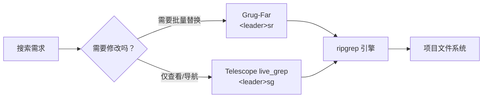
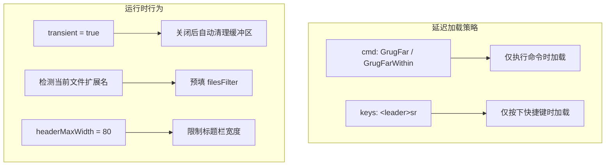

Grug-Far 是本配置中负责**跨文件搜索与替换**的核心插件。当你需要在整个项目中批量重命名变量、修改 API 路径或统一代码风格时，它是比 `:%s` 更强大、更安全的替代方案。本配置对 Grug-Far 做了三项关键增强：**一键唤起并自动识别文件类型**、**瞬态缓冲区模式避免污染窗口布局**、**命令行延迟加载以优化启动速度**。

Sources: [grug-far.lua](lua/plugins/grug-far.lua#L1-L24)

## 插件定位与工作原理

Grug-Far 的底层引擎是 **ripgrep（rg）**——与 [Telescope 模糊查找器：文件、Grep 与 Git 搜索](16-telescope-mo-hu-cha-zhao-qi-wen-jian-grep-yu-git-sou-suo) 的 live_grep 共享同一搜索引擎。两者的分工截然不同：Telescope 侧重**查找与导航**（找到文件后跳转过去），Grug-Far 侧重**查找与替换**（找到匹配项后原地修改）。当你只需要"看一眼"搜索结果时，用 Telescope 的 `<leader>sg`；当你需要"批量改掉"时，用 Grug-Far 的 `<leader>sr`。



Sources: [grug-far.lua](lua/plugins/grug-far.lua#L1-L6), [telescope.lua](lua/plugins/telescope.lua#L66-L75)

## 快捷键与触发方式

Grug-Far 在本配置中通过以下方式触发：

| 触发方式 | 按键 / 命令 | 模式 | 说明 |
|---|---|---|---|
| **快捷键** | `<leader>sr`（Space → s → r） | Normal / Visual | 主力入口，自动预填文件过滤器 |
| **命令行** | `:GrugFar` | — | 打开全项目搜索替换 |
| **命令行** | `:GrugFarWithin` | — | 限制在当前文件内搜索替换 |

其中 `<leader>s` 是 [Which-Key 快捷键提示系统](31-which-key-kuai-jie-jian-ti-shi-xi-tong) 注册的 **search 分组**，因此按下 `Space s` 后会弹出提示面板，`r` 对应的描述为 **"Search and Replace"**，非常容易记忆。

Sources: [grug-far.lua](lua/plugins/grug-far.lua#L6-L22), [whichkey.lua](lua/plugins/whichkey.lua#L23)

## 核心配置解析

整个插件配置仅 24 行，但每一项都有明确的设计意图：



### 1. 延迟加载（Lazy Loading）

```lua
cmd = { "GrugFar", "GrugFarWithin" },
```

插件声明了两个命令作为**延迟加载触发器**。这意味着 Grug-Far 的代码在你首次执行 `:GrugFar` 或按下 `<leader>sr` 之前**完全不会加载**，对 Neovim 启动速度零影响。

Sources: [grug-far.lua](lua/plugins/grug-far.lua#L5)

### 2. 智能文件类型预填

这是本配置中最值得关注的增强。按下 `<leader>sr` 时的执行逻辑如下：

```lua
local ext = vim.bo.buftype == "" and vim.fn.expand("%:e")
grug.open({
    transient = true,
    prefills = {
        filesFilter = ext and ext ~= "" and "*." .. ext or nil,
    },
})
```

这段代码的行为可以用下表清晰地理解：

| 当前文件 | `buftype` 检查 | `expand("%:e")` 结果 | `filesFilter` 预填值 | 效果 |
|---|---|---|---|---|
| `Program.cs` | `""`（普通文件）✓ | `"cs"` | `*.cs` | 仅搜索 C# 文件 |
| `App.razor` | `""`（普通文件）✓ | `"razor"` | `*.razor` | 仅搜索 Razor 文件 |
| `init.lua` | `""`（普通文件）✓ | `"lua"` | `*.lua` | 仅搜索 Lua 文件 |
| Telescope 浮窗 | `"prompt"` ✗ | — | `nil`（不预填） | 搜索所有文件 |
| 无扩展名文件 | `""`（普通文件）✓ | `""` | `nil`（不预填） | 搜索所有文件 |

**设计意图**：在 C# / .NET 项目中，文件类型繁多（`.cs`、`.razor`、`.css`、`.json`、`.csproj` 等）。如果你在编辑一个 `.cs` 文件时触发搜索替换，大概率你只想在 `.cs` 文件范围内操作——自动预填文件过滤器让你**省去手动输入 `*.cs` 的步骤**，同时也**降低了误改配置文件的风险**。当然，你可以在 Grug-Far 的 UI 中随时修改或清空这个过滤器。

Sources: [grug-far.lua](lua/plugins/grug-far.lua#L9-L17)

### 3. 瞬态模式（Transient Mode）

```lua
transient = true,
```

瞬态模式意味着 Grug-Far 打开的缓冲区在关闭后会**自动被清理**，不会残存在缓冲区列表中。这与你用 Telescope 搜索后关闭窗口的体验一致——工具用完即走，不会在 `<leader>,` 的缓冲区列表里留下一堆 `grug-far` 条目。

Sources: [grug-far.lua](lua/plugins/grug-far.lua#L13)

### 4. 标题栏宽度限制

```lua
opts = { headerMaxWidth = 80 },
```

将 Grug-Far 界面顶部的帮助信息区域宽度限制为 80 列。Grug-Far 默认会显示较长的操作说明和快捷键提示，在宽屏显示器上可能占据过多视觉空间。设置 `headerMaxWidth = 80` 确保标题区域紧凑聚焦，将更多屏幕空间留给搜索结果列表。

Sources: [grug-far.lua](lua/plugins/grug-far.lua#L4)

## 典型使用场景

### 场景一：批量重命名方法

假设你需要将项目中所有 `GetUserName()` 调用改为 `GetDisplayName()`：

1. 在任意 `.cs` 文件中按 **`Space s r`**
2. 搜索面板的 `filesFilter` 已自动填入 `*.cs`
3. 在搜索框中输入 `GetUserName`
4. 在替换框中输入 `GetDisplayName`
5. 预览匹配结果，确认无误后执行替换

### 场景二：在 Visual 模式下搜索选中内容

本配置注册了 **Visual 模式**（`mode = { "n", "x" }`）的支持。你可以先用 Visual 模式选中一段文本，然后按 `Space s r`，选中的内容会被自动填入搜索框，省去手动输入的步骤。

### 场景三：全项目无差别搜索

如果你在一个特殊缓冲区（如终端、快速修复列表）中按 `Space s r`，由于 `buftype` 检查不通过，`filesFilter` 不会被预填——Grug-Far 会搜索所有文件。这给了你一个隐含的"全量搜索"入口。

Sources: [grug-far.lua](lua/plugins/grug-far.lua#L8-L21)

## 配置文件完整参考

以下是本配置中 Grug-Far 的完整代码，仅 24 行，结构清晰：

| 配置项 | 值 | 作用 |
|---|---|---|
| `opts.headerMaxWidth` | `80` | 限制标题栏最大宽度 |
| `cmd` | `{ "GrugFar", "GrugFarWithin" }` | 延迟加载触发命令 |
| `keys[1].key` | `<leader>sr` | 主快捷键 |
| `keys[1].mode` | `{ "n", "x" }` | Normal + Visual 模式 |
| `keys[1].desc` | `"Search and Replace"` | Which-Key 描述 |
| `open().transient` | `true` | 瞬态缓冲区模式 |
| `open().prefills.filesFilter` | 动态计算 | 自动匹配当前文件扩展名 |

Sources: [grug-far.lua](lua/plugins/grug-far.lua#L1-L24)

## 延伸阅读

Grug-Far 与本配置中的其他搜索工具形成互补关系：

- **搜索但不替换**：使用 [Telescope 模糊查找器：文件、Grep 与 Git 搜索](16-telescope-mo-hu-cha-zhao-qi-wen-jian-grep-yu-git-sou-suo)（`<leader>sg` 全局 grep，`<leader>sb` 当前缓冲区搜索）
- **查看 Git 变更差异**：使用 [Diffview 差异查看与文件历史](23-diffview-chai-yi-cha-kan-yu-wen-jian-li-shi)（`<leader>gfd` 对比文件差异）
- **记住快捷键**：[Which-Key 快捷键提示系统](31-which-key-kuai-jie-jian-ti-shi-xi-tong)（按 `Space` 后等待片刻即可看到所有可用操作）