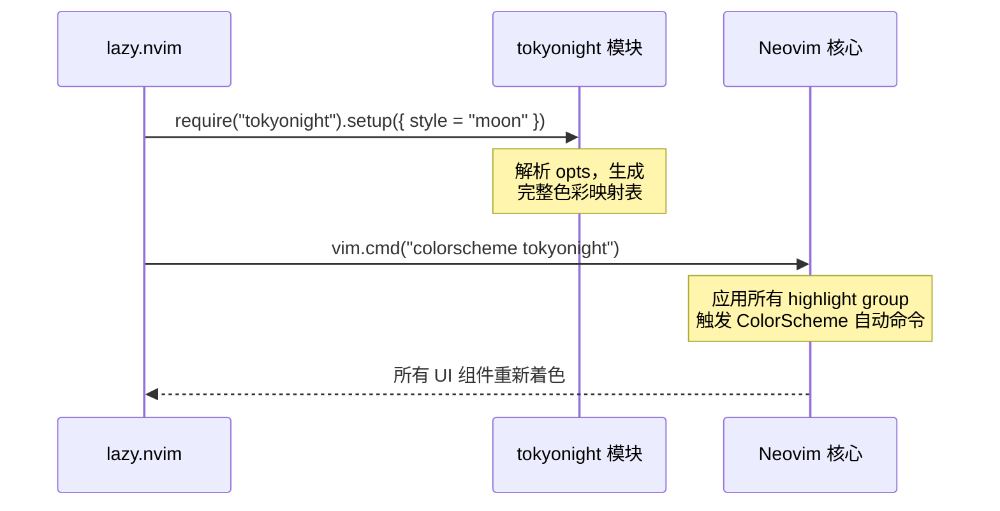
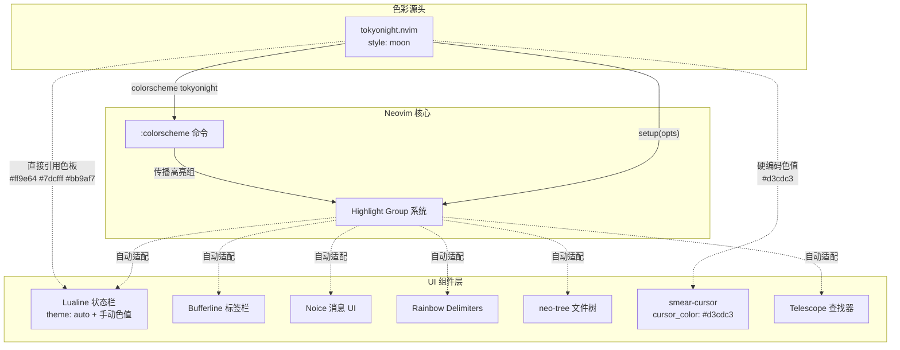

Tokyonight 是本 Neovim 配置中唯一启用的颜色主题，由 Folke Lemaitre 开发维护（与 lazy.nvim、noice.nvim 等为同一作者）。本项目的主题配置采用**极简声明式**风格——仅 10 行代码即完成全部设定，同时通过 Tokyonight 原生色板为 Lualine 状态栏等下游组件提供一致的视觉色彩基础。本文将解析主题的加载机制、`moon` 风格选型理由，以及项目中其他插件如何引用 Tokyonight 的配色体系。

Sources: [tokyonight.lua](lua/plugins/tokyonight.lua#L1-L10)

## 配置文件全貌

整个主题配置位于 `lua/plugins/tokyonight.lua`，内容如下：

```lua
return {
    "folke/tokyonight.nvim",
    opts = {
        style = "moon"
    },
    config = function (_, opts)
        require("tokyonight").setup(opts)
        vim.cmd("colorscheme tokyonight")
    end
}
```

这段代码做了三件事：声明插件、设置风格选项、在加载后激活主题。下面逐层拆解。

Sources: [tokyonight.lua](lua/plugins/tokyonight.lua#L1-L10)

## lazy.nvim 插件声明与加载策略

### 插件声明结构

Tokyonight 作为 lazy.nvim 管理的插件，遵循本项目统一的「单文件 = 单插件」组织模式（参见 [插件管理策略：lazy.nvim 与按文件组织模式](6-cha-jian-guan-li-ce-lue-lazy-nvim-yu-an-wen-jian-zu-zhi-mo-shi)）。返回的 Lua 表包含以下关键字段：

| 字段 | 值 | 含义 |
|------|------|------|
| `"folke/tokyonight.nvim"` | 插件短名（表键） | lazy.nvim 从 GitHub 拉取的仓库标识 |
| `opts` | `{ style = "moon" }` | 传递给 `setup()` 的配置表 |
| `config` | 函数 | 插件加载完成后的初始化回调 |

### 加载时机：无延迟的即时加载

注意配置中**没有**设置 `lazy = true`、`event`、`cmd` 或 `keys` 等懒加载条件。这意味着 Tokyonight 在 Neovim 启动时由 lazy.nvim **立即加载**，确保主题在任何 UI 组件渲染之前就已生效。这是颜色主题插件的标准做法——如果延迟加载，用户会先看到默认主题闪烁，再切换到目标主题，体验不佳。

Sources: [tokyonight.lua](lua/plugins/tokyonight.lua#L1-L10), [lazy-lock.json](lazy-lock.json#L48)

## moon 风格详解

### Tokyonight 的四种内置风格

Tokyonight 提供四种预设风格，每种对应不同的背景亮度和色彩饱和度配置：

| 风格 | 背景色 | 特点 | 适用场景 |
|------|--------|------|----------|
| `storm` | `#24283b`（深蓝灰） | 原始默认风格，色彩鲜明 | 通用开发 |
| `moon` | `#222436`（纯深蓝） | 最深背景，对比度最高，色温偏冷 | 长时间编码、暗光环境 |
| `night` | `#1a1b26`（近纯黑） | 类似 VS Code 的 One Dark Pro | 偏好极暗背景 |
| `day` | 浅色背景 | 日间模式浅色主题 | 明亮环境、白天办公 |

### 为什么选择 moon

本配置选用 `moon` 风格，其背景色 `#222436` 在四种风格中提供了**最优的前景/背景对比度**。相比 `storm` 和 `night`，`moon` 的蓝调背景更深沉但不至于像纯黑那样刺眼，长时间注视时眼睛疲劳感更低。对于以 C# / .NET 为主的开发场景，高对比度有助于区分语法元素——关键字、类型名、字符串和注释之间的色彩分层更加清晰。

Sources: [tokyonight.lua](lua/plugins/tokyonight.lua#L3-L5)

## 主题激活机制

```lua
config = function (_, opts)
    require("tokyonight").setup(opts)
    vim.cmd("colorscheme tokyonight")
end
```

`config` 回调中的两行代码构成了主题激活的完整流程：



1. **`setup(opts)`**：Tokyonight 根据 `style = "moon"` 生成完整的 Highlight Group 映射表，覆盖 Neovim 内置语法组、Treesitter 组、LSP 诊断组以及数十种流行插件的专业高亮组。

2. **`colorscheme tokyonight`**：执行 Vim 的 `:colorscheme` 命令，将 `setup()` 生成的映射表写入 Neovim 的高亮系统。这一步会触发 `ColorScheme` 自动命令事件，使其他已经加载的插件（如 Lualine、Bufferline）能够感知主题变更并自动适配。

### 为什么使用自定义 config 而非 lazy.nvim 默认行为

lazy.nvim 对 `config` 字段有一个便捷默认行为：如果 `config` 是一个表而非函数，lazy.nvim 会自动调用 `require("插件主模块").setup(opts)`。但仅调用 `setup()` 并不会激活主题——还必须显式执行 `:colorscheme` 命令。因此这里使用函数形式的 `config`，在 `setup()` 之后追加 `vim.cmd("colorscheme tokyonight")`，确保两步操作原子性地完成。

Sources: [tokyonight.lua](lua/plugins/tokyonight.lua#L6-L9)

## 下游组件的色彩适配

Tokyonight 作为「源头主题」——一旦激活，其色彩体系会通过 Neovim 的 Highlight Group 机制自动传播给所有 UI 组件。以下是本项目中与主题色彩产生交互的关键插件。

### Lualine 状态栏：auto 主题 + 手动色值引用

Lualine 的主题配置使用 `theme = "auto"`，这意味着它会自动检测当前活跃的 colorscheme 并提取对应的高亮组，无需手动指定主题名称。当 Tokyonight 被激活后，Lualine 的区域背景、分隔符颜色等会自动跟随 Tokyonight Moon 的色板。

但状态栏中的**功能组件**使用了直接引用 Tokyonight 色板的手动色值：

```lua
-- Lualine lualine_x 区域中的自定义颜色
color = { fg = "#ff9e64" }  -- Noice 命令状态，Tokyonight 的 orange (Statement)
color = { fg = "#7dcfff" }  -- Noice 模式状态，Tokyonight 的 cyan (Constant)
color = { fg = "#bb9af7" }  -- DAP 调试状态，Tokyonight 的 purple (Debug)
color = { fg = "#ff9e64" }  -- Lazy 更新提示，Tokyonight 的 orange
```

这些 `#rrggbb` 色值直接取自 Tokyonight 的**语义色彩映射**：

| 色值 | Tokyonight 语义名 | 用途 |
|------|-------------------|------|
| `#ff9e64` | `orange` / `Statement` 关键字色 | 命令提示、Lazy 更新提示 |
| `#7dcfff` | `cyan` / `Constant` 常量色 | 模式显示 |
| `#bb9af7` | `purple` / `Debug` 调试色 | DAP 调试状态 |

这种设计确保了状态栏中的自定义文本元素与编辑区域的语法高亮在视觉上保持和谐——即使 Lualine 组件的文本内容（如 `DAP stopped`）不属于任何标准语法组，也能呈现出与主题一致的色调。

Sources: [lualine.lua](lua/plugins/lualine.lua#L76-L93)

### Smear Cursor 光标拖影

smear-cursor 插件的光标颜色使用硬编码值：

```lua
cursor_color = "#d3cdc3"
```

`#d3cdc3` 是一种温暖的灰白色，与 Tokyonight Moon 的深蓝背景 `#222436` 形成柔和的视觉对比。这个色值并非直接取自 Tokyonight 标准色板，而是专门为光标拖影效果选择的——既足够亮以跟踪光标轨迹，又不会过于刺眼打断注意力。

Sources: [smear-cursor.lua](lua/plugins/smear-cursor.lua#L16)

### 其他自动适配的组件

以下插件无需任何手动配色即可跟随 Tokyonight 主题，因为它们完全依赖 Neovim 的 Highlight Group 系统：

- **Bufferline**：标签页的背景、活动/非活动高亮完全由当前 colorscheme 决定
- **Noice**：消息与命令行 UI 的颜色继承自 Neovim 的 `Normal`、`MsgArea` 等内置高亮组
- **Rainbow Delimiters**：彩色括号匹配使用 Tokyonight 预定义的彩虹色板
- **neo-tree**：文件树的颜色通过 `Normal`、`Directory`、`Comment` 等标准高亮组自动适配
- **Telescope**：模糊查找器的选区、边框、预览窗口均使用 Tokyonight 提供的 Telescope 高亮组

Sources: [bufferline.lua](lua/plugins/bufferline.lua#L1-L39), [noice.lua](lua/plugins/noice.lua#L1-L53), [rainebow.lua](lua/plugins/rainebow.lua#L1-L5)

## 架构关系总览

下图展示了 Tokyonight 在整个 UI 色彩体系中的位置——作为唯一的色彩源头，向下辐射至所有可视组件：



Sources: [tokyonight.lua](lua/plugins/tokyonight.lua#L1-L10)

## 如果需要自定义主题

如果希望在此基础上进一步微调，Tokyonight 的 `opts` 表支持以下常用选项（当前项目未使用，但可供扩展）：

| 选项 | 类型 | 默认值 | 说明 |
|------|------|--------|------|
| `style` | string | `"storm"` | 四种风格：storm / moon / night / day |
| `transparent` | boolean | `false` | 启用透明背景（终端需要支持） |
| `terminal_colors` | boolean | `true` | 将主题颜色应用到 `:terminal` |
| `dim_inactive` | boolean | `false` | 非活动窗口自动变暗 |
| `lualine_bold` | boolean | `false` | Lualine 的模式名称使用粗体 |
| `styles.comments` | string | `"italic"` | 注释样式：italic / bold / none |
| `styles.keywords` | string | `"italic"` | 关键字样式 |
| `styles.functions` | string | `"bold"` | 函数名样式 |
| `styles.variables` | string | `"none"` | 变量名样式 |

例如，如果希望启用透明背景并将注释设为非斜体，只需修改 `opts`：

```lua
opts = {
    style = "moon",
    transparent = true,
    styles = {
        comments = "none",
    }
}
```

修改后重启 Neovim 即可生效。如果需要在运行时快速切换风格，也可以使用 `:colorscheme tokyonight-storm` / `:colorscheme tokyonight-moon` 等命令预览效果，满意后再更新配置文件。

Sources: [tokyonight.lua](lua/plugins/tokyonight.lua#L3-L5)

## 延伸阅读

- [Lualine 状态栏与 DAP/Lazy 状态集成](28-lualine-zhuang-tai-lan-yu-dap-lazy-zhuang-tai-ji-cheng) — 了解状态栏中引用 Tokyonight 色值的组件是如何工作的
- [Noice 消息与命令行 UI 重构](29-noice-xiao-xi-yu-ming-ling-xing-ui-zhong-gou) — 消息系统的颜色如何继承自主题
- [插件管理策略：lazy.nvim 与按文件组织模式](6-cha-jian-guan-li-ce-lue-lazy-nvim-yu-an-wen-jian-zu-zhi-mo-shi) — 理解主题配置文件的 lazy.nvim 表结构规范