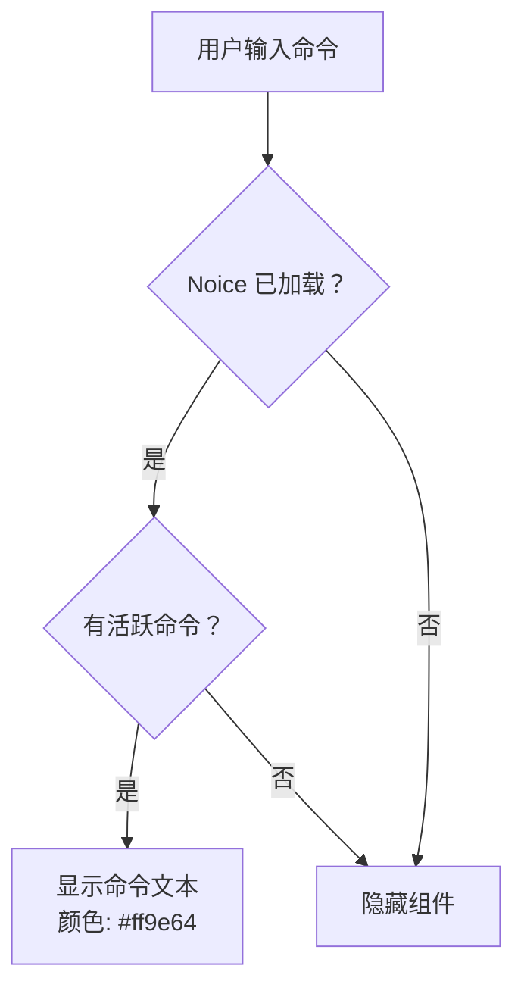
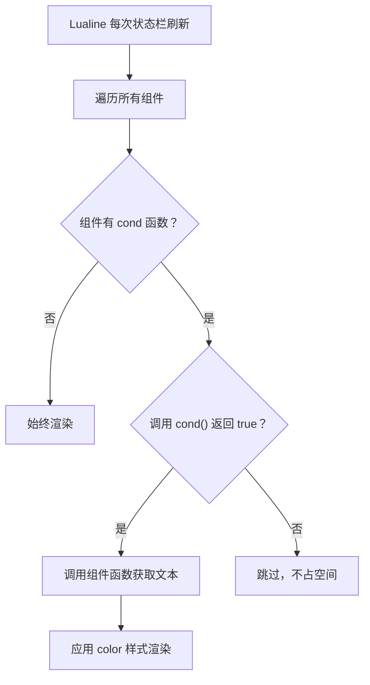

Lualine 是本配置中状态栏的核心框架，它不仅展示传统的编辑器信息（模式、文件名、光标位置），还深度集成了 **DAP 调试状态**、**Lazy 插件更新提示**、**Noice 命令行状态** 和 **Gitsigns 差异统计**。本文档将从布局架构出发，逐段解析每个区域的设计意图与实现细节，帮助你在理解的基础上进行自定义扩展。

## 整体架构：分段式状态栏布局

Lualine 采用经典的 **A–Z 九段式布局**，将状态栏从左到右划分为 `lualine_a` 到 `lualine_z` 共九个区域。本配置在 `sections` 中只使用了 `a`–`d` 和 `x`–`z` 六个区域，中间区域留空，形成左右对称的视觉分隔。

```mermaid
graph LR
    subgraph 左侧区域
        A["lualine_a<br/>模式"]
        B["lualine_b<br/>Git 分支"]
        C["lualine_c<br/>文件名 + 诊断"]
    end
    subgraph 右侧区域
        X["lualine_x<br/>Noice / DAP / Lazy<br/>Diff / 编码 / 文件类型"]
        Y["lualine_y<br/>进度 + 位置"]
        Z["lualine_z<br/>时钟"]
    end
    A --> B --> C
    X --> Y --> Z
    C -.-"中间留空"-.-> X
```

**全局配置**层面有三个关键决策值得注意：主题设为 `"auto"`，这意味着 Lualine 会自动继承当前 colorscheme（本项目中为 [Tokyonight 主题配置](27-tokyonight-zhu-ti-pei-zhi) 的 `moon` 风格），无需手动同步颜色。`globalstatus` 在 `laststatus == 3` 时启用——Neovim 0.7+ 的全局状态栏模式会生成一条横跨所有窗口的单一样式状态栏，避免每个窗口各自渲染带来的视觉碎片化。`disabled_filetypes` 将 `dashboard`、`alpha`、`ministarter` 三类启动页排除在外，确保首页的简洁外观不被状态栏干扰。

`init` 阶段执行了一项精心设计的 **预加载策略**：先保存当前 `laststatus` 值到 `vim.g.lualine_laststatus`，然后判断启动参数——如果通过命令行打开了文件（`vim.fn.argc(-1) > 0`），则将 `statusline` 设为一个空格占位符，避免 Lualine 加载前的闪烁；如果是空启动（显示启动页），则将 `laststatus` 设为 0 完全隐藏状态栏。待插件正式加载后，再从全局变量恢复原始的 `laststatus` 值。这种"保存-修改-恢复"的模式确保了加载过程中的视觉一致性。

Sources: [lualine.lua](lua/plugins/lualine.lua#L1-L46)

## 左侧区域：模式、分支与文件上下文

左侧三个区域承载最常用的上下文信息，信息密度从高到低排列：

| 区域 | 组件 | 功能说明 |
|------|------|----------|
| `lualine_a` | `mode` | 显示当前 Vim 模式（NORMAL / INSERT / VISUAL 等） |
| `lualine_b` | `branch` | 当前 Git 分支名称 |
| `lualine_c` | `filename` | 相对路径文件名，含修改 `●` / 只读 ` ` 标记 |
| `lualine_c` | `diagnostics` | LSP 诊断计数（Error / Warn / Info / Hint） |

**filename** 组件的 `path = 1` 设置使文件名显示为相对于当前工作目录的路径（而非仅文件名或绝对路径），这在多项目并行的场景中提供了足够的辨识度。`symbols` 表定义了三种文件状态的视觉标记：`modified` 用实心圆点 `●` 表示未保存的更改，`readonly` 用锁图标 ` ` 标识只读文件，`unnamed` 用 `[No Name]` 标识新建缓冲区。

**diagnostics** 组件使用了自定义的 Nerd Font 图标集合（` ` / ` ` / ` ` / ` `），而非 Lualine 的默认图标。这套图标与 Gitsigns 和其他 UI 插件形成统一的视觉语言。Lualine 的 diagnostics 组件默认从 LSP 获取数据，因此只要 [LSP 通用配置与 Mason 包管理](13-lsp-tong-yong-pei-zhi-yu-mason-bao-guan-li) 中的语言服务器处于活跃状态，这里就会实时显示错误和警告计数。

分隔符方面，`component_separators` 和 `section_separators` 均被设为空字符串，这意味着各组件之间没有额外的分隔线，依靠颜色块的差异来区分——这是现代状态栏设计中常见的"极简"策略，减少视觉噪音。

Sources: [lualine.lua](lua/plugins/lualine.lua#L47-L70)

## 右侧区域（上）：条件性状态集成

`lualine_x` 是本配置中最复杂的区域，它按特定顺序排列了六个组件，前四个是**条件渲染**组件——只有在满足条件时才出现。这种设计避免了不相关信息的视觉污染：调试状态只在调试时显示，插件更新提示只在有更新时出现。

### Noice 命令与模式状态



两个 Noice 组件分别展示当前命令行的命令文本（如 `:Telescope`）和 Vim 模式名称（如 `-- VISUAL --`）。它们使用 `cond` 条件函数做双重检查：首先通过 `package.loaded["noice"]` 验证 [Noice 消息与命令行 UI 重构](29-noice-xiao-xi-yu-ming-ling-xing-ui-zhong-gou) 插件已加载，然后调用 Noice 的 API 方法（`status.command.has()` / `status.mode.has()`）确认当前有可显示的内容。`package.loaded` 检查是一个关键的性能优化——它比 `pcall(require, "noice")` 更轻量，因为它只查询 Lua 的模块缓存表而不触发文件系统搜索。

颜色选择上，命令状态使用 `#ff9e64`（Tokyonight 的 Statement 高亮色，偏橙色），模式状态使用 `#7dcfff`（Constant 高亮色，偏青色），两种颜色的色调差异使得即使两个组件同时出现也能一目了然。

Sources: [lualine.lua](lua/plugins/lualine.lua#L72-L83)

### DAP 调试状态集成

DAP 状态组件是调试工作流在状态栏上的唯一视觉出口。它的实现模式与 Noice 组件完全一致——`cond` 中检查 `package.loaded["dap"]` 再判断 `dap.status()` 是否非空。

组件函数 `function() return "  " .. require("dap").status() end` 前置了一个 Nerd Font 的调试图标 ` `，然后拼接 `dap.status()` 返回的字符串。在调试会话的不同阶段，`dap.status()` 会返回如 `"Stopped at breakpoint"`、`"Running"` 等信息。由于 DAP 插件声明为 `lazy = true`（仅在 C# buffer 触发 `LspAttach` 后才通过 [C# DAP 调试器：从适配器注册到启动配置](8-c-dap-diao-shi-qi-cong-gua-pei-qi-zhu-ce-dao-qi-dong-pei-zhi) 中的机制加载），在非调试场景下这个组件完全不可见。

颜色 `#bb9af7` 是 Tokyonight 的 Debug 高亮色（偏紫色），与 Noice 的橙色和青色形成三角对比，便于快速区分状态来源。

Sources: [lualine.lua](lua/plugins/lualine.lua#L85-L89), [dap-cs.lua](lua/plugins/dap-cs.lua#L3)

### Lazy 插件更新提示

```lua
{
  require("lazy.status").updates,
  cond = require("lazy.status").has_updates,
  color = { fg = "#ff9e64" },
},
```

这个组件是 lazy.nvim 包管理器的内建集成。`require("lazy.status").updates` 返回形如 `" 3"` 的字符串（图标 + 可更新数量），而 `has_updates` 返回布尔值控制可见性。当 [插件管理策略：lazy.nvim 与按文件组织模式](6-cha-jian-guan-li-ce-lue-lazy-nvim-yu-an-wen-jian-zu-zhi-mo-shi) 检测到远程仓库有新版本时，状态栏右侧会自动出现橙色更新提示——无需手动运行 `:Lazy` 检查。

Sources: [lualine.lua](lua/plugins/lualine.lua#L90-L94)

### Gitsigns 差异统计

diff 组件没有使用 Lualine 内置的 diff 数据源，而是自定义了 `source` 函数，从 `vim.b.gitsigns_status_dict` 缓冲区变量中提取数据。这个变量由 [Gitsigns 行级变更与 blame](22-gitsigns-xing-ji-bian-geng-yu-blame) 插件自动维护。值得注意的是字段名映射：Gitsigns 使用 `changed` 而 Lualine diff 组件期望 `modified`，`source` 函数中做了显式的 `gitsigns.changed → modified` 转换。

图标使用 ` `（已添加）、` `（已修改）、` `（已删除）三个 Nerd Font 图标，与 `lualine_c` 的诊断图标在风格上保持一致。

Sources: [lualine.lua](lua/plugins/lualine.lua#L95-L112)

## 右侧区域（下）：文件元信息、位置与时钟

`lualine_x` 的尾部是三个标准的静态组件：`encoding`（文件编码，如 UTF-8）、`fileformat`（行尾格式，如 DOS/Unix）、`filetype`（文件类型，如 cs/lua）。这三个组件没有条件渲染，始终可见。

**lualine_y** 包含 `progress`（当前行占总行数的百分比）和 `location`（光标的行号:列号）。通过精细的 `padding` 和 `separator` 配置——`progress` 右侧无内边距、`location` 左侧无内边距，两者共享分隔符空格——使 `42% ㏑ 15,8` 这样的显示更加紧凑。

**lualine_z** 是一个自定义函数组件，返回 ` ` 图标加上 `os.date("%R")` 格式的 24 小时制时间（如 ` 14:37`）。使用函数组件而非内置组件的原因是可以在时间前添加图标，增强视觉识别度。

Sources: [lualine.lua](lua/plugins/lualine.lua#L113-L128)

## 条件渲染机制与懒加载的协同

本配置中 `lualine_x` 的四个条件组件（Noice×2、DAP、Lazy）共享同一种实现模式，理解这个模式对扩展至关重要：



每个条件组件的核心是 `cond` 函数，它决定了组件是否在当前帧中渲染。**DAP 和 Lazy 的 `cond` 模式存在微妙差异**：DAP 使用 `package.loaded["dap"] and require("dap").status() ~= ""`，其中 `package.loaded` 检查既是性能优化也是安全保护——如果 DAP 插件未被加载，直接 `require("dap")` 会触发不必要的模块搜索甚至报错；Lazy 使用 `require("lazy.status").has_updates`，因为 lazy.nvim 作为插件管理器始终在 Lualine 之前加载，无需做存在性检查。

这种协同设计意味着：在纯编辑场景下，状态栏右侧只显示 diff/编码/文件类型/位置/时间；进入调试后，紫色调试状态自动出现；有插件更新时，橙色更新计数自动出现——信息展示严格遵循"需要时才显示"的原则。

Sources: [lualine.lua](lua/plugins/lualine.lua#L71-L94), [dap-cs.lua](lua/plugins/dap-cs.lua#L3-L6)

## 扩展系统：lazy / mason / nvim-tree

配置末尾的 `extensions` 列表注册了三个 Lualine 扩展：

| 扩展 | 作用 |
|------|------|
| `lazy` | 在 `:Lazy` 管理面板中显示简化的状态栏 |
| `mason` | 在 `:Mason` 包管理面板中适配状态栏样式 |
| `nvim-tree` | 在 [neo-tree 文件浏览器配置](18-neo-tree-wen-jian-liu-lan-qi-pei-zhi) 侧栏底部显示文件信息 |

Lualine 扩展的本质是为特定 filetype 注入覆盖的 section 配置。以 `lazy` 扩展为例，它会在 filetype 为 `lazy` 的窗口中将状态栏替换为只显示 Lazy 自身的状态信息，避免主配置栏的无关信息干扰插件管理操作。

Sources: [lualine.lua](lua/plugins/lualine.lua#L127)

## 性能优化：lualine_require 替换

配置开头有一行看似奇怪的代码：

```lua
local lualine_require = require("lualine_require")
lualine_require.require = require
```

这是 LazyVim 生态系统中的一个已知性能优化技巧。Lualine 内部使用自己的 `lualine_require` 模块来加载子模块，这个加载器在某些情况下会执行冗余的文件系统查找。通过将其替换为 Neovim 原生的 `require`，可以跳过 Lualine 的加载逻辑直接使用 Lua 的模块缓存。注释中的 `PERF` 标记也证实了这是有意的性能优化。

Sources: [lualine.lua](lua/plugins/lualine.lua#L17-L20)

## 自定义指南：添加新的条件组件

如果你想为状态栏添加新的条件组件（例如显示当前 .sln 解决方案名称），可以遵循以下模板：

```lua
-- 在 lualine_x 表中添加
{
  function()
    local sln = require("cs_solution").find_sln(vim.fn.getcwd())
    return " " .. vim.fn.fnamemodify(sln, ":t")
  end,
  cond = function()
    return vim.bo.filetype == "cs"
       and package.loaded["cs_solution"] ~= nil
  end,
  color = { fg = "#9ece6a" },  -- Tokyonight 的 String 高亮色
},
```

关键要点：① 组件函数返回显示文本（建议前置 Nerd Font 图标）；② `cond` 函数做 filetype 和模块加载的双重检查；③ `color` 使用 Tokyonight 色板中的颜色以保持视觉一致性。将该代码块插入 `lualine_x` 表中 `diff` 组件之前的位置，解决方案名称就会在打开 C# 文件时出现在状态栏右侧。

Sources: [lualine.lua](lua/plugins/lualine.lua#L71-L116)

## 相关页面导航

- **调试功能全貌**：[C# DAP 调试器：从适配器注册到启动配置](8-c-dap-diao-shi-qi-cong-gua-pei-qi-zhu-ce-dao-qi-dong-pei-zhi) — DAP 状态栏组件的数据来源
- **主题配色基础**：[Tokyonight 主题配置](27-tokyonight-zhu-ti-pei-zhi) — 状态栏颜色的上游定义
- **消息系统集成**：[Noice 消息与命令行 UI 重构](29-noice-xiao-xi-yu-ming-ling-xing-ui-zhong-gou) — Noice 状态 API 的另一端
- **Git 状态来源**：[Gitsigns 行级变更与 blame](22-gitsigns-xing-ji-bian-geng-yu-blame) — diff 组件的数据源
- **插件管理**：[插件管理策略：lazy.nvim 与按文件组织模式](6-cha-jian-guan-li-ce-lue-lazy-nvim-yu-an-wen-jian-zu-zhi-mo-shi) — Lazy 更新提示的后端机制