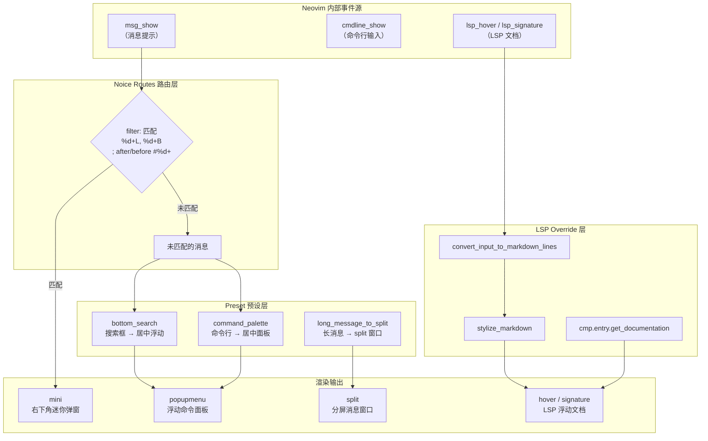

Noice.nvim 是一款高度实验性的 Neovim 插件，它**完全接管**了 Neovim 的消息提示（`:messages`）、命令行（`cmdline`）以及弹出菜单（`popupmenu`）的 UI 渲染，用现代化的浮动窗口替代了传统的底部回显区域。本配置以 LazyVim 社区预设为基础，围绕三大核心目标展开：**视觉降噪**（自动隐藏低价值消息）、**交互升级**（命令面板化、搜索框居中）以及 **LSP 文档美化**（Markdown 渲染与浮动滚动），配合 Lualine 状态栏实现了 Vim 模式和当前命令的实时状态反馈。本文将逐一拆解配置中的每个设计决策与其背后的工程意图。

Sources: [noice.lua](lua/plugins/noice.lua#L1-L53)

## 架构总览：Noice 的消息拦截与渲染管线

在理解具体配置之前，需要先厘清 Noice 的工作原理。Neovim 本身通过 `msg_show`、`msg_showcmd`、`cmdline_show` 等内部事件驱动其消息系统，而这些事件的传统处理方式就是在屏幕底部直接输出文本。Noice 的核心策略是：**拦截这些事件 → 按规则路由到不同的 View → 在独立的浮动窗口中渲染**。下面的 Mermaid 图展示了本配置中 Noice 的完整消息处理管线：



整条管线的关键在于 **Presets** 和 **Routes** 的协同：Presets 修改了 Neovim 内建 View 的默认行为（比如把搜索框从底部移到屏幕中央），而 Routes 则提供细粒度的消息过滤规则，将特定模式的消息导向指定的 View。二者叠加，既获得了开箱即用的现代化体验，又保留了精确控制的能力。

Sources: [noice.lua](lua/plugins/noice.lua#L5-L31)

## 加载策略：VeryLazy 与 Lazy 安装场景的 Hack

本配置将 Noice 的加载事件设置为 `VeryLazy`，这意味着它不会在 Neovim 启动阶段立即加载，而是在首次触发相关事件（如打开文件后的用户操作）时才初始化。这种策略避免了启动阶段不必要的开销，但也引入了一个边界场景：**如果 Neovim 直接以 Lazy UI 作为初始界面启动**（例如用户执行 `nvim` 后 Lazy 正在安装插件），在 Noice 加载之前产生的消息会在加载后突然显示出来，造成视觉混乱。

配置中通过自定义 `config` 函数中的 HACK 解决了这个问题：

```lua
config = function(_, opts)
  -- HACK: noice shows messages from before it was enabled,
  -- but this is not ideal when Lazy is installing plugins,
  -- so clear the messages in this case.
  if vim.o.filetype == "lazy" then
    vim.cmd([[messages clear]])
  end
  require("noice").setup(opts)
end,
```

这段代码的执行逻辑是：在执行 `require("noice").setup(opts)` 之前，先检测当前 buffer 的 `filetype` 是否为 `lazy`。如果是，则先执行 `:messages clear` 清空消息队列，避免 Lazy 安装过程中的大量进度消息在 Noice 初始化后集中爆发。这是一个典型的 **防御性编程** 模式——在框架初始化前预判并消除已知的副作用。

Sources: [noice.lua](lua/plugins/noice.lua#L44-L53)

## Presets 预设：三大视觉改造

配置启用了三个 LazyVim 社区预设，每一个都对应一项具体的 UI 改造：

| 预设名称 | 改造内容 | 用户体验变化 |
|---|---|---|
| `bottom_search` | 搜索输入框（`/` 和 `?`）从屏幕底部移至屏幕中央的浮动窗口 | 搜索时视线无需大幅下移，输入内容始终处于视觉焦点区域 |
| `command_palette` | 命令行（`:`）从底部单行改为屏幕中央的浮动面板 | 类似 VS Code 的命令面板体验，输入时获得更大的可视空间 |
| `long_message_to_split` | 超过一定长度的消息自动路由到独立的 split 窗口 | 避免长输出（如 `:highlight` 的完整列表）被截断或遮挡编辑区 |

这三个预设的组合效果是：**所有需要用户注意力的交互都被提升到屏幕中央**，而那些不需要关注的低价值信息则被静默处理或分流。这正是 Noice 设计哲学的核心——把 UI 层级从"所有东西都堆在底部"重构为"按重要性分层展示"。

Sources: [noice.lua](lua/plugins/noice.lua#L26-L30)

## Routes 路由规则：视觉降噪的实现

配置中定义了一条精确的路由规则，其目的是**自动隐藏编辑操作产生的低价值反馈消息**：

```lua
routes = {
  {
    filter = {
      event = "msg_show",
      any = {
        { find = "%d+L, %d+B" },    -- 如 "5L, 128B"
        { find = "; after #%d+" },   -- 如 "; after #5"
        { find = "; before #%d+" },  -- 如 "; before #12"
      },
    },
    view = "mini",
  },
},
```

这条规则的匹配逻辑如下：

- **`event = "msg_show"`**：仅拦截消息显示事件，不影响命令行或其他类型的事件。
- **`any` 组中的三个模式**：
  - `"%d+L, %d%B"` — 匹配 yank（复制）、删除等操作后的行数/字节数统计消息，如 `"5L, 128B"`。
  - `"; after #%d+"` — 匹配跳转操作的相对位置反馈，如 `"; after #5"`（表示目标在第 5 行之后）。
  - `"; before #%d+"` — 匹配跳转操作的相对位置反馈，如 `"; before #12"`（表示目标在第 12 行之前）。
- **`view = "mini"`**：匹配成功的消息被路由到 `mini` 视图——右下角的迷你弹窗，短暂显示后自动消失。

这种设计的意图很明确：这些消息虽然有用，但不需要占据命令行的正式位置来显示。将它们降级为 `mini` 视图后，既保留了信息（用户仍然能看到），又不干扰正常的工作流。如果用户需要回顾这些消息，可以通过 `<leader>snh` 查看历史记录。

Sources: [noice.lua](lua/plugins/noice.lua#L13-L25)

## LSP Override：Markdown 文档渲染增强

```lua
lsp = {
  override = {
    ["vim.lsp.util.convert_input_to_markdown_lines"] = true,
    ["vim.lsp.util.stylize_markdown"] = true,
    ["cmp.entry.get_documentation"] = true,
  },
},
```

这三个 override 标志将 Neovim 内建的 LSP 文档处理函数替换为 Noice 的增强版本，具体效果是：

| Override 函数 | 增强内容 |
|---|---|
| `convert_input_to_markdown_lines` | 将 LSP 返回的原始文档（通常是 MarkupContent 或 MarkedString）转换为规范的 Markdown 行，使后续渲染有统一的输入格式 |
| `stylize_markdown` | 利用 Neovim 的 extmarks 和高亮机制对 Markdown 内容进行富文本渲染——标题加粗、代码块语法高亮、列表缩进等 |
| `cmp.entry.get_documentation` | 将 [blink.cmp 自动补全框架配置](12-blink-cmp-zi-dong-bu-quan-kuang-jia-pei-zhi) 中补全项的文档弹出窗口也纳入 Noice 的 Markdown 渲染管线 |

三者协同工作的结果是：无论用户通过 K 键查看 hover 文档、在补全菜单中浏览函数签名，还是通过 LSP 窗口阅读详细文档，所有 LSP 返回的 Markdown 内容都会被统一美化渲染，不再出现原始文本混排的情况。

Sources: [noice.lua](lua/plugins/noice.lua#L6-L12)

## 快捷键体系：消息导航与 LSP 滚动

配置通过 `keys` 表注册了完整的快捷键体系，所有 Noice 相关的操作都挂在 `<leader>sn` 前缀下，形成了一个逻辑清晰的命令空间：

| 快捷键 | 模式 | 功能 | 使用场景 |
|---|---|---|---|
| `<leader>sn` | Normal | 进入 Noice 子命令组 | 作为 Which-Key 的入口前缀 |
| `<S-Enter>` | Command | 将当前命令行内容重定向到 Noice | 在命令行中编辑复杂命令时使用 |
| `<leader>snl` | Normal | 显示最近一条 Noice 消息 | 快速查看刚才消失的 mini 通知 |
| `<leader>snh` | Normal | 打开 Noice 消息历史 | 回溯之前被路由隐藏的消息 |
| `<leader>sna` | Normal | 显示所有 Noice 消息 | 全量查看所有被 Noice 处理的消息 |
| `<leader>snd` | Normal | 关闭所有 Noice 弹窗 | 批量清除屏幕上的浮动窗口 |
| `<leader>snt` | Normal | 用 Telescope/FzfLua 选择消息 | 在消息历史中模糊搜索定位 |
| `<C-f>` | I/N/S | LSP 文档向下滚动 4 行 | 浏览 hover 文档或签名帮助 |
| `<C-b>` | I/N/S | LSP 文档向上滚动 4 行 | 回翻 LSP 文档内容 |

值得特别注意的是 `<C-f>` 和 `<C-b>` 的实现方式：

```lua
{
  "<c-f>",
  function()
    if not require("noice.lsp").scroll(4) then
      return "<c-f>"
    end
  end,
  silent = true, expr = true, desc = "Scroll Forward",
  mode = {"i", "n", "s"},
},
```

这里使用了 `expr = true` 模式——函数的返回值会被作为按键序列执行。`require("noice.lsp").scroll(4)` 尝试滚动当前可见的 Noice LSP 浮动窗口（通常是 hover 文档或签名帮助）。如果当前没有可滚动的 Noice 窗口，函数返回 `false`，此时 `if not` 分支将 `"<c-f>"` 作为原始按键返回，让 Neovim 执行默认的 `<C-f>` 行为（Normal 模式下向下翻页）。这种 **条件委托模式** 确保了快捷键在有无 Noice 浮动窗口的场景下都能正常工作，不会产生按键冲突。

Sources: [noice.lua](lua/plugins/noice.lua#L33-L43)

## Lualine 集成：状态栏中的命令与模式反馈

Noice 与 [Lualine 状态栏与 DAP/Lazy 状态集成](28-lualine-zhuang-tai-lan-yu-dap-lazy-zhuang-tai-ji-cheng) 的集成体现在状态栏的 `lualine_x` 区域中，注册了两个条件组件：

```lua
-- 命令组件：显示当前正在执行的命令
{
  function() return require("noice").api.status.command.get() end,
  cond = function()
    return package.loaded["noice"]
      and require("noice").api.status.command.has()
  end,
  color = { fg = "#ff9e64" },
},

-- 模式组件：显示当前的 Vim 模式信息
{
  function() return require("noice").api.status.mode.get() end,
  cond = function()
    return package.loaded["noice"]
      and require("noice").api.status.mode.has()
  end,
  color = { fg = "#7dcfff" },
},
```

两个组件都采用了相同的防御策略：**`cond` 函数先检查 `package.loaded["noice"]` 确保 Noice 模块已加载**，再调用 `has()` 检查是否有可显示的内容。这避免了 Noice 尚未加载（VeryLazy 机制下）时调用其 API 导致的报错。颜色上，命令组件使用 `#ff9e64`（橙色调，与 Tokyonight 主题的 Statement 高亮色一致），模式组件使用 `#7dcfff`（蓝色调，对应 Constant 高亮色），二者在视觉上能清晰区分，又与 [Tokyonight 主题配置](27-tokyonight-zhu-ti-pei-zhi) 的色彩体系协调统一。

Sources: [lualine.lua](lua/plugins/lualine.lua#L71-L83)

## 依赖关系：nui.nvim 与插件生态

Noice 的底层依赖是 **nui.nvim**——一个为 Neovim 提供高阶 UI 组件库的插件，负责浮动窗口、弹窗、菜单等 UI 原语的创建与管理。从 `lazy-lock.json` 可以确认，当前配置锁定了 `noice.nvim` 和 `nui.nvim` 两个包：

```
"noice.nvim": { "branch": "main", "commit": "7bfd9424" },
"nui.nvim":   { "branch": "main", "commit": "de740991" },
```

lazy.nvim 会自动解析 `noice.nvim` 的依赖声明并安装 `nui.nvim`，无需手动管理。值得注意的是，`noice.nvim` 通常还依赖 `nvim-notify` 作为通知后端，但本配置的 `lazy-lock.json` 中并未锁定它——这表明当前版本可能已将通知功能内化，或者 lazy.nvim 在运行时自动拉取了该依赖而未写入 lock 文件。

Sources: [lazy-lock.json](lazy-lock.json#L22-L23)

## 配置总结与调优方向

下表汇总了本配置中 Noice 的全部关键设计点，方便快速回顾：

| 设计维度 | 具体配置 | 解决的问题 |
|---|---|---|
| 加载时机 | `VeryLazy` + Lazy 场景 HACK | 避免启动开销 + 防止 Lazy 安装消息泄露 |
| 消息路由 | `msg_show` → `mini`（行数/字节数/跳转反馈） | 视觉降噪，低价值消息不占命令行 |
| 搜索体验 | `bottom_search` 预设 | 搜索框居中，视线聚焦 |
| 命令体验 | `command_palette` 预设 | 命令行面板化，类 VS Code 体验 |
| 长消息处理 | `long_message_to_split` 预设 | 长输出不被截断 |
| LSP 文档 | 三项 override + Markdown 渲染 | 统一的富文档展示 |
| LSP 滚动 | `<C-f>` / `<C-b>` 条件委托 | 文档浏览与翻页不冲突 |
| 状态栏 | Lualine 命令/模式组件 | 实时反馈当前操作状态 |
| 消息导航 | `<leader>sn` 子命令组 | 历史回溯、搜索、批量清除 |

如果需要进一步定制，常见的调优方向包括：添加更多路由规则来过滤特定 LSP 服务器的冗余通知、调整 `mini` 视图的显示时长、或者自定义 `popupmenu` 的样式以配合 [blink.cmp 自动补全框架配置](12-blink-cmp-zi-dong-bu-quan-kuang-jia-pei-zhi) 的视觉风格。了解快捷键提示系统的完整映射，可参考 [Which-Key 快捷键提示系统](31-which-key-kuai-jie-jian-ti-shi-xi-tong)；关于主题配色与 Noice 视觉效果的协调，参见 [Tokyonight 主题配置](27-tokyonight-zhu-ti-pei-zhi)。