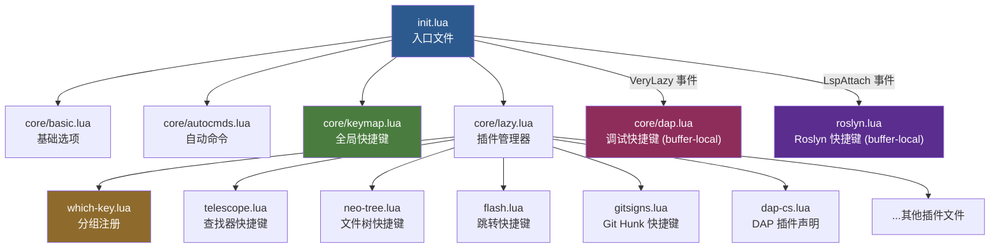

本页是整个 Neovim IDE 配置的**快捷键总览**。你将了解到：**Leader 键**如何定义、全局快捷键分布在哪些文件中、以及各功能分组的核心按键映射。掌握本页内容后，你就能在日常编辑中流畅地调用文件查找、Git 操作、代码导航、调试等功能，而不必反复翻阅配置源码。

如果你尚未完成环境搭建，请先阅读 [环境搭建与首次启动](2-huan-jing-da-jian-yu-shou-ci-qi-dong)。如果你更想先了解整体架构和模块加载流程，可以跳转至 [整体架构与模块加载流程](4-zheng-ti-jia-gou-yu-mo-kuai-jia-zai-liu-cheng)。

Sources: [init.lua](init.lua#L1-L23), [keymap.lua](lua/core/keymap.lua#L1-L68)

## Leader 键定义与设计哲学

本配置选用 **空格键（Space）** 作为全局 Leader 键，反斜杠 `\` 作为 Local Leader 键。这是一个经过广泛验证的设计决策——空格键在键盘上面积最大、拇指自然落位，无论哪种键盘布局都能零成本触及。

```lua
vim.g.mapleader = " "
vim.g.maplocalleader = "\\"
```

Leader 键本身不执行任何操作，它是一个**前缀触发器**：按下 Space 后，Neovim 进入"等待后续按键"状态。所有以 `<leader>` 开头的快捷键构成了一棵**功能树**，由 [Which-Key 快捷键提示系统](31-which-key-kuai-jie-jian-ti-shi-xi-tong) 在你按下 Leader 后弹出可视化的分组菜单。这意味着你只需记住"Space 是起点"，然后跟随屏幕提示即可发现全部功能。

Sources: [keymap.lua](lua/core/keymap.lua#L1-L2)

## 快捷键加载架构

快捷键并非集中在一个文件里，而是**分散定义在各插件文件和核心模块中**，通过 `lazy.nvim` 的按需加载机制统一注册。下图展示了从入口文件到各快捷键定义点的加载链路：



关键要点：**全局快捷键**在 `core/keymap.lua` 中一次性注册，始终可用；**插件快捷键**通过 lazy.nvim 的 `keys` 字段声明，仅在对应插件加载后生效；**Buffer 局部快捷键**（如 DAP 调试、Roslyn LSP）通过 `LspAttach` 自动命令在特定条件下注册，只对 C# 文件生效。

Sources: [init.lua](init.lua#L12-L22), [lazy.lua](lua/core/lazy.lua#L1)

## Which-Key 功能分组总览

[Which-Key 快捷键提示系统](31-which-key-kuai-jie-jian-ti-shi-xi-tong) 在按下 Leader 后会展示如下分组菜单。这些分组是理解整个快捷键体系的**顶层入口**：

| 按键序列 | 分组名称 | 主要功能 |
|---|---|---|
| `Space` + `Space` | — | 模糊查找文件 |
| `Space` + `,` | — | 切换 Buffer |
| `Space` + `:` | — | 命令历史 |
| `Space` + `a` | AI | Claude Code AI 助手 |
| `Space` + `b` | Buffer | Buffer 管理、浏览、书签 |
| `Space` + `c` | Code | 代码操作：符号大纲、解决方案目标、Roslyn 重载 |
| `Space` + `d` | Debug | DAP 调试：断点、单步、变量修改、热重载 |
| `Space` + `f` | File/Find | 文件查找：模糊搜索、Git 文件、最近文件 |
| `Space` + `g` | Git | Git 操作：提交、状态、Diff、LazyGit |
| `Space` + `o` | OpenCode | OpenCode AI 编程助手 |
| `Space` + `q` | Quit/Session | 退出与 Session 管理 |
| `Space` + `s` | Search | 搜索：Grep、Diagnostics、Noice、符号跳转 |
| `Space` + `u` | UI | 界面开关 |
| `Space` + `w` | Windows | 窗口管理（代理到 Ctrl+W） |
| `Space` + `x` | Diagnostics/Quickfix | 诊断与快速修复 |
| `Space` + `?` | Which-Key | 显示当前 Buffer 的所有快捷键 |

Sources: [whichkey.lua](lua/plugins/whichkey.lua#L10-L48)

## 全局编辑快捷键（无 Leader 前缀）

以下快捷键**不需要按 Leader 键**，直接使用 `Ctrl` 或 `Alt` 组合键触发。它们是编辑体验的基石，建议优先记忆：

### 撤销 / 重做 / 保存

| 快捷键 | 模式 | 功能 |
|---|---|---|
| `Ctrl+Z` | Normal / Insert | 撤销 |
| `Ctrl+Shift+Z` | Normal / Insert | 重做 |
| `Ctrl+S` | Normal / Insert / Visual / Select | 保存文件 |

### 窗口导航与调整

| 快捷键 | 模式 | 功能 |
|---|---|---|
| `Ctrl+H/J/K/L` | Normal | 在窗口间向左/下/上/右移动焦点 |
| `Ctrl+↑/↓/←/→` | Normal | 增大/缩小窗口高度/宽度 |

### 行移动

| 快捷键 | 模式 | 功能 |
|---|---|---|
| `Alt+J` | Normal / Insert / Visual | 当前行（或选中行）下移 |
| `Alt+K` | Normal / Insert / Visual | 当前行（或选中行）上移 |

### 搜索行为优化

标准 Neovim 中 `n` / `N` 的方向在反转搜索（`?`）后会变得反直觉。本配置通过表达式映射使搜索方向始终与预期一致——`n` 永远"向前"，`N` 永远"向后"，无论上次使用的是 `/` 还是 `?`。

| 快捷键 | 模式 | 功能 |
|---|---|---|
| `n` | Normal / Visual / Operator | 下一个搜索结果（智能方向） |
| `N` | Normal / Visual / Operator | 上一个搜索结果（智能方向） |

### 终端

| 快捷键 | 模式 | 功能 |
|---|---|---|
| `Ctrl+\` | — | 打开/关闭浮动终端 |
| `Space` + `Tab` | Terminal | 从终端模式退回到 Normal 模式 |

Sources: [keymap.lua](lua/core/keymap.lua#L5-L53), [toggleterm.lua](lua/plugins/toggleterm.lua#L8-L9)

## Leader 快捷键分组详解

### Buffer 管理（Space + b）

Buffer 是 Neovim 中"已打开文件"的基本单位。本配置通过 `bufferline.nvim` 在顶部标签栏可视化所有打开的 Buffer，以下快捷键控制 Buffer 的切换与关闭：

| 快捷键 | 功能 |
|---|---|
| `Space` + `,` | 快速切换到最近使用的 Buffer |
| `Space` + `bh` | 切换到前一个 Buffer |
| `Space` + `bl` | 切换到后一个 Buffer |
| `Space` + `bp` | 通过字母标签拾取 Buffer |
| `Space` + `bc` | 通过字母标签关闭 Buffer |
| `Space` + `bo` | 关闭除当前外的所有 Buffer |
| `Space` + `bd` | 关闭当前 Buffer |
| `Shift+H` / `Shift+L` | 切换到前/后一个 Buffer（无 Leader） |

Sources: [telescope.lua](lua/plugins/telescope.lua#L23-L26), [bufferline.lua](lua/plugins/bufferline.lua#L26-L36)

### 文件查找（Space + f）

文件查找功能由 [Telescope 模糊查找器](16-telescope-mo-hu-cha-zhao-qi-wen-jian-grep-yu-git-sou-suo) 提供，支持模糊搜索文件名和浏览历史记录：

| 快捷键 | 功能 |
|---|---|
| `Space` + `Space` | 模糊查找文件（最常用入口） |
| `Space` + `fb` | 列出所有打开的 Buffer |
| `Space` + `fg` | 查找 Git 跟踪的文件 |
| `Space` + `fr` | 打开最近访问过的文件 |

Sources: [telescope.lua](lua/plugins/telescope.lua#L29-L41)

### 搜索（Space + s）

搜索分组是功能最丰富的分组之一，涵盖文本搜索、诊断、帮助、快捷键查询等。部分常用项目如下：

| 快捷键 | 功能 |
|---|---|
| `Space` + `sg` | 全局 Grep 搜索（当前目录） |
| `Space` + `sG` | 全局 Grep 搜索（仅 `.cs` / `.razor` / `.css` 文件） |
| `Space` + `sb` | 当前 Buffer 内模糊搜索 |
| `Space` + `sd` | 搜索项目级诊断信息 |
| `Space` + `sD` | 搜索当前 Buffer 的诊断信息 |
| `Space` + `sk` | 搜索已注册的快捷键 |
| `Space` + `sh` | 搜索 Vim 帮助文档 |
| `Space` + `ss` | 通过 Aerial 搜索代码符号 |
| `Space` + `sr` | [Grug-Far 项目级搜索替换](26-grug-far-xiang-mu-ji-sou-suo-ti-huan) |
| `Space` + `s/` | 搜索历史记录 |

此外，`Space` + `sn` 是 [Noice 消息系统](29-noice-xiao-xi-yu-ming-ling-xing-ui-zhong-gou) 的子分组，用于查看和管理 Neovim 的通知消息：

| 快捷键 | 功能 |
|---|---|
| `Space` + `snl` | 查看最后一条消息 |
| `Space` + `snh` | 消息历史 |
| `Space` + `sna` | 查看全部消息 |
| `Space` + `snd` | 清除所有消息 |
| `Space` + `snt` | 通过 Telescope 拾取消息 |

Sources: [telescope.lua](lua/plugins/telescope.lua#L48-L88), [aerial.lua](lua/plugins/aerial.lua#L129-L136), [grug-far.lua](lua/plugins/grug-far.lua#L6-L23), [noice.lua](lua/plugins/noice.lua#L33-L42)

### Git 操作（Space + g）

Git 工作流是本配置的重点领域之一，整合了 LazyGit、Gitsigns、Diffview 三套工具：

| 快捷键 | 功能 | 来源插件 |
|---|---|---|
| `Space` + `gg` | 打开 LazyGit 全界面 | [LazyGit](21-lazygit-ji-cheng) |
| `Space` + `gc` / `gl` | 查看 Git 提交历史 | Telescope |
| `Space` + `gs` | 查看 Git 工作区状态 | Telescope |
| `Space` + `gd` | 打开 Diffview 差异视图 | [Diffview](23-diffview-chai-yi-cha-kan-yu-wen-jian-li-shi) |
| `Space` + `gD` | 当前文件的提交历史 | Diffview |
| `Space` + `gq` | 关闭 Diffview | Diffview |
| `Space` + `gp` | 预览当前行 Hunk | [Gitsigns](22-gitsigns-xing-ji-bian-geng-yu-blame) |
| `Space` + `gb` | 切换行级 Blame 注释 | Gitsigns |
| `Space` + `ghs` | 暂存当前 Hunk | Gitsigns |
| `Space` + `ghr` | 重置当前 Hunk | Gitsigns |
| `Space` + `ghu` | 撤销 Hunk 暂存 | Gitsigns |
| `]h` / `[h` | 跳转到下一个/上一个 Hunk | Gitsigns |

Sources: [lazygit.lua](lua/plugins/lazygit.lua#L8-L10), [telescope.lua](lua/plugins/telescope.lua#L44-L47), [diffview.lua](lua/plugins/diffview.lua#L4-L8), [gitsigns.lua](lua/plugins/gitsigns.lua#L21-L29)

### 代码操作（Space + c）

代码分组整合了 [Lspsaga 代码导航](15-lspsaga-dai-ma-dao-hang-yu-cao-zuo-zeng-qiang)、[Aerial 符号大纲](20-aerial-dai-ma-da-gang-yu-fu-hao-dao-hang) 和 [Roslyn LSP](7-roslyn-lsp-ji-cheng-yu-jie-jue-fang-an-guan-li) 的专用操作：

| 快捷键 | 功能 |
|---|---|
| `Space` + `cs` | 切换 Aerial 代码符号大纲 |
| `Space` + `ct` | 选择解决方案目标（.sln 选择器） |
| `Space` + `cl` | 重载 Roslyn 分析 |

Lspsaga 提供的 LSP 操作使用 `Space` + `l` 前缀（注意：这不是 Which-Key 注册的分组，而是独立的快捷键前缀）：

| 快捷键 | 功能 |
|---|---|
| `Space` + `ld` | 跳转到定义 |
| `Space` + `lR` | 查找所有引用 |
| `Space` + `lr` | 重命名符号 |
| `Space` + `lc` | 代码操作 |
| `Space` + `lh` | 悬停文档 |
| `Space` + `ln` | 下一条诊断 |
| `Space` + `lp` | 上一条诊断 |

Sources: [aerial.lua](lua/plugins/aerial.lua#L118-L120), [roslyn.lua](lua/plugins/roslyn.lua#L42-L62), [lspsaga.lua](lua/plugins/lspsaga.lua#L11-L18)

### 调试（Space + d）

DAP 调试快捷键采用**双轨设计**——Leader 序列和 F 键并行存在，满足不同使用习惯。这些快捷键仅在你打开 C# 文件且 Roslyn LSP 已 attach 时生效（Buffer 局部绑定）。详细原理参见 [C# DAP 调试器：从适配器注册到启动配置](8-c-dap-diao-shi-qi-cong-gua-pei-qi-zhu-ce-dao-qi-dong-pei-zhi) 和 [DAP 调试操作：断点、单步、变量修改与热重载](11-dap-diao-shi-cao-zuo-duan-dian-dan-bu-bian-liang-xiu-gai-yu-re-zhong-zai)。

| Leader 快捷键 | F 键等效 | 功能 |
|---|---|---|
| `Space` + `dc` | `F5` | 启动调试 / 选择配置 / 继续执行 |
| `Space` + `db` | `F9` | 切换断点 |
| `Space` + `do` | `F10` | 单步跳过 |
| `Space` + `di` | `F11` | 单步进入 |
| `Space` + `dO` | `Shift+F11` | 单步跳出 |
| `Space` + `dq` | `Shift+F5` | 终止调试会话 |
| `Space` + `dB` | — | 设置条件断点 |
| `Space` + `dE` | — | 交互式修改变量值 |
| `Space` + `dh` | — | 热重载 |
| `Space` + `dr` | — | 打开 DAP REPL |
| `Space` + `du` | — | 切换 DAP UI 面板 |
| `Space` + `dl` | — | 列出所有断点 |
| `Space` + `df` | — | 列出调用栈帧 |
| `Space` + `dv` | — | 列出变量 |

Sources: [dap.lua](lua/core/dap.lua#L205-L276)

### 窗口与标签页管理

窗口（Window）和标签页（Tab）是 Neovim 组织编辑空间的两种方式：

| 快捷键 | 功能 |
|---|---|
| `Space` + `-` | 垂直分割窗口（注意：Yazi 文件管理器覆盖了此键为打开 Yazi） |
| `Space` + `\|` | 水平分割窗口 |
| `Space` + `wd` | 关闭当前窗口 |
| `Space` + `Tab` + `Tab` | 新建标签页 |
| `Space` + `Tab` + `]` / `[` | 下一个/上一个标签页 |
| `Space` + `Tab` + `l` / `f` | 最后一个/第一个标签页 |
| `Space` + `Tab` + `d` | 关闭当前标签页 |
| `Space` + `Tab` + `o` | 关闭其他标签页 |

窗口组还支持 Hydra 模式——按 `Ctrl+W` 然后按 `Space` 进入循环模式，连续调整窗口大小和布局而无需反复按前缀。

Sources: [keymap.lua](lua/core/keymap.lua#L55-L67), [whichkey.lua](lua/plugins/whichkey.lua#L58-L65), [yazi.lua](lua/plugins/yazi.lua#L9-L16)

### AI 辅助（Space + a）

本配置集成了 Claude Code AI 编程助手，提供代码生成、对话和 Diff 管理功能：

| 快捷键 | 模式 | 功能 |
|---|---|---|
| `Space` + `ac` | Normal | 打开/关闭 Claude Code |
| `Space` + `af` | Normal | 聚焦 Claude Code 窗口 |
| `Space` + `ar` | Normal | 恢复上次 Claude 会话 |
| `Space` + `aC` | Normal | 继续上次 Claude 会话 |
| `Space` + `ab` | Normal | 将当前 Buffer 发送给 Claude |
| `Space` + `as` | Visual | 将选中内容发送给 Claude |
| `Space` + `aa` | Normal | 接受 Claude 的 Diff |
| `Space` + `ad` | Normal | 拒绝 Claude 的 Diff |

Sources: [claudecode.lua](lua/plugins/claudecode.lua#L15-L32)

### 跳转与选择（无 Leader 前缀）

[Flash 快速跳转](17-flash-kuai-su-tiao-zhuan-yu-treesitter-xuan-ze) 提供了高效的屏幕内跳转能力，这些快捷键无需 Leader 前缀：

| 快捷键 | 模式 | 功能 |
|---|---|---|
| `s` | Normal / Visual / Operator | Flash 跳转到屏幕内任意位置 |
| `S` | Normal / Visual / Operator | Flash Treesitter 选择（语法感知选区） |
| `r` | Operator | 远程 Flash（在 Operator-pending 模式中跳转） |
| `R` | Operator / Visual | Treesitter 搜索 |
| `Ctrl+Space` | Normal / Visual / Operator | Treesitter 渐进式选择 |
| `Ctrl+S` | Command | 在搜索中切换 Flash 模式 |

此外，Hop 提供了一个额外的快速跳转入口：`Space` + `hp` 可跳转到屏幕内的任意单词。

Sources: [flash.lua](lua/plugins/flash.lua#L8-L24), [hop.lua](lua/plugins/hop.lua#L6-L8)

### 文件浏览与导航

| 快捷键 | 功能 |
|---|---|
| `Space` + `e` | 切换 [neo-tree 文件浏览器](18-neo-tree-wen-jian-liu-lan-qi-pei-zhi) 侧栏 |
| `Space` + `o` | 聚焦到 neo-tree |
| `Space` + `cw` | 在工作目录打开 [Yazi 文件管理器](19-yazi-wen-jian-guan-li-qi-ji-cheng) |

Sources: [neo-tree.lua](lua/plugins/neo-tree.lua#L9-L12), [yazi.lua](lua/plugins/yazi.lua#L9-L22)

### 代码折叠

折叠功能由 [nvim-ufo 代码折叠](25-nvim-ufo-dai-ma-zhe-die) 提供，使用标准 Neovim 的 `z` 前缀按键：

| 快捷键 | 功能 |
|---|---|
| `zR` | 打开所有折叠 |
| `zM` | 关闭所有折叠 |

Sources: [nvim-ufo.lua](lua/plugins/nvim-ufo.lua#L17-L18)

### 浏览器书签

| 快捷键 | 功能 |
|---|---|
| `Space` + `bb` | 浏览搜索（通过搜索引擎搜索） |
| `Space` + `bs` | 浏览器搜索 |
| `Space` + `bm` | 打开书签列表 |

Sources: [browse.lua](lua/plugins/browse.lua#L82-L86)

### OpenCode AI 编程助手

| 快捷键 | 模式 | 功能 |
|---|---|---|
| `Space` + `oo` | Normal / Visual | 向 OpenCode 提问 |
| `Space` + `ox` | Normal | 执行 OpenCode 操作 |
| `Space` + `og` | Normal / Terminal | 切换 OpenCode 窗口 |

Sources: [opencode.lua](lua/plugins/opencode.lua#L68-L76)

## 快捷键发现与自助查询

面对如此多的快捷键，你不可能一次全记住。以下是**在实践中逐步学习**的策略：

**第一步：善用 Which-Key 提示。** 按下 `Space` 后稍作停顿，屏幕底部会弹出分组菜单。按任意分组键（如 `f`、`g`、`d`）后再次停顿，会展开该分组的所有可用操作。这是最自然的发现方式。

**第二步：查询已注册快捷键。** 按 `Space` + `sk` 打开 Telescope 快捷键搜索器，输入关键词即可模糊查找任何快捷键。

**第三步：查看当前 Buffer 专属快捷键。** 按 `Space` + `?` 显示仅作用于当前 Buffer 的快捷键列表。对于 C# 文件，这里会列出所有 DAP 调试和 Roslyn LSP 的 Buffer-local 快捷键。

Sources: [whichkey.lua](lua/plugins/whichkey.lua#L51-L58), [telescope.lua](lua/plugins/telescope.lua#L79)

## 下一步阅读

掌握了快捷键体系后，建议按以下顺序继续深入：

1. [整体架构与模块加载流程](4-zheng-ti-jia-gou-yu-mo-kuai-jia-zai-liu-cheng) — 理解配置的组织方式和插件加载机制
2. [插件管理策略：lazy.nvim 与按文件组织模式](6-cha-jian-guan-li-ce-lue-lazy-nvim-yu-an-wen-jian-zu-zhi-mo-shi) — 了解插件如何按需加载、快捷键如何与生命周期绑定
3. 根据你的开发场景，深入具体的功能模块文档（如 [Telescope 模糊查找器](16-telescope-mo-hu-cha-zhao-qi-wen-jian-grep-yu-git-sou-suo)、[C# DAP 调试器](8-c-dap-diao-shi-qi-cong-gua-pei-qi-zhu-ce-dao-qi-dong-pei-zhi) 等）