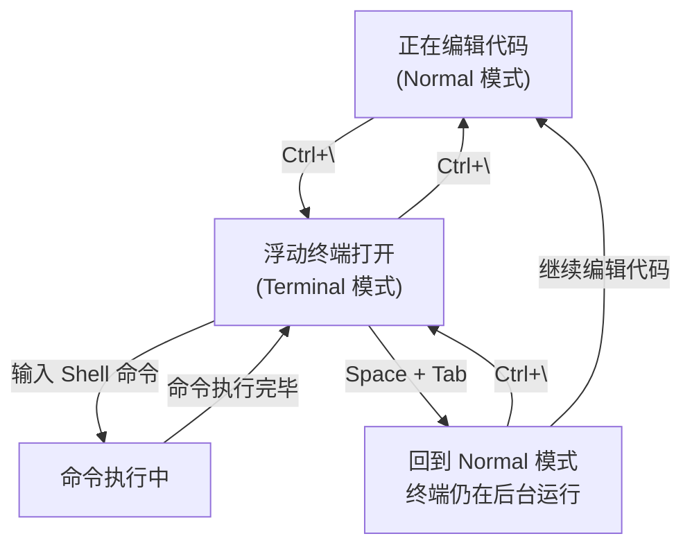

ToggleTerm 是本配置中内置终端方案的核心组件，它让你在 Neovim 内部以**浮动窗口**的形式打开 PowerShell 7 终端，无需离开编辑器即可执行构建、运行测试、Git 操作等命令。本文将逐一拆解它的配置结构、关键参数、快捷键操作，以及与其他终端相关功能的协作关系。

## 插件声明与加载方式

ToggleTerm 以 lazy.nvim 插件的形式声明在 `lua/plugins/toggleterm.lua` 中，使用 `version = "*"` 表示安装最新稳定版本。整个配置通过 `config` 函数内联完成，没有拆分为独立模块——这是因为该插件配置相对简单，所有设置项都可以在一个 `setup()` 调用中完成。

Sources: [toggleterm.lua](lua/plugins/toggleterm.lua#L1-L18)

## 核心配置参数解析

下面是 `require("toggleterm").setup({})` 中每一项配置的含义与效果：

| 参数 | 值 | 说明 |
|------|-----|------|
| `size` | `20` | 终端窗口大小。对 `float` 方向来说，该值影响浮动窗口的默认缩放比例 |
| `open_mapping` | `<C-\>` | **Ctrl+\\** 触发终端的打开/关闭切换，可在 Normal 模式下使用 |
| `direction` | `'float'` | 终端以浮动窗口形式出现，覆盖在编辑区域之上，不拆分任何窗口布局 |
| `shell` | `'pwsh'` | 明确指定使用 PowerShell 7 作为终端 Shell |
| `on_create` | 函数 | 终端创建时的回调钩子，用于注入环境变量 |

其中 `direction` 参数支持四种模式，本配置选择了浮动模式：

| 模式 | 值 | 效果 |
|------|-----|------|
| 浮动窗口 | `'float'` | 居中浮层覆盖，本配置使用此模式 |
| 水平分屏 | `'horizontal'` | 在编辑区下方水平拆分 |
| 垂直分屏 | `'vertical'` | 在编辑区右侧垂直拆分 |
| 标签页 | `'tab'` | 在新标签页中打开 |

Sources: [toggleterm.lua](lua/plugins/toggleterm.lua#L5-L16)

## on_create 回调与环境变量注入

`on_create` 回调在终端实例首次创建时被调用，本配置利用它注入了一个关键环境变量：

```lua
on_create = function (term)
    term.env = vim.tbl_extend('force', term.env or {}, {
        TERM = 'xterm-256color',
    })
end
```

这段代码的作用是将 `TERM` 环境变量设置为 `xterm-256color`。**为什么需要这个设置？** 因为 Neovim 内置终端有时无法正确向子进程报告终端类型，导致某些 CLI 工具（如 `bat`、`delta`、`fzf`、`lazygit` 等）无法使用 256 色或真彩色渲染，表现为色彩缺失或显示异常。通过显式注入 `TERM=xterm-256color`，确保浮动终端内的所有命令行工具都能获得正确的颜色支持。

`vim.tbl_extend('force', ...)` 确保该设置会覆盖已有的同名环境变量，但不会影响其他环境变量——这是一种安全的合并策略。

Sources: [toggleterm.lua](lua/plugins/toggleterm.lua#L11-L15)

## Shell 配置与系统级一致性

ToggleTerm 配置中 `shell = 'pwsh'` 直接指定了 PowerShell 7，这与 `lua/core/basic.lua` 中的全局 Shell 设置保持一致：

```lua
-- basic.lua 中的全局 Shell 配置
vim.o.shell = 'pwsh'
vim.o.shellcmdflag = '-NoLogo -NoProfile -ExecutionPolicy RemoteSigned -Command ...'
vim.o.shellredir = '2>&1 | Out-File -Encoding UTF8 %s; exit $LastExitCode'
vim.o.shellpipe = '2>&1 | Out-File -Encoding UTF8 %s; exit $LastExitCode'
```

全局 Shell 配置处理了 PowerShell 7 在 Neovim 中的编码、管道、重定向等底层适配问题。ToggleTerm 中的 `shell = 'pwsh'` 则是插件层面的显式声明，两者共同确保了终端行为的一致性。

Sources: [basic.lua](lua/core/basic.lua#L29-L35), [toggleterm.lua](lua/plugins/toggleterm.lua#L10)

## 快捷键操作指南

### 打开/关闭浮动终端

按下 **`Ctrl+\`** 即可切换浮动终端的显示与隐藏。这是 ToggleTerm 的核心操作——按下一次打开，再按一次关闭。终端会以浮动窗口形式出现在编辑区中央。

### 退出终端模式（回到 Normal 模式）

当光标在终端窗口内时，你处于 **Terminal 模式**（Terminal-mode），此时键盘输入会直接发送给 Shell 而不是 Neovim。要回到 Neovim 的 Normal 模式来操作窗口、切换缓冲区等，需要使用以下快捷键：

| 快捷键 | 模式 | 功能 |
|--------|------|------|
| `<Leader><TAB>` | Terminal | 退出终端模式，回到 Normal 模式 |

即按下 **Space + Tab** 组合键即可从终端模式逃逸。这实际上映射的是 Vim 原生的 `<C-\><C-n>` 命令——这是从 Terminal 模式回到 Normal 模式的标准方式，但通过 Leader 键映射使其更容易按下。

Sources: [keymap.lua](lua/core/keymap.lua#L52-L53)

## 终端操作的工作流

下面展示了一个典型的终端操作流程：



**关键理解**：ToggleTerm 的浮动终端不是"用完即弃"的——它会一直在后台运行。当你用 `Ctrl+\` 关闭浮动窗口时，终端进程并未终止，Shell 会话仍然保持。下次打开时，你会看到之前的命令历史和工作目录都还在。这对于需要反复执行 `dotnet build`、`dotnet test` 等命令的 C# / .NET 开发场景尤为实用。

## 与 LazyGit 的协作关系

本配置还集成了 [LazyGit 集成](21-lazygit-ji-cheng)插件（`kdheepak/lazygit.nvim`），通过 `<leader>gg`（Space+g+g）快捷键打开 LazyGit 的 TUI 界面。LazyGit 插件在底层同样依赖终端来渲染其文本界面，但它是一个独立的终端实例，与 ToggleTerm 的浮动终端互不干扰——你可以同时保持 ToggleTerm 终端和 LazyGit 终端的运行。

Sources: [lazygit.lua](lua/plugins/lazygit.lua#L1-L11)

## 常见问题排查

| 问题 | 可能原因 | 解决方法 |
|------|----------|----------|
| 终端颜色显示异常 | 终端类型未被正确识别 | `on_create` 中的 `TERM=xterm-256color` 设置已处理此问题 |
| `Ctrl+\` 无法打开终端 | 快捷键被其他插件占用 | 检查是否有其他插件映射了 `<C-\>` |
| 终端中文乱码 | Shell 编码不匹配 | 确认 `basic.lua` 中的 UTF-8 编码设置已生效 |
| 终端中无法回到 Normal 模式 | 忘记 Terminal 模式的退出方式 | 使用 `Space + Tab` 或 Neovim 原生的 `Ctrl+\ Ctrl+N` |

## 配置文件位置速查

| 文件 | 作用 |
|------|------|
| [toggleterm.lua](lua/plugins/toggleterm.lua) | ToggleTerm 插件声明与配置 |
| [keymap.lua](lua/core/keymap.lua#L53) | 终端模式退出快捷键定义 |
| [basic.lua](lua/core/basic.lua#L29-L35) | 全局 Shell 配置（pwsh 适配） |

## 推荐阅读顺序

- 下一页：[Which-Key 快捷键提示系统](31-which-key-kuai-jie-jian-ti-shi-xi-tong) — 了解如何通过 Which-Key 发现更多快捷键
- 相关页面：[Windows 专属配置：PowerShell Shell、代理、IME 自动切换](32-windows-zhuan-shu-pei-zhi-powershell-shell-dai-li-ime-zi-dong-qie-huan) — 深入理解 Windows 平台下 Shell 和环境的适配策略
- 相关页面：[LazyGit 集成](21-lazygit-ji-cheng) — 另一个基于终端的 Git 工作流工具