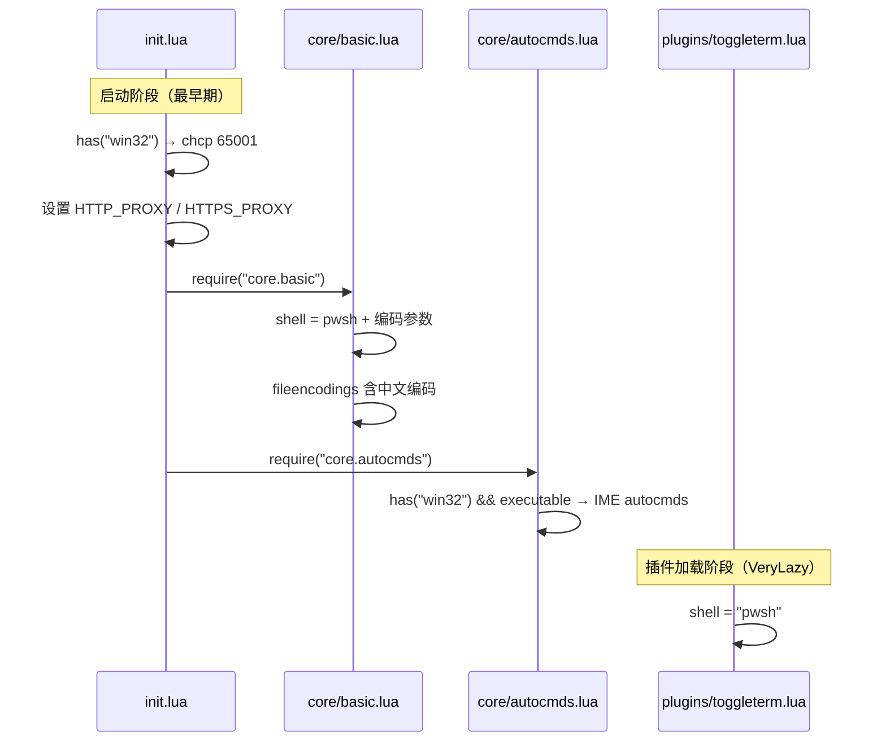

本页聚焦该 Neovim 配置中所有 **Windows 平台专属**的适配逻辑，涵盖三个核心领域：**PowerShell 7 Shell 集成**（含 UTF-8 编码页修复）、**HTTP/HTTPS 代理环境变量注入**、以及**基于 im-select 的中文输入法自动切换**。这些配置分散在 `init.lua`、`lua/core/basic.lua`、`lua/core/autocmds.lua` 和 `lua/plugins/toggleterm.lua` 中，通过条件判断确保仅在 Windows 环境下生效，对跨平台使用无侵入性。

## 整体架构：Windows 适配的加载顺序



加载顺序至关重要：`init.lua` 最先执行 `chcp 65001` 和代理注入，确保后续所有子进程（包括 lazy.nvim 的 git clone、Mason 的 LSP 下载等）都能正确使用 UTF-8 编码和代理网络。随后 `core/basic.lua` 设置 Shell 选项，`core/autocmds.lua` 注册 IME 自动命令，最终 ToggleTerm 插件在 VeryLazy 阶段继承全局 Shell 配置。

Sources: [init.lua](init.lua#L1-L23), [basic.lua](lua/core/basic.lua#L1-L62), [autocmds.lua](lua/core/autocmds.lua#L1-L25)

## UTF-8 代码页修复：chcp 65001

Windows 默认的控制台代码页通常是 936（GBK），这会导致 Neovim 内部启动的子进程输出中文乱码。配置在 `init.lua` 最顶部通过条件检测解决此问题：

```lua
-- 让子进程（如 lazygit）的错误信息以 UTF-8 输出，避免乱码
if vim.fn.has("win32") == 1 then
  vim.fn.system("chcp 65001")
end
```

**`chcp 65001`** 将当前控制台会话的代码页切换为 UTF-8（代码页 65001）。此命令在 Neovim 启动的最早期执行，确保后续所有通过 `:!`、`vim.fn.system()`、ToggleTerm 等方式创建的子进程都继承 UTF-8 编码环境。`vim.fn.has("win32")` 提供平台守卫，Linux/macOS 上此分支完全跳过，零开销。

**影响范围**：LazyGit 中文提交信息显示、Mason 插件安装日志、`:!` 命令输出、LSP 诊断信息中的中文路径等。

Sources: [init.lua](init.lua#L3-L6)

## PowerShell 7 Shell 集成

### 全局 Shell 选项配置

Neovim 的 `:!\` 命令、`system()` 函数、`makeprg` 等功能都依赖 `vim.o.shell` 系列选项。配置在 `lua/core/basic.lua` 中将默认 Shell 从 cmd.exe 替换为 **PowerShell 7（pwsh）**：

```lua
vim.o.shell = 'pwsh'
vim.o.shellcmdflag = '-NoLogo -NoProfile -ExecutionPolicy RemoteSigned -Command [Console]::InputEncoding=[Console]::OutputEncoding=[System.Text.Encoding]::UTF8;'
vim.o.shellredir = '2>&1 | Out-File -Encoding UTF8 %s; exit $LastExitCode'
vim.o.shellpipe = '2>&1 | Out-File -Encoding UTF8 %s; exit $LastExitCode'
vim.o.shellquote = ''
vim.o.shellxquote = ''
```

各选项的精确作用如下表所示：

| 选项 | 值 | 作用说明 |
|---|---|---|
| `shell` | `'pwsh'` | 指定 PowerShell 7（需独立安装，非 Windows PowerShell 5.1 的 `powershell.exe`） |
| `shellcmdflag` | `-NoLogo -NoProfile ...` | 控制调用参数：禁止启动 Logo、跳过用户 Profile 加载、设置 RemoteSigned 执行策略、**强制控制台输入输出编码为 UTF-8** |
| `shellredir` | `2>&1 \| Out-File ...` | 重定向 `:w !command` 等操作的输出，合并 stderr 到 stdout，UTF-8 编码写入，保留退出码 |
| `shellpipe` | `2>&1 \| Out-File ...` | 管道输出格式（用于 `:make` 等），逻辑与 `shellredir` 一致 |
| `shellquote` | `''` | 禁用 Shell 引用包裹，因为 pwsh 的参数传递方式与 bash 不同 |
| `shellxquote` | `''` | 禁用扩展引用，配合 `shellquote` 使用 |

**关键技术细节**：`shellcmdflag` 中嵌入的 `[Console]::InputEncoding=[Console]::OutputEncoding=[System.Text.Encoding]::UTF8` 是一条内联 PowerShell 语句，在每次 Shell 调用时强制将控制台编解码器设为 UTF-8。这是对 `chcp 65001` 的双重保障——即使代码页切换未完全生效，PowerShell 层面仍能正确处理 UTF-8 文本。

**前置条件**：需要安装 **PowerShell 7+**。可通过 `winget install Microsoft.PowerShell` 安装。`pwsh` 必须在系统 PATH 中可找到。

Sources: [basic.lua](lua/core/basic.lua#L29-L35)

### ToggleTerm 终端的 Shell 配置

ToggleTerm 浮动终端同样显式指定使用 PowerShell 7：

```lua
shell = 'pwsh', -- 使用 PowerShell 7
on_create = function (term)
   term.env = vim.tbl_extend('force', term.env or {},{
        TERM = 'xterm-256color',
    })
end
```

除了 `shell = 'pwsh'`，`on_create` 回调还注入了 `TERM=xterm-256color` 环境变量。这是因为 Neovim 的终端模拟器可能不会自动设置 `TERM`，导致某些 CLI 工具（如 `less`、`bat`、Git 日志等）无法正确渲染颜色。显式设置后，ToggleTerm 内运行的程序能正确识别终端能力。

Sources: [toggleterm.lua](lua/plugins/toggleterm.lua#L1-L18)

### 文件编码与中文兼容

在 Shell 配置之后，`basic.lua` 还设置了文件编码自动检测链：

```lua
vim.o.encoding = 'utf-8'
vim.o.fileencoding = 'utf-8'
vim.o.fileencodings = 'utf-8,gbk,gb18030,gb2312,latin1'
```

`fileencodings` 是 Neovim 打开文件时依次尝试的编码列表。优先尝试 UTF-8，然后依次尝试 GBK、GB18030、GB2312（覆盖简体中文文件），最后回退到 Latin-1。这确保了在 Windows 环境下打开旧版中文文档、日志文件时不会出现乱码。

Sources: [basic.lua](lua/core/basic.lua#L22-L27)

## HTTP/HTTPS 代理配置

在 `init.lua` 中，代理环境变量在所有模块加载之前注入：

```lua
vim.env.HTTP_PROXY = "http://127.0.0.1:7897"
vim.env.HTTPS_PROXY = "http://127.0.0.1:7897"
vim.env.NO_PROXY = "localhost,127.0.0.1"
```

**注意**：此代理配置**未做平台条件判断**，在所有操作系统上都会生效。这是因为代理需求在开发者网络环境中是普遍存在的，且 `127.0.0.1:7897` 在无代理服务运行时仅产生连接超时，不会导致 Neovim 本身崩溃。

| 环境变量 | 值 | 影响范围 |
|---|---|---|
| `HTTP_PROXY` | `http://127.0.0.1:7897` | git clone（lazy.nvim 插件安装）、Mason LSP 下载、HTTP 请求 |
| `HTTPS_PROXY` | `http://127.0.0.1:7897` | GitHub API 调用、HTTPS 源的插件安装 |
| `NO_PROXY` | `localhost,127.0.0.1` | 本地回环地址绕过代理，避免本地服务的请求被错误转发 |

**端口号 7897** 对应常见的代理客户端（如 Clash Verge、v2rayN 等）的默认混合端口。如果你的代理客户端使用不同端口，需要相应修改。如果不需要代理，直接删除或注释这三行即可。

Sources: [init.lua](init.lua#L8-L10)

## IME 输入法自动切换

### 设计原理

在中文 Windows 环境下开发时，输入法状态切换是一个常见痛点：进入插入模式需要中文输入，退出插入模式回到 Normal 模式后，若输入法仍为中文，所有 Vim 命令都会被拦截。配置通过 **im-select** 工具实现自动化：离开插入模式切到英文（布局代码 `1033`），进入插入模式切到中文（布局代码 `2052`）。

### 实现代码解析

```lua
local im_select_path = vim.fn.expand("~/Tools/im_select.exe")
im_select_path = im_select_path:gsub("\\", "/")

if vim.fn.has("win32") == 1 and vim.fn.executable(im_select_path) == 1 then
    local ime_autogroup = vim.api.nvim_create_augroup("ImeAutoGroup", { clear = true })

    vim.api.nvim_create_autocmd("InsertLeave", {
        group = ime_autogroup,
        callback = function()
            vim.cmd(":silent :!" .. im_select_path .. " 1033")
        end
    })

    vim.api.nvim_create_autocmd("InsertEnter", {
        group = ime_autogroup,
        callback = function()
            vim.cmd(":silent :!" .. im_select_path .. " 2052")
        end
    })
end
```

### 双重条件守卫

配置设置了两个前置条件，缺一不可：

1. **`vim.fn.has("win32") == 1`** — 仅 Windows 平台执行
2. **`vim.fn.executable(im_select_path) == 1`** — `im_select.exe` 文件存在且可执行

如果任一条件不满足（例如在 Linux 上、或未安装 im-select），整个 IME 自动切换功能静默跳过，不会报错或影响启动速度。

### 布局代码对照表

| 参数值 | 含义 | 触发时机 |
|---|---|---|
| `1033` | 英语（美国）键盘布局 | `InsertLeave` — 退出插入模式时 |
| `2052` | 简体中文（微软拼音） | `InsertEnter` — 进入插入模式时 |

### im-select 安装与路径配置

**im-select** 是一个跨平台的输入法命令行切换工具。在 Windows 上的安装步骤：

1. 从 [im-select releases](https://github.com/daipeihust/im-select) 下载 Windows 版本
2. 将 `im-select.exe` 放置到 `~/Tools/` 目录（即 `%USERPROFILE%\Tools\`）
3. 也可修改 `im_select_path` 变量指向实际路径

路径中的 `gsub("\\", "/")` 调用将 Windows 反斜杠转换为正斜杠，避免在 Lua 字符串拼接中产生转义问题。

### 工作流示意

```mermaid
stateDiagram-v2
    [*] --> NormalMode: Neovim 启动
    NormalMode --> InsertMode: i/a/o 等
    state InsertMode {
        note right of InsertMode: im_select 2052\n中文输入法激活
    end
    InsertMode --> NormalMode: Esc / Ctrl+[
    state NormalMode {
        note right of NormalMode: im_select 1033\n英文输入法激活\nVim 命令正常响应
    end
    NormalMode --> TerminalMode: ToggleTerm 打开
    TerminalMode --> NormalMode: Leader+Tab 退出
```

`:silent` 前缀确保 IME 切换命令不会在命令行区域显示输出，避免视觉干扰。`ImeAutoGroup` 使用 `{ clear = true }` 确保配置重载时旧的自动命令被清除，不会产生重复注册。

Sources: [autocmds.lua](lua/core/autocmds.lua#L1-L23)

## 配置清单与故障排除

### Windows 适配配置全景

| 配置项 | 文件位置 | 条件守卫 | 影响范围 |
|---|---|---|---|
| `chcp 65001` | `init.lua` | `has("win32")` | 所有子进程的编码 |
| Shell 选项 (`pwsh`) | `lua/core/basic.lua` | 无条件（全局） | `:!`、`system()`、`makeprg` |
| 文件编码检测链 | `lua/core/basic.lua` | 无条件（全局） | 文件打开时的编码自动检测 |
| 代理环境变量 | `init.lua` | 无条件（全局） | git、Mason、HTTP 请求 |
| IME 自动切换 | `lua/core/autocmds.lua` | `has("win32")` + `executable` | 插入模式进出的输入法 |
| ToggleTerm Shell | `lua/plugins/toggleterm.lua` | 无条件（插件配置） | 浮动终端内的 Shell |

### 常见故障排除

| 症状 | 可能原因 | 解决方案 |
|---|---|---|
| `:!` 命令中文乱码 | `chcp` 未生效或 pwsh 未安装 | 确认 `pwsh` 在 PATH 中；手动在终端执行 `chcp 65001` 验证 |
| ToggleTerm 内中文显示为方块 | 终端字体不支持 | 安装 Nerd Font（如 JetBrainsMono Nerd Font） |
| 插件安装超时 / 失败 | 代理端口不匹配或代理未启动 | 检查代理客户端端口是否为 `7897`；临时关闭可注释 `init.lua` 中代理行 |
| IME 不自动切换 | `im_select.exe` 路径错误 | 确认文件存在于 `~/Tools/im_select.exe`；或在 autocmds.lua 中修改路径 |
| Normal 模式下命令被输入法拦截 | IME 自动切换未生效 | 检查启动时是否输出 `hasIm_Select`；确认 im-select 可正常执行 |

## 相关页面

- [核心基础配置（编辑器行为、Shell、剪贴板与编码）](5-he-xin-ji-chu-pei-zhi-bian-ji-qi-xing-wei-shell-jian-tie-ban-yu-bian-ma) — Shell 选项的完整上下文和剪贴板配置
- [SSH 远程环境下的 OSC 52 剪贴板转发](33-ssh-yuan-cheng-huan-jing-xia-de-osc-52-jian-tie-ban-zhuan-fa) — 同样在 `basic.lua` 中，处理 SSH 环境下剪贴板跨平台转发
- [ToggleTerm 浮动终端](30-toggle-term-fu-dong-zhong-duan) — ToggleTerm 完整配置细节
- [nvim_edit.ps1 远程编辑脚本与 Neovim Server 模式](36-nvim_edit-ps1-yuan-cheng-bian-ji-jiao-ben-yu-neovim-server-mo-shi) — 另一个 Windows 专属的 PowerShell 脚本