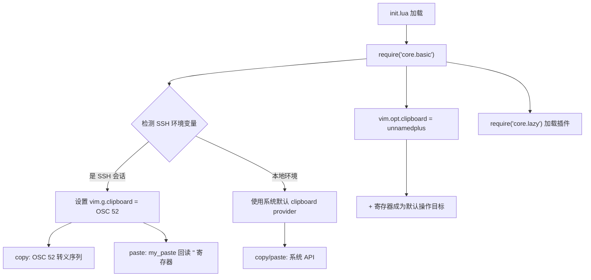

当你通过 SSH 连接到远程服务器并在其中运行 Neovim 时，一个看似简单却极其影响体验的问题会立刻浮现：**复制的内容无法到达本地剪贴板**。远程进程无法直接访问客户端操作系统的剪贴板 API，这使得 `yank` 操作的内容被困在远端。本配置通过 Neovim 内置的 **OSC 52 协议支持**，在 SSH 环境下自动切换剪贴板后端，将复制内容以终端转义序列的形式传回本地终端，实现跨机器的剪贴板互通。本文将深入解析该机制的实现原理、配置策略、paste 操作的工程折衷，以及终端兼容性要求。

Sources: [basic.lua](lua/core/basic.lua#L45-L61)

## 问题背景：SSH 下的剪贴板断层

在本地环境中，Neovim 通过 `vim.opt.clipboard` 选项将 `+` 和 `*` 寄存器映射到系统剪贴板服务（Windows 上的 `clip.exe` / `Get-Clipboard`，macOS 上的 `pbcopy` / `pbpaste`）。配置中通过 `vim.opt.clipboard:append("unnamedplus")` 使所有未指定寄存器的复制/粘贴操作默认使用 `+` 寄存器。

然而在 SSH 会话中，远程 Neovim 运行在一个没有图形界面、没有剪贴板守护进程的 headless 环境中。`+` 寄存器的底层提供者（clipboard provider）无法找到可用的剪贴板工具，导致复制操作静默失败——你按下 `yy` 复制一行，切换到本地浏览器想粘贴，却发现剪贴板是空的。这就是 OSC 52 协议要解决的问题。

Sources: [basic.lua](lua/core/basic.lua#L19-L20)

## OSC 52 协议原理

**OSC 52**（Operating System Command 52）是一种终端转义序列协议，属于 ANSI/VT100 控制序列的扩展族。其核心机制非常简洁：远程程序向终端的 stdout 写入一条特殊格式的转义序列，**本地终端模拟器**解析该序列后，将 payload 中的内容写入操作系统的剪贴板。

```mermaid
sequenceDiagram
    participant N as 远程 Neovim
    participant SSH as SSH 通道
    participant T as 本地终端模拟器
    participant OS as 操作系统剪贴板

    Note over N: 用户执行 yy (yank)
    N->>SSH: 发送 OSC 52 转义序列\n\x1b]52;c;{base64}\x07
    SSH->>T: 透传转义序列
    T->>T: 解析 OSC 52 序列
    T->>OS: 将解码内容写入剪贴板
    Note over OS: 内容现在可在本地粘贴
```

序列格式为 `\x1b]52;c;{base64_encoded_content}\x07`，其中 `c` 代表目标剪贴板选择区（`c` = system clipboard）。Base64 编码确保二进制内容和多行文本可以安全地在转义序列中传输。整个流程中，SSH 通道只负责透传字节流，它不需要理解 OSC 52 协议——这正是该方案零依赖、零配置即可工作的关键所在。

Sources: [basic.lua](lua/core/basic.lua#L45-L52)

## 自动检测与条件激活

本配置采用**环境变量嗅探**策略来自动判断当前是否处于 SSH 会话中，无需手动切换：

```lua
if vim.env.SSH_CLIENT ~= nil or vim.env.SSH_TTY ~= nil or vim.env.SSH_CONNECTION ~= nil then
  vim.g.clipboard = {
    name = 'OSC 52',
    copy = {
      ['+'] = require('vim.ui.clipboard.osc52').copy('+'),
      ['*'] = require('vim.ui.clipboard.osc52').copy('*'),
    },
    paste = {
      ["+"] = my_paste("+"),
      ["*"] = my_paste("*"),
    },
  }
end
```

三个环境变量的检测逻辑覆盖了绝大多数 SSH 场景，它们的含义如下：

| 环境变量 | 设置时机 | 典型值示例 |
|---|---|---|
| `SSH_CLIENT` | SSH 连接建立时由服务端 sshd 设置 | `192.168.1.100 52341 22`（客户端IP 客户端端口 服务端端口） |
| `SSH_TTY` | 当前会话拥有一个交互式伪终端时设置 | `/dev/pts/3` |
| `SSH_CONNECTION` | 更详细的连接四元组信息 | `192.168.1.100 52341 10.0.0.5 22` |

检测任意一个变量非空即判定为 SSH 环境。条件成立时，`vim.g.clipboard` 被重新赋值为一个自定义的 clipboard provider 表，覆盖系统默认的剪贴板后端。这个赋值发生在 `require("core.basic")` 阶段（即 `init.lua` 加载的第一时间），确保后续所有插件和操作都使用 OSC 52 作为剪贴板通道。

Sources: [basic.lua](lua/core/basic.lua#L47-L61), [init.lua](init.lua#L12)

## Copy 操作：OSC 52 的核心路径

在 `copy` 字段中，`+`（系统剪贴板）和 `*`（主选择区）两个寄存器都被配置为使用 `vim.ui.clipboard.osc52` 模块提供的 copy 函数。这是 Neovim 0.10+ 内置的 OSC 52 实现，它的工作方式是：当寄存器写入发生时，将内容进行 Base64 编码，然后通过 `io.stdout:write()` 向终端输出 OSC 52 转义序列。

在 `clipboard = unnamedplus` 的设定下，用户在 Normal 模式中执行的每一次 `y`、`yy`、`yiw` 等操作，都会隐式写入 `+` 寄存器，从而触发 OSC 52 序列的发送。这意味着**你不需要改变任何操作习惯**——普通的 yank 操作自动将内容同步到本地剪贴板。

Sources: [basic.lua](lua/core/basic.lua#L19-L20), [basic.lua](lua/core/basic.lua#L50-L52)

## Paste 操作：从寄存器回读的工程折衷

Paste 操作的实现是这个配置中最值得玩味的部分。注意看 `paste` 字段中，原生 OSC 52 paste 被注释掉了：

```lua
paste = {
  -- ['+'] = require('vim.ui.clipboard.osc52').paste('+'),
  -- ['*'] = require('vim.ui.clipboard.osc52').paste('*'),
  ["+"] = my_paste("+"),
  ["*"] = my_paste("*"),
},
```

取而代之的是一个自定义的 `my_paste` 函数。要理解这个设计选择，需要先理解 OSC 52 paste 的局限性：**OSC 52 协议本身并不提供从终端读取剪贴板内容的标准化机制**。虽然某些终端实现了"向终端请求剪贴板内容"的序列，但这严重依赖终端的配合，且存在安全问题（恶意程序可以读取你的剪贴板），因此支持度参差不齐。

`my_paste` 的实现逻辑是：**回退到 Neovim 自身的无名寄存器 `"`** 作为粘贴源：

```lua
function my_paste(reg)
    return function(lines)
        local content = vim.fn.getreg('"')
        return vim.split(content, '\n')
    end
end
```

这意味着 paste 操作的实际行为是：读取最后一次 yank 操作的内容（因为它存储在 `"` 寄存器中）并返回给 Neovim 的 paste 操作符。这构建了一个**单向同步 + 本地回环**的模型——copy 走 OSC 52 同步到本地 OS 剪贴板，paste 则回读 Neovim 内部最后一次 yank 的内容。

| 操作 | 路径 | 能力 |
|---|---|---|
| `y` / `yy` (Copy) | OSC 52 → 本地终端 → OS 剪贴板 | ✅ 远程内容同步到本地 |
| `p` (Paste from `+`) | 读取 `"` 寄存器（最近一次 yank） | ✅ 粘贴最近在 Neovim 中复制的内容 |
| 从本地 OS 剪贴板粘贴到远程 Neovim | ❌ 不支持 | 需通过 `<C-r>+` 或终端自身的粘贴快捷键 |

**从本地 OS 剪贴板粘贴内容到远程 Neovim** 的场景需要换一种方式：使用终端的粘贴功能（如 `Ctrl+Shift+V`）或 Neovim 命令行模式下的 `<C-r>+`（通过 SSH 通道的 bracketed paste 机制工作）。

Sources: [basic.lua](lua/core/basic.lua#L37-L43), [basic.lua](lua/core/basic.lua#L54-L59)

## 终端兼容性要求

OSC 52 的支持取决于你**本地运行的终端模拟器**（不是远程的），以下是主流终端的支持情况：

| 终端 | OSC 52 支持 | 最低版本要求 | 备注 |
|---|---|---|---|
| **Windows Terminal** | ✅ | 1.18+ | 需在设置中确认未禁用 |
| **iTerm2** | ✅ | 全版本 | 默认启用 |
| **kitty** | ✅ | 全版本 | 默认启用 |
| **WezTerm** | ✅ | 全版本 | 默认启用 |
| **Alacritty** | ✅ | 0.13+ | 需确认配置 |
| **GNOME Terminal** | ⚠️ | 有限支持 | 可能需要额外配置 |
| **PuTTY** | ❌ | — | 不支持 OSC 52 |
| **cmd.exe** | ❌ | — | 不支持任何 OSC 扩展 |

验证方法：在远程 Neovim 中执行 `:echo has('clipboard')`，如果返回 `1`，则 clipboard provider 已正确初始化。你也可以通过 `:=vim.g.clipboard` 查看当前活跃的剪贴板后端，在 SSH 环境下应显示 `name = 'OSC 52'`。

Sources: [basic.lua](lua/core/basic.lua#L45-L46)

## 加载时序与配置关系

本配置的加载顺序对剪贴板行为至关重要。`require("core.basic")` 在 `init.lua` 中是第一个被加载的核心模块，这意味着 OSC 52 clipboard provider 在所有插件初始化之前就已就位。整个配置链路如下：



`clipboard = unnamedplus` 的设置（第 20 行）在 SSH 检测（第 47 行）之前执行，但这不影响功能——`unnamedplus` 只是将默认操作从 `"` 寄存器重定向到 `+` 寄存器，而 `+` 寄存器的底层实现由 `vim.g.clipboard` 决定。两者协同工作：`unnamedplus` 决定"用哪个寄存器"，`vim.g.clipboard` 决定"那个寄存器的内容如何与外部交互"。

Sources: [basic.lua](lua/core/basic.lua#L19-L20), [basic.lua](lua/core/basic.lua#L47-L61), [init.lua](init.lua#L12-L15)

## 故障排除指南

| 症状 | 可能原因 | 解决方案 |
|---|---|---|
| Yank 后本地剪贴板为空 | 终端不支持 OSC 52 | 切换至支持的终端（见上方兼容性表） |
| Yank 后本地剪贴板为空 | SSH 环境变量未被设置（如通过 tmux attach） | 手动设置 `:let vim.g.clipboard` 或确认 `SSH_CLIENT` 存在 |
| Paste 内容不是预期的本地剪贴板内容 | 预期行为——paste 读取 `"` 寄存器 | 使用终端粘贴快捷键（`Ctrl+Shift+V`）或 `<C-r>+` |
| 部分内容（如大文件）复制后截断 | 终端对 OSC 52 payload 大小有限制 | 分段复制，或使用 `tmux` + `set -s set-clipboard on` 中转 |
| `:echo has('clipboard')` 返回 0 | clipboard provider 初始化失败 | 检查 `:=vim.g.clipboard` 确认配置是否生效 |
| 在 tmux 内 OSC 52 不工作 | tmux 默认不转发 OSC 52 | 在 `tmux.conf` 中添加 `set -s set-clipboard on` |

Sources: [basic.lua](lua/core/basic.lua#L47-L61)

## 延伸阅读

本页描述的 OSC 52 机制是 [Windows 专属配置](32-windows-zhuan-shu-pei-zhi-powershell-shell-dai-li-ime-zi-dong-qie-huan) 页面中 Windows 平台适配策略的组成部分。如果你对远程编辑的完整工作流感兴趣，[nvim_edit.ps1 远程编辑脚本与 Neovim Server 模式](36-nvim_edit-ps1-yuan-cheng-bian-ji-jiao-ben-yu-neovim-server-mo-shi) 展示了如何从本地 PowerShell 环境便捷地打开远程文件。关于核心基础配置中剪贴板和编码设置的全貌，参见[核心基础配置（编辑器行为、Shell、剪贴板与编码）](5-he-xin-ji-chu-pei-zhi-bian-ji-qi-xing-wei-shell-jian-tie-ban-yu-bian-ma)。