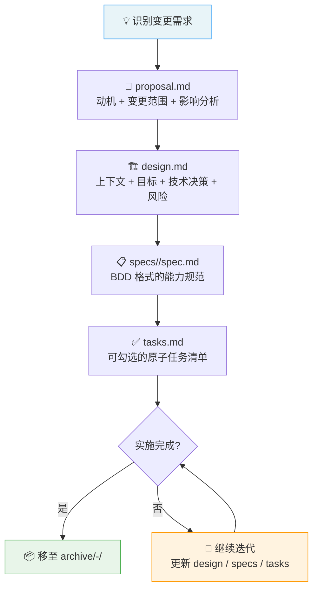

本项目采用 **OpenSpec** 作为规范驱动的配置变更管理方法论——在动手修改 Lua 配置文件之前，先以结构化文档明确"为什么要改、改什么、怎么改、如何验证"，使每一次功能性变更都具备完整的可追溯性。OpenSpec 的核心价值在于：将 Neovim 配置的演进从"改完再看"的试错模式，转变为"先想清楚再动手"的工程化流程。本页将系统阐述 OpenSpec 的目录结构、文档规范、变更生命周期，以及如何在日常开发中实际运用这一流程。

Sources: [openspec](openspec)

---

## 目录结构总览

OpenSpec 的物理载体是仓库根目录下的 `openspec/` 文件夹，内部分为两个一级子目录——`specs/` 和 `changes/`，前者存放**当前生效的能力规范（Capability Specs）**，后者管理**进行中或已归档的变更提案（Changes）**。

```
openspec/
├── specs/                          # 当前生效的能力规范（单一真相源）
│   ├── csharp-dap-core/spec.md     # DAP 框架 + netcoredbg 适配器注册
│   ├── csharp-dap-launch/spec.md   # .NET Console / ASP.NET launch 配置
│   ├── csharp-dap-ui/spec.md       # dap-ui 面板 + virtual-text + 快捷键作用域
│   └── csharp-lsp-config/spec.md   # Roslyn LSP 单一入口配置
├── changes/                        # 变更提案（活跃 + 归档）
│   ├── add-csharp-debug-plugin/    # 活跃：C# 调试插件集成
│   ├── dap-keybindings-and-features/  # 活跃：F 键 + 变量修改 + 热重载
│   ├── fix-roslyn-sln-reload/      # 活跃（早期）：仅 .openspec.yaml
│   └── archive/                    # 已完成归档
│       └── 2026-02-21-configure-csharp-lsp/
```

`specs/` 目录中的每个子目录代表一个**命名能力单元（Named Capability）**，文件名即能力名。这些规范描述的是"系统当前应该满足什么行为"，是配置代码的**合约层**。`changes/` 目录中的每个子目录代表一次**变更提案**，记录从动机到设计决策再到实施任务的完整过程。

Sources: [openspec](openspec)

---

## 能力规范（Capability Spec）格式

每个 `specs/<capability-name>/spec.md` 文件遵循 **BDD（Behavior-Driven Development）** 风格编写，以 `SHALL` / `WHEN` / `THEN` 三段式结构定义系统行为的合约。这种写法的核心优势在于：每条规范都是**可验证的**——`WHEN` 描述触发条件，`THEN` 描述期望结果，直接映射为手动或自动化的验证步骤。

规范文件的通用结构如下：

```markdown
### Requirement: <简明的能力要求描述>
系统 SHALL <强制性的行为约束>。

#### Scenario: <具体场景名称>
- **WHEN** <触发条件>
- **THEN** <期望的系统行为>
```

以 `csharp-dap-core` 为例，它定义了三条核心要求：DAP 框架插件声明、netcoredbg 自动安装、适配器注册。每条要求下挂载 2–3 个场景，覆盖正常路径和异常路径（如适配器未安装时的 WARN 提示）。

Sources: [csharp-dap-core/spec.md](openspec/specs/csharp-dap-core/spec.md#L1-L36), [csharp-dap-ui/spec.md](openspec/specs/csharp-dap-ui/spec.md#L1-L40), [csharp-dap-launch/spec.md](openspec/specs/csharp-dap-launch/spec.md#L1-L58)

### Spec 与代码的对应关系

能力规范不是孤立存在的——每条 `Requirement` 都与具体的 Lua 配置文件形成**双向追溯**关系。下表展示了当前 `specs/` 目录中各能力单元与其对应的实现文件：

| 能力规范 | 核心实现文件 | 管辖范围 |
|----------|-------------|---------|
| `csharp-lsp-config` | `lua/plugins/roslyn.lua` | Roslyn LSP 安装、单一配置入口、blink.cmp 集成、项目文件检测 |
| `csharp-dap-core` | `lua/plugins/dap-cs.lua` | nvim-dap 声明、netcoredbg 适配器注册、Mason 自动安装 |
| `csharp-dap-launch` | `lua/core/dap.lua` | launch.json 加载、Console/ASP.NET 配置、cs_solution 联动 |
| `csharp-dap-ui` | `lua/core/dap.lua` | dap-ui 自动开关、virtual-text、buffer 局部快捷键 |

当修改某个 Lua 文件的行为时，应同步审查对应的 spec 是否需要更新。若行为变更未被任何 spec 覆盖，则说明需要新建 change 提案来补充。

Sources: [csharp-lsp-config/spec.md](openspec/specs/csharp-lsp-config/spec.md#L1-L76), [csharp-dap-core/spec.md](openspec/specs/csharp-dap-core/spec.md#L1-L36), [csharp-dap-launch/spec.md](openspec/specs/csharp-dap-launch/spec.md#L1-L58), [csharp-dap-ui/spec.md](openspec/specs/csharp-dap-ui/spec.md#L1-L40)

---

## 变更提案（Change）的生命周期

一次完整的 OpenSpec 变更遵循从**提案 → 设计 → 规范编写 → 任务拆解 → 实施 → 归档**的六阶段生命周期。下图概括了整个流程及各阶段的产物：



每个变更提案对应 `changes/` 下的一个子目录，目录名使用 kebab-case 描述变更主题（如 `add-csharp-debug-plugin`、`dap-keybindings-and-features`）。目录内包含以下固定文件结构：

| 文件 | 必选 | 用途 |
|------|:----:|------|
| `.openspec.yaml` | ✅ | 元数据标记（`schema: spec-driven`、创建日期） |
| `proposal.md` | ✅ | 动机（Why）、变更内容（What Changes）、能力影响（Capabilities）、影响范围（Impact） |
| `design.md` | ✅ | 上下文、目标/非目标、技术决策记录（D1, D2, ...）、风险与权衡、迁移计划 |
| `specs/<name>/spec.md` | ✅ | 本次变更新增或修改的能力规范（BDD 格式） |
| `tasks.md` | ✅ | 可勾选的原子任务清单，按功能模块分组 |

Sources: [add-csharp-debug-plugin/.openspec.yaml](openspec/changes/add-csharp-debug-plugin/.openspec.yaml#L1-L3), [add-csharp-debug-plugin/proposal.md](openspec/changes/add-csharp-debug-plugin/proposal.md#L1-L35), [add-csharp-debug-plugin/design.md](openspec/changes/add-csharp-debug-plugin/design.md#L1-L151), [add-csharp-debug-plugin/tasks.md](openspec/changes/add-csharp-debug-plugin/tasks.md#L1-L59)

### 阶段一：提案（proposal.md）

提案文档回答三个根本问题：**为什么要改**（Why）、**改什么**（What Changes）、**影响多大**（Impact）。它是变更的"电梯演讲"——让任何阅读者在 3 分钟内理解变更的必要性和边界。

`proposal.md` 的关键段落包括：

- **Why**：描述当前痛点或缺失能力。例如 `add-csharp-debug-plugin` 的 Why 段明确指出"已有 Roslyn LSP 提供代码智能，但缺少调试能力，开发体验不完整"。
- **What Changes**：以条目列表列出具体的变更动作（新增/修改/删除哪些模块或插件）。
- **Capabilities**：声明本次变更**新增**（New Capabilities）和**修改**（Modified Capabilities）的能力单元名称。这些名称直接对应 `specs/` 或 change 内 `specs/` 下的子目录名。
- **Impact**：列出受影响的文件、依赖变化、外部工具要求，以及明确标注"不涉及"的范围。

Sources: [add-csharp-debug-plugin/proposal.md](openspec/changes/add-csharp-debug-plugin/proposal.md#L1-L35), [dap-keybindings-and-features/proposal.md](openspec/changes/dap-keybindings-and-features/proposal.md#L1-L30)

### 阶段二：设计（design.md）

设计文档是整个 OpenSpec 流程中**信息密度最高**的文件。它不只记录"怎么做"，更重要的是记录"为什么这样做"以及"为什么不那样做"。每条技术决策以 **D1, D2, D3...** 编号，格式统一为：选择 → 理由 → 放弃的方案。

以 `add-csharp-debug-plugin` 的设计文档为例，它包含 6 条决策：

| 决策编号 | 主题 | 核心选择 |
|---------|------|---------|
| D1 | DAP 配置文件组织 | 集中到 `dap-cs.lua`，与 `roslyn.lua` 解耦 |
| D2 | 调试快捷键挂载方式 | `LspAttach` autocmd + `client.name` 过滤，不修改 roslyn.lua |
| D3 | netcoredbg 安装管理 | mason-nvim-dap.nvim 的 `ensure_installed`，动态解析路径 |
| D4 | launch.json 支持 | 优先加载项目级 `.vscode/launch.json`，`load_launchjs` 过滤 coreclr type |
| D5 | 非标准输出目录处理 | 在项目的 launch.json 中手动添加 coreclr 条目 |
| D6 | 无 launch.json 时的兜底 | 保留内置 glob + input 配置 |

每条决策的"放弃的方案"段落尤其重要——它防止团队在 future iteration 中重新踩坑。例如 D1 明确记录了"在 roslyn.lua 中内联 DAP 配置 → 造成两种关注点混合"这一被否决的方案。

设计文档还包含 **Goals / Non-Goals** 段落划定变更边界，**Risks / Trade-offs** 表格评估风险与缓解措施，以及 **Migration Plan** 描述实施步骤和回滚策略。

Sources: [add-csharp-debug-plugin/design.md](openspec/changes/add-csharp-debug-plugin/design.md#L1-L151), [dap-keybindings-and-features/design.md](openspec/changes/dap-keybindings-and-features/design.md#L1-L108)

### 阶段三：规范编写（specs/）

变更提案内的 `specs/` 子目录存放本次变更**新增或修改**的能力规范。这些规范与顶层 `openspec/specs/` 使用完全相同的 BDD 格式，但以 `## ADDED Requirements` 或 `## MODIFIED Requirements` 标记变更类型。

一个关键的设计模式是：**change 内的 specs 是变更级别的增量，顶层 specs 是合并后的全量**。当变更完成并归档后，change 内的 spec 内容应被合并（或替换）到顶层 `openspec/specs/` 中，形成新的"当前生效版本"。例如 `add-csharp-debug-plugin/specs/` 下的三个能力单元（`csharp-dap-core`、`csharp-dap-launch`、`csharp-dap-ui`），在变更完成后其内容已与顶层 `openspec/specs/` 中的对应文件保持一致。

规范中还有一种特殊标记——**已移除的能力**。`dap-set-next-statement/spec.md` 的全部内容仅为一行 HTML 注释，说明 netcoredbg 不支持 DAP `supportsGotoTargetsRequest`，该能力已被确认不可行并从方案中移除。这种"留下痕迹"的做法避免了日后重复调研已否决的方案。

Sources: [dap-keybindings-and-features/specs/dap-set-next-statement/spec.md](openspec/changes/dap-keybindings-and-features/specs/dap-set-next-statement/spec.md#L1-L2), [add-csharp-debug-plugin/specs/csharp-dap-core/spec.md](openspec/changes/add-csharp-debug-plugin/specs/csharp-dap-core/spec.md#L1-L31)

### 阶段四：任务拆解（tasks.md）

`tasks.md` 将设计决策转化为**可勾选的原子任务清单**。任务按功能模块分组（用 `## 1. 模块名` 标记），每个子任务以 `- [x]` 或 `- [ ]` 标记完成状态。

任务粒度的控制原则是：**每个子任务对应一次有意义的 `git diff`**。以 `add-csharp-debug-plugin/tasks.md` 为例，"插件声明"模块下拆分为 4 个子任务（dap-cs.lua 骨架、mason-nvim-dap 声明、dap-ui 声明、virtual-text 声明），每个任务对应一个 lazy.nvim 插件条目的声明——可以独立编写、独立验证。

任务清单中还有一个值得注意的模式：**验证类任务**通常标记为未完成（`- [ ]`），因为它们需要在真实环境中手动执行。例如 `tasks.md` 末尾的 7.1–7.5 是一整套调试流程的端到端验证步骤，覆盖 Console App 断点、单步、virtual text、ASP.NET 环境变量等场景——这些步骤直接对应 spec 中的 WHEN/THEN 场景。

Sources: [add-csharp-debug-plugin/tasks.md](openspec/changes/add-csharp-debug-plugin/tasks.md#L1-L59), [dap-keybindings-and-features/tasks.md](openspec/changes/dap-keybindings-and-features/tasks.md#L1-L30)

### 阶段五：归档（archive）

变更完成（所有 `[x]` 已勾选或剩余项仅为手动验证）后，整个变更目录移至 `changes/archive/`，并以**完成日期 + 变更名**重命名（如 `2026-02-21-configure-csharp-lsp`）。归档目录保留完整的五件套文件，不做任何删减——它们是项目演进的**历史记录**。

当前已归档的变更 `configure-csharp-lsp` 是一个典型示例：它清理了旧的 OmniSharp 多入口冲突，建立了 Roslyn LSP 的单一配置入口。其 `tasks.md` 中的 22 个子任务全部标记为 `[x]`，表明实施已完成。

Sources: [archive/2026-02-21-configure-csharp-lsp/](openspec/changes/archive/2026-02-21-configure-csharp-lsp), [archive/2026-02-21-configure-csharp-lsp/tasks.md](openspec/changes/archive/2026-02-21-configure-csharp-lsp/tasks.md#L1-L22)

---

## 早期阶段的 Change：fix-roslyn-sln-reload

并非所有 change 都会走完全部六阶段。`fix-roslyn-sln-reload` 目前仅包含 `.openspec.yaml` 元数据文件，尚未编写 proposal、design、specs 和 tasks。这种"先占位、后填充"的模式在 OpenSpec 流程中是正常的——当开发者识别到一个变更需求但尚未开始深入分析时，可以先创建目录和元数据，标记创建日期，待后续有完整时间再逐步完善。

该变更的实际设计内容目前记录在 `docs/fix-roslyn-sln-reload.md` 中，采用了更轻量的"接口契约"格式（快捷键表 + 受影响文件表 + 边界情况），属于正式 OpenSpec 流程前的**快速设计备忘录**。

Sources: [fix-roslyn-sln-reload/.openspec.yaml](openspec/changes/fix-roslyn-sln-reload/.openspec.yaml#L1-L3), [docs/fix-roslyn-sln-reload.md](docs/fix-roslyn-sln-reload.md#L1-L53)

---

## 实战指南：发起一次新变更

当需要对本 Neovim 配置进行功能性修改时，按以下步骤使用 OpenSpec 流程：

**第一步：创建变更目录和元数据**

```
openspec/changes/<your-change-name>/
└── .openspec.yaml        # schema: spec-driven, created: <today>
```

**第二步：编写 proposal.md**。回答 Why / What Changes / Capabilities / Impact 四个问题。Capbilities 段落中的能力名称将决定后续 `specs/` 子目录的组织方式。

**第三步：编写 design.md**。从 Context 段开始，梳理当前系统的约束和前提。然后明确 Goals 和 Non-Goals——Non-Goals 尤其重要，它防止变更范围蔓延。每条技术决策以 D1, D2, D3 编号，必须包含"选择"、"理由"、"放弃的方案"三部分。

**第四步：编写 specs**。在变更目录的 `specs/` 下为每个新增或修改的能力创建 `spec.md`，使用 `### Requirement` + `#### Scenario` + `WHEN/THEN` 格式。如果某个能力在调研后被确认不可行，保留文件但以 HTML 注释说明原因（参照 `dap-set-next-statement` 的做法）。

**第五步：拆解 tasks.md**。按模块分组，每个子任务对应一次可独立验证的代码变更。验证类任务（需要在真实 Neovim 环境中手动执行）与编码类任务分开列出。

**第六步：实施并归档**。逐一勾选任务，全部完成后将目录移至 `changes/archive/<date>-<name>/`，同时将 spec 内容同步到顶层 `openspec/specs/`。

Sources: [add-csharp-debug-plugin/.openspec.yaml](openspec/changes/add-csharp-debug-plugin/.openspec.yaml#L1-L3), [add-csharp-debug-plugin/proposal.md](openspec/changes/add-csharp-debug-plugin/proposal.md#L1-L35)

---

## 设计决策记录的横向关联

OpenSpec 的一个隐性价值在于**跨变更的决策追溯**。当多个变更涉及同一模块时，设计文档中的决策编号构成了一条连贯的推理链。以 `lua/core/dap.lua` 为例：

| 变更 | 决策 | 对 dap.lua 的影响 |
|------|------|-------------------|
| `add-csharp-debug-plugin` | D2: 通过 `LspAttach` autocmd 挂载快捷键 | 建立了"buffer 局部快捷键 + roslyn 过滤"的基础模式 |
| `dap-keybindings-and-features` | D1: F 键与 `<leader>d` 双轨并存 | 在同一 `LspAttach` 回调中追加 F 键绑定，不破坏已有模式 |
| `dap-keybindings-and-features` | D3: dotnet watch + attach 热重载 | 在 dap.lua 中新增 `hot_reload()` 函数和 attach 配置 |

这种链式决策记录使得后续变更的作者能够快速理解"为什么当前代码是这种结构"，避免无意中推翻前人的设计考量。

Sources: [add-csharp-debug-plugin/design.md](openspec/changes/add-csharp-debug-plugin/design.md#L40-L61), [dap-keybindings-and-features/design.md](openspec/changes/dap-keybindings-and-features/design.md#L29-L47)

---

## 延伸阅读

- [整体架构与模块加载流程](4-zheng-ti-jia-gou-yu-mo-kuai-jia-zai-liu-cheng) — 理解 OpenSpec 管理的配置在 Neovim 启动链中的加载位置
- [C# DAP 调试器：从适配器注册到启动配置](8-c-dap-diao-shi-qi-cong-gua-pei-qi-zhu-ce-dao-qi-dong-pei-zhi) — `add-csharp-debug-plugin` 变更的最终实现细节
- [DAP 调试操作：断点、单步、变量修改与热重载](11-dap-diao-shi-cao-zuo-duan-dian-dan-bu-bian-liang-xiu-gai-yu-re-zhong-zai) — `dap-keybindings-and-features` 变更的用户操作文档
- [Roslyn LSP 集成与解决方案管理](7-roslyn-lsp-ji-cheng-yu-jie-jue-fang-an-guan-li) — `configure-csharp-lsp` 归档变更的实施结果
- [插件管理策略：lazy.nvim 与按文件组织模式](6-cha-jian-guan-li-ce-lue-lazy-nvim-yu-an-wen-jian-zu-zhi-mo-shi) — 理解 OpenSpec 管理的插件文件组织约定