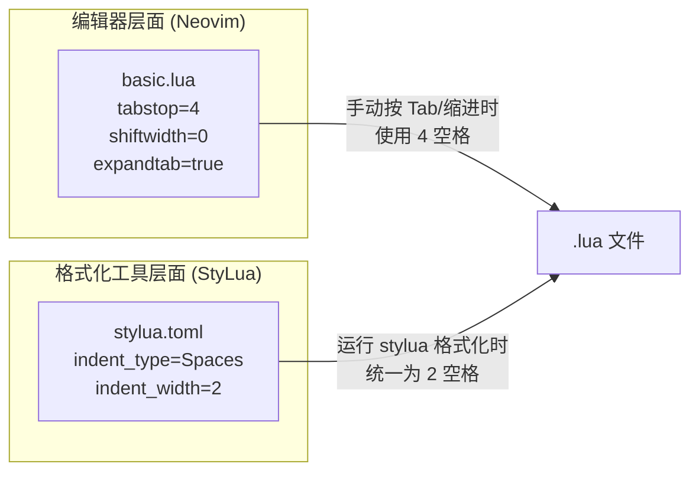
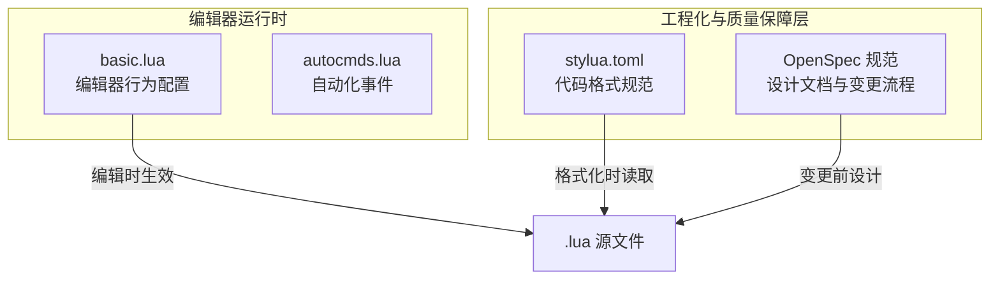

**StyLua** 是专为 Lua 代码设计的确定性格式化工具（opinionated formatter），本仓库通过根目录的 [stylua.toml](stylua.toml) 统一管理所有 `.lua` 文件的格式化规则。本文档解析该配置文件的三项核心参数、项目中的实际使用模式，以及 StyLua 与 Neovim 编辑器缩进设置之间的关系与差异。

Sources: [stylua.toml](stylua.toml#L1-L3)

## 配置文件解析

整个格式化配置仅由三行 TOML 构成，却精确控制了代码的视觉结构：

```toml
indent_type = "Spaces"    -- 缩进字符类型：空格
indent_width = 2          -- 每级缩进宽度：2 个空格
column_width = 120        -- 最大行宽：120 字符
```

三项参数的作用域与默认值对比：

| 参数 | 当前值 | StyLua 默认值 | 作用说明 |
|---|---|---|---|
| `indent_type` | `"Spaces"` | `"Tabs"` | 强制使用空格而非 Tab 字符进行缩进，确保不同编辑器下显示一致 |
| `indent_width` | `2` | `4` | 每级缩进占用 2 个空格，是 Lua 社区（特别是 Neovim 配置生态）的主流风格 |
| `column_width` | `120` | `120` | 当单行超过此宽度时，StyLua 会将长表达式拆分为多行 |

**设计意图**：这套配置采用 **2 空格缩进 + 120 字符行宽** 的组合，与 Neovim 插件生态（LazyVim、AstroNvim 等）的代码风格高度一致。120 字符行宽同时与本项目中 Neovim 编辑器设置的 `colorcolumn = "120"` 视觉参考线完美对齐——当代码触碰该参考线时，正是 StyLua 可能执行折行的阈值。

Sources: [stylua.toml](stylua.toml#L1-L3), [basic.lua](lua/core/basic.lua#L5-L6)

## StyLua 与 Neovim 编辑器缩进设置的关系

本项目中存在两组独立的缩进配置，作用于不同场景：



**关键差异**：[basic.lua](lua/core/basic.lua#L7-L9) 中 `tabstop = 4` 和 `shiftwidth = 0`（`0` 表示跟随 `tabstop`）控制的是 **在 Neovim 中手动编辑时的缩进行为**，即按下 `Tab` 键或使用 `>>` / `<<` 操作符时插入 4 个空格。而 [stylua.toml](stylua.toml#L1-L3) 的 `indent_width = 2` 控制的是 **StyLua 格式化工具输出时的缩进宽度**。

这意味着在手动编辑阶段，你可能以 4 空格缩进书写代码；一旦运行 StyLua 格式化，所有 `.lua` 文件会被统一规范化为 2 空格缩进。**格式化工具的规则优先**——最终代码库中的缩进风格由 StyLua 决定。

Sources: [basic.lua](lua/core/basic.lua#L7-L9), [stylua.toml](stylua.toml#L1-L2)

## stylua: ignore 行级豁免指令

StyLua 支持通过注释指令 `-- stylua: ignore` 对特定代码行跳过格式化。本项目中使用了这一机制来保护需要保持特定排列格式的代码结构。

### 使用场景：Dashboard 快捷键表

在 [snacks.lua](lua/plugins/snacks.lua#L17-L30) 中，Dashboard 的快捷键定义被 `stylua: ignore` 保护：

```lua
-- stylua: ignore
---@type snacks.dashboard.Item[]
keys = {
  { icon = " ", key = "f", desc = "Find File", action = ":lua Snacks.dashboard.pick('files')" },
  { icon = " ", key = "n", desc = "New File", action = ":ene | startinsert" },
  { icon = " ", key = "p", desc = "Projects", action = ":lua Snacks.picker.projects()" },
  -- ...更多条目
},
```

此处豁免的原因是：每个快捷键条目采用 **单行结构** 保持表项的可读性，一旦 StyLua 对这些长行执行基于 `column_width = 120` 的折行，会将每个 `{ ... }` 条目拆散为多行，破坏表格式排列的可读性。

### ignore 指令的工作原理

| 指令位置 | 作用范围 | 示例 |
|---|---|---|
| 独占一行的 `-- stylua: ignore` | 仅作用于**下一行**代码 | snacks.lua 中的 keys 表定义 |
| 行内 `-- stylua: ignore` | 仅作用于**当前行** | 单行长函数调用 |

**判断何时需要 ignore**：当代码的视觉排列本身构成一种"文档化"表达（如配置表、键映射列表），且自动折行会降低可读性时，应考虑添加 `-- stylua: ignore`。

Sources: [snacks.lua](lua/plugins/snacks.lua#L17-L30)

## StyLua 的安装与运行

### 安装方式

StyLua 可通过多种途径安装，在 Neovim 生态中最常见的是通过 **Mason** 包管理器。本项目的示例配置 [example.lua](lua/plugins/example.lua#L189-L194) 中包含 Mason 安装清单的参考：

```lua
{
  "williamboman/mason.nvim",
  opts = {
    ensure_installed = {
      "stylua",    -- StyLua 格式化工具
      -- ...其他工具
    },
  },
}
```

> **注意**：以上代码位于 `example.lua` 中——该文件首行有 `if true then return {} end` 保护，实际不会被加载。这意味着 StyLua 的安装方式取决于开发者的个人偏好，可从以下方式中选择：

| 安装方式 | 命令 | 适用场景 |
|---|---|---|
| Mason（Neovim 内） | `:MasonInstall stylua` | 所有格式化工具由 Mason 统一管理 |
| cargo（Rust 包管理器） | `cargo install stylua` | 系统级安装，适用于 CI/CD |
| winget（Windows） | `winget install JohnnyMorganz.StyLua` | Windows 系统级安装 |
| scoop | `scoop install stylua` | Windows Scoop 用户 |

### 运行方式

```bash
# 格式化单个文件
stylua init.lua

# 格式化整个项目
stylua lua/

# 检查模式（不修改文件，仅报告不符合规范的文件）
stylua --check lua/

# 验证当前配置是否生效
stylua --help
```

StyLua 会自动从当前目录向上查找 `stylua.toml` 配置文件，因此只需将其置于项目根目录即可生效。

Sources: [example.lua](lua/plugins/example.lua#L189-L194)

## 配置设计的架构位置

StyLua 配置在本项目工程化体系中扮演"代码风格守门人"的角色：



[stylua.toml](stylua.toml) 作为项目根目录的独立配置文件，与 Neovim 的 Lua 配置解耦——它不依赖任何 Neovim 插件，可以被 CI/CD 流水线、Git pre-commit hook 或命令行直接调用。这种设计确保了**格式化标准在不同执行环境下的一致性**。

Sources: [stylua.toml](stylua.toml#L1-L3)

## 延伸阅读

- 了解本项目的整体模块加载流程：[整体架构与模块加载流程](4-zheng-ti-jia-gou-yu-mo-kuai-jia-zai-liu-cheng)
- 了解 Neovim 编辑器缩进等基础设置：[核心基础配置（编辑器行为、Shell、剪贴板与编码）](5-he-xin-ji-chu-pei-zhi-bian-ji-qi-xing-wei-shell-jian-tie-ban-yu-bian-ma)
- 了解插件管理与 Mason 工具安装策略：[插件管理策略：lazy.nvim 与按文件组织模式](6-cha-jian-guan-li-ce-lue-lazy-nvim-yu-an-wen-jian-zu-zhi-mo-shi)
- 了解工程化变更管理流程：[OpenSpec 规范驱动的设计文档与变更流程](34-openspec-gui-fan-qu-dong-de-she-ji-wen-dang-yu-bian-geng-liu-cheng)