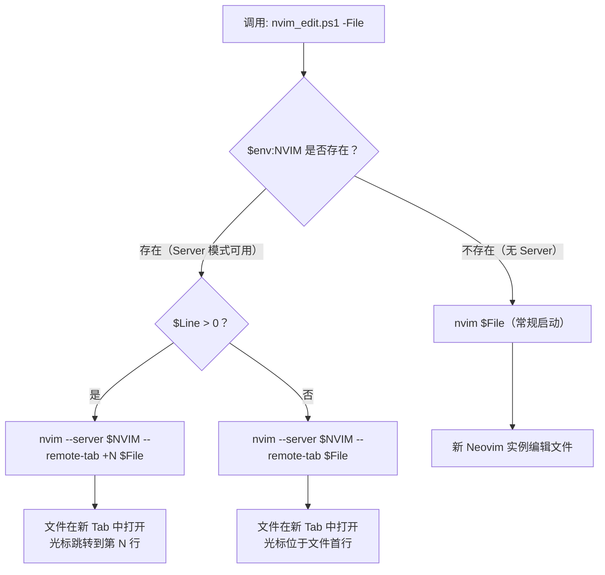

本文档解析项目中唯一的 PowerShell 脚本 `nvim_edit.ps1`——一个轻量级的 **远程编辑桥接工具**。它利用 Neovim 内置的 Server 模式，将外部来源的文件打开请求（如 Windows 资源管理器右键菜单、终端命令行、CI 日志中的文件路径）统一路由到已运行的 Neovim 实例中，避免多窗口碎片化。适合在 Windows 环境下频繁在 Neovim 与其他工具之间切换的开发者使用。

Sources: [nvim_edit.ps1](nvim_edit.ps1#L1-L12)

## 设计动机与核心问题

在日常开发中，开发者经常遇到以下场景：Neovim 已经在一个终端窗口中运行着完整的项目上下文（LSP 已加载、文件树已展开、终端会话已就绪），但此时需要从**外部来源**编辑某个文件——可能是 Windows 资源管理器中双击一个 `.lua` 文件，可能是从另一终端窗口的 `grep` 输出中定位到某行代码，也可能是从 IDE 的错误日志中点击文件路径。如果每次都启动一个新的 Neovim 实例，不仅启动缓慢、资源浪费，更关键的是丢失了已有实例中的上下文（断点状态、undo 历史、窗口布局）。

Neovim 原生提供了 **Server 模式** 来解决这个问题：当 Neovim 以 GUI 或终端方式启动时，它会自动在 `NVIM` 环境变量中注册一个套接字地址。外部进程可以通过 `nvim --server $NVIM --remote-tab <file>` 将文件发送到已运行的实例中。`nvim_edit.ps1` 将这一机制封装为一个可复用的 PowerShell 函数，提供两个参数：文件路径（必填）和行号（可选），并自动检测是否存在可用的 Neovim Server。

Sources: [nvim_edit.ps1](nvim_edit.ps1#L1-L11)

## 脚本逻辑详解

### 完整源码

```powershell
param([string]$File, [int]$Line = 0)
$socket = $env:NVIM
if ($socket) {
    if ($Line -gt 0) {
        & nvim --server $socket --remote-tab "+$Line" $File
    } else {
        & nvim --server $socket --remote-tab $File
    }
} else {
    & nvim $File
}
```

Sources: [nvim_edit.ps1](nvim_edit.ps1#L1-L12)

### 执行流程

脚本的执行逻辑可以用以下流程图清晰表达：



Sources: [nvim_edit.ps1](nvim_edit.ps1#L1-L12)

### 参数说明

| 参数 | 类型 | 必填 | 默认值 | 说明 |
|------|------|------|--------|------|
| `$File` | `string` | ✅ | — | 要编辑的文件路径，支持相对路径和绝对路径 |
| `$Line` | `int` | ❌ | `0` | 光标跳转的目标行号；`0` 或未指定表示不跳转 |

Sources: [nvim_edit.ps1](nvim_edit.ps1#L1-L2)

### 关键技术细节

**`$env:NVIM` 环境变量的生命周期**：这个变量由 Neovim 自身在启动时自动设置到其子进程环境中。它包含一个命名管道地址（Windows 上形如 `\\.\pipe\nvim-XXXX`），是 `--server` 通信的端点。需要注意的是，这个变量**仅存在于 Neovim 的子进程树中**——在 Neovim 内部通过 `:!nvim_edit.ps1` 或 ToggleTerm 终端调用时可以读取到它，但在独立的 PowerShell 窗口中则无法访问，除非手动导出。

**`--remote-tab` 的行为**：该参数指示 Neovim Server 在已有实例中新建一个 Tab 页并打开目标文件。如果文件已经在某个 Tab 中打开，Neovim 不会重复创建，而是切换到已有的 Tab。这与 `--remote`（在当前窗口打开）和 `--remote-wait`（打开并等待关闭）形成了互补的选择空间。

**`"+$Line"` 的 Vim 语法**：这是 Vim/Neovim 的命令行惯例——以 `+` 开头的参数在文件打开后作为 Ex 命令执行。当 `$Line` 为 `42` 时，等价于打开文件后执行 `:42`，即跳转到第 42 行。这在从外部工具（如编译器错误输出、`grep -n` 结果）中跳转到特定行时非常实用。

Sources: [nvim_edit.ps1](nvim_edit.ps1#L3-L8)

## 典型使用场景

### 场景一：Windows 资源管理器右键菜单集成

将 `nvim_edit.ps1` 注册为特定文件类型的右键菜单项（通过注册表或 `OpenWith` 设置），可以在不离开资源管理器的情况下将文件发送到正在运行的 Neovim 实例。前提是需要在 Neovim 的启动环境（如 Windows Terminal 的配置文件）中将 `NVIM` 环境变量暴露到系统级别。

### 场景二：Neovim 内部终端调用

在本项目的 [ToggleTerm 浮动终端](30-toggleterm-fu-dong-zhong-duan) 中，`$env:NVIM` 已经在进程环境中可用。此时在终端内执行：

```powershell
# 从 grep 结果直接跳转
nvim_edit.ps1 -File lua\core\keymap.lua -Line 44
```

这会在当前 Neovim 实例的新 Tab 中打开 `keymap.lua` 并将光标定位到第 44 行。

### 场景三：SSH 远程环境的桥接

结合 [SSH 远程环境下的 OSC 52 剪贴板转发](33-ssh-yuan-cheng-huan-jing-xia-de-osc-52-jian-tie-ban-zhuan-fa) 的配置，在 SSH 会话中 Neovim 同样会设置 `$NVIM` 环境变量。此时脚本可以用于从远程 Shell 中向远端 Neovim 实例发送文件——虽然对于纯 SSH 场景，直接在远端 Shell 中运行 `nvim_edit.ps1` 更为常见。

Sources: [nvim_edit.ps1](nvim_edit.ps1#L1-L11), [basic.lua](lua/core/basic.lua#L47-L61), [toggleterm.lua](lua/plugins/toggleterm.lua#L1-L19)

## Neovim Server 模式机制解析

### Server 模式的启停

Neovim 的 Server 模式**无需显式启用**——每个 Neovim 实例在启动时都会自动创建一个 RPC 套接字。可以通过以下方式验证：

```vim
:echo $NVIM
" 输出类似: \\.\pipe\nvim-12345.0
```

如果需要启动一个**命名 Server**（例如供脚本固定引用），可以在启动时指定地址：

```powershell
nvim --listen \\.\pipe\my-nvim-server
# 后续通过 --server \\.\pipe\my-nvim-server 连接
```

### Server 模式可用的命令族

| 命令 | 功能 | 典型用途 |
|------|------|----------|
| `--remote-tab <file>` | 在新 Tab 打开文件 | 编辑新文件（本脚本使用） |
| `--remote <file>` | 在当前窗口打开文件 | 替换当前 buffer |
| `--remote-wait <file>` | 打开文件并等待其被关闭 | 脚本需要同步等待的场景 |
| `--remote-expr <expr>` | 在 Server 中执行表达式并返回结果 | 查询 Neovim 状态 |
| `--remote-send <keys>` | 向 Server 发送按键序列 | 自动化操作 |

本脚本选择的 `--remote-tab` 是最适合"外部打开文件"场景的命令，因为它不干扰当前 Tab 的编辑状态，始终以新 Tab 承载新文件。

Sources: [nvim_edit.ps1](nvim_edit.ps1#L3-L8)

## 与项目其他配置的关联

`nvim_edit.ps1` 是一个**独立脚本**，不依赖任何 Lua 配置或插件。但它与项目中多处配置形成了协同关系：

| 关联配置 | 协同方式 | 相关文档 |
|----------|----------|----------|
| ToggleTerm 终端 | 提供 `$env:NVIM` 可用的 Shell 环境 | [ToggleTerm 浮动终端](30-toggleterm-fu-dong-zhong-duan) |
| SSH OSC 52 剪贴板 | 确保 SSH 环境下的 Neovim 实例也能被 Server 模式连接 | [SSH 远程环境下的 OSC 52 剪贴板转发](33-ssh-yuan-cheng-huan-jing-xia-de-osc-52-jian-tie-ban-zhuan-fa) |
| PowerShell Shell 配置 | 确保脚本在 `pwsh` 环境中正常运行 | [Windows 专属配置](32-windows-zhuan-shu-pei-zhi-powershell-shell-dai-li-ime-zi-dong-qie-huan) |
| Tab 快捷键 | Server 模式以 Tab 方式打开文件，可配合 `<leader><tab>` 系列快捷键管理 | [快捷键体系速览](3-kuai-jie-jian-ti-xi-su-lan-leader-jian-yu-he-xin-cao-zuo) |

Sources: [basic.lua](lua/core/basic.lua#L29-L35), [toggleterm.lua](lua/plugins/toggleterm.lua#L8-L10), [keymap.lua](lua/core/keymap.lua#L61-L67)

## 扩展与改进方向

当前脚本以"最小可用"原则实现，以下是一些可能的扩展方向：

1. **列号支持**：添加 `$Column` 参数，将 `"+$Line"` 扩展为 `"+call cursor($Line,$Column)"`，实现精确到列的定位
2. **文件存在性检查**：在调用 `nvim --server` 前验证文件路径，提供更友好的错误提示
3. **Server 存活检测**：通过 `nvim --server $socket --remote-expr "1"` 验证 Server 是否仍在运行，避免向已关闭的管道发送请求
4. **系统级环境变量导出**：通过 Windows 注册表将 `NVIM` 写入用户级环境变量，使脚本在任意 PowerShell 窗口中可用

Sources: [nvim_edit.ps1](nvim_edit.ps1#L1-L12)

## 延伸阅读

- [快捷键体系速览（Leader 键与核心操作）](3-kuai-jie-jian-ti-xi-su-lan-leader-jian-yu-he-xin-cao-zuo) — Tab 管理快捷键与 Server 模式打开的文件配合使用
- [ToggleTerm 浮动终端](30-toggleterm-fu-dong-zhong-duan) — 脚本最常被调用的终端环境
- [Windows 专属配置：PowerShell Shell、代理、IME 自动切换](32-windows-zhuan-shu-pei-zhi-powershell-shell-dai-li-ime-zi-dong-qie-huan) — PowerShell 集成与 Windows 平台适配
- [SSH 远程环境下的 OSC 52 剪贴板转发](33-ssh-yuan-cheng-huan-jing-xia-de-osc-52-jian-tie-ban-zhuan-fa) — 远程 Neovim 实例的环境配置