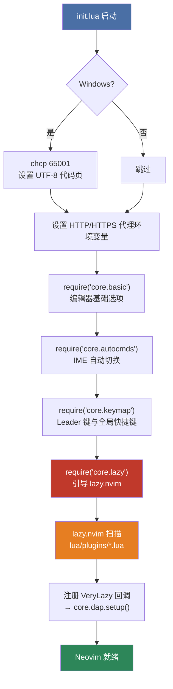
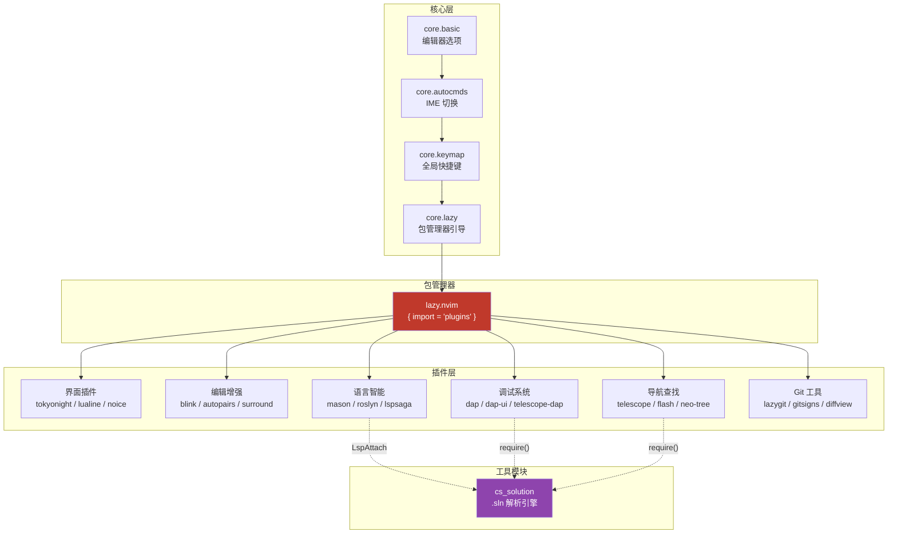
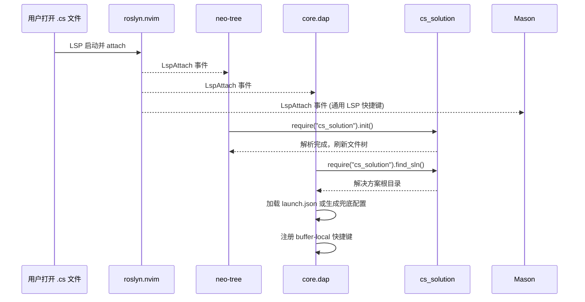

本页解析 Neovim 配置的**全局启动时序**、**模块分层结构**以及 **lazy.nvim 插件加载机制**。理解这一流程是深入阅读后续各模块文档的基础——所有插件配置、快捷键绑定、LSP/DAP 初始化都嵌套在这个加载管线之中。

## 启动入口：init.lua 的四阶段引导

`init.lua` 是整个配置的唯一起点，它以严格的顺序执行四个阶段：**环境预处理 → 核心模块加载 → 包管理器启动 → 延迟初始化注册**。每一阶段都依赖前一阶段的副作用，因此加载顺序不可调换。

**阶段 1 — 环境预处理**（第 3-10 行）：在 Windows 上通过 `chcp 65001` 强制子进程输出 UTF-8，并将代理地址写入 `HTTP_PROXY` / `HTTPS_PROXY` 环境变量，确保 git clone 等网络操作在代理环境下正常工作。Sources: [init.lua](init.lua#L3-L10)

**阶段 2 — 核心模块链式加载**（第 12-15 行）：依次加载四个核心模块。`core.basic` 设定编辑器行为（行号、缩进、Shell、剪贴板）；`core.autocmds` 注册 Windows IME 自动切换；`core.keymap` 定义 Leader 键和全局快捷键；`core.lazy` 引导 lazy.nvim 并触发插件加载。Sources: [init.lua](init.lua#L12-L15)

**阶段 3 — DAP 延迟初始化**（第 18-22 行）：通过 `User VeryLazy` 一次性 autocmd 将 DAP 调试系统注册为延迟回调。这意味着 `core.dap.setup()` 在所有 `VeryLazy` 插件加载完毕后才执行，确保 Mason 安装的 `netcoredbg` 适配器路径已可用。Sources: [init.lua](init.lua#L17-L22)

## 三层架构总览

整个配置由三层构成，每层有明确的责任边界和加载时机：

| 层级 | 目录 | 加载时机 | 职责 |
|------|------|---------|------|
| **核心层** (`core`) | `lua/core/` | 启动时同步加载 | 编辑器选项、快捷键、autocmds、包管理器引导 |
| **插件层** (`plugins`) | `lua/plugins/` | 由 lazy.nvim 按策略延迟加载 | 功能插件的声明与配置（37 个文件） |
| **工具模块** | `lua/cs_solution.lua` | 被 `require()` 按需加载 | .sln/.csproj 解析引擎，服务于 neo-tree 和 DAP |

核心层与插件层的边界很清晰：**核心层不依赖任何第三方插件**，它只使用 Neovim 内置 API。插件层的所有功能都通过 lazy.nvim 管理，遵循"按需加载"原则。`cs_solution.lua` 是一个特殊的共享工具模块——它既不归入核心层（因为它解决的是 C# 特定需求），也不是一个插件（没有 UI 或用户交互），而是被 neo-tree、DAP、roslyn 三个子系统共同引用。

Sources: [init.lua](init.lua#L12-L15), [lua/core/lazy.lua](lua/core/lazy.lua#L24-L31), [lua/cs_solution.lua](lua/cs_solution.lua#L1-L6)

## lazy.nvim 的导入机制与插件文件约定

`core/lazy.lua` 是包管理器的引导模块，它完成两件事：**自动安装 lazy.nvim** 和**批量导入插件规格**。Sources: [lua/core/lazy.lua](lua/core/lazy.lua#L1-L31)

### 自动安装逻辑

启动时检查 `stdpath("data")/lazy/lazy.nvim` 是否存在。若不存在，则从 GitHub 克隆 stable 分支。克隆失败时显示错误信息并退出。安装完成后将路径添加到 `runtimepath`，使 `require("lazy")` 可用。Sources: [lua/core/lazy.lua](lua/core/lazy.lua#L1-L22)

### 插件目录导入

`require("lazy").setup()` 中的关键配置是 `{ import = "plugins" }`。这告诉 lazy.nvim 自动扫描 `lua/plugins/` 目录下的所有 `.lua` 文件，将每个文件的返回值作为插件规格注册。这种"一个文件对应一个功能域"的组织方式有以下特点：

- **每个文件 `return` 一个表（或表的数组）**，符合 lazy.nvim 的 Plugin Spec 格式
- **文件名即功能域标识**——`telescope.lua` 管理 Telescope 全部配置，`roslyn.lua` 管理 C# LSP
- **同一文件可声明多个插件**——例如 `dap-cs.lua` 返回包含 6 个插件规格的数组，`blink.lua` 同时声明了 nvim-cmp（禁用）和 blink.cmp（启用）
- **`example.lua` 通过早期 `return {}` 实现禁用**——lazy.nvim 导入空表不会产生任何效果

Sources: [lua/core/lazy.lua](lua/core/lazy.lua#L24-L31)

## 插件延迟加载策略分类

本配置中 37 个插件文件采用了五种延迟加载策略。理解这些策略对于后续阅读各插件文档至关重要——加载时机决定了配置代码中可以安全引用哪些其他模块。

| 策略 | 关键字 | 触发条件 | 代表插件 | 适用场景 |
|------|--------|---------|---------|---------|
| **VeryLazy** | `event = "VeryLazy"` | Neovim 完成基本初始化后 | mason, noice, lualine, whichkey, gitsigns, flash, smear-cursor, nvim-surround, aerial, yazi | 大多数 UI/编辑增强插件，不依赖文件类型 |
| **按键触发** | `keys = { ... }` | 用户按下指定快捷键 | telescope, neo-tree, lazygit, diffview, grug-far, lspsaga, bufferline, hop, browse, claudecode | 按需调用的工具类插件 |
| **InsertEnter** | `event = "InsertEnter"` | 首次进入插入模式 | blink.cmp, nvim-autopairs | 仅编辑时需要的补全/配对功能 |
| **LspAttach** | `event = { "LspAttach" }` | LSP 客户端首次挂载 | fidget | LSP 进度展示 |
| **文件类型** | `ft = "cs"` | 打开 C# 文件 | roslyn | 特定语言的 LSP 服务器 |
| **手动延迟** | `lazy = true` | 由其他代码显式 `require()` | nvim-dap, dap-ui, nvim-dap-virtual-text, telescope-dap | 被 DAP 初始化代码统一管理的底层依赖 |
| **即时加载** | 无延迟关键字 | Neovim 启动时立即加载 | treesitter, snacks (dashboard), tokyonight | 主题、语法高亮、启动面板等基础体验 |

Sources: [lua/plugins/dap-cs.lua](lua/plugins/dap-cs.lua#L1-L25), [lua/plugins/blink.lua](lua/plugins/blink.lua#L24), [lua/plugins/fidget.lua](lua/plugins/fidget.lua#L5), [lua/plugins/roslyn.lua](lua/plugins/roslyn.lua#L3), [lua/plugins/treesitter.lua](lua/plugins/treesitter.lua#L1-L23), [lua/plugins/snacks.lua](lua/plugins/snacks.lua#L1-L34)

## 跨模块通信模式：LspAttach 事件总线

本配置中最显著的架构模式是**以 `LspAttach` autocmd 作为跨模块通信的事件总线**。当 Roslyn LSP 首次挂载到 C# buffer 时，三个独立子系统同时被激活：

这个设计的关键在于**每个子系统独立监听 `LspAttach`，通过 `client.name` 过滤器只响应 Roslyn 客户端**。例如 neo-tree 在收到事件后调用 `cs_solution.init()` 解析 .sln 文件（[lua/plugins/neo-tree.lua](lua/plugins/neo-tree.lua#L15-L35)）；DAP 模块则调用 `cs_solution.find_sln()` 定位项目根目录来搜索 `launch.json`（[lua/core/dap.lua](lua/core/dap.lua#L162-L186)）；Mason 注册通用 LSP 快捷键（`gd`, `gr`, `K` 等）不论 LSP 类型（[lua/plugins/mason.lua](lua/plugins/mason.lua#L61-L81)）。

这种事件驱动架构的优势是**模块间零直接依赖**——neo-tree 不需要知道 DAP 的存在，DAP 不需要知道 neo-tree 的存在，它们只通过 LspAttach 事件和共享的 `cs_solution` 模块间接协作。

Sources: [lua/plugins/neo-tree.lua](lua/plugins/neo-tree.lua#L15-L35), [lua/core/dap.lua](lua/core/dap.lua#L162-L186), [lua/plugins/mason.lua](lua/plugins/mason.lua#L61-L81), [lua/plugins/roslyn.lua](lua/plugins/roslyn.lua#L32-L64)

## DAP 延迟初始化的二级延迟策略

DAP（Debug Adapter Protocol）系统的初始化体现了本配置中最复杂的延迟加载设计，它使用了**两级延迟**：

1. **第一级 — VeryLazy 事件**：`init.lua` 注册 `User VeryLazy` 回调，确保 `core.dap.setup()` 在所有插件加载后执行。这一步注册 netcoredbg 适配器路径、配置 dap-ui、加载 Telescope DAP 扩展。

2. **第二级 — LspAttach 事件**：在 `core.dap.setup()` 内部，通过 `LspAttach` autocmd 注册 C# buffer 级别的配置——加载 `launch.json` 或生成兜底 DLL 选择配置，并绑定 `<leader>d` 前缀的调试快捷键。

这意味着 DAP 系统只有在用户**同时满足**"插件已加载（VeryLazy）"和"打开了 C# 文件并触发 LSP attach"两个条件时才会完整激活。这种设计保证了非 C# 开发场景下零额外开销。

Sources: [init.lua](init.lua#L17-L22), [lua/core/dap.lua](lua/core/dap.lua#L101-L279)

## 核心模块职责速查

| 模块 | 文件 | 加载时机 | 核心职责 |
|------|------|---------|---------|
| `core.basic` | [lua/core/basic.lua](lua/core/basic.lua) | 第 1 个 | 行号、缩进、Shell (pwsh)、剪贴板 (OSC 52)、编码 |
| `core.autocmds` | [lua/core/autocmds.lua](lua/core/autocmds.lua) | 第 2 个 | Windows IME 自动切换（InsertLeave → 英文, InsertEnter → 中文） |
| `core.keymap` | [lua/core/keymap.lua](lua/core/keymap.lua) | 第 3 个 | Leader 键 (`空格`)、窗口/Tab/移动/保存快捷键 |
| `core.lazy` | [lua/core/lazy.lua](lua/core/lazy.lua) | 第 4 个 | lazy.nvim 引导、自动安装、插件目录导入 |
| `core.dap` | [lua/core/dap.lua](lua/core/dap.lua) | VeryLazy + LspAttach | DAP 适配器注册、dap-ui 配置、C# 调试配置与快捷键 |
| `cs_solution` | [lua/cs_solution.lua](lua/cs_solution.lua) | 被 require 按需加载 | .sln/.csproj 解析、Glob 匹配、文件归属判断 |

## 继续阅读

理解了全局架构后，建议按以下路径深入各模块：

- **编辑器基础**：[核心基础配置（编辑器行为、Shell、剪贴板与编码）](5-he-xin-ji-chu-pei-zhi-bian-ji-qi-xing-wei-shell-jian-tie-ban-yu-bian-ma) — 了解 `core.basic` 中每项设置的具体含义
- **插件管理**：[插件管理策略：lazy.nvim 与按文件组织模式](6-cha-jian-guan-li-ce-lue-lazy-nvim-yu-an-wen-jian-zu-zhi-mo-shi) — 深入 lazy.nvim 的 spec 格式与文件组织模式
- **C# 工作流**：[Roslyn LSP 集成与解决方案管理](7-roslyn-lsp-ji-cheng-yu-jie-jue-fang-an-guan-li) — 了解 LspAttach 事件驱动的 LSP 子系统
- **调试系统**：[C# DAP 调试器：从适配器注册到启动配置](8-c-dap-diao-shi-qi-cong-gua-pei-qi-zhu-ce-dao-qi-dong-pei-zhi) — 了解二级延迟加载的 DAP 完整流程
- **解决方案引擎**：[cs_solution 模块：.sln / .csproj 解析与 Glob 匹配引擎](10-cs_solution-mo-kuai-sln-csproj-jie-xi-yu-glob-pi-pei-yin-qing) — 了解跨模块共享的核心工具模块