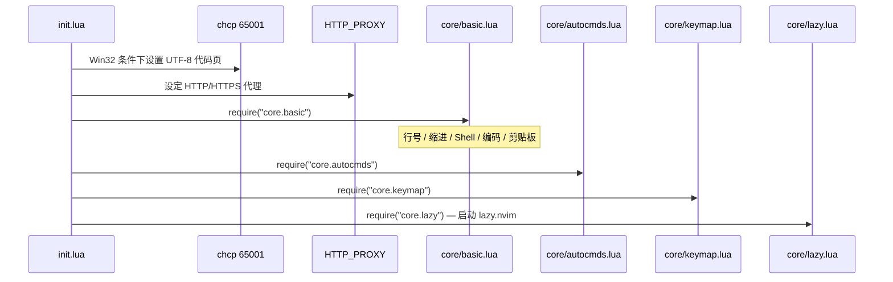
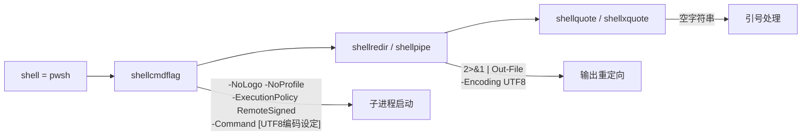
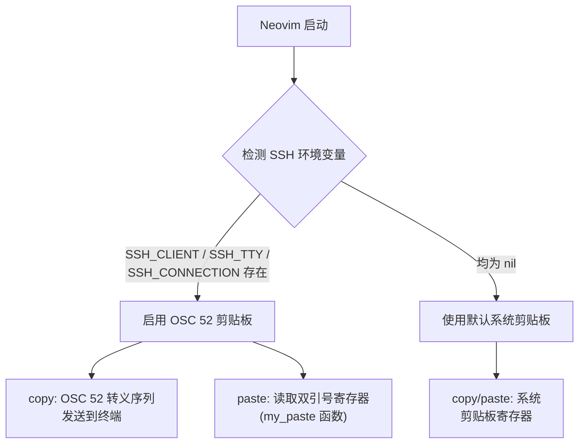

[basic.lua](lua/core/basic.lua) 是整个 Neovim 配置的**行为基座**——它不引入任何插件，仅通过 `vim.opt` / `vim.o` API 设置编辑器的原生行为参数。与快捷键（[快捷键体系速览](3-kuai-jie-jian-ti-xi-su-lan-leader-jian-yu-he-xin-cao-zuo)）和自动命令（[Windows 专属配置](32-windows-zhuan-shu-pei-zhi-powershell-shell-dai-li-ime-zi-dong-qie-huan)）不同，本模块关注的是"编辑器本身如何运转"：光标如何显示、空白如何插入、剪贴板如何同步、子进程使用哪个 Shell。理解这些配置是后续阅读所有插件文档的前提。

Sources: [basic.lua](lua/core/basic.lua#L1-L62), [init.lua](init.lua#L1-L23)

## 模块在启动链中的位置

[init.lua](init.lua) 作为入口文件，在加载任何插件管理器之前就执行了两项关键操作：**Windows 代码页切换**与**代理环境变量设定**，随后才按顺序加载 `core` 模块组。加载时序如下：



**代码页切换**（第 4–6 行）是 Windows 平台特有的前序操作。它通过 `vim.fn.system("chcp 65001")` 将当前控制台代码页切换至 UTF-8，确保 lazygit 等子进程的错误信息不会以系统默认编码（如 GBK）输出而产生乱码。这一步必须在加载任何子进程调用之前完成。

Sources: [init.lua](init.lua#L3-L6)

## 编辑器行为配置

[basic.lua](lua/core/basic.lua) 的前 17 行定义了六组编辑器行为参数，覆盖视觉辅助、缩进策略、窗口拆分和搜索智能四个维度：

| 配置项 | 值 | 效果说明 |
|---|---|---|
| `number` | `true` | 显示绝对行号 |
| `relativenumber` | `true` | 非当前行显示相对行号（配合 `number`，当前行仍显示绝对行号） |
| `cursorline` | `true` | 高亮当前光标所在行 |
| `colorcolumn` | `"120"` | 在第 120 列绘制参考线，标识行宽边界 |
| `expandtab` | `true` | 将 Tab 键转换为空格 |
| `tabstop` | `4` | 一个 Tab 等价于 4 个空格宽度 |
| `shiftwidth` | `0` | 设为 `0` 表示自动跟随 `tabstop` 值（即 4） |
| `autoread` | `true` | 文件被外部修改后自动重新加载（需 `checktime` 触发） |
| `splitbelow` | `true` | 水平拆分时新窗口出现在当前窗口**下方** |
| `splitright` | `true` | 垂直拆分时新窗口出现在当前窗口**右侧** |
| `ignorecase` | `true` | 搜索默认忽略大小写 |
| `smartcase` | `true` | 若搜索词中包含大写字母，则自动切换为区分大小写 |

**`shiftwidth = 0` 的设计意图**：当 `shiftwidth` 为 0 时，Neovim 自动将其视为与 `tabstop` 相同的值。这种写法确保只需维护 `tabstop` 一处即可同步影响缩进宽度，避免两者不一致导致的对齐问题。

**`ignorecase` + `smartcase` 组合**是 Neovim 社区广泛采用的搜索策略：输入 `foo` 匹配 `Foo`、`FOO`、`foo`；输入 `Foo` 则仅匹配 `Foo`。这兼顾了日常搜索的宽松性与精确搜索的意图识别。

Sources: [basic.lua](lua/core/basic.lua#L1-L17)

## Shell 配置：PowerShell 7 集成

本配置面向 Windows 开发环境，将 Neovim 的默认 Shell 从 `cmd.exe` 切换为 **PowerShell 7**（`pwsh`），并通过精细的 Shell 选项参数链确保子进程以 UTF-8 模式运行：



各参数的协作关系如下表：

| 选项 | 值 | 作用 |
|---|---|---|
| `shell` | `'pwsh'` | 指定 PowerShell 7 可执行文件 |
| `shellcmdflag` | `-NoLogo -NoProfile -ExecutionPolicy RemoteSigned -Command [Console]::InputEncoding=...` | 每次 Shell 调用的启动参数：抑制 Logo 输出、跳过 Profile 加载、放宽执行策略、**强制控制台编码为 UTF-8** |
| `shellredir` | `2>&1 \| Out-File -Encoding UTF8 %s; exit $LastExitCode` | 将 stderr 合并到 stdout 并以 UTF-8 写入文件 |
| `shellpipe` | `2>&1 \| Out-File -Encoding UTF8 %s; exit $LastExitCode` | 管道输出同样以 UTF-8 编码，并正确传递退出码 |
| `shellquote` | `''` | PowerShell 不需要额外的引号包裹 |
| `shellxquote` | `''` | 同上，关闭默认引号行为 |

**`shellcmdflag` 中的 `[Console]::InputEncoding=[Console]::OutputEncoding=[System.Text.Encoding]::UTF8` 是关键设计**。这行内联 C# 代码在每次子进程启动时将 PowerShell 的输入输出编码同时设为 UTF-8，解决了 Windows 平台下 Neovim 与 Shell 子进程之间常见的中文乱码问题。`-NoProfile` 则避免加载用户的 PowerShell Profile 脚本，减少启动延迟。

**`shellredir` 和 `shellpipe` 末尾的 `exit $LastExitCode`** 确保 Neovim 能正确捕获子进程的退出状态，而非 `Out-File` 管道命令本身的退出码。这对 `:make`、`:grep` 等依赖退出码的内置命令至关重要。

Sources: [basic.lua](lua/core/basic.lua#L29-L35)

## 编码配置：UTF-8 优先与中文兼容链

编码配置由三个层次组成，分别作用于 Neovim 内部、文件读写和文件打开时的编码探测：

| 选项 | 值 | 作用域 |
|---|---|---|
| `encoding` | `'utf-8'` | Neovim 内部编码（缓冲区、寄存器、表达式） |
| `fileencoding` | `'utf-8'` | 当前缓冲区的文件写入编码 |
| `fileencodings` | `'utf-8,gbk,gb18030,gb2312,latin1'` | 文件打开时的编码探测优先级链 |

**`fileencodings` 的探测机制**：Neovim 在打开文件时，会按此列表从左到右依次尝试检测文件编码。UTF-8 排在最前面，确保标准文件零开销打开；若 UTF-8 解码失败，则依次回退到 `gbk` → `gb18030` → `gb2312` → `latin1`。这条回退链专为中文 Windows 环境设计，能正确处理遗留的 GBK/GB18030 编码文件，而 `latin1` 作为最终兜底确保任何二进制内容都不会导致打开失败。

**与 `init.lua` 中 `chcp 65001` 的协同**：`init.lua` 在启动最早期执行 `chcp 65001` 切换控制台代码页，这是为**子进程**准备的编码环境；而 `basic.lua` 中的 `encoding` / `fileencodings` 则是 Neovim **自身**的编码策略。两层配置共同构成了完整的 UTF-8 编码保障。

Sources: [init.lua](init.lua#L3-L6), [basic.lua](lua/core/basic.lua#L22-L27)

## 剪贴板配置：系统同步与 SSH 环境自适应

剪贴板是本模块中最具架构复杂性的部分，它需要在**本地桌面**和 **SSH 远程会话**两种场景下均能正常工作。

### 系统剪贴板同步

```lua
vim.opt.clipboard:append("unnamedplus")
```

`unnamedplus` 将 Neovim 的默认粘贴寄存器映射到系统剪贴板寄存器 `+`。这意味着在本地桌面环境中，所有 `y`（复制）、`d`（剪切）、`p`（粘贴）操作自动与操作系统剪贴板同步，无需额外使用 `"+y` 前缀。

Sources: [basic.lua](lua/core/basic.lua#L19-L20)

### SSH 环境下的 OSC 52 剪贴板转发

在 SSH 远程会话中，Neovim 无法直接访问本地操作系统的剪贴板。本配置通过检测 SSH 相关环境变量，在远程环境下自动切换到 **OSC 52 协议**实现剪贴板转发：



**环境检测逻辑**：当 `SSH_CLIENT`、`SSH_TTY`、`SSH_CONNECTION` 三个环境变量中任意一个存在时，即判定当前为 SSH 远程会话。

**复制（copy）** 使用 `vim.ui.clipboard.osc52` 模块，它通过 OSC 52 转义序列将文本内容发送给终端模拟器，由终端负责写入本地剪贴板。这要求本地终端支持 OSC 52，兼容的终端包括 Windows Terminal 1.18+、iTerm2、kitty、WezTerm 等。

**粘贴（paste）** 没有使用 OSC 52 的 paste 功能（已被注释掉），而是通过自定义的 `my_paste` 函数直接读取 Neovim 的双引号寄存器 `"` 的内容。这是一种务实的设计选择：OSC 52 的 paste 实现在某些终端上不稳定，而 SSH 场景下通过终端快捷键（如 `Ctrl+Shift+V`）粘贴时，Neovim 会自动将内容存入 `"` 寄存器，`my_paste` 函数再将其提供给 `p` 操作符，形成了可靠的粘贴回路。

Sources: [basic.lua](lua/core/basic.lua#L37-L61)

## 配置一览总表

将 `init.lua` 和 `basic.lua` 中的所有核心配置按功能域汇总：

| 功能域 | 配置项 | 来源文件 | 备注 |
|---|---|---|---|
| **启动前序** | `chcp 65001` | [init.lua](init.lua#L4-L6) | Win32 条件执行 |
| **行号显示** | `number` + `relativenumber` | [basic.lua](lua/core/basic.lua#L1-L2) | 当前行绝对 + 其余行相对 |
| **光标辅助** | `cursorline` + `colorcolumn` | [basic.lua](lua/core/basic.lua#L4-L5) | 行高亮 + 120 列参考线 |
| **缩进策略** | `expandtab` + `tabstop=4` + `shiftwidth=0` | [basic.lua](lua/core/basic.lua#L7-L9) | 空格缩进，宽度跟随 tabstop |
| **搜索行为** | `ignorecase` + `smartcase` | [basic.lua](lua/core/basic.lua#L16-L17) | 默认忽略大小写，含大写则精确 |
| **窗口拆分** | `splitbelow` + `splitright` | [basic.lua](lua/core/basic.lua#L13-L14) | 新窗口出现在右/下方 |
| **Shell 集成** | `shell=pwsh` + 5 项 shell 选项 | [basic.lua](lua/core/basic.lua#L29-L35) | PowerShell 7 + UTF-8 编码 |
| **内部编码** | `encoding=utf-8` | [basic.lua](lua/core/basic.lua#L23) | Neovim 内部统一 UTF-8 |
| **文件编码** | `fileencoding=utf-8` | [basic.lua](lua/core/basic.lua#L24) | 写入默认 UTF-8 |
| **编码探测** | `fileencodings` 回退链 | [basic.lua](lua/core/basic.lua#L27) | UTF-8 → GBK → GB18030 → latin1 |
| **剪贴板同步** | `clipboard=unnamedplus` | [basic.lua](lua/core/basic.lua#L20) | 默认寄存器绑定系统剪贴板 |
| **SSH 剪贴板** | OSC 52 + `my_paste` | [basic.lua](lua/core/basic.lua#L47-L61) | SSH 环境自动启用 |

## 延伸阅读

本页描述的基础配置为后续所有模块提供了运行环境基础。以下页面与本文内容存在直接关联：

- **[整体架构与模块加载流程](4-zheng-ti-jia-gou-yu-mo-kuai-jia-zai-liu-cheng)**：理解 `core` 模块组在完整启动链中的协作关系
- **[快捷键体系速览](3-kuai-jie-jian-ti-xi-su-lan-leader-jian-yu-he-xin-cao-zuo)**：`core/keymap.lua` 中定义的 Leader 键与核心操作映射
- **[Windows 专属配置](32-windows-zhuan-shu-pei-zhi-powershell-shell-dai-li-ime-zi-dong-qie-huan)**：`core/autocmds.lua` 中的 IME 自动切换等平台适配逻辑
- **[SSH 远程环境下的 OSC 52 剪贴板转发](33-ssh-yuan-cheng-huan-jing-xia-de-osc-52-jian-tie-ban-zhuan-fa)**：OSC 52 协议的终端兼容性详情与故障排除