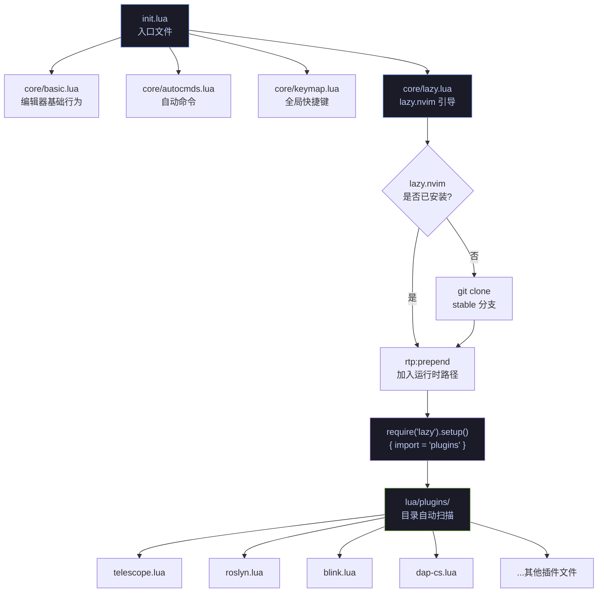
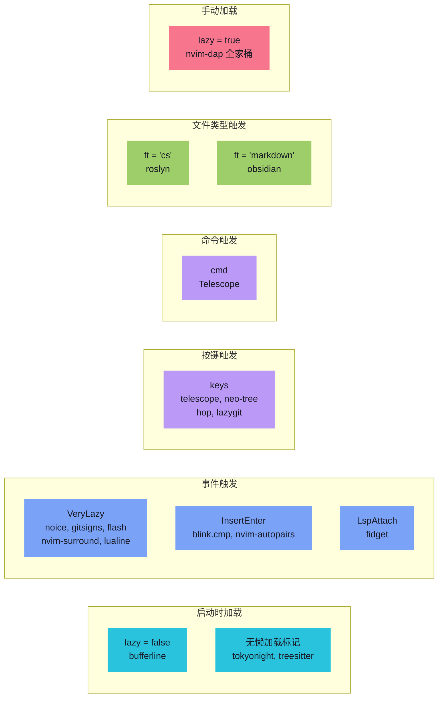
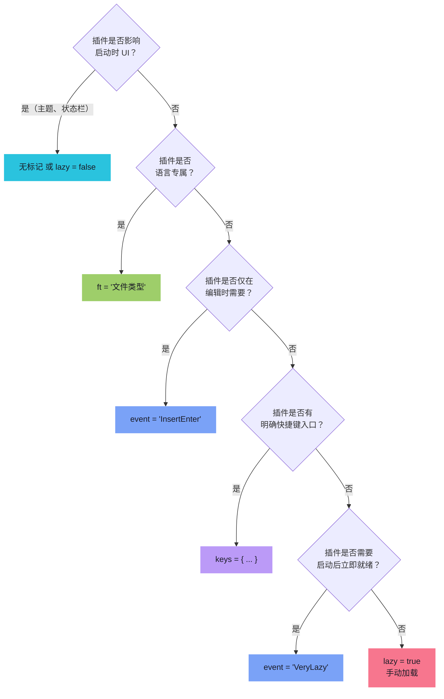

本配置采用 **lazy.nvim** 作为插件管理器，遵循"一个插件（或一组功能关联插件）一个文件"的组织模式。所有插件声明集中在 `lua/plugins/` 目录下，由 lazy.nvim 的 `{ import = "plugins" }` 机制自动发现并加载。本文将深入解析这一管理策略的架构设计、懒加载机制、插件声明规范，以及按文件组织模式带来的工程化优势。

Sources: [lazy.lua](lua/core/lazy.lua#L1-L33), [init.lua](init.lua#L1-L23)

## 整体架构：从引导到自动发现

插件管理的生命周期分为三个阶段：**引导安装** → **核心模块加载** → **插件目录自动导入**。`init.lua` 作为入口，按顺序加载基础配置、自动命令、快捷键，最后才触发 lazy.nvim 初始化，确保所有基础 `vim.opt` 设置先于插件就绪。



引导逻辑位于 [lazy.lua](lua/core/lazy.lua#L1-L22)。它首先检测 `stdpath("data")/lazy/lazy.nvim` 路径是否存在，若不存在则通过 `git clone --filter=blob:none` 执行浅克隆以节省带宽。克隆失败时会展示错误信息并退出，确保不会在缺少插件管理器的状态下继续运行。成功后通过 `vim.opt.rtp:prepend` 将 lazy.nvim 加入 Neovim 的运行时路径优先级队列。

核心调用位于 [lazy.lua](lua/core/lazy.lua#L24-L31)：`require("lazy").setup({ spec = { { import = "plugins" } } })`。这里的 `import = "plugins"` 会自动扫描 `lua/plugins/` 目录下的所有 `.lua` 文件，将每个文件 `return` 的表作为插件规格注册。这意味着新增插件只需在该目录创建一个新文件，无需手动维护任何索引或入口列表。

Sources: [init.lua](init.lua#L12-L15), [lazy.lua](lua/core/lazy.lua#L1-L33)

## 按文件组织模式

### 设计哲学

本配置的插件组织遵循 **"按功能域分文件"** 的原则：每个 `lua/plugins/*.lua` 文件围绕一个功能域（如模糊查找、Git 工作流、C# 调试）组织其插件声明。这种模式与 lazy.nvim 的自动导入机制天然契合——无需中央注册表，文件即模块。

### 目录结构与文件分类

当前 `lua/plugins/` 目录共包含 **36 个插件文件**，按功能域可归纳如下：

| 功能域 | 文件 | 插件数量 | 典型懒加载策略 |
|--------|------|---------|--------------|
| **主题与 UI** | `tokyonight.lua`, `bufferline.lua`, `lualine.lua`, `noice.lua`, `smear-cursor.lua`, `rainebow.lua` | 6 | `VeryLazy` / 立即加载 |
| **补全与 LSP** | `blink.lua`, `mason.lua`, `roslyn.lua`, `lspsaga.lua`, `fidget.lua` | 5 | `event` / `ft` |
| **文件导航** | `telescope.lua`, `neo-tree.lua`, `yazi.lua`, `aerial.lua`, `browse.lua` | 5 | `keys` / `cmd` |
| **编辑增强** | `flash.lua`, `hop.lua`, `nvim-autopairs.lua`, `nvim-surround.lua`, `nvim-ufo.lua`, `render-markdown.lua` | 6 | `VeryLazy` / `InsertEnter` |
| **Git 集成** | `lazygit.lua`, `gitsigns.lua`, `diffview.lua` | 3 | `keys` / `VeryLazy` |
| **DAP 调试** | `dap-cs.lua`, `sharpdbg.lua` | 2 | `lazy = true`（手动） |
| **终端与工具** | `toggleterm.lua`, `whichkey.lua`, `snacks.lua`, `grug-far.lua` | 4 | `keys` / `VeryLazy` |
| **知识管理** | `obsidian.lua`, `dooing.lua` | 2 | `ft = "markdown"` |
| **AI 辅助** | `claudecode.lua`, `opencode.lua` | 2 | 按需加载 |
| **参考模板** | `example.lua` | 0（已禁用） | — |

Sources: [plugins/](lua/plugins/) 目录结构

### 单文件单插件 vs 单文件多插件

大部分文件遵循 **一个文件对应一个主插件** 的模式，但在功能强关联的场景下，单文件可返回**插件规格数组**，将多个插件的声明聚合在一起：

**单插件文件**（大多数情况）——文件 `return` 一个表，代表一个插件规格：

```lua
-- lua/plugins/gitsigns.lua — 单插件模式
return {
  "lewis6991/gitsigns.nvim",
  event = "VeryLazy",
  opts = { signs = { add = { text = "+" }, ... } },
  keys = { { "]h", function() ... end, desc = "Next Hunk" }, ... },
}
```

**多插件聚合文件**——文件 `return` 一个数组，包含多个关联插件的规格。典型场景如 [dap-cs.lua](lua/plugins/dap-cs.lua#L1-L25) 将 `nvim-dap`、`nvim-dap-ui`、`nvim-dap-virtual-text`、`telescope-dap` 全部声明在一起：

```lua
-- lua/plugins/dap-cs.lua — 多插件聚合模式
return {
  { "mfussenegger/nvim-dap",           lazy = true },
  { "nvim-neotest/nvim-nio",           lazy = true },
  { "rcarriga/nvim-dap-ui",            lazy = true, dependencies = { ... } },
  { "theHamsta/nvim-dap-virtual-text", lazy = true, dependencies = { ... } },
  { "nvim-telescope/telescope-dap.nvim", lazy = true, dependencies = { ... } },
}
```

同样，[blink.lua](lua/plugins/blink.lua#L1-L117) 在返回数组中先禁用了 `nvim-cmp`（`enabled = false`），再声明 `blink.cmp` 作为替代补全引擎；[telescope.lua](lua/plugins/telescope.lua#L1-L226) 则聚合了 Telescope 主插件、`telescope-ui-select` 扩展以及 Flash 集成扩展三个规格。

Sources: [dap-cs.lua](lua/plugins/dap-cs.lua#L1-L25), [blink.lua](lua/plugins/blink.lua#L1-L6), [telescope.lua](lua/plugins/telescope.lua#L185-L225)

## 懒加载策略详解

lazy.nvim 的核心价值在于精细的懒加载控制。本配置充分利用了 lazy.nvim 提供的多种加载触发器，按插件特性选择最优策略：



### 各策略对比与适用场景

| 加载策略 | 触发条件 | 典型插件 | 优势 | 注意事项 |
|---------|---------|---------|------|---------|
| **无标记**（立即加载） | Neovim 启动时 | `tokyonight`, `treesitter`, `bufferline` | 确保核心 UI 和主题第一时间可用 | 仅用于真正必要的插件 |
| `event = "VeryLazy"` | `VeryLazy` 事件（启动完成后） | `noice`, `gitsigns`, `flash`, `nvim-surround` | 不阻塞启动，但几乎立即可用 | 最常用的延迟策略 |
| `event = "InsertEnter"` | 首次进入插入模式 | `blink.cmp`, `nvim-autopairs` | 仅在需要编辑时加载 | 适合补全和编辑辅助类插件 |
| `event = "LspAttach"` | 首次 LSP 附加 | `fidget` | 与 LSP 生命周期绑定 | 适合 LSP 增强类插件 |
| `keys = { ... }` | 首次按下指定快捷键 | `telescope`, `neo-tree`, `hop`, `lazygit` | 零开销——不按不加载 | 需要确保用户知道快捷键存在 |
| `cmd = "..."` | 首次执行指定命令 | `telescope`（`cmd = "Telescope"`） | 命令触发，适合有 `:` 命令入口的插件 | 与 `keys` 互为补充 |
| `ft = "..."` | 打开指定文件类型 | `roslyn`（`ft = "cs"`）, `obsidian`（`ft = "markdown"`） | 语言/领域隔离，非目标文件永不加载 | 适合语言专属工具链 |
| `lazy = true` | 由其他代码手动 `require` | `nvim-dap` 全家桶 | 完全手动控制加载时机 | 需确保有显式调用点 |

### 案例分析：DAP 调试器的延迟加载架构

DAP 调试器是本配置中最精细的懒加载设计。在 [dap-cs.lua](lua/plugins/dap-cs.lua#L1-L25) 中，所有 DAP 相关插件均标记为 `lazy = true`，意味着它们不会在任何自动事件下加载。实际的加载触发点位于 [init.lua](init.lua#L17-L22)：

```lua
-- init.lua 中的 VeryLazy 回调
vim.api.nvim_create_autocmd("User", {
  pattern = "VeryLazy",
  once = true,
  callback = function() require("core.dap").setup() end,
})
```

这种两阶段设计——**声明阶段**（`dap-cs.lua` 仅注册插件元数据）与 **初始化阶段**（`core/dap.lua` 在 `VeryLazy` 后统一执行 `setup()`）——确保所有插件已完全加载后才建立快捷键映射和 DAP 配置，避免了初始化顺序竞争问题。

Sources: [dap-cs.lua](lua/plugins/dap-cs.lua#L1-L25), [init.lua](init.lua#L17-L22)

## 插件规格声明模式

lazy.nvim 的插件规格支持丰富的声明字段。本配置中主要使用了以下模式：

### 最小化声明

仅指定插件名和默认选项，由 lazy.nvim 自动调用 `setup()`：

```lua
-- lua/plugins/nvim-surround.lua
return {
  "kylechui/nvim-surround",
  event = "VeryLazy",
  opts = {},
}
```

Sources: [nvim-surround.lua](lua/plugins/nvim-surround.lua#L1-L5)

### 带 config 函数的完整声明

当需要自定义初始化逻辑时，使用 `config` 函数替代 `opts` 自动合并：

```lua
-- lua/plugins/tokyonight.lua
return {
  "folke/tokyonight.nvim",
  opts = { style = "moon" },
  config = function(_, opts)
    require("tokyonight").setup(opts)
    vim.cmd("colorscheme tokyonight")
  end
}
```

`config` 函数接收两个参数：`_`（插件规格本身，此处忽略）和 `opts`（已合并的选项表）。这种模式允许在 `setup()` 之后执行额外的副作用操作（如应用主题）。

Sources: [tokyonight.lua](lua/plugins/tokyonight.lua#L1-L11)

### 带依赖关系声明

`dependencies` 字段声明插件间的加载依赖，lazy.nvim 会确保依赖先于主插件加载：

```lua
-- lua/plugins/neo-tree.lua
return {
  "nvim-neo-tree/neo-tree.nvim",
  branch = "v3.x",
  dependencies = {
    "nvim-lua/plenary.nvim",
    "nvim-tree/nvim-web-devicons",
    "MunifTanjim/nui.nvim",
  },
  keys = { { "<leader>e", "<cmd>Neotree toggle<cr>" } },
  config = function() ... end,
}
```

Sources: [neo-tree.lua](lua/plugins/neo-tree.lua#L1-L12)

### 跨插件集成（optional 模式）

通过 `optional = true` 声明"可选扩展"——仅当目标插件已安装时才生效。这是一种松耦合的跨文件集成机制，`telescope.lua` 中的 Flash 集成和 `aerial.lua` 中的 Telescope 集成都采用了这一模式：

```lua
-- lua/plugins/telescope.lua 末尾 — Flash Telescope 集成
{
  "nvim-telescope/telescope.nvim",
  optional = true,
  opts = function(_, opts)
    -- 为 Telescope 添加 Flash 跳转快捷键
    opts.defaults = vim.tbl_deep_extend("force", opts.defaults or {}, {
      mappings = { n = { s = flash }, i = { ["<c-s>"] = flash } },
    })
  end,
}
```

这种模式使得功能增强可以"就近"放置在功能提供者（如 Flash）的文件中，而不需要修改目标插件（如 Telescope）的配置文件。

Sources: [telescope.lua](lua/plugins/telescope.lua#L198-L224), [aerial.lua](lua/plugins/aerial.lua#L123-L137)

### 替代禁用模式

当用一个插件替代另一个时，可以在同一文件中先禁用被替代的插件。例如 [blink.lua](lua/plugins/blink.lua#L1-L6) 用 `blink.cmp` 替代 `nvim-cmp`：

```lua
return {
  { "hrsh7th/nvim-cmp", optional = true, enabled = false },  -- 禁用 nvim-cmp
  { "saghen/blink.cmp", version = "*", ... },                -- 启用 blink.cmp
}
```

Sources: [blink.lua](lua/plugins/blink.lua#L1-L6)

## 版本锁定与可复现性

[lazy-lock.json](lazy-lock.json#L1-L51) 文件记录了每个插件的精确 Git 分支和提交哈希。当前配置锁定了约 **40 个插件**，确保团队成员或不同机器间获得完全一致的插件版本。lazy.nvim 在执行 `:Lazy restore` 时会读取此文件，将所有插件回退到锁定版本。

该文件由 lazy.nvim 自动维护——每次执行 `:Lazy sync` 或 `:Lazy update` 后自动更新。应将其纳入版本控制（Git），以保证环境可复现性。

Sources: [lazy-lock.json](lazy-lock.json#L1-L51)

## 参考模板

[example.lua](lua/plugins/example.lua#L1-L198) 是 lazy.nvim 官方提供的完整参考模板，涵盖插件声明、选项合并、快捷键绑定、依赖管理、LSP 配置、Treesitter 扩展等几乎所有规格字段。该文件通过 `if true then return {} end` 在第 3 行被禁用，不会加载任何插件，但作为开发参考极具价值。

Sources: [example.lua](lua/plugins/example.lua#L1-L3)

## 新增插件的操作指南

要新增一个插件，只需在 `lua/plugins/` 目录下创建新的 `.lua` 文件：

1. **创建文件**：`lua/plugins/my-plugin.lua`
2. **声明规格**：`return { "author/plugin-name.nvim", opts = { ... } }`
3. **选择懒加载策略**：根据插件类型选择最合适的触发方式
4. **重启 Neovim**：lazy.nvim 会自动发现新文件并安装插件

选择懒加载策略的决策参考：



## 延伸阅读

- [整体架构与模块加载流程](4-zheng-ti-jia-gou-yu-mo-kuai-jia-zai-liu-cheng)——了解 `init.lua` 如何将核心模块与插件系统串联
- [Roslyn LSP 集成与解决方案管理](7-roslyn-lsp-ji-cheng-yu-jie-jue-fang-an-guan-li)——`ft = "cs"` 懒加载的典型应用场景
- [C# DAP 调试器：从适配器注册到启动配置](8-c-dap-diao-shi-qi-cong-gua-pei-qi-zhu-ce-dao-qi-dong-pei-zhi)——`lazy = true` 手动加载模式的深入解析
- [blink.cmp 自动补全框架配置](12-blink-cmp-zi-dong-bu-quan-kuang-jia-pei-zhi)——插件替代禁用模式（`enabled = false`）的实际案例
- [Telescope 模糊查找器：文件、Grep 与 Git 搜索](16-telescope-mo-hu-cha-zhao-qi-wen-jian-grep-yu-git-sou-suo)——`cmd` + `keys` 双重懒加载触发策略