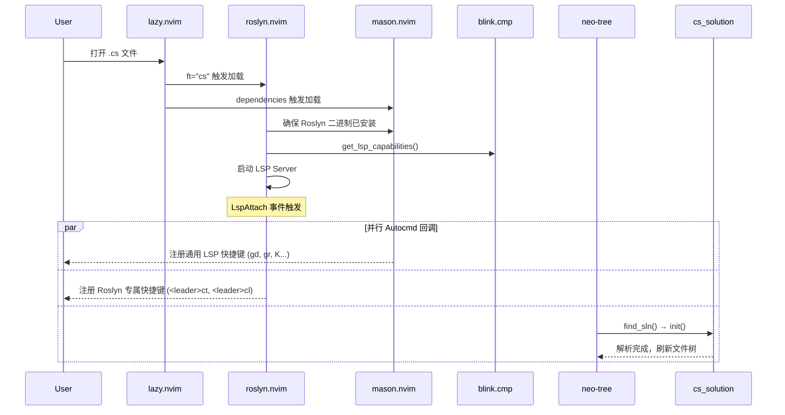
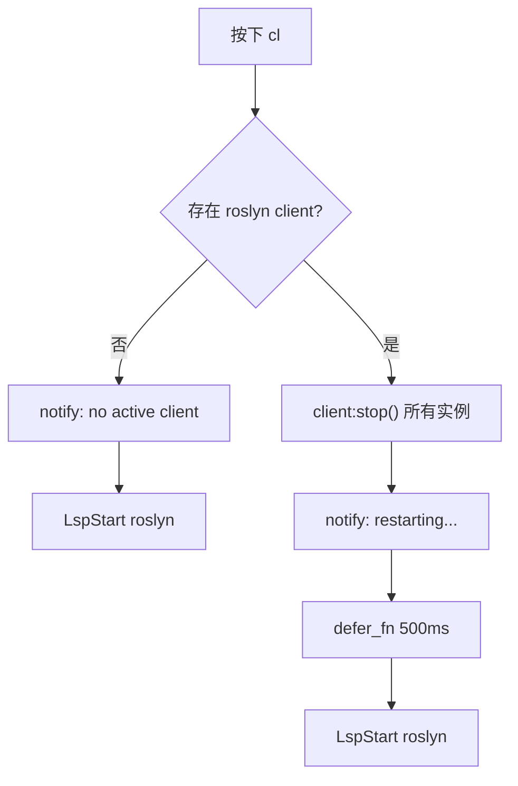

本文档深入解析本 Neovim 配置中 **Roslyn LSP** 的集成架构——从插件加载策略、LSP 服务器生命周期管理，到 `.sln` 解决方案的检测与手动切换机制。这是整个 C# / .NET 开发体验的语言智能基石，补全、诊断、代码导航等一切能力都建立在此层之上。相关联的 [`cs_solution` 模块](10-cs_solution-mo-kuai-sln-csproj-jie-xi-yu-glob-pi-pei-yin-qing) 和 [neo-tree .sln 归属状态显示](9-neo-tree-zhong-de-sln-wen-jian-gui-shu-zhuang-tai-xian-shi) 将在各自专页中详细讨论。

Sources: [roslyn.lua](lua/plugins/roslyn.lua#L1-L67), [mason.lua](lua/plugins/mason.lua#L1-L83)

## 架构全景：Roslyn LSP 的加载与初始化链

Roslyn LSP 的启动并非单一插件的独立行为，而是由 `mason.nvim`、`roslyn.nvim`、`blink.cmp`、`neo-tree` 和 `cs_solution` 五个模块协同完成的初始化链。理解这条链路是排查 Roslyn 相关问题的第一性原理。



这条链路的关键设计决策是 **惰性加载**：`roslyn.nvim` 通过 `ft = "cs"` 仅在打开 C# 文件时加载，避免非 .NET 工作流中的无谓启动开销。`mason.nvim` 作为其 `dependencies` 确保在 Roslyn 插件初始化之前，Mason 的自定义 registry 已经注册完毕。

Sources: [roslyn.lua](lua/plugins/roslyn.lua#L1-L6), [mason.lua](lua/plugins/mason.lua#L31-L35), [neo-tree.lua](lua/plugins/neo-tree.lua#L14-L35)

## 插件配置：roslyn.nvim 的两层设置

Roslyn 的配置分为 **插件层**（`require("roslyn").setup()`）和 **LSP 配置层**（`vim.lsp.config()`）两个层次，各司其职。

### 插件层：target 锁定与依赖声明

| 配置项 | 值 | 作用 |
|--------|-----|------|
| `ft` | `"cs"` | 惰性加载触发条件 |
| `lock_target` | `true` | 记住用户上次 `:Roslyn target` 选择的 .sln，后续打开不再弹窗 |
| `capabilities` | `blink.cmp` 提供 | 注入 snippet、label details 等补全增强能力 |

`lock_target = true` 是一项重要的体验优化——在包含多个 .sln 的仓库中，一旦用户通过 `<leader>ct` 手动选择了目标解决方案，Roslyn 会在后续会话中自动复用该选择，避免每次打开 C# 文件都弹出选择器。

Sources: [roslyn.lua](lua/plugins/roslyn.lua#L7-L13)

### LSP 配置层：Roslyn 分析器行为调优

通过 `vim.lsp.config("roslyn", {...})` 设置的三个配置域直接映射到 Roslyn Language Server 的 LSP 初始化选项：

| 配置域 | 键 | 值 | 效果 |
|--------|-----|-----|------|
| `csharp\|background_analysis` | `dotnet_analyzer_diagnostics_scope` | `"openFiles"` | 仅对当前打开的文件执行分析器诊断 |
| `csharp\|background_analysis` | `dotnet_compiler_diagnostics_scope` | `"openFiles"` | 仅对当前打开的文件执行编译器诊断 |
| `csharp\|inlay_hints` | `csharp_enable_inlay_hints_for_implicit_object_creation` | `true` | 为隐式对象创建（`new()`）显示类型提示 |
| `csharp\|inlay_hints` | `csharp_enable_inlay_hints_for_implicit_variable_types` | `true` | 为 `var` 隐式类型显示实际类型提示 |
| `csharp\|code_lens` | `dotnet_enable_references_code_lens` | `true` | 在类型/成员上方显示引用计数 Code Lens |

将 `background_analysis` 的范围限制为 `openFiles` 是一项性能权衡策略——在大型解决方案中，全项目分析会显著增加 CPU 和内存开销，聚焦已打开文件可以在保持即时诊断能力的同时将资源消耗控制在合理范围。

Sources: [roslyn.lua](lua/plugins/roslyn.lua#L15-L29)

## Mason Registry 与 Roslyn 安装

Roslyn LSP 服务器通过 Mason 的自定义 registry 机制自动安装。Mason 配置中注册了一个额外的 registry：

```lua
registries = {
    "github:mason-org/mason-registry",
    "github:Crashdummyy/mason-registry", -- 包含 roslyn 的自定义 registry
},
```

这个 `Crashdummyy/mason-registry` 提供了 Roslyn 的 Mason 包定义，使 `roslyn.nvim` 能够通过 Mason 自动检测并安装 Roslyn 二进制文件。值得注意的是，Roslyn **不在** `lsconfses` 表中——它由 `roslyn.nvim` 插件自身管理生命周期，而非走 Mason 的通用 `setup()` → `vim.lsp.config()` → `vim.lsp.enable()` 流程。这种分离是有意为之的，因为 `roslyn.nvim` 需要对 Roslyn 的启动参数（如 solution target 选择）进行细粒度控制。

Sources: [mason.lua](lua/plugins/mason.lua#L31-L53)

## 快捷键体系：通用 LSP + Roslyn 专属

C# buffer 中存在两组快捷键，分别由 `mason.lua` 和 `roslyn.lua` 在 `LspAttach` 时注入。两组快捷键都采用 **buffer-local** 模式，确保仅在 LSP 客户端实际附加的 buffer 中生效。

### 通用 LSP 快捷键（所有 LSP 共享）

| 快捷键 | 功能 | 来源 |
|--------|------|------|
| `gd` | 跳转到定义 | mason.lua |
| `gr` | 跳转到引用 | mason.lua |
| `gI` | 跳转到实现 | mason.lua |
| `gy` | 跳转到类型定义 | mason.lua |
| `gD` | 跳转到声明 | mason.lua |
| `K` | 悬停文档 | mason.lua |
| `<leader>cs` | 文档符号搜索 | mason.lua |
| `<leader>cr` | 重命名符号 | mason.lua |
| `<leader>ca` | 代码操作 | mason.lua |

### Roslyn 专属快捷键

| 快捷键 | 功能 | 实现细节 |
|--------|------|----------|
| `<leader>ct` | 选择解决方案目标 (.sln) | 执行 `:Roslyn target`，弹出 .sln 选择器 |
| `<leader>cl` | 重启 Roslyn 分析 | 停止所有 roslyn clients → 500ms 延迟 → `LspStart roslyn` |

`<leader>cl`（重启分析）的实现值得深入理解。它并非简单的 `:LspRestart`，而是一个精心设计的 **stop → delay → start** 三步流程：



这个 500ms 延迟是必要的——Roslyn 的 `stop()` 是异步操作，进程清理需要时间。如果立即 `LspStart`，新进程可能无法正确绑定到已被旧进程占用的 solution 文件。这种设计覆盖了以下边界情况：

- **无活动 client 时**：显示通知并尝试直接启动，而非静默失败
- **多个 roslyn client 实例时**：遍历并停止所有实例，确保干净重启
- **重启期间编辑时**：500ms 的缓冲窗口内用户的编辑不会丢失，因为 `client:stop()` 不会影响 buffer 内容

Sources: [roslyn.lua](lua/plugins/roslyn.lua#L31-L64), [mason.lua](lua/plugins/mason.lua#L61-L81), [whichkey.lua](lua/plugins/whichkey.lua#L15-L16)

## LspAttach 多路分发：三个并行回调的协作

当 Roslyn LSP client 附加到一个 C# buffer 时，`LspAttach` 事件会触发 **三个独立的 autocmd 回调**，各自承担不同职责：

| 来源 | Augroup 名称 | 职责 | 触发条件 |
|------|-------------|------|----------|
| `mason.lua` | `user-lsp-attach` | 注册通用 LSP 快捷键 | 所有 LSP client |
| `roslyn.lua` | `roslyn-keymaps` | 注册 Roslyn 专属快捷键 | 仅 `client.name == "roslyn"` |
| `neo-tree.lua` | (匿名 augroup) | 初始化 `cs_solution` 并刷新文件树 | 仅 `client.name == "roslyn"` 且 `_initialized == false` |

Roslyn 和 neo-tree 的回调都执行 `client.name` 过滤——只有 `client.name == "roslyn"` 时才执行逻辑，这意味着如果同一 buffer 上还附加了其他 LSP（如 `lua_ls`），这些回调会被安全跳过。

neo-tree 的回调还额外检查 `cs_sln._initialized`，确保整个 Neovim 会话中 `.sln` 解析只执行一次。解析完成后通过 `vim.schedule()` 异步刷新文件树，避免阻塞 LSP attach 流程。

Sources: [roslyn.lua](lua/plugins/roslyn.lua#L32-L36), [mason.lua](lua/plugins/mason.lua#L61-L65), [neo-tree.lua](lua/plugins/neo-tree.lua#L15-L21)

## 设计决策：为何将 sln 搜索交给用户手动触发

本配置的一个重要设计决策是：**不实现自动 sln 搜索，而是通过 `<leader>ct` 让用户手动选择**。这个决策背后的推理如下：

1. **roslyn.nvim 内部已有 sln 搜索逻辑**（通过 `roslyn.sln.utils`），其行为与 `cs_solution.lua` 中的 `find_sln()` 不一致——两者向上遍历的目录层数、匹配策略、优先级规则都不同
2. **多 .sln 项目中的不确定性**：当一个目录树中存在多个 .sln 文件（常见于微服务架构或 monorepo），自动搜索容易选错目标，导致 Roslyn 加载错误的 project 上下文
3. **`lock_target = true` 将一次性选择变为持久选择**：用户只需手动选择一次，后续所有会话自动复用，交互成本极低
4. **`cs_solution` 模块服务于不同目的**：它主要为 neo-tree 的归属状态显示提供数据，不参与 Roslyn 的 sln 选择逻辑

这种"手动一次 + 自动复用"的模式在工程配置中是一种常见的 **初期显式化** 策略——将容易出错的一次性决策交给用户显式执行，然后通过持久化机制消除后续重复操作。

Sources: [docs/fix-roslyn-sln-reload.md](docs/fix-roslyn-sln-reload.md#L6-L15), [roslyn.lua](lua/plugins/roslyn.lua#L9), [cs_solution.lua](lua/cs_solution.lua#L143-L155)

## 故障排查指南

| 症状 | 可能原因 | 操作 |
|------|----------|------|
| 打开 .cs 文件无补全、无诊断 | Roslyn 未安装 | 执行 `:Mason` 检查 `roslyn` 是否已安装 |
| 补全正常但诊断不刷新 | Roslyn 分析停滞 | 按 `<leader>cl` 重启分析 |
| 加载了错误的 project 上下文 | sln target 选择错误 | 按 `<leader>ct` 重新选择 target |
| 大量编辑后诊断不更新 | Roslyn 后台分析队列出错 | 按 `<leader>cl` 重启分析 |
| 代码操作或重命名不出现 | LSP 未 attach | 检查 `:LspInfo` 确认 roslyn client 状态 |

Sources: [roslyn.lua](lua/plugins/roslyn.lua#L43-L62), [mason.lua](lua/plugins/mason.lua#L31-L35)

## 相关页面

- [C# DAP 调试器：从适配器注册到启动配置](8-c-dap-diao-shi-qi-cong-gua-pei-qi-zhu-ce-dao-qi-dong-pei-zhi) — 调试器与 LSP 的协作关系
- [neo-tree 中的 .sln 文件归属状态显示](9-neo-tree-zhong-de-sln-wen-jian-gui-shu-zhuang-tai-xian-shi) — cs_solution 在 neo-tree 中的可视化集成
- [cs_solution 模块：.sln / .csproj 解析与 Glob 匹配引擎](10-cs_solution-mo-kuai-sln-csproj-jie-xi-yu-glob-pi-pei-yin-qing) — .sln 解析与 glob 匹配的完整实现
- [LSP 通用配置与 Mason 包管理](13-lsp-tong-yong-pei-zhi-yu-mason-bao-guan-li) — Mason 注册表与通用 LSP 快捷键
- [blink.cmp 自动补全框架配置](12-blink-cmp-zi-dong-bu-quan-kuang-jia-pei-zhi) — LSP capabilities 的补全端实现