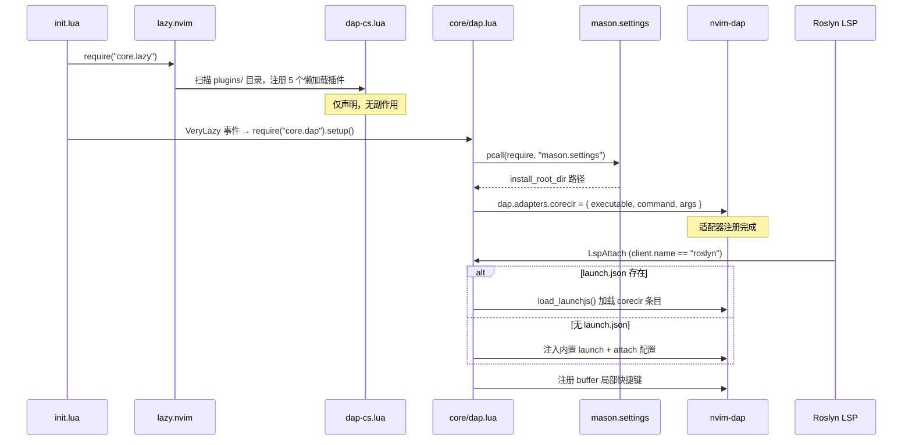
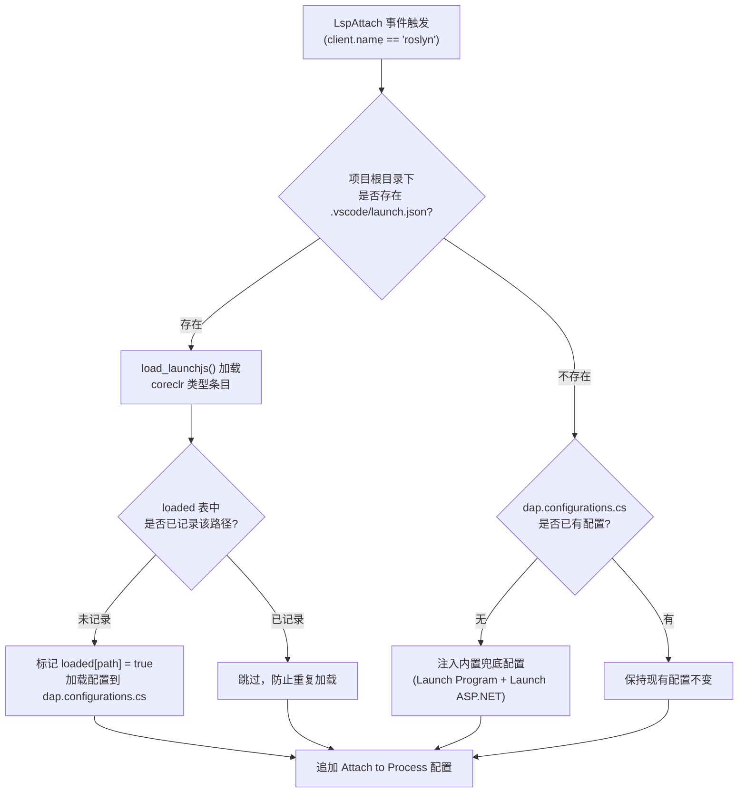

本页深入剖析 Neovim DAP（Debug Adapter Protocol）子系统中 C# / .NET 调试能力的完整构建过程——从插件声明、适配器注册、到启动配置的加载与兜底策略。这是一个**声明与运行时严格分层**的架构：插件定义在 `lua/plugins/dap-cs.lua` 中以懒加载方式注册，而所有运行时初始化逻辑则集中在 `lua/core/dap.lua`，由 `VeryLazy` 生命周期事件驱动。理解这一分层是掌握整个调试链路的前提。

Sources: [dap-cs.lua](lua/plugins/dap-cs.lua#L1-L25), [dap.lua](lua/core/dap.lua#L1-L4), [init.lua](init.lua#L17-L22)

## 架构总览：两阶段初始化模型

整个 C# DAP 调试系统的初始化可以划分为两个明确分离的阶段。**声明阶段**发生在 lazy.nvim 加载插件目录时，仅将五个调试相关插件注册到包管理器中，全部标记为 `lazy = true`，不触发任何实际的初始化逻辑。**运行时阶段**则在 `VeryLazy` 事件触发后启动，此时所有插件已就绪，`core/dap.lua` 的 `setup()` 函数被调用，开始注册适配器、配置 UI、挂载 `LspAttach` 自动命令。



**声明阶段**的五个插件构成完整的调试工具链，各自职责清晰划分：

| 插件 | 职责 | 依赖 |
|------|------|------|
| `mfussenegger/nvim-dap` | DAP 协议核心客户端 | 无 |
| `nvim-neotest/nvim-nio` | 异步 I/O 库（dap-ui 运行时依赖） | 无 |
| `rcarriga/nvim-dap-ui` | 调试面板 UI（变量、调用栈、REPL） | nvim-dap, nvim-nio |
| `theHamsta/nvim-dap-virtual-text` | 行内变量值虚拟文本显示 | nvim-dap, nvim-treesitter |
| `nvim-telescope/telescope-dap.nvim` | Telescope DAP 扩展（配置选择、断点列表） | nvim-dap, telescope |
| `nvim-telescope/telescope-ui-select.nvim` | 统一 `vim.ui.select` 为 Telescope 下拉框 | telescope |

Sources: [dap-cs.lua](lua/plugins/dap-cs.lua#L1-L25), [init.lua](init.lua#L17-L22)

## 适配器注册：netcoredbg 的发现与绑定

适配器是 DAP 架构中的**翻译层**——它将 nvim-dap 发出的 DAP 协议请求翻译为底层调试引擎能够理解的指令。本配置使用 `netcoredbg` 作为 .NET 的调试适配器，通过 Mason 包管理器安装，注册类型为 `executable`（即 nvim-dap 将其作为独立子进程启动并通过 stdin/stdout 通信）。

### 路径解析策略

适配器注册的核心是正确定位 `netcoredbg` 可执行文件的路径。代码通过 `mason.settings.current.install_root_dir` 获取 Mason 的安装根目录，然后按照 Mason 的包目录约定拼接出最终路径。在 Windows 上选择 `.exe` 后缀，在 Unix 系统上则不带后缀：

```
{mason_root}/packages/netcoredbg/netcoredbg/netcoredbg[.exe]
```

注册的适配器结构体为：

```lua
dap.adapters.coreclr = {
  type    = "executable",
  command = cmd,                          -- Mason 路径下的 netcoredbg 可执行文件
  args    = { "--interpreter=vscode" },   -- 使用 VS Code 兼容的协议解释器
}
```

`--interpreter=vscode` 参数指示 netcoredbg 使用 VS Code Debug Adapter 协议变体进行通信，这是 nvim-dap 所期望的交互模式。如果 Mason 的 settings 模块加载失败（例如 Mason 未安装），整个适配器注册块会被 `pcall` 静默跳过，不会导致启动报错。同时，若 `netcoredbg` 可执行文件不存在于磁盘上，系统会发出一条 WARN 级别的通知，提示用户运行 `:MasonInstall netcoredbg`。

Sources: [dap.lua](lua/core/dap.lua#L104-L120)

### SharpDbg 替代方案（已注释保留）

在当前代码中以注释形式保留了一套基于 `sharpdbg` 的替代适配器方案。SharpDbg 是一个实验性的 .NET 调试器项目，其路径解析逻辑与 netcoredbg 不同——它从 lazy.nvim 的插件安装目录中定位编译产物 `SharpDbg.Cli.exe`。这段代码目前处于禁用状态，但保留了切换的可行性：只需取消注释并注释掉 netcoredbg 段落即可切换调试后端。

Sources: [dap.lua](lua/core/dap.lua#L121-L135)

## 启动配置：三层配置优先级体系

启动配置（launch configuration）定义了调试会话的启动参数——目标程序、工作目录、环境变量等。本系统实现了一个**三层优先级**的配置解析链：



### 第一层：launch.json 文件加载

当 Roslyn LSP 附加到某个 `.cs` buffer 时，系统首先调用 `project_root()` 函数确定项目根目录——该函数通过 [cs_solution](lua/cs_solution.lua) 模块的 `find_sln()` 从 buffer 文件所在目录向上遍历最多 6 层目录查找 `.sln` 文件，以 `.sln` 所在目录作为项目根。若找不到 `.sln`，则回退到 buffer 文件的目录本身。

在项目根目录下，系统检查 `.vscode/launch.json` 是否存在。若存在，则调用 `dap.ext.vscode` 提供的 `load_launchjs()` 函数加载该 JSON 文件，但**仅提取 `type: "coreclr"` 的配置条目**到 `dap.configurations.cs`——其他类型（如 `chrome`、`node` 等）会被自动过滤。一个 `loaded` 哈希表记录了已加载的 launch.json 绝对路径，确保在多 buffer 场景下（同一项目中打开多个 `.cs` 文件，每个都触发 `LspAttach`）不会重复追加配置。

Sources: [dap.lua](lua/core/dap.lua#L9-L13), [dap.lua](lua/core/dap.lua#L162-L176), [cs_solution.lua](lua/cs_solution.lua#L143-L155)

### 第二层：内置兜底配置

当项目不存在 `.vscode/launch.json` 且 `dap.configurations.cs` 尚未被设置时，系统注入两个内置的 launch 配置作为兜底方案。这两个配置共享相同的 DLL 检测逻辑和 `cwd` 解析，区别仅在于 ASP.NET 配置额外注入了 `ASPNETCORE_ENVIRONMENT` 环境变量：

| 配置名称 | 类型 | 环境变量 | 适用场景 |
|----------|------|----------|----------|
| `.NET: Launch Program` | launch | 无 | 控制台应用、类库调试 |
| `.NET: Launch ASP.NET` | launch | `ASPNETCORE_ENVIRONMENT=Development` | ASP.NET Core Web 应用 |

**DLL 路径检测**是兜底配置的核心机制。`pick_dll()` 函数从项目根目录执行 glob 搜索 `**/bin/Debug/**/*.dll`，过滤掉 `obj/` 目录下的中间产物，将第一个匹配结果作为预填充默认值。若 glob 未找到任何 DLL，则回退到约定的路径 `bin/Debug/net8.0/App.dll`。用户在调试启动时会看到 `vim.fn.input()` 输入框，其中已填入检测到的路径，可直接按回车确认或手动修改。

Sources: [dap.lua](lua/core/dap.lua#L17-L26), [dap.lua](lua/core/dap.lua#L177-L186)

### 第三层：Attach 配置（始终追加）

无论前两层配置的结果如何，系统都会检查 `dap.configurations.cs` 中是否已存在名为 `.NET: Attach to Process` 的 attach 配置。若不存在则追加一个。这个配置使用 `dap.utils.pick_process` 提供进程选择器，允许用户从正在运行的 .NET 进程列表中选择一个进行附加调试。Attach 配置的设计意图是与 [热重载功能](lua/core/dap.lua#L80-L99) 配合——`dotnet watch run` 启动后，通过 attach 模式连接到已运行的进程。

Sources: [dap.lua](lua/core/dap.lua#L188-L203)

## UI 组件与生命周期绑定

在适配器和启动配置之外，`setup()` 函数还初始化了三个 UI 层面的组件，它们通过 DAP 事件监听器与调试会话的生命周期绑定：

**dap-ui 自动开闭**——通过注册三个事件监听器实现：`event_initialized` 触发 `dapui.open()`，`event_terminated` 和 `event_exited` 触发 `dapui.close()`。这意味着每次调试会话启动时面板自动展开（显示变量、调用栈、断点等面板），会话结束时面板自动收起，恢复原始窗口布局。

**nvim-dap-virtual-text**——调用 `setup()` 以默认配置启用。该插件在调试器暂停时将当前作用域变量的值以虚拟文本形式显示在代码行右侧，提供即时可见的变量状态反馈，无需打开 dap-ui 面板。会话结束后虚拟文本自动清除。

**Telescope DAP 扩展**——通过 `load_extension("dap")` 加载，同时配置 `ui-select` 扩展将 `vim.ui.select` 替换为 Telescope 下拉框样式。这使得 DAP 配置选择器、进程选择器等交互均通过 Telescope 界面呈现。

Sources: [dap.lua](lua/core/dap.lua#L137-L160)

## LspAttach 驱动的 Buffer 级初始化

整个配置加载和快捷键注册的入口是一个 `LspAttach` 自动命令，但其内部有一个严格的**守卫条件**：`client.name ~= "roslyn"` 时立即返回。这意味着所有 DAP 相关的初始化——包括配置加载、attach 配置注入、buffer 局部快捷键注册——**仅在 Roslyn LSP 附加到 buffer 时触发**。这一设计确保了：

1. **语言隔离**：非 C# 文件不会获得 C# 调试快捷键，避免与其他语言的 DAP 配置冲突
2. **时机正确**：LspAttach 意味着 LSP 已完成初始化，此时访问项目结构信息（`.sln`、`.csproj`）是安全的
3. **按需加载**：只有实际打开 C# 文件时才触发配置解析，不会影响其他语言文件的启动速度

自动命令以 `dap-cs` 为组名并设置 `clear = true`，确保每次重新加载配置时不会产生重复的自动命令组。

Sources: [dap.lua](lua/core/dap.lua#L162-L167)

## cs_solution 联动：项目路径推断引擎

DAP 配置中多处依赖 [cs_solution 模块](lua/cs_solution.lua) 的路径推断能力。`project_root()` 函数是该模块在 DAP 上下文中的封装入口，它将 `.sln` 文件所在目录作为所有路径计算的基准——包括 `cwd`（工作目录）和 DLL glob 搜索的起始点。

`find_sln()` 的实现逻辑是从 buffer 文件所在目录开始，逐级向上搜索 `.sln` 文件，最多遍历 6 层。这种向上遍历的设计适用于 `.cs` 文件位于项目子目录深层（如 `src/MyApp/Controllers/HomeController.cs`）的场景，能够正确找到位于解决方案根目录的 `.sln` 文件。当遍历到文件系统根目录（父目录与当前目录相同）或超过 6 层仍未找到时，返回 `nil`，此时 `project_root()` 回退到 buffer 文件所在目录。

Sources: [cs_solution.lua](lua/cs_solution.lua#L143-L155), [dap.lua](lua/core/dap.lua#L9-L14)

## Continue / Pick Config 双模式启动

快捷键 `<leader>dc` 和 `<F5>` 绑定到一个精心设计的 `continue_or_pick()` 函数，该函数根据当前调试会话状态呈现不同的行为：

- **存在活跃会话**（`dap.session()` 非 nil）：直接调用 `dap.continue()` 继续执行
- **无活跃会话**：打开 Telescope DAP 配置选择器，以 `language_filter` 过滤仅显示 `cs` 类型配置，用户选择后启动新会话

这种双模式设计消除了「继续执行」和「选择配置启动」两个操作之间的模式切换负担——同一个按键在不同上下文中自动选择正确的行为。当 Telescope DAP 扩展不可用时（`ok_tel` 为 false），退化为直接调用 `dap.continue()`，由 nvim-dap 内置的配置选择器接管。

Sources: [dap.lua](lua/core/dap.lua#L211-L221), [dap.lua](lua/core/dap.lua#L229-L230)

## 完整快捷键映射表

以下快捷键通过 buffer 局部映射注册，仅在 Roslyn LSP 附加的 `.cs` buffer 中生效。系统提供了 `<leader>d` 前缀和 `F` 功能键两套并行的操作入口：

| Leader 快捷键 | F 键等效 | 功能 | 实现方式 |
|---------------|---------|------|----------|
| `<leader>dc` | `<F5>` | 启动 / 继续调试 | `continue_or_pick()` |
| `<leader>do` | `<F10>` | 单步跳过 | `dap.step_over` |
| `<leader>di` | `<F11>` | 单步进入 | `dap.step_into` |
| `<leader>dO` | `<S-F11>` | 单步跳出 | `dap.step_out` |
| `<leader>db` | `<F9>` | 切换断点 | `dap.toggle_breakpoint` |
| `<leader>dB` | — | 条件断点 | `dap.set_breakpoint(input)` |
| `<leader>dq` | `<S-F5>` | 终止调试 | `dap.terminate()` + `dapui.close()` |
| `<leader>dE` | — | 修改变量值 | `set_variable()` |
| `<leader>dh` | — | 热重载 | `hot_reload()` (dotnet watch + attach) |
| `<leader>dr` | — | 打开 REPL | `dap.repl.open` |
| `<leader>du` | — | 切换 UI 面板 | `dapui.toggle()` |
| `<leader>dl` | — | 列出断点 | Telescope `list_breakpoints` |
| `<leader>df` | — | 显示栈帧 | Telescope `frames` |
| `<leader>dv` | — | 查看变量 | Telescope `variables` |

Sources: [dap.lua](lua/core/dap.lua#L205-L276)

## 延伸阅读

本文聚焦于适配器注册与启动配置的架构设计。以下页面提供了相关联的深层内容：

- [DAP 调试操作：断点、单步、变量修改与热重载](11-dap-diao-shi-cao-zuo-duan-dian-dan-bu-bian-liang-xiu-gai-yu-re-zhong-zai)——深入解析 `set_variable()`、`hot_reload()` 等运行时功能的实现细节
- [cs_solution 模块：.sln / .csproj 解析与 Glob 匹配引擎](10-cs_solution-mo-kuai-sln-csproj-jie-xi-yu-glob-pi-pei-yin-qing)——`find_sln()`、`is_in_solution()` 等函数的完整解析
- [Roslyn LSP 集成与解决方案管理](7-roslyn-lsp-ji-cheng-yu-jie-jue-fang-an-guan-li)——LspAttach 事件与 Roslyn 客户端的配置上下文
- [Lualine 状态栏与 DAP/Lazy 状态集成](28-lualine-zhuang-tai-lan-yu-dap-lazy-zhuang-tai-ji-cheng)——调试状态在状态栏中的可视化呈现