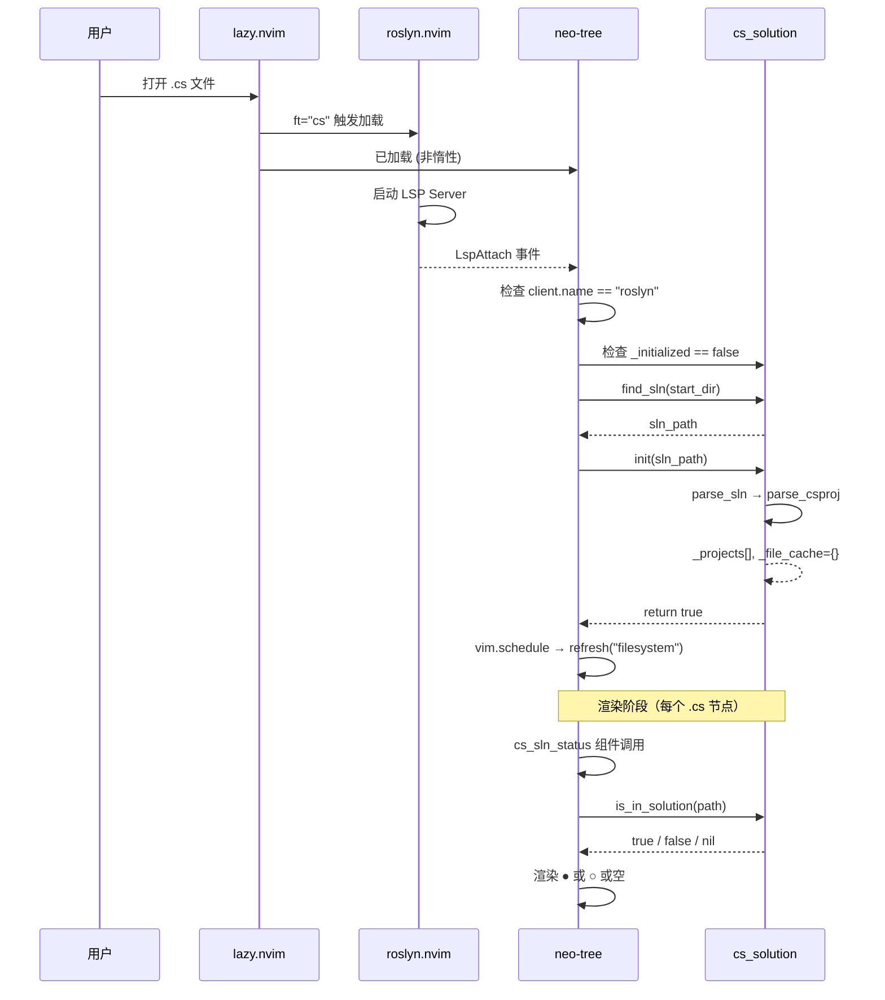

本文档解析 neo-tree 文件浏览器中 **.cs 文件归属状态图标** 的完整实现——从 Roslyn LSP 触发初始化、`cs_solution` 模块解析解决方案结构，到自定义 neo-tree 渲染组件将解析结果可视化为一目了然的 `●` / `○` 标记。这是本配置中 **语言感知文件树** 体验的核心视觉层，让开发者在浏览目录结构时就能立即识别哪些 `.cs` 文件正在被解决方案编译、哪些是游离于项目之外的孤立文件。

Sources: [neo-tree.lua](lua/plugins/neo-tree.lua#L1-L111), [cs_solution.lua](lua/cs_solution.lua#L1-L227)

## 问题背景：为什么需要归属状态显示

在 .NET 项目中，目录结构与编译结构并不总是一一对应的。SDK 风格的 `.csproj` 默认将项目目录下所有 `.cs` 文件纳入编译（所谓"自动通配"机制），但通过 `<Compile Remove="..."/>` 可以排除特定文件；传统风格 `.csproj` 则只编译显式 `<Compile Include="..."/>` 列出的文件。无论哪种情况，文件系统中都可能出现 **不被编译的 .cs 文件**——它们可能是废弃的旧代码、临时实验文件，或者忘记加入项目的新文件。

在 VS Code 或 Visual Studio 中，Solution Explorer 会按项目结构过滤显示，游离文件通常不会出现在视图中。但 neo-tree 作为通用文件浏览器，按物理目录结构展示所有文件，无法区分"在解决方案中"和"不在解决方案中"的 `.cs` 文件。本配置通过自定义 neo-tree 组件解决了这一问题：

| 状态 | 图标 | 高亮组 | 含义 |
|------|------|--------|------|
| 在解决方案中 | `●`（实心圆点） | `DiagnosticOk`（绿色） | 该 `.cs` 文件被解决方案中的某个 `.csproj` 编译 |
| 不在解决方案中 | `○`（空心圆圈） | `DiagnosticWarn`（黄色） | 该 `.cs` 文件未被任何 `.csproj` 编译 |
| 未初始化 | 无图标 | — | `cs_solution` 模块尚未初始化（Roslyn 未 attach 或未找到 .sln） |

Sources: [neo-tree.lua](lua/plugins/neo-tree.lua#L88-L93)

## 架构全景：从 LSP Attach 到视觉反馈的完整链路

归属状态显示不是 neo-tree 的独立功能，而是一条横跨三个模块的 **数据管道**：`roslyn.nvim` 提供触发时机、`cs_solution` 提供解析数据、`neo-tree` 负责渲染呈现。理解这条管道的完整流转是定位归属状态问题的关键。



这条链路的设计有一个核心特征：**懒初始化 + 一次解析 + 缓存查询**。`.sln` 文件的解析只在 Roslyn 首次 attach 时执行一次（通过 `_initialized` 标志位守卫），之后每个 `.cs` 文件的状态查询走 `_file_cache` 的 O(1) 哈希查找，不会对 neo-tree 的渲染性能造成可感知的影响。

Sources: [neo-tree.lua](lua/plugins/neo-tree.lua#L14-L35), [cs_solution.lua](lua/cs_solution.lua#L160-L171), [cs_solution.lua](lua/cs_solution.lua#L176-L224)

## 触发机制：LspAttach 守卫模式

neo-tree 中的初始化逻辑注册在 `LspAttach` autocmd 上，而非 `FileType` 或 `BufRead` 等更早的事件。这个选择是有深意的——归属状态数据完全依赖于 `.sln` 文件的解析结果，而 `.sln` 文件只在 C# 工作区中存在，只有 Roslyn LSP 实际启动并 attach 时才能确认当前工作区确实是一个 C# 解决方案。

```lua
vim.api.nvim_create_autocmd("LspAttach", {
  callback = function(args)
    local client = vim.lsp.get_client_by_id(args.data.client_id)
    if not (client and client.name == "roslyn") then return end

    local cs_sln = require("cs_solution")
    if cs_sln._initialized then return end

    local buf_path = vim.api.nvim_buf_get_name(args.buf)
    local start_dir = vim.fn.fnamemodify(buf_path, ":h")
    local sln_path = cs_sln.find_sln(start_dir)

    if cs_sln.init(sln_path) then
      vim.schedule(function()
        pcall(function()
          require("neo-tree.sources.manager").refresh("filesystem")
        end)
      end)
    end
  end,
})
```

这段代码包含三层守卫逻辑，每一层都有明确的过滤目的：

| 守卫层 | 条件 | 过滤目标 |
|--------|------|----------|
| 第一层 | `client.name == "roslyn"` | 排除非 Roslyn LSP client（如 `lua_ls`、`tsserver`）触发的 `LspAttach` |
| 第二层 | `cs_sln._initialized == false` | 确保整个会话中只执行一次解析，避免多次 `LspAttach` 重复初始化 |
| 第三层 | `cs_sln.init(sln_path)` 返回 `true` | 确认 `.sln` 文件确实存在且解析成功 |

初始化成功后的刷新操作被包裹在 `vim.schedule()` 和 `pcall()` 双重保护中。`vim.schedule()` 将刷新推迟到 Neovim 事件循环的下一轮迭代，避免在 `LspAttach` 回调中直接触发 neo-tree 的重新渲染导致潜在的递归或阻塞。`pcall()` 则是防御性编程——如果 neo-tree 尚未完全加载或处于不可刷新的状态，静默失败而非抛出错误中断 LSP attach 流程。

Sources: [neo-tree.lua](lua/plugins/neo-tree.lua#L14-L35)

## 自定义渲染组件：cs_sln_status 的实现

neo-tree 通过 `components` 和 `renderers` 两层配置实现自定义渲染。`cs_sln_status` 是注册在 `components` 表中的一个 **函数式组件**，接收 `config`、`node`、`_state` 三个参数，返回一个渲染描述表。

### 组件函数的三态逻辑

```lua
cs_sln_status = function(config, node, _state)
  if node.type ~= "file" then return {} end
  local path = node.path or ""
  if not path:match("%.cs$") then return {} end

  local cs_sln = require("cs_solution")
  local in_sln = cs_sln.is_in_solution(path)

  if in_sln == true then
    return { text = config.symbol_in, highlight = config.hl_in }
  elseif in_sln == false then
    return { text = config.symbol_out, highlight = config.hl_out }
  end
  -- nil：未初始化，不显示
  return {}
end,
```

组件的返回值严格对应三种状态，每种状态的渲染语义完全不同：

| `is_in_solution` 返回值 | 组件返回 | 视觉效果 | 触发条件 |
|--------------------------|----------|----------|----------|
| `true` | `{ text = "● ", highlight = "DiagnosticOk" }` | 绿色实心圆点 | `.cs` 文件被某个 `.csproj` 编译 |
| `false` | `{ text = "○ ", highlight = "DiagnosticWarn" }` | 黄色空心圆圈 | `.cs` 文件未被任何 `.csproj` 编译 |
| `nil` | `{}`（空表） | 无任何渲染输出 | 非 `.cs` 文件，或 `cs_solution` 未初始化 |

值得注意的是，前两层过滤（`node.type ~= "file"` 和 `not path:match("%.cs$")`）在调用 `is_in_solution()` 之前就已完成，这意味着对于目录节点和非 C# 文件，**不会产生任何函数调用开销**——直接返回空表跳过。`is_in_solution()` 内部也有相同的 `.cs` 扩展名检查，但组件层面的提前过滤避免了不必要的 Lua 模块加载和函数调用。

Sources: [neo-tree.lua](lua/plugins/neo-tree.lua#L62-L79)

### 渲染器配置：组件在文件行中的位置

`renderers.file` 表定义了文件类型节点的渲染顺序，`cs_sln_status` 被精确地放置在 `icon` 之后、`container` 之前：

```lua
renderers = {
  file = {
    { "indent" },          -- 缩进 + 展开箭头
    { "icon" },            -- 文件图标（通过 nvim-web-devicons）
    {                      -- ↓ 自定义归属状态组件 ↓
      "cs_sln_status",
      symbol_in = "● ",    -- 在解决方案中
      hl_in = "DiagnosticOk",
      symbol_out = "○ ",   -- 不在解决方案中
      hl_out = "DiagnosticWarn",
    },
    {                      -- container 包裹其余标准组件
      "container",
      content = {
        { "name",           zindex = 10 },
        { "symlink_target", zindex = 10, highlight = "NeoTreeSymbolicLinkTarget" },
        { "clipboard",      zindex = 10 },
        { "bufnr",          zindex = 10 },
        { "modified",       zindex = 20, align = "right" },
        { "diagnostics",    zindex = 20, align = "right" },
        { "git_status",     zindex = 10, align = "right" },
      },
    },
  },
},
```

neo-tree 的渲染器是一个 **线性流水线**：每个条目按顺序向右追加渲染内容。`cs_sln_status` 的位置决定了它在视觉上紧跟文件图标、位于文件名之前，形成 `📁 ● filename.cs` 的直观布局。`config` 表中的 `symbol_in`、`hl_in`、`symbol_out`、`hl_out` 四个参数通过 neo-tree 的组件配置机制传递给组件函数的 `config` 参数，实现了 **视觉定义与逻辑判断的分离**——修改图标或颜色只需改配置，无需触碰组件函数。

Sources: [neo-tree.lua](lua/plugins/neo-tree.lua#L83-L107)

## 数据源集成：cs_solution 的查询接口

`cs_sln_status` 组件的核心数据源是 `cs_solution` 模块的 `is_in_solution()` 函数。本节聚焦于组件如何消费该 API，完整的解析引擎实现细节请参阅 [cs_solution 模块：.sln / .csproj 解析与 Glob 匹配引擎](10-cs_solution-mo-kuai-sln-csproj-jie-xi-yu-glob-pi-pei-yin-qing)。

### 查询流程

`is_in_solution(file_path)` 的内部执行路径如下：

```mermaid
flowchart TD
    A["is_in_solution(path)"] --> B{path 匹配 %.cs$?}
    B -->|否| C["return nil"]
    B -->|是| D{_initialized?}
    D -->|否| C
    D -->|是| E["normalize(path)"]
    E --> F{_file_cache[norm]?}
    F -->|命中| G["return cache value"]
    F -->|未命中| H["遍历 _projects"]
    H --> I{当前 proj.sdk?}
    I -->|SDK 风格| J["前缀匹配 + glob 排除"]
    I -->|传统风格| K["精确匹配 includes"]
    J --> L{排除列表匹配?}
    L -->|是| M["excluded = true"]
    L -->|否| N["result = true"]
    K --> O{includes 包含 norm?}
    O -->|是| N
    O -->|否| P["检查显式 Include"]
    M --> P
    P --> Q{显式 Include 匹配?}
    Q -->|是| N
    Q -->|否| R["result = false"]
    N --> S["写入 _file_cache"]
    R --> S
    S --> T["return result"]
```

SDK 风格和传统风格 `.csproj` 的判断逻辑有本质区别：

| 项目风格 | 编译范围 | 判断策略 | 排除机制 |
|----------|----------|----------|----------|
| SDK 风格 (`<Project Sdk="...">`) | 目录下所有 `.cs` 文件 | 前缀匹配 + glob 排除 | 默认排除 `obj/**`、`bin/**`、`**/*.user`，加上 `<Compile Remove>` 模式 |
| 传统风格 | 仅 `<Compile Include>` 列出的文件 | 精确路径匹配 | 无默认排除，所有文件必须显式声明 |

SDK 风格的判断逻辑尤其精妙：首先检查文件路径是否以项目目录为前缀（快速排除不在该项目目录下的文件），然后对相对路径执行 glob 排除检查，最后再检查显式 `<Compile Include>`（处理链接文件等特殊情况）。这种 **前缀快速筛选 → glob 排除 → 精确包含** 的三层策略在保证正确性的同时最大限度地减少了不必要的模式匹配计算。

Sources: [cs_solution.lua](lua/cs_solution.lua#L176-L224), [cs_solution.lua](lua/cs_solution.lua#L97-L121)

### 缓存机制的性能保障

`_file_cache` 是一个以规范化路径为键、布尔值为值的 Lua 表，确保同一个 `.cs` 文件的归属判定只执行一次完整的 glob 匹配：

```lua
local norm = normalize(file_path)
if M._file_cache[norm] ~= nil then return M._file_cache[norm] end
-- ... 执行完整判断 ...
M._file_cache[norm] = result
return result
```

neo-tree 在滚动或刷新时会为每个可见的 `.cs` 文件节点调用一次 `cs_sln_status` 组件函数。在大型解决方案中，一次刷新可能涉及数百个文件节点。缓存机制将这些重复查询从 O(P×G)（P = 项目数 × G = glob 模式数）降为 O(1) 哈希查找，确保 neo-tree 的交互响应不受影响。

`normalize()` 函数在缓存键生成中扮演关键角色：它将路径中的 `\` 替换为 `/`、去除末尾分隔符、在 Windows 上转换为小写，确保 `C:\Project\A.cs` 和 `c:/project/a.cs` 映射到同一个缓存条目。

Sources: [cs_solution.lua](lua/cs_solution.lua#L180-L182), [cs_solution.lua](lua/cs_solution.lua#L10-L16)

## 设计决策分析

### 为何通过 LspAttach 而非 BufRead 触发初始化

将 `.sln` 解析的触发点放在 `LspAttach` 而非 `BufRead` 或 `FileType` 事件上，是一个有意的架构选择。`BufRead` 在打开任何文件时都会触发，但 `.sln` 解析只在 C# 工作区中有意义。`LspAttach` 天然提供了这个过滤——只有 Roslyn LSP 成功启动并附加到 buffer 时，才能确认当前工作区确实包含 `.sln` 文件。这避免了在非 .NET 项目（如纯 Lua 配置编辑场景）中执行无意义的 `.sln` 搜索。

### 为何初始化只执行一次

`_initialized` 标志位确保 `.sln` 解析在整个 Neovim 会话中只执行一次。这个设计基于以下假设：一个 Neovim 会话通常只对应一个解决方案。如果用户需要切换解决方案，需要重启 Neovim（或手动修改 `_initialized` 标志位后重新触发）。这与 Roslyn LSP 的 `lock_target = true` 策略一致——解决方案选择是一次性的持久决策。

### 为何组件配置与组件逻辑分离

`symbol_in`、`hl_in`、`symbol_out`、`hl_out` 四个参数定义在 `renderers.file` 的配置表中，而非硬编码在组件函数内。这种分离允许用户修改视觉表现（如将图标改为 `✓` / `✗`，或更改高亮组）而无需理解组件逻辑，同时保持组件函数纯粹负责"根据数据返回渲染描述"的单一职责。

Sources: [neo-tree.lua](lua/plugins/neo-tree.lua#L15-L21), [cs_solution.lua](lua/cs_solution.lua#L4-L6), [neo-tree.lua](lua/plugins/neo-tree.lua#L88-L93)

## 故障排查

| 症状 | 可能原因 | 诊断方法 | 解决方案 |
|------|----------|----------|----------|
| 所有 `.cs` 文件旁都没有图标 | `cs_solution` 未初始化 | `:lua print(require("cs_solution")._initialized)` 输出 `false` | 确认 Roslyn LSP 已启动（`:LspInfo`），确认工作区中有 `.sln` 文件 |
| 所有 `.cs` 文件都显示 `○` | `.sln` 解析成功但匹配失败 | `:lua print(vim.inspect(require("cs_solution")._projects))` 检查项目列表是否为空 | 确认 `.sln` 中引用的 `.csproj` 路径正确 |
| 图标出现但高亮颜色不对 | `DiagnosticOk` / `DiagnosticWarn` 高亮组被主题覆盖 | `:highlight DiagnosticOk` 和 `:highlight DiagnosticWarn` 检查颜色定义 | 在主题配置中调整对应高亮组，或修改 `hl_in` / `hl_out` 为自定义高亮组 |
| 修改 `.csproj` 后图标不更新 | `_file_cache` 中的旧数据未失效 | 这是已知行为——缓存不自动失效 | 重启 Neovim 以清空缓存并重新解析 |
| neo-tree 刷新后图标消失 | `vim.schedule` 中的 `pcall` 静默失败 | 检查 `:messages` 是否有错误 | 手动执行 `:lua require("neo-tree.sources.manager").refresh("filesystem")` |

Sources: [neo-tree.lua](lua/plugins/neo-tree.lua#L28-L33), [cs_solution.lua](lua/cs_solution.lua#L168-L170)

## 相关页面

- [Roslyn LSP 集成与解决方案管理](7-roslyn-lsp-ji-cheng-yu-jie-jue-fang-an-guan-li) — LspAttach 触发链路的完整上下文与 Roslyn 配置
- [cs_solution 模块：.sln / .csproj 解析与 Glob 匹配引擎](10-cs_solution-mo-kuai-sln-csproj-jie-xi-yu-glob-pi-pei-yin-qing) — `find_sln()`、`init()`、`is_in_solution()` 的完整实现解析
- [neo-tree 文件浏览器配置](18-neo-tree-wen-jian-liu-lan-qi-pei-zhi) — neo-tree 的基础配置与通用功能
- [C# DAP 调试器：从适配器注册到启动配置](8-c-dap-diao-shi-qi-cong-gua-pei-qi-zhu-ce-dao-qi-dong-pei-zhi) — DAP 调试器同样依赖 `cs_solution` 提供的项目结构信息