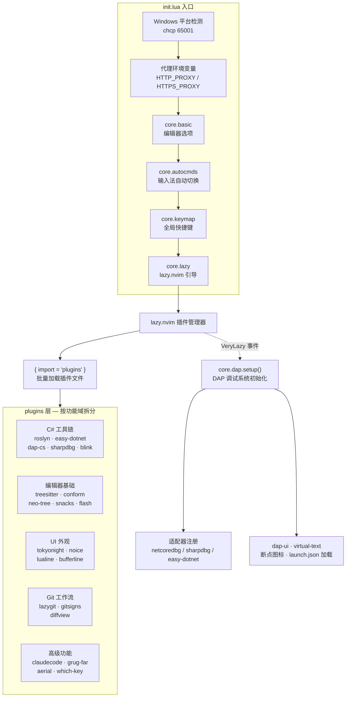
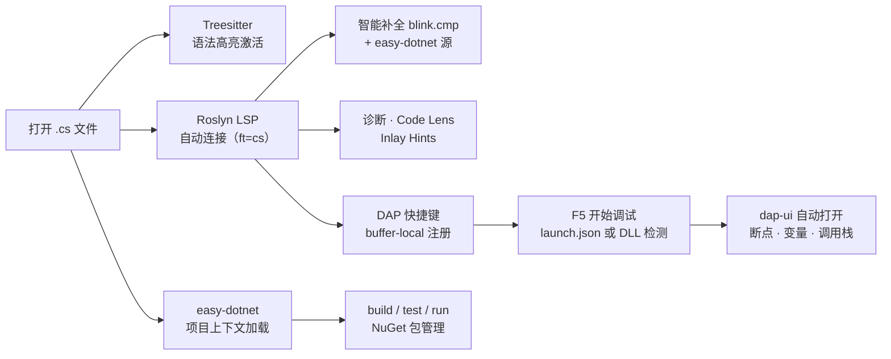

本页是整个文档的知识入口。你将了解这套 Neovim 配置框架的**设计动机、整体架构、核心能力概览**，以及按自身需求选择后续阅读路径的方法。文档面向具有基础 C#/.NET 开发经验、希望用 Neovim 替代或辅助 Visual Studio / VS Code 的开发者，不要求你事先熟悉 Neovim 的 Lua 配置体系。

Sources: [init.lua](init.lua#L1-L23), [README.md](README.md#L1-L5)

## 设计动机与定位

这是一套运行在 **Windows 平台**上的 Neovim 配置框架，核心目标是让 C#/.NET 开发者在 Neovim 中获得接近 IDE 的完整开发体验。项目没有采用 LazyVim 等预置发行版（LazyVim 的导入在 [lazy.lua](lua/core/lazy.lua#L27) 中已被注释掉），而是从零搭建了一套**自主可控**的双模块架构——`core` 层负责编辑器基础设施，`plugins` 层按功能拆分为独立插件文件。这种设计让每个配置单元都可以被独立理解、修改和替换。

整个配置框架围绕三个核心诉求构建：**Roslyn 驱动的 C# 智能补全与诊断**、**多后端 DAP 调试系统**（支持 netcoredbg / sharpdbg / easy-dotnet 三种切换），以及**Windows 平台的原生适配**（PowerShell 7 shell、UTF-8 编码、代理设置、OSC 52 剪贴板转发）。

Sources: [lua/core/lazy.lua](lua/core/lazy.lua#L24-L34), [lua/core/basic.lua](lua/core/basic.lua#L1-L61)

## 架构总览

下图展示了配置框架的启动流程与模块间的依赖关系。从 `init.lua` 入口点开始，四个 `core` 模块按固定顺序加载；随后 lazy.nvim 接管 `plugins` 目录下所有插件的生命周期管理。



Sources: [init.lua](init.lua#L1-L23), [lua/core/lazy.lua](lua/core/lazy.lua#L24-L34), [lua/core/dap.lua](lua/core/dap.lua#L114-L159)

## 目录结构

项目文件严格遵循**关注点分离**原则。`lua/core/` 下是编辑器的基础行为定义，`lua/plugins/` 下每个 `.lua` 文件对应一个独立插件或插件组：

```
.
├── init.lua                    # 入口：Windows 适配 → 加载 core 模块 → VeryLazy 初始化 DAP
├── .neoconf.json               # neoconf 设置（lua_ls 类型提示）
├── stylua.toml                 # Lua 代码格式化规则（2 空格缩进，120 列宽）
├── lazy-lock.json              # 插件版本锁定
├── nvim_edit.ps1               # PowerShell 启动脚本
│
├── lua/
│   ├── core/                   # ── 基础层：编辑器行为 ──
│   │   ├── basic.lua           #   选项集（行号、缩进、Shell、编码、剪贴板）
│   │   ├── autocmds.lua        #   自动命令（输入法切换）
│   │   ├── keymap.lua          #   全局快捷键（Leader、窗口、搜索）
│   │   ├── lazy.lua            #   lazy.nvim 引导与 setup
│   │   ├── dap.lua             #   DAP 核心逻辑（适配器注册、断点、热重载）
│   │   └── dap_config.lua      #   调试器选择配置（当前：sharpdbg）
│   │
│   └── plugins/                # ── 扩展层：功能插件 ──
│       ├── roslyn.lua          #   C# 语言服务器（Roslyn LSP）
│       ├── easy-dotnet.lua     #   .NET 项目管理（build / test / debug / NuGet）
│       ├── blink.lua           #   补全引擎（集成 easy-dotnet 源）
│       ├── dap-cs.lua          #   DAP 插件声明（dap / dap-ui / virtual-text）
│       ├── sharpdbg.lua        #   sharpdbg 调试器插件
│       ├── mason.lua           #   LSP 服务器安装与管理
│       ├── treesitter.lua      #   语法高亮（含 c_sharp、razor）
│       ├── conform.lua         #   保存时自动格式化
│       ├── snacks.lua          #   Dashboard / Picker / Notifier
│       ├── neo-tree.lua        #   文件浏览器
│       ├── tokyonight.lua      #   主题配色
│       └── ...                 #   其余 20+ 插件文件
│
└── openspec/                   #   需求规格与变更管理（工程化文档）
```

Sources: [init.lua](init.lua#L1-L23), [lua/core/basic.lua](lua/core/basic.lua#L1-L62), [lua/core/dap_config.lua](lua/core/dap_config.lua#L1-L10), [stylua.toml](stylua.toml#L1-L3)

## 核心能力概览

下表按功能域汇总了框架提供的主要能力及其对应模块，帮助你快速定位感兴趣的领域：

| 功能域 | 核心能力 | 关键模块 | 详情参阅 |
|:---|:---|:---|:---|
| **C# 语言服务** | Roslyn LSP：智能补全、诊断、Inlay Hints、Code Lens | `roslyn.lua` | [Roslyn LSP 配置](7-roslyn-lsp-pei-zhi-yu-yan-fu-wu-qi-guan-li-yu-jie-jue-fang-an-ding-wei) |
| **调试系统** | 三后端切换（netcoredbg / sharpdbg / easy-dotnet），launch.json 加载，热重载 | `dap.lua`, `dap_config.lua`, `dap-cs.lua`, `sharpdbg.lua` | [DAP 调试系统架构](8-dap-diao-shi-xi-tong-jia-gou-duo-diao-shi-qi-hou-duan-qie-huan-yu-gua-pei-qi-zhu-ce) |
| **项目管理** | build / run / test / clean / restore / NuGet 包管理 / 测试运行器 | `easy-dotnet.lua` | [easy-dotnet 集成](10-easy-dotnet-ji-cheng-xiang-mu-guan-li-ce-shi-yun-xing-yu-nuget-cao-zuo) |
| **代码补全** | blink.cmp 引擎 + easy-dotnet 源 + cmdline 补全 | `blink.lua` | [blink.cmp 补全框架](11-blink-cmp-bu-quan-kuang-jia-easy-dotnet-yuan-ji-cheng-yu-cmdline-bu-quan) |
| **语法高亮** | Treesitter：C#、Razor、Lua、Markdown 等 10 种语言 | `treesitter.lua` | [Treesitter 配置](14-treesitter-pei-zhi-yu-fa-gao-liang-dai-ma-zhe-die-yu-razor-wen-jian-zhi-chi) |
| **代码格式化** | conform.nvim 保存时自动格式化（stylua / prettier / black） | `conform.lua` | [代码格式化](15-dai-ma-ge-shi-hua-conform-nvim-bao-cun-shi-zi-dong-ge-shi-hua) |
| **文件浏览** | neo-tree 文件树 + yazi 终端文件管理器 + snacks picker | `neo-tree.lua`, `yazi.lua`, `snacks.lua` | [文件浏览与项目管理](13-wen-jian-liu-lan-yu-xiang-mu-guan-li-neo-tree-yazi-yu-snacks-picker) |
| **Git 工作流** | lazygit 集成、gitsigns 行内标注、diffview 差异对比 | `lazygit.lua`, `gitsigns.lua`, `diffview.lua` | [Git 工作流](17-git-gong-zuo-liu-lazygit-gitsigns-yu-diffview) |
| **Windows 适配** | PowerShell 7 shell、UTF-8 编码、代理、OSC 52 剪贴板、输入法切换 | `basic.lua`, `autocmds.lua`, `init.lua` | [Windows 平台适配](6-windows-ping-tai-gua-pei-shell-bian-ma-dai-li-yu-jian-tie-ban) |
| **AI 助手** | Claude Code 集成、Codex 集成 | `claudecode.lua`, `codex.lua` | [AI 编码助手集成](21-ai-bian-ma-zhu-shou-ji-cheng-claude-code-pei-zhi-yu-shi-yong) |

Sources: [lua/plugins/roslyn.lua](lua/plugins/roslyn.lua#L1-L67), [lua/core/dap.lua](lua/core/dap.lua#L114-L158), [lua/plugins/easy-dotnet.lua](lua/plugins/easy-dotnet.lua#L1-L92), [lua/plugins/blink.lua](lua/plugins/blink.lua#L1-L126), [lua/plugins/treesitter.lua](lua/plugins/treesitter.lua#L1-L49)

## 启动流程

Neovim 启动时，配置文件的执行遵循以下严格顺序。理解这个流程对于后续排查加载问题至关重要：

1. **Windows 平台检测** — 执行 `chcp 65001` 设置控制台编码为 UTF-8（仅 Windows）
2. **代理环境变量** — 设置 `HTTP_PROXY` / `HTTPS_PROXY` / `NO_PROXY`
3. **基础选项** — 加载 `core/basic.lua`，配置行号、缩进、Shell、编码、剪贴板
4. **自动命令** — 加载 `core/autocmds.lua`，注册输入法自动切换（插入模式中文 / 普通模式英文）
5. **全局快捷键** — 加载 `core/keymap.lua`，设置 Leader 键（空格）和窗口/编辑快捷键
6. **插件管理器** — 加载 `core/lazy.lua`，引导 lazy.nvim 并通过 `{ import = "plugins" }` 批量加载所有插件
7. **DAP 延迟初始化** — 监听 `VeryLazy` 事件，在所有插件加载完成后执行 `core/dap.setup()`

Sources: [init.lua](init.lua#L1-L23), [lua/core/basic.lua](lua/core/basic.lua#L1-L62), [lua/core/keymap.lua](lua/core/keymap.lua#L1-L68)

## C#/.NET 开发工作流一瞥

当你打开一个 `.cs` 文件时，框架会自动激活一整套 C# 开发工具链。以下流程图展示了从打开文件到开始调试的典型路径：



Sources: [lua/plugins/roslyn.lua](lua/plugins/roslyn.lua#L1-L67), [lua/plugins/treesitter.lua](lua/plugins/treesitter.lua#L20-L48), [lua/plugins/easy-dotnet.lua](lua/plugins/easy-dotnet.lua#L1-L92), [lua/core/dap.lua](lua/core/dap.lua#L226-L344)

## 建议阅读路径

根据你的使用场景，推荐以下阅读顺序。左侧为快速入门路径，右侧为深度理解路径：

| 阶段 | 入门路径（快速上手） | 深度路径（理解原理） |
|:---:|:---|:---|
| 1 | [环境搭建与首次启动](2-huan-jing-da-jian-yu-shou-ci-qi-dong) | [配置文件加载流程与启动顺序](3-pei-zhi-wen-jian-jia-zai-liu-cheng-yu-qi-dong-shun-xu) |
| 2 | [快捷键体系](12-kuai-jie-jian-ti-xi-leader-jian-fen-zu-yu-buffer-local-bang-ding-ce-lue) | [双模块分层设计](4-shuang-mo-kuai-fen-ceng-she-ji-core-ji-chu-ceng-yu-plugins-kuo-zhan-ceng) |
| 3 | [Roslyn LSP 配置](7-roslyn-lsp-pei-zhi-yu-yan-fu-wu-qi-guan-li-yu-jie-jue-fang-an-ding-wei) | [lazy.nvim 插件管理](5-lazy-nvim-cha-jian-guan-li-lan-jia-zai-ce-lue-yu-spec-gui-fan) |
| 4 | [DAP 调试系统架构](8-dap-diao-shi-xi-tong-jia-gou-duo-diao-shi-qi-hou-duan-qie-huan-yu-gua-pei-qi-zhu-ce) | [Windows 平台适配](6-windows-ping-tai-gua-pei-shell-bian-ma-dai-li-yu-jian-tie-ban) |
| 5 | [easy-dotnet 集成](10-easy-dotnet-ji-cheng-xiang-mu-guan-li-ce-shi-yun-xing-yu-nuget-cao-zuo) | [调试配置详解](9-diao-shi-pei-zhi-xiang-jie-launch-json-jia-zai-dll-jian-ce-yu-re-zhong-zai) |

如果你是第一次接触 Neovim 配置，建议先按照「入门路径」完成环境搭建和基本操作学习，再根据实际需要深入阅读感兴趣的模块文档。