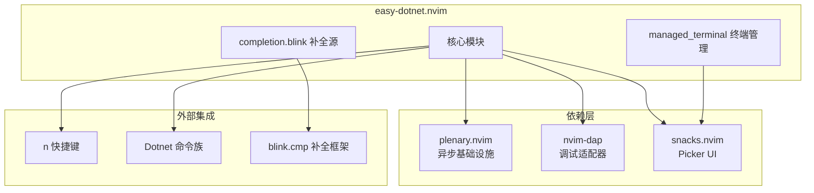
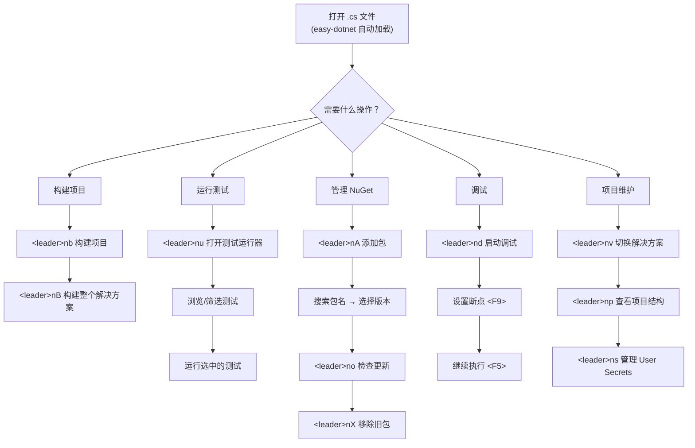

easy-dotnet.nvim 是本配置中 .NET 项目操作的核心枢纽——它将构建、运行、测试、NuGet 包管理、解决方案切换等功能统一到 `<leader>n` 快捷键前缀下，并通过 snacks picker 提供交互式选择器。本文档详细解析其配置结构、快捷键映射、与 DAP 调试系统的条件集成机制，以及与 blink.cmp 补全框架的协作关系。

Sources: [easy-dotnet.lua](lua/plugins/easy-dotnet.lua#L1-L91)

## 插件加载策略与依赖关系

easy-dotnet 采用 **文件类型触发懒加载** 策略，仅在打开 `.cs`、`.csproj`、`.sln`、`.props`、`.fs`、`.fsproj` 文件时才加载，最大限度减少非 .NET 工作场景下的启动开销。其依赖链包含三个关键组件：

| 依赖 | 职责 |
|---|---|
| `nvim-lua/plenary.nvim` | 异步任务、文件操作等基础设施库 |
| `mfussenegger/nvim-dap` | 调试适配器协议支持，用于 `dotnet.debug()` 与调试集成 |
| `folke/snacks.nvim` | 提供统一 picker UI，替代 telescope/fzf 成为选择器后端 |

三者的协作关系如下：plenary 处理底层异步调用，snacks 提供用户交互界面，nvim-dap 则在需要调试时被激活。这种依赖设计确保了插件本身专注于 .NET CLI 命令编排，而非重新实现 UI 或异步基础设施。



Sources: [easy-dotnet.lua](lua/plugins/easy-dotnet.lua#L1-L8)

## 核心配置解析

### 终端管理

`managed_terminal` 控制内置终端窗口的行为。`auto_hide = true` 配合 `auto_hide_delay = 1000` 意味着终端在命令执行完成 1 秒后自动隐藏——这在对 build、restore 等短命令时提供即时反馈后自动清理屏幕空间，避免手动关闭。

Sources: [easy-dotnet.lua](lua/plugins/easy-dotnet.lua#L14-L17)

### LSP 层——显式禁用

`lsp.enabled = false` 是一个重要的架构决策。本配置使用独立的 [Roslyn LSP 配置](7-roslyn-lsp-pei-zhi-yu-yan-fu-wu-qi-guan-li-yu-jie-jue-fang-an-ding-wei) 作为语言服务器，而非 easy-dotnet 内置的 LSP 功能。这种分离确保了 LSP 配置的独立可控性，避免两个插件在语言服务管理上产生冲突。

Sources: [easy-dotnet.lua](lua/plugins/easy-dotnet.lua#L19-L21)

### 调试器条件集成

debugger 配置中最关键的一行是 `auto_register_dap = dap_config.debugger == "easydotnet"`。这通过读取 [DAP 调试系统架构](8-dap-diao-shi-xi-tong-jia-gou-duo-diao-shi-qi-hou-duan-qie-huan-yu-gua-pei-qi-zhu-ce) 中定义的调试器选择器，实现**条件性适配器注册**：

| `dap_config.debugger` 值 | `auto_register_dap` | 实际调试适配器 |
|---|---|---|
| `"netcoredbg"` | `false` | netcoredbg（Mason 安装） |
| `"sharpdbg"` | `false` | SharpDbg（本地编译） |
| `"easydotnet"` | `true` | easy-dotnet 内置 VBCSCompiler 调试器 |

当 `auto_register_dap` 为 `false` 时，easy-dotnet 不注册任何 DAP 适配器，调试完全由 [DAP 调试系统架构](8-dap-diao-shi-xi-tong-jia-gou-duo-diao-shi-qi-hou-duan-qie-huan-yu-gua-pei-qi-zhu-ce) 中的 `coreclr` 适配器承担。但值得注意的是，`dap.adapters["easy-dotnet"]` 始终被注册（在 `core/dap.lua` 中），这确保了 `dotnet.debug()` 命令在任何调试器模式下都能正常启动基于端口的调试会话。

Sources: [easy-dotnet.lua](lua/plugins/easy-dotnet.lua#L23-L29), [dap.lua](lua/core/dap.lua#L160-L167), [dap_config.lua](lua/core/dap_config.lua#L1-L9)

### 测试运行器

test_runner 配置定义了测试执行的 UI 行为：

- **`auto_start_testrunner = true`**：在打开项目时自动启动测试运行器，无需手动触发
- **`viewmode = "float"`**：测试结果以浮动窗口展示，不干扰主编辑区
- **`hide_legend = false`**：显示图例说明，帮助理解图标含义
- **自定义图标**：使用 Nerd Font 图标直观区分测试状态（✓ 通过、⚠ 跳过、✗ 失败等）

Sources: [easy-dotnet.lua](lua/plugins/easy-dotnet.lua#L31-L49)

### Picker 与后台扫描

`picker = "snacks"` 指定使用本配置中已启用的 snacks.nvim picker 作为交互选择器后端。`background_scanning = true` 则启用后台项目扫描，预先索引解决方案中的项目、包引用等信息，使得后续操作（如选择项目、添加 NuGet 包）的响应更迅速。

Sources: [easy-dotnet.lua](lua/plugins/easy-dotnet.lua#L51-L52)

## 快捷键映射体系

所有 .NET 操作统一在 `<leader>n` 前缀下（Leader 键为空格），通过 `vim.keymap.set` 以 `desc = "Dotnet: ..."` 格式注册，确保 which-key 能自动识别并展示分组提示。

### 基础构建与运行

| 快捷键 | 命令 | 功能说明 |
|---|---|---|
| `<leader>nm` | `:Dotnet` | 打开命令菜单（所有 Dotnet 子命令的选择器） |
| `<leader>nb` | `dotnet.build()` | 构建当前项目 |
| `<leader>nB` | `:Dotnet build solution` | 构建整个解决方案 |
| `<leader>nr` | `dotnet.run()` | 运行当前项目 |
| `<leader>nR` | `dotnet.restore()` | 还原 NuGet 包 |
| `<leader>nc` | `dotnet.clean()` | 清理构建输出 |

`<leader>nm` 是万能入口——当不确定具体命令时，通过它打开命令选择器浏览所有可用操作。

Sources: [easy-dotnet.lua](lua/plugins/easy-dotnet.lua#L55-L69)

### 测试操作

| 快捷键 | 命令 | 功能说明 |
|---|---|---|
| `<leader>nt` | `dotnet.test()` | 运行当前项目测试 |
| `<leader>nT` | `:Dotnet test solution` | 运行整个解决方案的测试 |
| `<leader>nu` | `dotnet.testrunner()` | 打开持久化测试运行器 UI |

`<leader>nt` 和 `<leader>nT` 的区别在于作用范围：前者仅测试当前所在项目，后者跨解决方案所有测试项目执行。`<leader>nu` 打开的是一个交互式测试浏览器，支持按项目/类/方法筛选、重跑失败测试、查看测试输出等操作。

Sources: [easy-dotnet.lua](lua/plugins/easy-dotnet.lua#L67-L68), [easy-dotnet.lua](lua/plugins/easy-dotnet.lua#L83)

### NuGet 包管理

| 快捷键 | 命令 | 功能说明 |
|---|---|---|
| `<leader>nA` | `:Dotnet add package` | 添加 NuGet 包（交互搜索并选择版本） |
| `<leader>nX` | `:Dotnet remove package` | 移除 NuGet 包 |
| `<leader>no` | `dotnet.outdated()` | 检查过时的包依赖 |

包管理流程遵循 `添加 → 检查更新 → 移除` 的自然工作流。`<leader>nA` 通过 snacks picker 提供包名搜索与版本选择；`<leader>no` 扫描所有依赖并与 NuGet.org 比对最新版本，帮助及时升级。

Sources: [easy-dotnet.lua](lua/plugins/easy-dotnet.lua#L77-L80)

### 项目与解决方案管理

| 快捷键 | 命令 | 功能说明 |
|---|---|---|
| `<leader>np` | `:Dotnet project view` | 项目浏览器（查看项目引用、包引用） |
| `<leader>nv` | `:Dotnet solution select` | 切换当前活动的解决方案文件 |
| `<leader>nn` | `dotnet.new()` | 创建新 .NET 项目/文件模板 |
| `<leader>nP` | `dotnet.pack()` | 打包项目为 NuGet 包（.nupkg） |
| `<leader>ns` | `dotnet.secrets()` | 管理 User Secrets |

`<leader>nv` 在工作区包含多个 `.sln` 文件时尤为实用——它允许在不同解决方案间快速切换，所有后续操作（构建、测试等）将针对选定的解决方案执行。

Sources: [easy-dotnet.lua](lua/plugins/easy-dotnet.lua#L72-L76), [easy-dotnet.lua](lua/plugins/easy-dotnet.lua#L85-L86)

### 调试与监控

| 快捷键 | 命令 | 功能说明 |
|---|---|---|
| `<leader>nd` | `dotnet.debug()` | 启动调试（使用 easy-dotnet 内置调试器） |
| `<leader>nw` | `dotnet.watch()` | 启动 `dotnet watch`（文件变更时自动重新编译运行） |
| `<leader>nS` | `:Dotnet _server restart` | 重启 easy-dotnet 后台服务 |

`<leader>nd` 与 DAP 调试系统中的 `<leader>dc`（Continue/Pick Config）形成互补：前者通过 easy-dotnet 的内置调试器直接启动项目并附加调试，后者通过 nvim-dap 的标准流程启动。两者共享相同的断点系统和 UI，但启动路径不同。

Sources: [easy-dotnet.lua](lua/plugins/easy-dotnet.lua#L73-L74), [easy-dotnet.lua](lua/plugins/easy-dotnet.lua#L89)

## 与 blink.cmp 的补全集成

easy-dotnet 通过专用的 blink.cmp provider 深度集成到补全系统中。在 [blink.cmp 补全框架](11-blink-cmp-bu-quan-kuang-jia-easy-dotnet-yuan-ji-cheng-yu-cmdline-bu-quan) 的配置中，`easy-dotnet` 被列为默认补全源之一：

```lua
default = { "lsp", "path", "snippets", "buffer", "easy-dotnet" },
providers = {
  ["easy-dotnet"] = {
    name = "easy-dotnet",
    enabled = true,
    module = "easy-dotnet.completion.blink",
    score_offset = 10000,  -- 最高优先级
    async = true,
  },
},
```

`score_offset = 10000` 赋予 easy-dotnet 补全项远高于其他源的优先级——这意味着在编辑 `.cs` 文件时，.NET 相关的类型/方法补全会始终排在候选列表最前。`async = true` 确保补全计算不会阻塞主线程，这对大型解决方案中的类型索引尤为重要。该 provider 由 `easy-dotnet.completion.blink` 模块实现，easy-dotnet.nvim 插件自身提供，无需额外安装。

Sources: [blink.lua](lua/plugins/blink.lua#L55-L69)

## 典型工作流



## 配置决策总结

| 配置项 | 当前值 | 设计意图 |
|---|---|---|
| `ft` 懒加载 | cs/csproj/sln/props/fs/fsproj | 仅 .NET 上下文激活 |
| `lsp.enabled` | `false` | 使用独立 Roslyn LSP，避免双重语言服务 |
| `auto_register_dap` | 条件性 | 根据全局调试器选择决定是否注册适配器 |
| `picker` | `"snacks"` | 统一 UI 体验，复用已有 picker 基础设施 |
| `background_scanning` | `true` | 预索引提升交互响应速度 |
| `viewmode` (test_runner) | `"float"` | 测试结果不干扰编辑区 |
| `score_offset` (blink) | `10000` | .NET 补全项优先级最高 |

这些决策体现了**关注点分离**和**复用已有基础设施**的设计原则：LSP 交给 Roslyn、UI 交给 snacks、调试交给 DAP 生态，easy-dotnet 专注于它最擅长的领域——.NET CLI 命令编排与项目元数据管理。

Sources: [easy-dotnet.lua](lua/plugins/easy-dotnet.lua#L1-L91)

## 延伸阅读

- [DAP 调试系统架构：多调试器后端切换与适配器注册](8-dap-diao-shi-xi-tong-jia-gou-duo-diao-shi-qi-hou-duan-qie-huan-yu-gua-pei-qi-zhu-ce)：了解 easy-dotnet 调试器与其他调试后端的切换机制
- [调试配置详解：launch.json 加载、DLL 检测与热重载](9-diao-shi-pei-zhi-xiang-jie-launch-json-jia-zai-dll-jian-ce-yu-re-zhong-zai)：`<leader>nd` 与 `<leader>dc` 调试启动路径的完整对比
- [blink.cmp 补全框架：easy-dotnet 源集成与 cmdline 补全](11-blink-cmp-bu-quan-kuang-jia-easy-dotnet-yuan-ji-cheng-yu-cmdline-bu-quan)：补全源优先级体系与 async 模式的深入分析
- [Roslyn LSP 配置：语言服务器管理与解决方案定位](7-roslyn-lsp-pei-zhi-yu-yan-fu-wu-qi-guan-li-yu-jie-jue-fang-an-ding-wei)：理解为何 LSP 独立于 easy-dotnet 配置