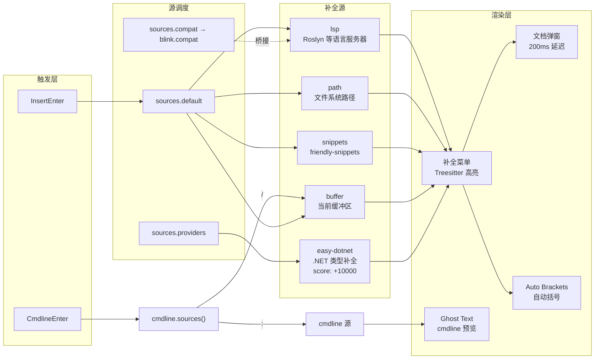

本配置以 **blink.cmp** 替代传统的 nvim-cmp 作为补全引擎，采用其原生 provider 体系将 `easy-dotnet` 的类型补全源直接纳入默认补全链。同时，cmdline 场景下实现了上下文感知的源切换策略——在 `:` 命令行模式下提供命令补全，在 `/` 搜索模式下提供 buffer 关键字补全。本文将从架构决策、源集成机制、cmdline 配置和交互设计四个维度展开深入分析。

Sources: [blink.lua](lua/plugins/blink.lua#L1-L126), [easy-dotnet.lua](lua/plugins/easy-dotnet.lua#L1-L92)

## 架构决策：从 nvim-cmp 到 blink.cmp 的迁移

配置文件开篇即通过 lazy.nvim 的 `optional = true` + `enabled = false` 组合拳显式禁用了 `hrsh7th/nvim-cmp`，确保即使其他插件将其声明为依赖，也不会在运行时加载。这一策略避免了两个补全引擎同时激活导致的行为冲突。

```lua
{
  "hrsh7th/nvim-cmp",
  optional = true,   -- 允许 lazy.nvim 在其他 spec 中找到该插件时合并
  enabled = false,   -- 运行时强制禁用
},
```

blink.cmp 选择 `version = "*"` 锁定稳定发布版本，并通过 `event = { "InsertEnter", "CmdlineEnter" }` 实现按需懒加载——仅在进入插入模式或命令行模式时才触发插件加载，避免正常模式下不必要的初始化开销。其依赖链包含 `friendly-snippets`（通用代码片段集合）和 `blink.compat`（nvim-cmp 源兼容桥接层），后者标记为 `optional = true`，仅在 `sources.compat` 列表中注册了 nvim-cmp 格式源时才会被激活。

Sources: [blink.lua](lua/plugins/blink.lua#L1-L24)

## 源体系架构：五源并行与 easy-dotnet 优先级策略

### 默认补全源链

blink.cmp 的 `sources.default` 定义了五路并行补全源，按声明顺序为：`lsp`、`path`、`snippets`、`buffer`、`easy-dotnet`。其中前四个是 blink.cmp 内置源，而 `easy-dotnet` 是通过 `sources.providers` 注册的自定义 provider：

| 源名称 | 类型 | 触发场景 | 优先级 |
|--------|------|----------|--------|
| `lsp` | 内置 | LSP 服务器活跃的缓冲区 | 默认 |
| `path` | 内置 | 输入文件路径时 | 默认 |
| `snippets` | 内置 | 片段触发词匹配时 | 默认 |
| `buffer` | 内置 | 始终可用（当前缓冲区词汇） | 默认 |
| `easy-dotnet` | 自定义 provider | C# 文件中 | **+10000** |

### easy-dotnet provider 的关键设计

easy-dotnet provider 的配置体现了三个关键决策：

```lua
providers = {
  ["easy-dotnet"] = {
    name = "easy-dotnet",
    enabled = true,
    module = "easy-dotnet.completion.blink",  -- blink.cmp 原生模块路径
    score_offset = 10000,                       -- 极高优先级偏移
    async = true,                               -- 异步获取补全项
  },
},
```

**`module = "easy-dotnet.completion.blink"`** 表明 easy-dotnet 插件内置了 blink.cmp 原生 provider 模块（而非通过 blink.compat 桥接）。这是最高效的集成方式，无需 nvim-cmp 兼容层的转换开销。**`score_offset = 10000`** 将 easy-dotnet 的补全项优先级大幅提升，确保当 LSP 和 easy-dotnet 同时提供候选项时（例如 `using` 语句、NuGet 包引用等场景），easy-dotnet 的 .NET 特有补全始终排在最前。**`async = true`** 标记该源为异步获取，避免补全请求阻塞主线程——这对涉及文件系统扫描和项目元数据解析的 .NET 补全至关重要。

Sources: [blink.lua](lua/plugins/blink.lua#L55-L68)

### blink.compat 桥接机制

配置中预留了 `sources.compat = {}` 空表，配合 `config` 函数中的自动注册逻辑。当需要集成任何 nvim-cmp 格式的源时，只需将其名称加入 `compat` 列表，`config` 函数会自动：

1. 为每个 compat 源创建 `blink.compat.source` 模块的 provider 定义
2. 确保该源被添加到 `default` 列表中
3. 在调用 `blink.cmp.setup()` 前清除 `compat` 字段（blink.cmp 的 `opts` 验证不接受此自定义字段）

这一设计模式允许零配置地将 nvim-cmp 生态源迁移到 blink.cmp 环境。

Sources: [blink.lua](lua/plugins/blink.lua#L104-L123)

## 补全 UI 与交互设计

### 自动括号与 Treesitter 高亮

配置启用了 `auto_brackets` 实验性功能，blink.cmp 在接受补全项时会自动补全匹配的括号对，减少手动输入。补全菜单进一步启用了 Treesitter 高亮——但仅限于 `lsp` 类型的补全项（`treesitter = { "lsp" }`），这意味着 LSP 提供的函数签名、类型名称等会获得语法高亮渲染，而 buffer 和 path 等简单文本补全保持朴素显示，兼顾视觉质量与渲染性能。

文档弹窗（documentation window）配置了 200ms 的 `auto_show_delay_ms`，在光标停留短暂时间后自动展示当前选中补全项的详细文档，无需额外按键触发。

Sources: [blink.lua](lua/plugins/blink.lua#L37-L53)

### super-tab 键位映射

```lua
keymap = {
  preset = "super-tab",
  ["<C-y>"] = { "select_and_accept" },
},
```

`super-tab` 预设提供了经典的 Tab 补全体验：Tab 展开补全菜单、循环候选项；Shift-Tab 反向循环；Enter 接受补全。额外绑定的 `<C-y>` 映射到 `select_and_accept`，提供一种不移动手指到 Tab 键的快速确认方式。与 [快捷键体系：Leader 键分组与 buffer-local 绑定策略](12-kuai-jie-jian-ti-xi-leader-jian-fen-zu-yu-buffer-local-bang-ding-ce-lue) 中描述的全局键位体系配合，形成插入模式与普通模式的无缝衔接。

Sources: [blink.lua](lua/plugins/blink.lua#L99-L102)

## cmdline 上下文感知补全

cmdline 补全是本配置中最精细的设计之一。它根据 `vim.fn.getcmdtype()` 的返回值动态切换补全源：

```mermaid
flowchart TD
    A["CmdlineEnter 事件触发"] --> B{"getcmdtype() ?"}
    B -->|":"| C["命令模式"]
    C --> D["源: cmdline<br/>显示: 自动弹出菜单<br/>Ghost text: 启用<br/>预选: 禁用"]
    B -->|"/" 或 "?"| E["搜索模式"]
    E --> F["源: buffer<br/>补全当前缓冲区词汇"]
    B -->|"其他"| G["空源列表<br/>不触发补全"]
```

### 命令行模式的具体策略

当检测到 `:` 命令行模式时，配置做了一系列精细的 UI 调整：

- **`preselect = false`**：补全菜单出现时不自动选中第一项，避免误操作执行不期望的命令。用户必须显式选择后才触发接受。
- **`auto_show` 条件函数**：仅在 `getcmdtype() == ":"` 时自动显示补全菜单。这排除了 `vim.ui.input()` 等通过 input 模式触发的 cmdline 场景，避免弹出式输入框中出现不合时宜的补全菜单。
- **`ghost_text = { enabled = true }`**：在命令行中以半透明文本预览当前最佳匹配项，用户可直观判断是否需要选择。

键位方面，cmdline 使用独立的 `cmdline` 预设，并显式禁用了 `<Right>` 和 `<Left>` 方向键的默认映射，保留这些键的原生行内光标移动行为。

### 与 noice.nvim 的协同

本配置同时启用了 noice.nvim 的 `cmdline_popup` 视图和 `command_palette` 预设（见 [界面美化系统：tokyonight 主题、noice 命令行、lualine 状态栏](18-jie-mian-mei-hua-xi-tong-tokyonight-zhu-ti-noice-ming-ling-xing-lualine-zhuang-tai-lan)），将命令行渲染为浮动窗口。blink.cmp 的 cmdline 补全菜单在此浮动窗口环境下正常工作，两者形成分层架构——noice 负责命令行的渲染美化，blink.cmp 负责命令行中的补全交互。

Sources: [blink.lua](lua/plugins/blink.lua#L71-L97), [noice.lua](lua/plugins/noice.lua#L36-L58)

## opts_extend 与配置合并策略

配置顶部声明了三个 `opts_extend` 字段：

```lua
opts_extend = {
  "sources.completion.enabled_providers",
  "sources.compat",
  "sources.default",
},
```

`opts_extend` 是 lazy.nvim 的特性，它告诉插件加载器：当多个 spec 文件为同一插件提供 `opts` 时，这三个字段的值应进行**列表合并**而非覆盖。这意味着任何其他插件文件只需返回 `{ "saghen/blink.cmp", opts = { sources = { default = { "my-custom-source" } } } }`，该源就会被追加到已有的五路源链中，而不会破坏现有的源配置。这是 [lazy.nvim 插件管理：懒加载策略与 spec 规范](5-lazy-nvim-cha-jian-guan-li-lan-jia-zai-ce-lue-yu-spec-gui-fan) 中 spec 合并机制的典型应用。

Sources: [blink.lua](lua/plugins/blink.lua#L10-L14)

## 配置全景图

以下是 blink.cmp 在本配置中的完整数据流：



Sources: [blink.lua](lua/plugins/blink.lua#L1-L126)

## 与 easy-dotnet 的协作边界

easy-dotnet 插件本身通过 `ft = { "cs", "csproj", "sln", "props", "fs", "fsproj" }` 进行文件类型懒加载（详见 [easy-dotnet 集成：项目管理、测试运行与 NuGet 操作](10-easy-dotnet-ji-cheng-xiang-mu-guan-li-ce-shi-yun-xing-yu-nuget-cao-zuo)），而 blink.cmp 的 easy-dotnet provider 则在 `InsertEnter` 时被激活。两者的加载时机存在微妙差异：easy-dotnet 的核心功能（构建、测试、调试）仅在 .NET 文件类型中可用，但其补全模块 `easy-dotnet.completion.blink` 由 blink.cmp 的 provider 系统按需调用——当用户在非 .NET 文件中编辑时，该 provider 虽然注册但不会产生有效补全项，不会造成性能负担。

Sources: [easy-dotnet.lua](lua/plugins/easy-dotnet.lua#L1-L4), [blink.lua](lua/plugins/blink.lua#L60-L68)

## 阅读导航

本章聚焦于补全框架本身的技术实现。建议结合以下章节形成完整的编辑器能力图谱：

- **补全源的上游**：[Roslyn LSP 配置：语言服务器管理与解决方案定位](7-roslyn-lsp-pei-zhi-yu-yan-fu-wu-qi-guan-li-yu-jie-jue-fang-an-ding-wei)——理解 `lsp` 源背后的语言服务器如何提供补全数据
- **补全框架的下游**：[界面美化系统：tokyonight 主题、noice 命令行、lualine 状态栏](18-jie-mian-mei-hua-xi-tong-tokyonight-zhu-ti-noice-ming-ling-xing-lualine-zhuang-tai-lan)——noice 与 cmdline 补全的视觉协同
- **插件加载基础设施**：[lazy.nvim 插件管理：懒加载策略与 spec 规范](5-lazy-nvim-cha-jian-guan-li-lan-jia-zai-ce-lue-yu-spec-gui-fan)——理解 `opts_extend`、`optional`、懒加载事件的工作原理