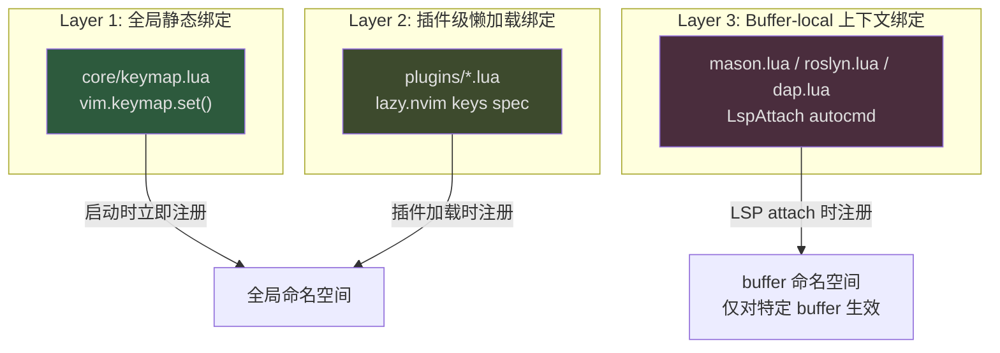
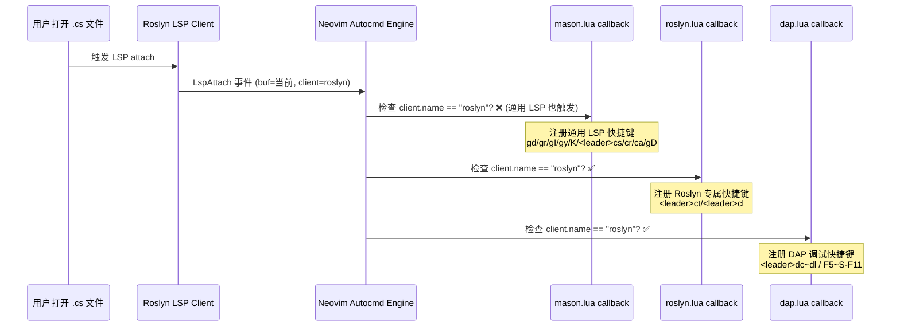

本配置框架采用 **Space 作为 Leader 键**，通过 which-key 分组体系、插件级 `keys` 规范和 `LspAttach` 驱动的 buffer-local 绑定三层架构，实现全局一致性与上下文敏感性的平衡。本文将深入解析快捷键的注册时机、分组命名空间设计、以及 buffer-local 绑定如何避免全局命名空间污染。

Sources: [keymap.lua](lua/core/keymap.lua#L1-L2), [whichkey.lua](lua/plugins/whichkey.lua#L1-L75)

## Leader 键选型与全局基础绑定

框架将 **Space（空格键）** 设为全局 Leader 键，**`\`** 设为 Local Leader 键。Space 键的选取并非随意——它位于键盘中央，左右手均可轻松触达，且在 Normal 模式下不承担任何原生功能，是 Neovim 社区公认的最佳 Leader 键候选。

Sources: [keymap.lua](lua/core/keymap.lua#L1-L2)

`core/keymap.lua` 中定义的全局基础绑定覆盖四个核心场景：

| 场景 | 快捷键 | 模式 | 功能 |
|------|--------|------|------|
| **窗口导航** | `<C-h/j/k/l>` | n | 在窗口间移动 |
| **窗口调整** | `<C-Arrow>` | n | 调整窗口大小（±2） |
| **行移动** | `<A-j/k>` | n/i/v | 上下移动当前行/选中行 |
| **文件保存** | `<C-s>` | n/i/x/s | 保存文件并回到 Normal |
| **撤销/重做** | `<C-z>` / `<C-S-z>` | n/i | undo / redo（Windows 习惯适配） |
| **窗口分割** | `<leader>-` / `<leader>\|` | n | 水平/垂直分割 |
| **Tab 管理** | `<leader><tab>*` | n | 新建/切换/关闭 Tab |

值得注意的是搜索方向键 `n`/`N` 的行为被重映射为"始终朝搜索方向跳转"模式，通过 `v:searchforward` 表达式动态判断，并附加 `zv` 展开折叠。这是一个经典的 vim-galore 推荐实践。

Sources: [keymap.lua](lua/core/keymap.lua#L30-L44), [keymap.lua](lua/core/keymap.lua#L55-L67)

## 快捷键注册的三层架构

本框架的快捷键注册遵循一个清晰的分层策略，每层有明确的职责边界：

**Layer 1**（`core/keymap.lua`）在 `init.lua` 加载流程中第四个被 require，此时 Neovim 刚完成基础选项设置，所有绑定立即可用。**Layer 2** 通过 lazy.nvim 的 `keys` spec 声明，lazy.nvim 在读取到这些 spec 时会立即注册全局键位，但对应的插件仅在首次按键时才实际加载——这是懒加载机制的关键。**Layer 3** 则完全延迟到 `LspAttach` 事件触发时才注册，确保快捷键仅在语义上合理的环境中存在。

Sources: [init.lua](init.lua#L12-L14), [keymap.lua](lua/core/keymap.lua#L1-L68)

## Which-Key 分组命名空间设计

which-key 配置定义了一个结构化的分组体系，使得 `<Leader>` 前缀下的命名空间有了清晰的语义划分：

| Leader 前缀 | 分组名 | 主要来源插件 | 用途 |
|-------------|--------|-------------|------|
| `<leader><tab>` | tabs | core/keymap | Tab 页管理 |
| `<leader>a` | +ai | claudecode | AI 编码助手 |
| `<leader>b` | buffer | bufferline | Buffer 切换/关闭/选择 |
| `<leader>c` | code | mason/aerial/lspsaga/roslyn | 代码操作与 LSP 功能 |
| `<leader>d` | debug | core/dap | 调试控制 |
| `<leader>e` | — | neo-tree | 切换文件树 |
| `<leader>f` | file/find | snacks | 文件查找与 Picker |
| `<leader>g` | git | gitsigns/lazygit/diffview/snacks | Git 工作流 |
| `<leader>n` | — | easy-dotnet | .NET 项目操作 |
| `<leader>o` | — | neo-tree/opencode | 聚焦文件树 / OpenCode |
| `<leader>s` | search | snacks/grug-far | 搜索与替换 |
| `<leader>u` | ui | — | UI 切换 |
| `<leader>w` | windows | core/keymap | 窗口管理（代理 `<C-w>`） |
| `<leader>x` | diagnostics/quickfix | — | 诊断与快速修复 |

Sources: [whichkey.lua](lua/plugins/whichkey.lua#L10-L48)

其中两个分组使用了 which-key 的高级特性：**`<leader>b`**（buffer）通过 `expand` 函数动态展示当前打开的 buffer 列表，**`<leader>w`**（windows）通过 `proxy` 将 `<C-w>` 的原生窗口命令代理到 Leader 命名空间下，并通过 `expand` 展示完整的窗口操作子菜单。这意味着按 `<leader>w` 后看到的菜单与按 `<C-w>` 后完全一致，但操作入口统一到了 Leader 体系中。

此外，which-key 还定义了几个非 Leader 前缀的分组：**`[` / `]`** 对应 prev/next 语义（如 `]h` 下一个 hunk），**`g`** 对应 goto 语义（如 `gd` 跳转定义），**`gs`** 对应 surround 操作，**`z`** 对应折叠操作。这些分组在按对应前缀时会自动弹出候选菜单。

Sources: [whichkey.lua](lua/plugins/whichkey.lua#L26-L47)

## Buffer-local 绑定策略：LspAttach 驱动的上下文感知

Buffer-local 绑定是本框架最精巧的设计。其核心思想是：**只在语义上合理的环境中注册快捷键**。这一策略通过 `LspAttach` autocmd 实现，分为三组并分别附加客户端名称过滤条件。

### 绑定注册流程

### 三组 buffer-local 绑定详情

**通用 LSP 绑定**（`mason.lua`）——任何 LSP 客户端 attach 时均注册：

| 快捷键 | 功能 | 说明 |
|--------|------|------|
| `gd` | Goto Definition | 跳转定义，使用 snacks.picker |
| `gr` | Goto References | 跳转引用 |
| `gI` | Goto Implementation | 跳转实现 |
| `gy` | Goto Type Definition | 跳转类型定义 |
| `gD` | Goto Declaration | 跳转声明 |
| `K` | Hover Documentation | 悬浮文档 |
| `<leader>cs` | Document Symbols | 文档符号 |
| `<leader>cr` | Code Rename | 重命名 |
| `<leader>ca` | Code Action | 代码操作 |

**Roslyn 专属绑定**（`roslyn.lua`）——仅当 `client.name == "roslyn"` 时注册：

| 快捷键 | 功能 |
|--------|------|
| `<leader>ct` | 选择解决方案目标（`.sln`） |
| `<leader>cl` | 重启 Roslyn 分析 |

**DAP 调试绑定**（`dap.lua`）——仅当 `client.name == "roslyn"` 时注册（即仅 C# buffer）：

| 快捷键 | 功能 | F-key 替代 |
|--------|------|-----------|
| `<leader>dc` | Continue / Pick Config | `<F5>` |
| `<leader>dp` | Pause | `<F8>` |
| `<leader>do` | Step Over | `<F10>` |
| `<leader>di` | Step Into | `<F11>` |
| `<leader>dO` | Step Out | `<S-F11>` |
| `<leader>db` | Toggle Breakpoint | `<F9>` |
| `<leader>dB` | Conditional Breakpoint | — |
| `<leader>dq` | Terminate | `<S-F5>` |
| `<leader>dE` | Set Variable | — |
| `<leader>dh` | Hot Reload (dotnet watch) | — |
| `<leader>dj` | Jump to Current Frame | — |
| `<leader>dg` | Go to Line (Set Next Statement) | — |
| `<leader>dr` | Open REPL | — |
| `<leader>du` | Toggle DAP UI | — |
| `<leader>dl` | List Breakpoints | — |

DAP 绑定同时提供 Leader 序列和 F-key 两种入口，前者符合框架的分组一致性，后者照顾从 VS Code 迁移的肌肉记忆。

Sources: [mason.lua](lua/plugins/mason.lua#L63-L83), [roslyn.lua](lua/plugins/roslyn.lua#L32-L63), [dap.lua](lua/core/dap.lua#L226-L343)

## 插件级全局快捷键：lazy.nvim keys spec 机制

除 buffer-local 绑定外，大部分插件通过 lazy.nvim 的 `keys` spec 注册全局快捷键。这一机制的核心优势是 **按键触发懒加载**——快捷键在 Neovim 启动时就注册为占位符，用户首次按下时才触发对应插件的完整加载。

### `<leader>f` 文件/查找分组

| 快捷键 | 功能 | 来源 |
|--------|------|------|
| `<leader><space>` | 查找文件（根目录） | snacks |
| `<leader>,` | 切换 Buffer | snacks |
| `<leader>fb` | Buffer 列表 | snacks |
| `<leader>fg` | Git 文件查找 | snacks |
| `<leader>fr` | 最近文件 | snacks |

### `<leader>s` 搜索分组

| 快捷键 | 功能 | 来源 |
|--------|------|------|
| `<leader>sg` | Grep 搜索 | snacks |
| `<leader>sG` | Grep 搜索（仅 .cs/.razor/.css） | snacks |
| `<leader>sb` | Buffer 内行搜索 | snacks |
| `<leader>sk` | 快捷键列表 | snacks |
| `<leader>sh` | 帮助页搜索 | snacks |
| `<leader>sd` / `sD` | 全局/Buffer 诊断 | snacks |
| `<leader>sr` | 跨文件搜索替换 | grug-far |
| `<leader>ss` | 文档符号 | snacks |
| `<leader>sS` | 工作区符号 | snacks |

### `<leader>g` Git 分组

| 快捷键 | 功能 | 来源 |
|--------|------|------|
| `<leader>gg` | 打开 lazygit | lazygit |
| `<leader>gs` | Git Status | snacks |
| `<leader>gc` / `gl` | Git Log | snacks |
| `<leader>gd` | 打开 DiffView | diffview |
| `<leader>gD` | 文件历史 | diffview |
| `<leader>gp` | 预览 Hunk | gitsigns |
| `<leader>gb` | 行 Blame | gitsigns |
| `<leader>ghs/ghr/ghu` | Hunk 暂存/重置/撤销 | gitsigns |
| `]h` / `[h` | 下一个/上一个 Hunk | gitsigns |

### `<leader>a` AI 分组

| 快捷键 | 功能 |
|--------|------|
| `<leader>ac` | 打开 Claude Code |
| `<leader>af` | 聚焦 Claude Code |
| `<leader>ar` | 恢复上次会话 |
| `<leader>aC` | 继续上次对话 |
| `<leader>ab` | 添加当前 buffer |
| `<leader>as` | 发送选中内容 |
| `<leader>aa` | 接受 diff |
| `<leader>ad` | 拒绝 diff |

### `<leader>n` .NET 项目分组

easy-dotnet 注册了一整套 `<leader>n` 前缀的快捷键，覆盖 .NET 日常开发操作：

| 快捷键 | 功能 |
|--------|------|
| `<leader>nm` | 命令菜单 |
| `<leader>nb` / `nB` | 构建项目 / 构建解决方案 |
| `<leader>nr` | 运行 |
| `<leader>nR` | 恢复 NuGet 包 |
| `<leader>nt` / `nT` | 测试项目 / 测试解决方案 |
| `<leader>nd` | 调试 |
| `<leader>nw` | Watch 模式 |
| `<leader>np` / `nA` / `nX` | 项目视图 / 添加包 / 移除包 |

注意 `<leader>n` 分组**未在 which-key 的 spec 中声明**，因此按下 `<leader>n` 后不会自动弹出分组提示，但具体按键仍然有效。

Sources: [snacks.lua](lua/plugins/snacks.lua#L54-L134), [gitsigns.lua](lua/plugins/gitsigns.lua#L21-L29), [claudecode.lua](lua/plugins/claudecode.lua#L15-L32), [easy-dotnet.lua](lua/plugins/easy-dotnet.lua#L55-L89)

## 设计考量与潜在冲突分析

### 冲突点一：`<leader>-` 双重绑定

`core/keymap.lua` 将 `<leader>-` 映射为 `<C-W>s`（水平分割窗口），而 `yazi.lua` 将同一按键映射为 `<cmd>Yazi<cr>`（打开 yazi 文件管理器）。由于 yazi 通过 lazy.nvim 的 `keys` spec 在更晚的阶段注册，它会**覆盖** keymap.lua 中的全局绑定。用户若需要水平分割，应使用 `<leader>w` + `s` 的 which-key 路径（代理到 `<C-w>s`）。

Sources: [keymap.lua](lua/core/keymap.lua#L56), [yazi.lua](lua/plugins/yazi.lua#L12-L14)

### 冲突点二：`<leader>o` 前缀混用

`neo-tree.lua` 注册了 `<leader>o` 作为独立的快捷键（聚焦文件树），而 `opencode.lua` 注册了 `<leader>oo`、`<leader>ox`、`<leader>og` 三个以 `<leader>o` 为前缀的快捷键。在 `timeoutlen` 窗口期内，Neovim 会等待第二个按键——如果超时则执行 neo-tree 聚焦，如果快速按下第二个键则进入 opencode 功能。which-key 的弹出提示会在此间隔中辅助决策。

Sources: [neo-tree.lua](lua/plugins/neo-tree.lua#L12), [opencode.lua](lua/plugins/opencode.lua#L68-L76)

### 冲突点三：`<leader>cs` 上下文覆盖

`aerial.lua` 全局注册了 `<leader>cs`（切换符号大纲），而 `mason.lua` 在 `LspAttach` 时以 buffer-local 方式注册了同按键（文档符号）。在 LSP 活跃的 buffer 中，buffer-local 绑定**优先级更高**，将覆盖全局绑定。这意味着在 LSP buffer 中按 `<leader>cs` 会调用 snacks.picker 的文档符号功能而非 aerial 大纲。用户若需要 aerial 视图，需通过命令行 `:AerialToggle` 调用。

Sources: [aerial.lua](lua/plugins/aerial.lua#L119), [mason.lua](lua/plugins/mason.lua#L75)

### Buffer-local 策略的设计收益

将 LSP 和 DAP 快捷键限定在 buffer 命名空间中，带来了三个核心收益：**隔离性**——调试快捷键不会在编辑 Markdown 文件时意外触发；**可扩展性**——未来添加新的语言支持时，只需注册新的 `LspAttach` 回调并添加客户端名称过滤，不影响已有绑定；**清理自动化**——当 buffer 被卸载时，其 buffer-local 绑定自动销毁，无需手动管理。

Sources: [dap.lua](lua/core/dap.lua#L226-L233), [mason.lua](lua/plugins/mason.lua#L64-L68)

## 快捷键发现机制

框架提供了两个快捷键发现入口：

- **`<leader>?`** —— 显示当前 buffer 的所有 buffer-local 快捷键（which-key 的 `global = false` 模式），适合查看 LSP/DAP 在当前上下文中注册了哪些操作
- **`<C-w><Space>`** —— 进入窗口管理的 Hydra 模式，可连续执行窗口操作而无需反复按 Leader 前缀

Sources: [whichkey.lua](lua/plugins/whichkey.lua#L51-L65)

## 延伸阅读

- 关于 buffer-local 绑定依赖的 LSP 客户端配置，参见 [Mason LSP 管理：服务器自动安装与 capabilities 注册](28-mason-lsp-guan-li-fu-wu-qi-zi-dong-an-zhuang-yu-capabilities-zhu-ce)
- 关于 DAP 调试快捷键的完整上下文，参见 [DAP 调试系统架构：多调试器后端切换与适配器注册](8-dap-diao-shi-xi-tong-jia-gou-duo-diao-shi-qi-hou-duan-qie-huan-yu-gua-pei-qi-zhu-ce)
- 关于 which-key 分组提示的完整说明，参见 [快捷键发现：which-key 按键提示系统](23-kuai-jie-jian-fa-xian-which-key-an-jian-ti-shi-xi-tong)
- 关于 .NET 项目操作的快捷键来源，参见 [easy-dotnet 集成：项目管理、测试运行与 NuGet 操作](10-easy-dotnet-ji-cheng-xiang-mu-guan-li-ce-shi-yun-xing-yu-nuget-cao-zuo)