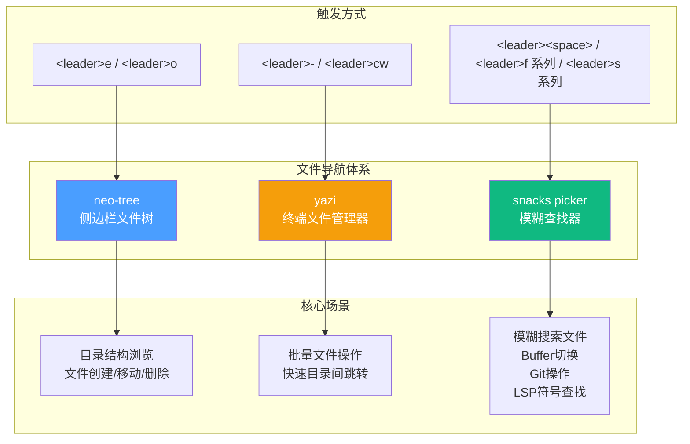

本配置集成了三个互补的文件导航与项目管理工具：**neo-tree** 提供经典的侧边栏文件树浏览器，**yazi** 带来终端风格的高效文件管理体验，**snacks picker** 则作为全能型模糊查找器覆盖文件搜索、Buffer 切换、Git 操作等场景。三者各司其职，构成从目录浏览到精确跳转的完整工作流。

## 架构总览：三工具的协作关系

在深入每个工具之前，先理解它们在整个文件导航体系中的定位和分工。下图展示了三个工具的触发方式与核心功能域：

三者的核心区别可以用下表概括：

| 特性 | neo-tree | yazi | snacks picker |
|------|----------|------|---------------|
| **交互模式** | 持久侧边栏，可固定显示 | 全屏浮动窗口，即开即关 | 模态浮动面板，选择后关闭 |
| **核心用途** | 项目目录结构浏览 | 终端式文件管理 | 模糊搜索与快速跳转 |
| **操作风格** | 图形化树状视图 | 键盘驱动的双面板 | 搜索驱动的列表选择 |
| **适合场景** | 了解项目结构、拖拽操作 | 批量文件管理、快速移动 | 已知目标名的精确查找 |
| **懒加载** | 按键触发 (`keys`) | `VeryLazy` 事件 + 按键触发 | `lazy = false`（始终加载） |

Sources: [neo-tree.lua](lua/plugins/neo-tree.lua#L1-L59), [yazi.lua](lua/plugins/yazi.lua#L1-L46), [snacks.lua](lua/plugins/snacks.lua#L1-L135)

## neo-tree：侧边栏文件树浏览器

**neo-tree** 是一个功能完备的文件树浏览器，以持久化的侧边栏形式呈现项目目录结构。本配置中，它被设定为始终显示隐藏文件与 Git 忽略文件，并自动跟踪当前编辑的文件位置，非常适合需要直观了解项目结构的场景。

### 快捷键绑定

neo-tree 的入口非常简洁，只有两个核心按键：

| 快捷键 | 功能 | 说明 |
|--------|------|------|
| `<leader>e` | `Neotree toggle` | 打开/关闭侧边栏文件树 |
| `<leader>o` | `Neotree focus` | 将焦点移到文件树窗口 |

打开 neo-tree 后，可以在文件树内使用其自带的快捷键进行操作：按 `a` 新建文件，按 `d` 删除文件，按 `r` 重命名，按 `c`/`m` 复制/移动文件，按 `y` 复制文件名，按 `<CR>`（回车）打开文件。

Sources: [neo-tree.lua](lua/plugins/neo-tree.lua#L10-L13)

### 关键配置解读

neo-tree 的配置涵盖四个核心维度——文件过滤策略、文件跟踪机制、窗口布局和渲染器定制：

**文件过滤策略**采用"完全透明"原则：`visible = true` 让被过滤的条目以半透明方式显示（而非完全隐藏），`hide_dotfiles = false` 和 `hide_gitignored = false` 确保 `.gitignore` 文件和点文件（如 `.env`、`.gitignore` 自身）始终可见。这对 .NET 项目尤其重要，因为 `obj/`、`bin/` 目录虽被 Git 忽略但调试时可能需要查看。

**文件跟踪**通过 `follow_current_file.enabled = true` 实现当前文件高亮——无论你在哪个 Buffer 中编辑，neo-tree 都会自动展开并定位到该文件所在的目录节点。配合 `use_libuv_file_watcher = true`，neo-tree 使用 libuv 文件系统监视器实时检测外部文件变更（如通过终端创建的文件），无需手动刷新。

**窗口布局**固定在左侧（`position = "left"`），宽度为 30 列。渲染器配置中，`indent.with_expanders = true` 启用了可折叠的展开/收起图标（` ` / ` `），让嵌套目录的层级关系一目了然。

自定义的 `file` 渲染器在每行中按 z-index 优先级排列：文件名（`name`）和符号链接目标（`symlink_target`）居左，剪贴板状态（`clipboard`）、Buffer 编号（`bufnr`）紧随其后；修改状态（`modified`）、诊断信息（`diagnostics`）和 Git 状态（`git_status`）右对齐——信息密度高但不干扰主视线。

Sources: [neo-tree.lua](lua/plugins/neo-tree.lua#L14-L57)

### 依赖说明

neo-tree 依赖四个插件协同工作：`plenary.nvim` 提供异步工具函数，`nvim-web-devicons` 提供文件类型图标（让 `.cs` 文件显示 C# 图标），`nui.nvim` 提供构建 UI 组件的基础设施，`nvim-window-picker` 用于在多窗口场景中选择目标窗口。

Sources: [neo-tree.lua](lua/plugins/neo-tree.lua#L4-L9)

## yazi：终端风格文件管理器

**yazi.nvim** 是 [yazi](https://github.com/sxyazi/yazi) 终端文件管理器的 Neovim 集成。与 neo-tree 的树状视图不同，yazi 采用双面板的终端文件管理器范式——类似 Midnight Commander 或 ranger——通过键盘快捷键高效完成文件的复制、移动、重命名和删除等批量操作。

### 快捷键绑定

| 快捷键 | 功能 | 说明 |
|--------|------|------|
| `<leader>-` | `Yazi` | 在当前文件所在目录打开 yazi |
| `<leader>cw` | `Yazi cwd` | 在 Neovim 工作目录打开 yazi |

`<leader>-` 是最常用的入口，它会在当前编辑文件所在的目录启动 yazi，让你立即对当前目录的文件进行操作。`<leader>cw` 则跳转到 Neovim 的工作目录（通常是项目根目录），适合从根目录开始浏览整个项目。

yazi 内部使用自己的快捷键体系（按 `~` 可查看帮助），核心操作包括：`h/j/k/l` 导航，`y` 复制（yank），`d` 剪切，`p` 粘贴，`D` 删除到回收站，`r` 重命名，`a` 创建文件/目录。选择文件后在 yazi 中按回车即可在 Neovim 中打开该文件。

Sources: [yazi.lua](lua/plugins/yazi.lua#L9-L28)

### Windows 平台适配

配置中有一处关键的 Windows 适配：`copy_relative_path_to_selected_files = nil` 明确禁用了相对路径复制功能。这是因为 Windows 系统缺少 `realpath` 命令（Linux/macOS 上用于解析符号链接并返回绝对路径），禁用此功能可以避免运行时错误。

同时，`open_for_directories = false` 意味着 yazi 不会替代 Neovim 内置的 netrw 作为目录浏览器——当你用 `:e .` 打开目录时，仍然使用默认行为。`init` 函数中的 `vim.g.loaded_netrwPlugin = 1` 预先标记 netrw 插件为已加载状态，防止 netrw 与 yazi 产生冲突。

> **前提条件**：使用 yazi.nvim 需要系统已安装 yazi 本体。在 Windows 上可通过 `winget install sxyazi.yazi` 或 `scoop install yazi` 安装。可通过在终端中运行 `yazi --version` 来验证安装状态。

Sources: [yazi.lua](lua/plugins/yazi.lua#L30-L46)

## snacks picker：全能模糊查找器

**snacks picker** 是 [snacks.nvim](https://github.com/folke/snacks.nvim) 的模糊查找器模块，在本配置中取代了 telescope.nvim 的角色，承担文件搜索、Buffer 切换、Git 操作、LSP 符号查找等全部模糊查找需求。它是唯一设置 `lazy = false` 的导航工具，意味着 Neovim 启动时即加载，保证随时可用。

### 启动面板（Dashboard）

snacks.nvim 还负责启动面板的显示。本配置自定义了 ASCII Art Logo 和九个快捷入口：

| 按键 | 功能 | 对应操作 |
|------|------|----------|
| `f` | 查找文件 | `Snacks.dashboard.pick('files')` |
| `n` | 新建文件 | `:ene \| startinsert` |
| `p` | 项目列表 | `Snacks.picker.projects()` |
| `g` | 全局文本搜索 | `Snacks.dashboard.pick('live_grep')` |
| `r` | 最近文件 | `Snacks.dashboard.pick('oldfiles')` |
| `c` | 配置文件 | 在 Neovim 配置目录中搜索文件 |
| `s` | 恢复会话 | 恢复上次关闭时的编辑状态 |
| `l` | 插件管理 | `:Lazy` |
| `q` | 退出 | `:qa` |

启动面板中的 `pick` 函数做了一层映射封装，将 `files`、`live_grep`、`oldfiles` 映射到 snacks picker 的对应方法，使得 Dashboard 的搜索能力与 picker 的快捷键完全一致。

Sources: [snacks.lua](lua/plugins/snacks.lua#L6-L51)

### 核心布局与配置

picker 的全局布局使用 `preset = "telescope"` 预设——这是最经典的模糊查找界面风格，顶部为搜索输入框，下方为结果列表。除了 telescope 预设外，snacks picker 还支持 `default`、`ivy`、`dropdown`、`vertical`、`sidebar` 等多种预设。`ui_select = true` 让 snacks picker 接管 Neovim 的 `vim.ui.select()` 调用，统一所有选择界面的视觉风格。

Sources: [snacks.lua](lua/plugins/snacks.lua#L18-L27)

### 快捷键体系

snacks picker 的快捷键按照 **which-key 分组**组织，形成 `f`（文件/查找）、`s`（搜索）、`g`（Git）三个主要命名空间。下表按功能域分类列出所有绑定：

#### 文件与 Buffer 操作（`<leader>f` 组）

| 快捷键 | 功能 | 说明 |
|--------|------|------|
| `<leader><space>` | 查找文件（项目根目录） | 最常用的文件查找入口 |
| `<leader>,` | 切换 Buffer | 按最近使用排序，快速在打开的文件间跳转 |
| `<leader>fb` | Buffer 列表 | 同上，按最近使用排序 |
| `<leader>fB` | Buffer 列表（全部） | 显示所有 Buffer，不按使用频率排序 |
| `<leader>fg` | Git 跟踪文件 | 仅搜索 `git ls-files` 返回的文件 |
| `<leader>fr` | 最近文件 | 浏览最近打开过的文件列表 |

#### 搜索与 Grep（`<leader>s` 组）

| 快捷键 | 功能 | 说明 |
|--------|------|------|
| `<leader>sg` | Grep 搜索（当前目录） | 全局文本搜索 |
| `<leader>sG` | Grep 搜索（仅 .cs/.razor/.css） | **C# 项目专用**，限定搜索范围 |
| `<leader>sb` | Buffer 内搜索行 | 在当前文件的所有行中模糊搜索 |
| `<leader>sd` | 诊断信息 | 查看项目中所有 LSP 诊断 |
| `<leader>sD` | Buffer 诊断 | 仅当前文件的诊断 |
| `<leader>ss` | 文档符号 | 当前文件中的 LSP 符号（函数、类等） |
| `<leader>sS` | 工作区符号 | 整个工作区的 LSP 符号搜索 |
| `<leader>sh` | 帮助页 | 搜索 Neovim 帮助文档 |
| `<leader>sk` | 快捷键 | 查看所有已注册的快捷键 |
| `<leader>sj` | 跳转列表 | 查看跳转历史 |
| `<leader>sK` | 标记列表 | 查看所有 Vim 标记 |
| `<leader>sq` | Quickfix 列表 | 查看编译/搜索结果 |
| `<leader>sl` | Location 列表 | 查看当前窗口的 Location 列表 |
| `<leader>sR` | 恢复上次搜索 | 重新打开上次关闭的 picker |
| `<leader>sc` | 命令历史 | 搜索历史执行过的 Ex 命令 |
| `<leader>sC` | 命令列表 | 浏览所有可用命令 |
| `<leader>sa` | 自动命令 | 查看所有自动命令 |
| `<leader>sM` | Man 页面 | 搜索 Unix 手册页 |
| `<leader>sH` | 高亮组 | 搜索颜色高亮组 |
| `<leader>so` | 选项 | 浏览 Neovim 选项 |
| `<leader>s"` | 寄存器 | 查看所有寄存器内容 |
| `<leader>s/` | 搜索历史 | 查看搜索模式历史 |
| `<leader>:` | 命令历史 | 同 `<leader>sc` |
| `<leader>sm` | 消息历史 | **自定义功能**：以语法高亮的浮动窗口显示 `:messages` |

其中 `<leader>sG` 是一个面向 C#/.NET 开发者的特别配置，它将 Grep 搜索限定在 `*.cs`、`*.razor`、`*.css` 三种文件类型中，避免搜索到 `obj/` 下的生成文件或 `node_modules/` 中的无关内容。

`<leader>sm`（消息历史）是一个自定义的增强实现——它不只简单调用 picker，而是将 `:messages` 的输出捕获到一个新 Buffer 中，并通过正则表达式匹配为 `error`、`warn`、`info`、`success`、文件路径等内容添加语法高亮，最终以 60% 宽高的居中浮动窗口展示。

#### Git 操作（`<leader>g` 组）

| 快捷键 | 功能 | 说明 |
|--------|------|------|
| `<leader>gc` / `<leader>gl` | Git 提交历史 | 查看所有 commit |
| `<leader>gs` | Git 状态 | 查看已修改/未跟踪文件 |
| `<leader>gS` | Git Stash | 查看暂存列表 |

#### 通知管理（`<leader>sn` 组）

| 快捷键 | 功能 | 说明 |
|--------|------|------|
| `<leader>snh` | 通知历史 | 查看所有通知记录 |
| `<leader>snd` | 关闭所有通知 | 清除当前显示的通知 |

Sources: [snacks.lua](lua/plugins/snacks.lua#L54-L134)

## 典型工作流示例

理解三个工具的最佳方式是将它们放入实际的开发场景中：

**场景一：接手一个陌生的 .NET 项目**

首先按 `<leader>e` 打开 neo-tree 侧边栏，浏览解决方案的整体目录结构——了解有哪些项目（`.csproj`）、配置文件、测试目录。然后按 `<leader>-` 在当前目录打开 yazi，快速跳转到感兴趣的子目录中查看文件内容。当你已经知道要找的文件名时，直接按 `<leader><space>` 用 snacks picker 模糊搜索即可。

**场景二：在代码中定位特定函数**

按 `<leader>ss` 打开文档符号搜索，在当前文件中查找目标函数。如果函数可能在其他文件中，按 `<leader>sS` 搜索整个工作区符号。如果只记得函数中的某个关键词，按 `<leader>sg` 全局 Grep 搜索，或按 `<leader>sG` 限定在 C# 文件中搜索。

**场景三：批量整理项目文件**

按 `<leader>cw` 在项目根目录打开 yazi，使用 yazi 的批量选择和操作功能（如按 `v` 进入可视模式选择多个文件，然后 `d` 剪切，`p` 粘贴到目标目录）高效完成文件重组。

Sources: [neo-tree.lua](lua/plugins/neo-tree.lua#L1-L59), [yazi.lua](lua/plugins/yazi.lua#L1-L46), [snacks.lua](lua/plugins/snacks.lua#L1-L135)

## 与 which-key 的集成

三个工具的快捷键均已注册到 which-key 的分组体系中。`<leader>f` 对应"file/find"组，`<leader>s` 对应"search"组，`<leader>g` 对应"git"组。当你在 Normal 模式下按下 `<leader>` 后短暂停留，which-key 会弹出所有可用分组的提示面板，帮助你快速定位目标操作。

如果你忘记了某个快捷键，可以按 `<leader>?` 查看 Buffer 本地绑定的所有快捷键，或按 `<leader>sk` 通过 snacks picker 搜索所有已注册的快捷键。

Sources: [whichkey.lua](lua/plugins/whichkey.lua#L11-L48), [snacks.lua](lua/plugins/snacks.lua#L83)

## 延伸阅读

- 文件浏览中涉及的 Git 状态显示功能，其完整的 Git 工作流详见 [Git 工作流：lazygit、gitsigns 与 diffview](17-git-gong-zuo-liu-lazygit-gitsigns-yu-diffview)
- snacks picker 中的 `<leader>ss`/`<leader>sS` 符号搜索依赖 LSP 能力，相关配置见 [Roslyn LSP 配置：语言服务器管理与解决方案定位](7-roslyn-lsp-pei-zhi-yu-yan-fu-wu-qi-guan-li-yu-jie-jue-fang-an-ding-wei)
- 所有快捷键的整体组织策略详见 [快捷键体系：Leader 键分组与 buffer-local 绑定策略](12-kuai-jie-jian-ti-xi-leader-jian-fen-zu-yu-buffer-local-bang-ding-ce-lue)
- 快捷键发现功能的配置详见 [快捷键发现：which-key 按键提示系统](23-kuai-jie-jian-fa-xian-which-key-an-jian-ti-shi-xi-tong)