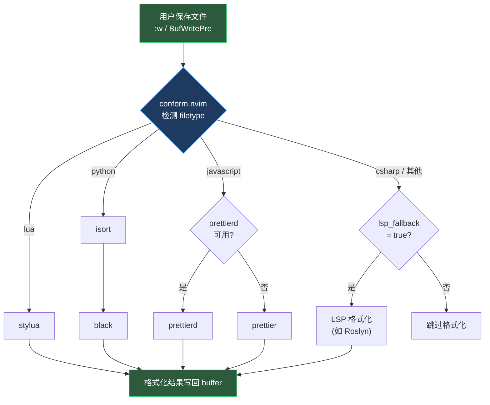

本页解析项目中 **conform.nvim** 的配置架构——一个以「保存时自动格式化」为核心工作流的 Neovim 格式化框架。内容涵盖插件懒加载策略、按语言分配格式化工具的声明式映射、LSP 回退机制，以及与之配套的 stylua 项目级配置。理解此页后，你将掌握如何为本项目添加新的格式化工具、调整格式化行为，以及排查格式化不生效的常见问题。

Sources: [conform.lua](lua/plugins/conform.lua#L1-L30)

## 架构概览

conform.nvim 在本项目中承担「**格式化统一入口**」的角色，它将外部格式化工具（如 stylua、black、prettier）和 LSP 格式化能力统一收口到一个声明式配置中。其核心设计理念是：**开发者只需保存文件，格式化自动完成**。

下面的 Mermaid 图展示了 conform.nvim 在格式化流程中的调度逻辑：



整个流程分为三个阶段：**触发 → 调度 → 执行**。触发由 `BufWritePre` 事件驱动；调度由 `formatters_by_ft` 映射表和 `lsp_fallback` 开关共同决定；执行则由 conform 调用对应的外部二进制或 LSP 能力完成。

Sources: [conform.lua](lua/plugins/conform.lua#L1-L30)

## 插件 Spec 解构：懒加载与触发条件

conform.nvim 在 lazy.nvim 的插件规范中使用了三种加载触发机制，确保插件「按需加载、零启动开销」：

| 触发方式 | 配置值 | 说明 |
|---|---|---|
| `event` | `"BufWritePre"` | 首次保存任何 buffer 时加载——这是 `format_on_save` 正常工作的核心触发点 |
| `cmd` | `"ConformInfo"` | 执行 `:ConformInfo` 命令时加载，用于调试当前 buffer 的格式化配置 |
| `keys` | `<leader>f` | 手动按下格式化快捷键时加载，作为保存格式化的补充入口 |

```lua
return {
  "stevearc/conform.nvim",
  event = { "BufWritePre" },
  cmd = { "ConformInfo" },
  keys = { ... },
  opts = { ... },
}
```

这三层触发形成互补：日常开发中 `BufWritePre` 覆盖了绝大多数场景；`<leader>f` 提供了无需保存的手动格式化能力；`:ConformInfo` 则是排查问题的调试工具。

Sources: [conform.lua](lua/plugins/conform.lua#L1-L5)

## 格式化工具映射：按语言声明

`formatters_by_ft` 是 conform.nvim 的核心配置表，它将 **filetype** 映射到一组格式化工具名称。本项目当前配置了三种语言的格式化策略：

```lua
formatters_by_ft = {
  lua = { "stylua" },
  python = { "isort", "black" },
  javascript = { { "prettierd", "prettier" } },
},
```

这三种配置代表了 conform.nvim 的三种典型映射模式，理解它们的区别是扩展配置的基础：

| 映射模式 | 示例 | 语义 | 行为 |
|---|---|---|---|
| **单工具** | `lua = { "stylua" }` | 仅一个格式化工具 | 直接调用 stylua |
| **链式管道** | `python = { "isort", "black" }` | 多个工具按序执行 | 先 isort 排序 import，再 black 格式化代码 |
| **降级备选** | `javascript = { { "prettierd", "prettier" } }` | 嵌套数组表示优先级 | 优先尝试 prettierd（守护进程，更快）；不可用则回退到 prettier |

**链式管道**的关键细节：`isort` 和 `black` 会**按顺序依次执行**，每个工具处理上一步的输出。这意味着 isort 对 import 排序的结果会被 black 二次处理——两者需要保持兼容的配置以避免互相冲突。

**降级备选**的嵌套数组语法 `{ "prettierd", "prettier" }` 是 conform.nvim 的特殊约定：外层数组表示「管道」，内层嵌套数组表示「备选」。conform 会尝试第一个可用的工具，跳过不可用的。

Sources: [conform.lua](lua/plugins/conform.lua#L18-L22)

## 保存时自动格式化：format_on_save 机制

`format_on_save` 是本项目中 conform.nvim 的核心工作模式，它将格式化动作绑定到 `BufWritePre` 自动命令上——在文件实际写入磁盘之前完成格式化：

```lua
format_on_save = {
  timeout_ms = 500,
  lsp_fallback = true,
},
```

| 参数 | 值 | 说明 |
|---|---|---|
| `timeout_ms` | `500` | 格式化操作的超时上限（毫秒）。如果格式化工具在 500ms 内未完成，conform 将放弃本次格式化并继续保存。这是防止格式化工具卡死导致编辑器冻结的安全阀 |
| `lsp_fallback` | `true` | 当 `formatters_by_ft` 中没有为当前 filetype 配置专用工具时，回退到 LSP 提供的格式化能力 |

`lsp_fallback = true` 对本项目的 C#/.NET 开发工作流至关重要。当前 `formatters_by_ft` 并未为 `cs`（C#）filetype 配置专用格式化工具（如 `csharpier`），因此 C# 文件的格式化完全依赖 Roslyn LSP 的 `textDocument/formatting` 能力。这意味着 **C# 的格式化规则由 `.editorconfig` 或 Roslyn 自身的格式化设置控制**，而非由 conform 直接管理。

Sources: [conform.lua](lua/plugins/conform.lua#L24-L27)

## 手动格式化：Leader+f 快捷键

除了保存时的自动格式化，配置中还提供了一个手动触发入口：

```lua
keys = {
  {
    "<leader>f",
    function()
      require("conform").format({ async = true, lsp_fallback = true })
    end,
    mode = "",
    desc = "Format buffer",
  },
},
```

注意 `async = true` 参数——手动格式化以异步方式执行，不会阻塞 UI。这与 `format_on_save` 的同步行为形成对比：保存格式化必须在写入前同步完成（否则磁盘上的文件不会被格式化），而手动格式化没有这个约束。

`mode = ""` 表示该快捷键在所有模式下均不生效于特定模式，实际上默认在 **Normal 模式** 下生效。Leader 键在 [快捷键体系：Leader 键分组与 buffer-local 绑定策略](12-kuai-jie-jian-ti-xi-leader-jian-fen-zu-yu-buffer-local-bang-ding-ce-lue) 中定义为空格键，因此实际操作是 **`Space + f`**。

Sources: [conform.lua](lua/plugins/conform.lua#L5-L15), [keymap.lua](lua/core/keymap.lua#L1-L2)

## stylua 项目配置：与 conform 的协作

`stylua.toml` 位于项目根目录，为 Lua 格式化工具 **stylua** 提供项目级参数。当 conform.nvim 调用 stylua 时，stylua 会自动向上查找并加载此配置文件：

```toml
indent_type = "Spaces"
indent_width = 2
column_width = 120
```

| 参数 | 值 | 说明 |
|---|---|---|
| `indent_type` | `"Spaces"` | 使用空格缩进（而非 Tab）。这与 Neovim 的全局设置 `expandtab = true` 保持一致 |
| `indent_width` | `2` | 每级缩进 2 个空格。注意：Neovim 全局 `tabstop = 4` 用于编辑其他文件，Lua 文件由 stylua 覆盖为 2 空格 |
| `column_width` | `120` | 单行最大宽度 120 字符，超过则 stylua 尝试换行 |

值得注意的设计决策是 `column_width = 120` 与 Neovim 全局设置 `colorcolumn = "120"` 的对齐——[basic.lua](lua/core/basic.lua) 中设置的参考线恰好标记了 stylua 的换行边界，提供了**视觉辅助与格式化规则的一致性**。

Sources: [stylua.toml](stylua.toml#L1-L3), [basic.lua](lua/core/basic.lua#L5-L9)

## 扩展指南：为新语言添加格式化工具

当需要为新的编程语言添加格式化支持时，只需在 `formatters_by_ft` 中增加一行映射。以下以 C# 为例展示两种典型方案：

**方案一：使用专用格式化工具（如 csharpier）**

```lua
formatters_by_ft = {
  -- ...已有配置...
  cs = { "csharpier" },
},
```

这要求 `csharpier` 已通过 Mason 安装或全局可用。conform.nvim 会自动在 `$PATH` 和 Mason 的安装路径中查找。

**方案二：继续依赖 LSP 回退**

当前配置已经通过 `lsp_fallback = true` 覆盖了 C# 场景。如果你对 Roslyn 的格式化结果满意，无需做任何修改。

**安装新格式化工具的推荐路径**是通过 Mason——在 [Mason LSP 管理：服务器自动安装与 capabilities 注册](28-mason-lsp-guan-li-fu-wu-qi-zi-dong-an-zhuang-yu-capabilities-zhu-ce) 中了解如何管理和安装工具。conform.nvim 与 Mason 共享安装路径，Mason 安装的格式化工具会被 conform 自动发现。

Sources: [conform.lua](lua/plugins/conform.lua#L16-L28)

## 调试技巧：ConformInfo 命令

当格式化行为不符合预期时，`:ConformInfo` 是首要的排查工具。它会显示当前 buffer 的以下信息：

- 检测到的 filetype
- 匹配的格式化工具列表
- 每个工具的可用状态（已安装 / 未找到）
- `format_on_save` 是否启用
- LSP 回退状态

该命令通过 `cmd = { "ConformInfo" }` 懒加载声明注册，执行时无需手动加载 conform 插件。

Sources: [conform.lua](lua/plugins/conform.lua#L4)

## 配置参数速查表

以下是 [conform.lua](lua/plugins/conform.lua) 的完整配置参数汇总：

| 层级 | 参数 | 值 | 用途 |
|---|---|---|---|
| 插件级 | `event` | `"BufWritePre"` | 懒加载触发：首次保存时加载 |
| 插件级 | `cmd` | `"ConformInfo"` | 懒加载触发：调试命令 |
| 插件级 | `keys` | `<leader>f` | 懒加载触发 + 手动格式化 |
| opts | `formatters_by_ft.lua` | `"stylua"` | Lua 文件使用 stylua 格式化 |
| opts | `formatters_by_ft.python` | `"isort", "black"` | Python 文件链式格式化 |
| opts | `formatters_by_ft.javascript` | `"prettierd" / "prettier"` | JS 文件降级备选格式化 |
| opts | `format_on_save.timeout_ms` | `500` | 格式化超时上限 |
| opts | `format_on_save.lsp_fallback` | `true` | 无专用工具时回退到 LSP |

Sources: [conform.lua](lua/plugins/conform.lua#L1-L30)

## 延伸阅读

- **格式化工具的安装管理**：了解 Mason 如何统一管理 LSP 服务器和格式化工具 → [Mason LSP 管理：服务器自动安装与 capabilities 注册](28-mason-lsp-guan-li-fu-wu-qi-zi-dong-an-zhuang-yu-capabilities-zhu-ce)
- **Lua 代码风格的完整约定**：stylua.toml 的参数选择理由与团队规范 → [代码风格约定：stylua 格式化配置](27-dai-ma-feng-ge-yue-ding-stylua-ge-shi-hua-pei-zhi)
- **快捷键 Leader 键的定义**：Space 键作为 Leader 的设计考量 → [快捷键体系：Leader 键分组与 buffer-local 绑定策略](12-kuai-jie-jian-ti-xi-leader-jian-fen-zu-yu-buffer-local-bang-ding-ce-lue)
- **插件懒加载的通用策略**：event、cmd、keys 三种触发机制的详细分析 → [lazy.nvim 插件管理：懒加载策略与 spec 规范](5-lazy-nvim-cha-jian-guan-li-lan-jia-zai-ce-lue-yu-spec-gui-fan)