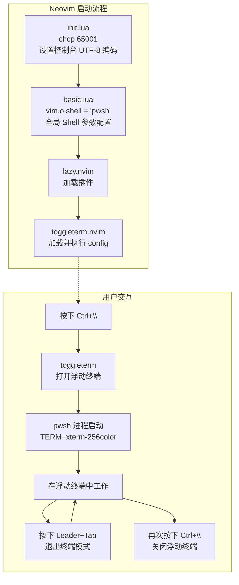
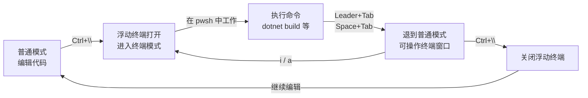

在 Neovim 中内嵌一个随时可用的终端，是提升开发效率的关键能力之一——你无需在编辑器和外部终端之间反复切换窗口，就能执行 `dotnet build`、运行脚本或调试命令。本配置通过 **toggleterm.nvim** 插件实现了一套以 **浮动窗口** 为载体的终端方案，默认 shell 为 **PowerShell 7（pwsh）**，并配合全局 shell 选项和快捷键体系，构建了完整的终端集成体验。

Sources: [toggleterm.lua](lua/plugins/toggleterm.lua#L1-L18), [basic.lua](lua/core/basic.lua#L29-L35)

## 架构总览：终端集成的三层配置

本项目的终端集成并非单一文件完成，而是由三个层次协作构成：

| 层次 | 文件 | 职责 |
|------|------|------|
| **全局 Shell 基础** | [basic.lua](lua/core/basic.lua#L29-L35) | 设置 Neovim 的默认 shell 为 pwsh，配置编码、管道和重定向参数 |
| **终端插件层** | [toggleterm.lua](lua/plugins/toggleterm.lua#L1-L18) | 配置 toggleterm.nvim 的外观、行为和 shell 选择 |
| **快捷键层** | [keymap.lua](lua/core/keymap.lua#L52-L53) | 定义终端模式下的按键映射，特别是终端模式的退出方式 |
| **启动编码层** | [init.lua](init.lua#L3-L6) | 在 Neovim 启动时设置控制台代码页为 UTF-8，确保子进程输出不乱码 |

下面的 Mermaid 图展示了这四层配置如何协同工作：



Sources: [init.lua](init.lua#L3-L6), [basic.lua](lua/core/basic.lua#L29-L35), [toggleterm.lua](lua/plugins/toggleterm.lua#L1-L18), [keymap.lua](lua/core/keymap.lua#L52-L53)

## toggleterm.nvim 插件配置详解

[toggleterm.lua](lua/plugins/toggleterm.lua) 是终端集成的核心配置文件，完整内容仅 18 行，结构清晰：

```lua
return {
    'akinsho/toggleterm.nvim',
    version = "*",
    config = function()
        require("toggleterm").setup({
            size = 20,
            open_mapping = [[<c-\>]],
            direction = 'float',
            shell = 'pwsh',
            on_create = function (term)
               term.env = vim.tbl_extend('force', term.env or {},{
                    TERM = 'xterm-256color',
                })
            end
        })
    end
}
```

### 配置参数逐一解读

| 参数 | 值 | 说明 |
|------|-----|------|
| `version` | `"*"` | 使用最新稳定版本，由 lazy.nvim 的锁文件（`lazy-lock.json`）固定具体版本 |
| `size` | `20` | 终端窗口的大小。对于 `float` 模式，这个值影响浮动窗口的初始尺寸计算 |
| `open_mapping` | `<c-\>` | **Ctrl+\\** 键切换终端的打开和关闭，在任何模式下均可触发 |
| `direction` | `'float'` | 终端以**浮动窗口**形式出现，悬浮在编辑区之上，不分割现有窗口布局 |
| `shell` | `'pwsh'` | 使用 PowerShell 7 作为终端 shell，而非 Windows 默认的 cmd 或 PowerShell 5 |
| `on_create` | 回调函数 | 终端创建时注入 `TERM=xterm-256color` 环境变量，确保 256 色终端能力 |

### 为什么选择浮动模式（float）？

toggleterm 支持四种终端方向：`horizontal`（水平分屏）、`vertical`（垂直分屏）、`float`（浮动窗口）、`tab`（新标签页）。本配置选择 `float` 模式有明确的理由：

- **不破坏布局**：浮动窗口覆盖在编辑区上方，关闭后原有窗口布局完好无损，这在已经拆分了多个窗口（LSP 面板、文件树等）的场景下尤为重要
- **即开即用**：一个快捷键打开，用完关闭，像 IDE 内置终端一样自然
- **视觉聚焦**：浮动窗口有明显的边框和背景色区分，能立即吸引注意力到终端任务上

Sources: [toggleterm.lua](lua/plugins/toggleterm.lua#L1-L18)

## PowerShell 7 的双层适配

### 插件层：toggleterm 的 shell 选择

在 [toggleterm.lua](lua/plugins/toggleterm.lua#L10) 中，`shell = 'pwsh'` 指定了终端插件使用的 shell 程序。toggleterm 会在内部启动 `pwsh` 进程来提供交互式终端体验。这里的 `'pwsh'` 对应 PowerShell 7 的可执行文件名——你需要在系统中安装 PowerShell 7 并确保 `pwsh` 在 PATH 中可用。

### 全局层：Neovim 的 shell 选项

[toggleterm.lua](lua/plugins/toggleterm.lua#L10) 的 shell 设置只影响 toggleterm 打开的终端。而 Neovim 自身执行外部命令（如 `:!dotnet build`、`make` 等）使用的是另一套全局 shell 配置，定义在 [basic.lua](lua/core/basic.lua#L29-L35)：

```lua
vim.o.shell = 'pwsh'
vim.o.shellcmdflag = '-NoLogo -NoProfile -ExecutionPolicy RemoteSigned -Command [Console]::InputEncoding=[Console]::OutputEncoding=[System.Text.Encoding]::UTF8;'
vim.o.shellredir = '2>&1 | Out-File -Encoding UTF8 %s; exit $LastExitCode'
vim.o.shellpipe = '2>&1 | Out-File -Encoding UTF8 %s; exit $LastExitCode'
vim.o.shellquote = ''
vim.o.shellxquote = ''
```

这段配置的每个选项都有明确用途：

| 选项 | 值 | 作用 |
|------|-----|------|
| `shell` | `'pwsh'` | 全局默认 shell 为 PowerShell 7 |
| `shellcmdflag` | `-NoLogo -NoProfile ...` | 启动参数：去除 Logo 输出、跳过 Profile 加载（提速）、设置 UTF-8 编码 |
| `shellredir` | `2>&1 \| Out-File ...` | 输出重定向：合并 stderr 到 stdout，以 UTF-8 写入文件，保留退出码 |
| `shellpipe` | `2>&1 \| Out-File ...` | 管道输出：与 redir 类似，用于 `:make` 等命令捕获输出 |
| `shellquote` | `''` | PowerShell 不需要额外引号包裹命令 |
| `shellxquote` | `''` | 同上，避免多余的引号导致命令解析错误 |

**关键细节**：`shellcmdflag` 中内联了 `[Console]::InputEncoding=[Console]::OutputEncoding=[System.Text.Encoding]::UTF8;`，这确保了每次 Neovim 通过 shell 执行命令时，PowerShell 的输入输出编码都被强制设为 UTF-8，从而避免中文乱码问题。

### 编码三重保障

本项目从三个层面确保编码正确性：

1. **系统层**：[init.lua](init.lua#L3-L6) 在启动时执行 `chcp 65001`，将 Windows 控制台代码页切换为 UTF-8
2. **Shell 层**：[basic.lua](lua/core/basic.lua#L31) 在 shellcmdflag 中强制 PowerShell 使用 UTF-8 编码
3. **终端层**：[toggleterm.lua](lua/plugins/toggleterm.lua#L11-L15) 在 `on_create` 中注入 `TERM=xterm-256color`，确保终端具备完整的颜色能力

Sources: [toggleterm.lua](lua/plugins/toggleterm.lua#L10-L15), [basic.lua](lua/core/basic.lua#L29-L35), [init.lua](init.lua#L3-L6)

## 终端模式的按键映射

### 打开和关闭终端

toggleterm 的 `open_mapping` 设置为 `[[<c-\>]]`（**Ctrl+\\**），这是一个非常精心的选择。在 Neovim 的默认键位中，`Ctrl+\` 并未被占用（不像 `Ctrl+c` 被用于中断操作），而且这个组合键在物理键盘上只需左手即可按下，操作十分便捷。按下一次打开浮动终端，再按一次关闭——这是典型的 **toggle（切换）** 交互模式。

### 终端模式下的退出快捷键

Neovim 的终端模式（Terminal mode）是一个独立的模式，与普通模式（Normal mode）、插入模式（Insert mode）并列。在终端模式中，你的所有键盘输入都会直接发送到底层的 shell 进程，这意味着你无法直接使用 Neovim 的编辑命令。

要从终端模式返回到普通模式，Neovim 默认的快捷键是 `<C-\><C-N>`（按 Ctrl+\ 然后再按 Ctrl+N）。这个组合键不太方便操作，因此本配置在 [keymap.lua](lua/core/keymap.lua#L52-L53) 中设置了一个更直觉的替代方案：

```lua
map("t", "<leader><TAB>", "<C-\\><C-n>", { desc = "Escape From Terminal" })
```

这行代码将 **Leader+Tab**（空格+Tab）映射为终端模式下的退出键。按下后，你可以像在普通窗口中一样使用 Neovim 命令——比如用 `hjkl` 移动光标、用 `:q` 关闭窗口等。

### 终端操作的完整工作流



Sources: [toggleterm.lua](lua/plugins/toggleterm.lua#L8), [keymap.lua](lua/core/keymap.lua#L52-L53)

## 环境变量注入与终端能力

toggleterm 的 `on_create` 回调在终端实例创建时执行，本配置利用它在终端进程中注入环境变量：

```lua
on_create = function (term)
   term.env = vim.tbl_extend('force', term.env or {},{
        TERM = 'xterm-256color',
    })
end
```

`vim.tbl_extend('force', ...)` 将新环境变量合并到终端已有的环境变量表中。`'force'` 策略意味着如果 `TERM` 变量已存在，会被覆盖为 `xterm-256color`。

**为什么需要设置 `TERM=xterm-256color`？**

在 Windows 环境下，`TERM` 环境变量通常未设置或值不正确。很多命令行工具（如 `bat`、`delta`、`fzf`、`lazygit` 等）会通过 `TERM` 变量判断终端是否支持 256 色。设置为 `xterm-256color` 后，这些工具会输出带颜色的富文本，而不是单调的黑白输出。这对于在 toggleterm 中运行 `dotnet test --logger "console;verbosity=detailed"` 等彩色输出的命令尤为重要。

Sources: [toggleterm.lua](lua/plugins/toggleterm.lua#L11-L15)

## lazy-lock 版本锁定

根据项目中的锁文件（`lazy-lock.json`），当前安装的 toggleterm.nvim 版本信息为：

| 字段 | 值 |
|------|-----|
| 插件名 | `toggleterm.nvim` |
| 分支 | `main` |
| 提交哈希 | `50ea089fc548917cc3cc16b46a8211833b9e3c7c` |

这确保了每次安装或更新时使用的是经过验证的固定版本，避免上游变更引入兼容性问题。

Sources: [lazy-lock.json](lazy-lock.json)

## 常见使用场景

### 场景一：快速构建项目

1. 按 **Ctrl+\\** 打开浮动终端
2. 输入 `dotnet build` 并回车
3. 按 **Leader+Tab**（空格+Tab）退出终端模式，检查编译错误
4. 按 **Ctrl+\\** 关闭终端，回到编辑区修复问题

### 场景二：长时间运行的服务

1. 在浮动终端中启动 `dotnet watch run`
2. 按 **Leader+Tab** 退出终端模式，浮动终端保持运行
3. 正常编辑代码，热重载自动生效
4. 需要查看输出时，按 **Ctrl+\\** 切回终端查看

### 场景三：与其他插件的协同

本项目的终端集成与多个插件形成配合：

| 插件 | 协同方式 | 配置文件 |
|------|----------|----------|
| **lazygit.nvim** | 通过 `<leader>gg` 在独立浮动终端中打开 lazygit，不依赖 toggleterm 但共享相同的 shell 环境 | [lazygit.lua](lua/plugins/lazygit.lua#L1-L10) |
| **easy-dotnet** | 在 toggleterm 终端中直接运行 `dotnet` 相关命令，共享 pwsh 环境 | — |
| **noice.nvim** | 美化终端切换时的视觉效果 | [noice.lua](lua/plugins/noice.lua) |

Sources: [toggleterm.lua](lua/plugins/toggleterm.lua#L1-L18), [lazygit.lua](lua/plugins/lazygit.lua#L1-L10)

## 前置条件与故障排查

### 前置条件

| 要求 | 检查命令 | 说明 |
|------|----------|------|
| PowerShell 7 已安装 | 在 cmd 中运行 `pwsh --version` | 应返回 `PowerShell 7.x.x` |
| pwsh 在 PATH 中 | 在 cmd 中运行 `where pwsh` | 应返回 pwsh.exe 的完整路径 |
| Neovim 0.9+ | 在终端中运行 `nvim --version` | toggleterm.nvim 要求 Neovim 0.9 或更高版本 |

### 常见问题

| 问题 | 可能原因 | 解决方案 |
|------|----------|----------|
| 按 Ctrl+\\ 无反应 | toggleterm 插件未加载 | 运行 `:Lazy` 检查插件状态，确保已安装 |
| 终端中中文乱码 | 系统代码页非 UTF-8 | 确认 [init.lua](init.lua#L4-L6) 中的 `chcp 65001` 正常执行 |
| 提示找不到 pwsh | PowerShell 7 未安装 | 从 [GitHub Releases](https://github.com/PowerShell/PowerShell/releases) 下载安装 |
| 终端中无颜色输出 | TERM 变量未生效 | 在终端中运行 `$env:TERM` 检查是否为 `xterm-256color` |

Sources: [init.lua](init.lua#L3-L6), [toggleterm.lua](lua/plugins/toggleterm.lua#L10)

## 延伸阅读

- **全局 Shell 配置的完整上下文**：终端集成的全局 shell 配置是 [Windows 平台适配：Shell、编码、代理与剪贴板](6-windows-ping-tai-gua-pei-shell-bian-ma-dai-li-yu-jian-tie-ban) 页面的一部分，该页面还涵盖了代理设置、剪贴板共享和 SSH 环境下的 OSC 52 适配
- **Git 工作流中的终端使用**：[Git 工作流：lazygit、gitsigns 与 diffview](17-git-gong-zuo-liu-lazygit-gitsigns-yu-diffview) 介绍了如何在浮动终端中使用 lazygit 进行版本控制操作
- **快捷键体系的完整视图**：[快捷键体系：Leader 键分组与 buffer-local 绑定策略](12-kuai-jie-jian-ti-xi-leader-jian-fen-zu-yu-buffer-local-bang-ding-ce-lue) 提供了所有快捷键的全局概览，终端快捷键是其中的一个子集