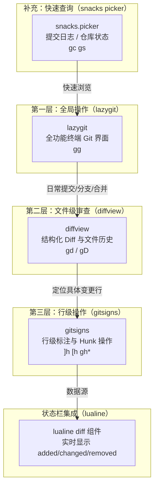
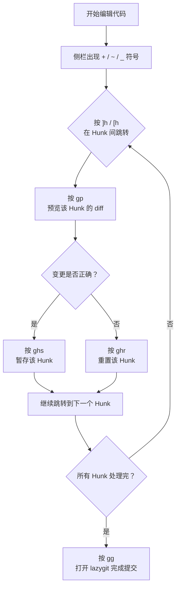

本项目的 Git 工作流由三个插件协同构成：**lazygit** 提供全功能的终端 Git 界面，**gitsigns** 在编辑器内提供行级变更标注与 Hunk 操作，**diffview** 提供结构化的 Diff 浏览与文件历史视图。此外，**snacks.nvim** 的 picker 组件补充了提交日志浏览和仓库状态快速查看能力。四者通过 `<leader>g` 前缀键形成统一的快捷键入口，配合 [快捷键发现：which-key 按键提示系统](23-kuai-jie-jian-fa-xian-which-key-an-jian-ti-shi-xi-tong) 的分组提示，实现从「感知变更」到「审查历史」的完整工作流。

Sources: [lazygit.lua](lua/plugins/lazygit.lua#L1-L11), [gitsigns.lua](lua/plugins/gitsigns.lua#L1-L31), [diffview.lua](lua/plugins/diffview.lua#L1-L11), [snacks.lua](lua/plugins/snacks.lua#L63-L67)

## 架构总览：三层 Git 工作流模型

本配置将 Git 操作按交互粒度分为三个层级，每个层级对应一个专用工具，形成清晰的职责划分：



| 层级 | 工具 | 交互粒度 | 典型场景 |
|------|------|----------|----------|
| 全局操作 | lazygit | 仓库级 | 提交代码、切换分支、解决合并冲突 |
| 文件级审查 | diffview | 文件级 | Code Review、对比两个版本的差异 |
| 行级操作 | gitsigns | Hunk 级（代码块） | 逐块暂存/撤销、查看单行 blame |
| 快速查询 | snacks picker | 列表级 | 快速浏览提交日志、查看暂存区状态 |

Sources: [whichkey.lua](lua/plugins/whichkey.lua#L20-L21), [lualine.lua](lua/plugins/lualine.lua#L85-L101)

## lazygit：全功能终端 Git 界面

**lazygit** 是一个终端下的 Git 图形化客户端，提供提交、分支管理、合并冲突处理等全流程操作。本配置中它以**浮动终端窗口**的方式嵌入 Neovim，让你无需离开编辑器即可完成复杂的 Git 操作。

### 配置解析

```lua
return {
    "kdheepak/lazygit.nvim",
    cmd = "LazyGit",                          -- 仅在执行命令时加载
    dependencies = { "nvim-lua/plenary.nvim" },
    keys = {
        { "<leader>gg", ":LazyGit<CR>", noremap = true, silent = true }
    }
}
```

这里有两个关键的**懒加载策略**：`cmd = "LazyGit"` 表示只有当你真正执行 `:LazyGit` 命令时插件才会被加载；`keys` 表定义了快捷键绑定，当你按下 `<leader>gg` 时会触发该命令。这种双重懒加载确保 lazygit 在你不使用 Git 操作时完全不会占用启动时间。

依赖 `plenary.nvim` 提供了异步 Job 管理和路径处理等基础能力，是 lazygit.nvim 运行的前提条件。

> **前提条件**：使用前需确保系统已安装 lazygit 本体。在 Windows 上可通过 `scoop install lazygit` 或 `winget install lazygit` 进行安装。

Sources: [lazygit.lua](lua/plugins/lazygit.lua#L1-L11)

### 使用场景

按下 `<leader>gg`（即空格 + g + g）后，lazygit 会在浮动终端中打开，你可以直接在其中进行以下操作：

- **提交代码**：在 Files 面板选择文件，按 `a` 暂存全部，在 commit message 区域输入信息后按 `Enter` 提交
- **切换分支**：按 `b` 打开分支列表，搜索并切换到目标分支
- **查看日志**：按 `l` 查看当前分支的提交日志
- **解决冲突**：合并冲突时，lazygit 会高亮冲突区域并引导你选择保留方案

按 `q` 或 `Esc` 退出 lazygit 回到编辑器。

Sources: [lazygit.lua](lua/plugins/lazygit.lua#L7-L9)

## gitsigns：行级变更标注与 Hunk 操作

**gitsigns.nvim** 是编辑器内 Git 集成的核心组件。它在侧栏（sign column）实时显示每一行的 Git 状态，并提供基于 Hunk（代码变更块）的精细化操作能力。与 lazygit 的全局视角不同，gitsigns 专注于「你在编辑时能看到什么、能做什么」。

### 配置解析

配置分为三个部分：**符号定义**、**快捷键绑定**和**懒加载策略**。

```lua
-- 工作区符号（未暂存的变更）
signs = {
    add          = { text = "+" },    -- 新增行
    change       = { text = "~" },    -- 修改行
    delete       = { text = "_" },    -- 删除行
    topdelete    = { text = "‾" },    -- 文件顶部删除
    changedelete = { text = "~" },    -- 修改后又删除
    untracked    = { text = "?" },    -- 未追踪文件
},
-- 暂存区符号（已 git add 的变更）
signs_staged = {
    add          = { text = "+" },
    change       = { text = "~" },
    delete       = { text = "_" },
    topdelete    = { text = "‾" },
    changedelete = { text = "~" },
},
```

`signs` 与 `signs_staged` 的符号定义完全一致。这种设计意味着你可以通过 Neovim 的 sign column 颜色（而非符号形状）来区分「已暂存」和「未暂存」的变更——已暂存的符号通常使用更明亮的颜色高亮显示。这让你在不打开 lazygit 的情况下就能直观了解暂存区状态。

加载策略使用 `event = "VeryLazy"`，即插件在 Neovim 完成基础初始化后的第一时间自动加载，确保打开任何 Git 仓库中的文件时都能立即看到变更标注。

Sources: [gitsigns.lua](lua/plugins/gitsigns.lua#L1-L31)

### 快捷键一览

| 快捷键 | 功能 | 说明 |
|--------|------|------|
| `]h` | 跳转到下一个 Hunk | 在代码变更块之间快速导航 |
| `[h` | 跳转到上一个 Hunk | 反向导航 |
| `<leader>gp` | 预览 Hunk | 弹出浮动窗口显示该代码块的 diff |
| `<leader>gb` | 切换行级 Blame | 在当前行末尾显示最后一次提交信息 |
| `<leader>ghr` | 重置 Hunk | 撤销该代码块的修改，恢复为 Git 版本 |
| `<leader>ghs` | 暂存 Hunk | 相当于 `git add -p` 对该块的操作 |
| `<leader>ghu` | 撤销暂存 Hunk | 撤回上一次 stage_hunk 操作 |

注意 `<leader>gh` 前缀对应 which-key 中注册的 `hunks` 分组。当你按下 `<leader>gh` 后稍微停顿，which-key 会弹出提示面板显示所有可用的 Hunk 操作。

Sources: [gitsigns.lua](lua/plugins/gitsigns.lua#L21-L29), [whichkey.lua](lua/plugins/whichkey.lua#L21)

### 典型工作流：逐块审查并提交



这个流程体现了 gitsigns 与 lazygit 的协作关系：gitsigns 负责**行级的精细化审查与操作**，而最终的提交动作交给 lazygit 的完整界面来完成。

Sources: [gitsigns.lua](lua/plugins/gitsigns.lua#L21-L29)

## diffview：结构化 Diff 浏览与文件历史

**diffview.nvim** 填补了 lazygit（全局操作）和 gitsigns（行级操作）之间的空白——它提供**文件级的结构化 Diff 视图**。当你需要对比当前工作区与某个提交、某个分支之间的完整差异，或者查看某个文件的修改历史时，diffview 是最合适的工具。

### 配置解析

```lua
return {
    "sindrets/diffview.nvim",
    cmd = { "DiffviewOpen", "DiffviewFileHistory", "DiffviewClose" },
    keys = {
        { "<leader>gd", "<cmd>DiffviewOpen<cr>",           desc = "Open DiffView" },
        { "<leader>gD", "<cmd>DiffviewFileHistory %<cr>",  desc = "File History" },
        { "<leader>gq", "<cmd>DiffviewClose<cr>",          desc = "Close DiffView" },
    },
    opts = {},
}
```

`cmd` 列表定义了三个延迟加载的命令。只有当你首次执行这些命令之一时，插件才会被加载。`opts = {}` 表示使用 diffview 的全部默认配置，不做额外定制。

`DiffviewFileHistory %` 中的 `%` 是 Vim 的特殊符号，代表**当前缓冲区对应的文件名**。这意味着 `<leader>gD` 会直接打开**当前文件**的修改历史，而非整个仓库的历史。

Sources: [diffview.lua](lua/plugins/diffview.lua#L1-L11)

### 核心命令与使用场景

| 快捷键 | 命令 | 功能 | 典型场景 |
|--------|------|------|----------|
| `<leader>gd` | `DiffviewOpen` | 打开工作区与索引的 Diff 视图 | 提交前审查所有未提交的变更 |
| `<leader>gD` | `DiffviewFileHistory %` | 打开当前文件的提交历史 | 查看某个文件是谁在何时修改的 |
| `<leader>gq` | `DiffviewClose` | 关闭 Diff 视图 | 审查完毕，回到编辑 |

**DiffviewOpen** 打开后会呈现一个双栏对比界面：左侧是原始版本（a 侧），右侧是修改版本（b 侧）。侧栏会列出所有有变更的文件，你可以逐文件浏览差异。还支持 `:DiffviewOpen HEAD~3` 这样的命令来与指定提交对比。

**DiffviewFileHistory** 则以时间线形式展示文件的每次提交，选中某次提交即可查看该次提交引入的具体变更。这对于理解代码演进过程和追踪 Bug 引入时间非常有用。

Sources: [diffview.lua](lua/plugins/diffview.lua#L3-L8)

## snacks picker：Git 快速查询

虽然 snacks picker 的主要职责是文件搜索和内容搜索（在 [文件浏览与项目管理：neo-tree、yazi 与 snacks picker](13-wen-jian-liu-lan-yu-xiang-mu-guan-li-neo-tree-yazi-yu-snacks-picker) 中详细介绍），但它在 `<leader>g` 分组下也提供了三个 Git 相关的快捷查询功能，作为上述三个工具的轻量补充：

| 快捷键 | 功能 | 说明 |
|--------|------|------|
| `<leader>gc` / `<leader>gl` | 提交日志浏览 | 以列表形式展示 Git 提交记录，支持搜索过滤 |
| `<leader>gs` | 仓库状态 | 查看当前工作区的文件变更状态 |
| `<leader>gS` | Stash 列表 | 浏览 Git stash 中的条目 |

这些功能的特点是**即时性**——按下快捷键后即刻弹出 picker 列表，无需进入完整界面。适合「只想快速看一眼」的场景：确认最近一次提交的信息、检查是否有遗漏的文件、或查找某个 stash 条目。

Sources: [snacks.lua](lua/plugins/snacks.lua#L63-L67)

## 状态栏集成：lualine 的 Git 信息展示

gitsigns 不仅在编辑区提供可视化标注，还将变更统计数据提供给 [界面美化系统：tokyonight 主题、noice 命令行、lualine 状态栏](18-jie-mian-mei-hua-xi-tong-tokyonight-zhu-ti-noice-ming-ling-xing-lualine-zhuang-tai-lan) 中的 lualine 状态栏组件。在状态栏右侧你会看到类似 ` +3 ~2 -1` 的信息，分别表示新增 3 行、修改 2 行、删除 1 行：

```lua
{
    "diff",
    symbols = {
        added = icons.git.added,       --  
        modified = icons.git.modified, --  
        removed = icons.git.removed,   --  
    },
    source = function()
        local gitsigns = vim.b.gitsigns_status_dict
        if gitsigns then
            return {
                added = gitsigns.added,
                modified = gitsigns.changed,
                removed = gitsigns.removed,
            }
        end
    end,
},
```

数据源来自 `vim.b.gitsigns_status_dict`——这是 gitsigns 为每个缓冲区自动设置的 buffer-local 变量。lualine 通过这个变量获取当前文件的变更统计并实时更新状态栏显示。当你编辑代码时，状态栏的数字会随之变化，让你随时感知当前文件与 Git 版本的偏离程度。状态栏的 `branch` 组件（`lualine_b`）还会显示当前所在分支名，提供完整的 Git 上下文信息。

Sources: [lualine.lua](lua/plugins/lualine.lua#L85-L101)

## 完整快捷键速查表

以下是所有 `<leader>g` 分组下的 Git 快捷键汇总。按下 `<leader>g` 后，[快捷键发现：which-key 按键提示系统](23-kuai-jie-jian-fa-xian-which-key-an-jian-ti-shi-xi-tong) 会弹出提示面板帮助你记忆。

| 快捷键 | 工具 | 功能 | 加载方式 |
|--------|------|------|----------|
| `<leader>gg` | lazygit | 打开 lazygit 界面 | 命令触发 |
| `<leader>gd` | diffview | 打开 Diff 视图 | 命令触发 |
| `<leader>gD` | diffview | 当前文件历史 | 命令触发 |
| `<leader>gq` | diffview | 关闭 Diff 视图 | 命令触发 |
| `<leader>gc` / `<leader>gl` | snacks | 提交日志 | 即时 |
| `<leader>gs` | snacks | 仓库状态 | 即时 |
| `<leader>gS` | snacks | Stash 列表 | 即时 |
| `<leader>gp` | gitsigns | 预览 Hunk | VeryLazy |
| `<leader>gb` | gitsigns | 切换行 Blame | VeryLazy |
| `<leader>ghr` | gitsigns | 重置 Hunk | VeryLazy |
| `<leader>ghs` | gitsigns | 暂存 Hunk | VeryLazy |
| `<leader>ghu` | gitsigns | 撤销暂存 Hunk | VeryLazy |
| `]h` | gitsigns | 下一个 Hunk | VeryLazy |
| `[h` | gitsigns | 上一个 Hunk | VeryLazy |

Sources: [whichkey.lua](lua/plugins/whichkey.lua#L20-L21), [lazygit.lua](lua/plugins/lazygit.lua#L7-L9), [gitsigns.lua](lua/plugins/gitsigns.lua#L21-L29), [diffview.lua](lua/plugins/diffview.lua#L4-L8), [snacks.lua](lua/plugins/snacks.lua#L63-L67)

## 推荐阅读顺序

掌握 Git 工作流后，可以继续探索以下相关主题：

1. **[快捷键发现：which-key 按键提示系统](23-kuai-jie-jian-fa-xian-which-key-an-jian-ti-shi-xi-tong)** — 了解 which-key 如何帮助你记忆和发现 `<leader>g` 分组下的所有快捷键
2. **[界面美化系统：tokyonight 主题、noice 命令行、lualine 状态栏](18-jie-mian-mei-hua-xi-tong-tokyonight-zhu-ti-noice-ming-ling-xing-lualine-zhuang-tai-lan)** — 深入了解状态栏中 Git 信息的展示原理
3. **[全局搜索与替换：grug-far 跨文件搜索](22-quan-ju-sou-suo-yu-ti-huan-grug-far-kua-wen-jian-sou-suo)** — 配合 Git 工作流进行跨文件的批量修改和重构