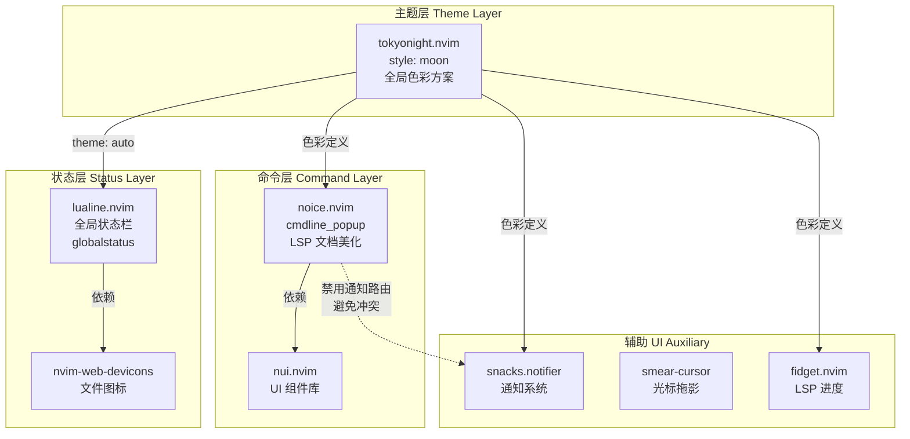
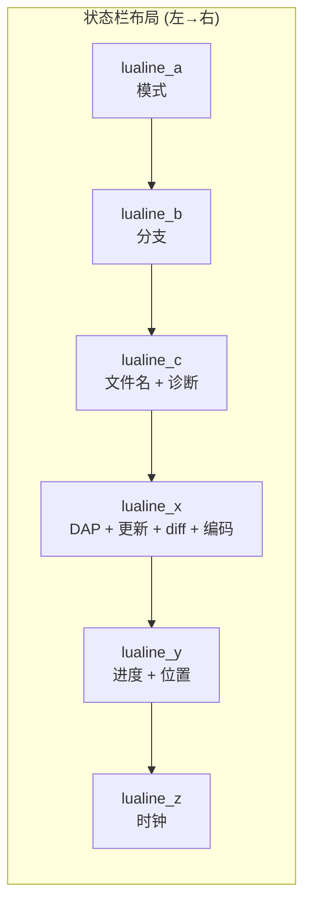

本配置的界面美化系统由三大核心插件协同构成：**tokyonight** 负责全局色彩方案，**noice** 将原生命令行重构为浮动窗口体验，**lualine** 提供高度定制化的全局状态栏。三者通过 `tokyonight` 的色彩体系形成视觉一致性，并与 `snacks.notifier`（通知）、`smear-cursor`（光标动画）、`fidget`（LSP 进度）等辅助 UI 插件组成完整的视觉层次。

Sources: [tokyonight.lua](lua/plugins/tokyonight.lua#L1-L11), [noice.lua](lua/plugins/noice.lua#L1-L73), [lualine.lua](lua/plugins/lualine.lua#L1-L122)

## 系统架构：三层视觉体系

整个界面美化系统遵循 **主题层 → 命令层 → 状态层** 的分层架构。主题层由 `tokyonight` 定义全局调色板，所有 UI 插件通过 `theme = "auto"` 自动继承；命令层由 `noice` 接管原生命令行区域，将 `:cmd`、`/search`、`:lua` 等命令渲染为带图标和语法高亮的浮动弹窗；状态层由 `lualine` 构建全局状态栏，集中展示模式、分支、文件、诊断、调试状态等信息。



从加载顺序上看，`tokyonight` 作为色彩方案具有最高优先级——它没有设置 `lazy` 加载事件，会在 Neovim 启动时立即加载并执行 `vim.cmd("colorscheme tokyonight")`。`noice` 和 `lualine` 均使用 `event = "VeryLazy"` 延迟加载，确保核心启动流程不受阻塞。`noice` 在 `init` 阶段就将 `vim.opt.cmdheight` 设为 0，彻底隐藏原生命令行区域，为后续浮动窗口接管做准备。

Sources: [tokyonight.lua](lua/plugins/tokyonight.lua#L1-L11), [noice.lua](lua/plugins/noice.lua#L9-L12), [lualine.lua](lua/plugins/lualine.lua#L3-L16)

## tokyonight 主题：moon 风格的视觉基调

[tokyonight.lua](lua/plugins/tokyonight.lua) 的配置极其精简——仅指定 `style = "moon"` 并在自定义 `config` 函数中手动调用 setup 和 colorscheme：

```lua
-- lua/plugins/tokyonight.lua
return {
    "folke/tokyonight.nvim",
    opts = {
        style = "moon"
    },
    config = function (_, opts)
        require("tokyonight").setup(opts)
        vim.cmd("colorscheme tokyonight")
    end
}
```

**为什么使用自定义 `config` 而非让 lazy.nvim 自动调用？** 因为 lazy.nvim 的自动 config 机制会在 `require("tokyonight").setup(opts)` 之后自动添加 `vim.cmd.colorscheme("tokyonight")`，但此处通过显式 `config` 函数确保了 setup 和 colorscheme 的执行顺序完全可控，避免与其他在 `ColorScheme` 事件上注册的 autocmd 产生竞态。

`tokyonight` 提供四种内置风格，本配置选用的 **moon** 风格特点如下：

| 风格 | 背景色调 | 适合场景 | 本配置是否采用 |
|------|---------|---------|-------------|
| storm | 深蓝偏冷 | 暗室环境 | ✗ |
| moon | 暖灰深蓝 | 长时间编码，眼睛舒适 | ✓ |
| night | 纯深蓝黑 | 极简暗色 | ✗ |
| day | 浅色模式 | 明亮环境 | ✗ |

`moon` 风格的色温偏暖，背景色 `#222439` 相比 `storm` 的 `#1a1b26` 明度更高、饱和度更低，在长时间编码时对眼睛的疲劳感更小。所有 UI 插件通过 Neovim 的 highlight group 体系自动继承这套色彩——`lualine` 的 `theme = "auto"` 会读取当前 colorscheme 的调色板，`noice` 的弹窗边框和背景也直接使用主题定义的 `FloatBorder` 和 `NormalFloat` 高亮组。

Sources: [tokyonight.lua](lua/plugins/tokyonight.lua#L1-L11)

## noice 命令行美化：职责分离的设计哲学

[noice.lua](lua/plugins/noice.lua) 的配置体现了明确的 **职责分离** 原则——noice 仅负责 cmdline 美化和 LSP 文档增强，通知功能已完全移交给 `snacks.notifier`。这种分离避免了两个插件在消息路由上的冲突，同时让每个插件在自己擅长的领域发挥最大价值。

### 消息路由的禁用策略

配置中通过三个维度禁用了 noice 的通知能力：

| 模块 | 配置 | 原因 |
|------|------|------|
| `notify.enabled` | `false` | `snacks.notifier` 已接管 `vim.notify` |
| `messages.enabled` | `false` | `snacks.notifier` 已接管消息显示 |
| `lsp.progress` | `false` | `snacks.notifier` 已处理 LSP 进度 |
| `lsp.message` | `false` | LSP 消息由 snacks 统一管理 |
| `routes` | `{}` | 空路由表，不进行任何消息重定向 |

Sources: [noice.lua](lua/plugins/noice.lua#L14-L51)

### cmdline 浮动窗口：带上下文图标的命令行

noice 的核心功能是将原生命令行升级为 **浮动弹窗**（`view = "cmdline_popup"`）。它通过 `format` 表定义了不同命令类型的识别规则和视觉表现：

```lua
format = {
    cmdline    = { pattern = "^:",      icon = "", lang = "vim" },
    search_down = { pattern = "^/",     icon = " ", lang = "regex" },
    search_up   = { pattern = "^%?",    icon = " ", lang = "regex" },
    filter      = { pattern = "^:%s*!", icon = "$", lang = "bash" },
    lua         = { pattern = { "^:%s*lua%s+", "^:%s*lua%s*=%s*", "^:%s*=%s*" },
                    icon = "", lang = "lua" },
    help        = { pattern = "^:%s*he?l?p?%s+", icon = "󰋖" },
    input       = {},   -- vim.ui.input 回调
}
```

每种命令类型拥有独立的 **图标** 和 **语法高亮语言**（`lang` 字段）。当输入 `:lua print()` 时，弹窗左侧显示  图标并以 Lua 语法高亮渲染内容；输入 `/pattern` 时显示  图标并启用 regex 高亮。这种上下文感知让用户一眼就能区分当前正在输入的命令类型。

Sources: [noice.lua](lua/plugins/noice.lua#L36-L49)

### LSP 文档美化：Markdown 渲染与边框

noice 对 LSP 的增强通过 `override` 机制实现——它替换了 Neovim 内置的三个核心函数，使 hover 文档、签名帮助和补全文档都以格式化的 Markdown 形式呈现：

| 被覆盖函数 | 作用 |
|-----------|------|
| `vim.lsp.util.convert_input_to_markdown_lines` | 将 LSP 返回的内容转为 Markdown 行 |
| `vim.lsp.util.stylize_markdown` | 对 Markdown 内容进行语法高亮渲染 |
| `cmp.entry.get_documentation` | 补全菜单中的文档弹窗 |

配合 `presets.lsp_doc_border = true`，所有 LSP 文档弹窗都会带有圆角边框，视觉上与浮动命令行风格一致。`hover`、`signature`、`documentation` 三个子模块均显式启用，确保 K 键触发 hover 和自动弹出签名帮助时都能获得美化效果。

Sources: [noice.lua](lua/plugins/noice.lua#L22-L34), [noice.lua](lua/plugins/noice.lua#L52-L58)

### 预设与快捷键

noice 启用了两个关键预设：`bottom_search` 保留搜索在底部的习惯，`command_palette` 使用 VS Code 风格的命令补全面板。快捷键方面定义了三个操作：

| 快捷键 | 模式 | 功能 |
|--------|------|------|
| `<S-Enter>` | `c`（命令模式） | 重定向当前命令行到 noice 弹窗 |
| `<C-f>` | `i`, `n`, `s` | 向前滚动 LSP 文档弹窗（4 行） |
| `<C-b>` | `i`, `n`, `s` | 向后滚动 LSP 文档弹窗（4 行） |

`<C-f>` / `<C-b>` 使用 `expr = true` 模式——当 noice 的 LSP 弹窗不存在时，回退为原生 `<C-f>` / `<C-b>` 行为（前/后翻页），避免功能丢失。

Sources: [noice.lua](lua/plugins/noice.lua#L52-L58), [noice.lua](lua/plugins/noice.lua#L61-L65)

## lualine 状态栏：信息密度的精平衡

[lualine.lua](lua/plugins/lualine.lua) 构建了一条全局状态栏，在有限空间内集成了模式、Git、文件、诊断、调试、插件更新、差异统计和时钟等多元信息，同时通过 `globalstatus`（`laststatus = 3`）实现跨窗口的统一状态栏。

### 启动优化：避免闪烁

lualine 的 `init` 函数实施了一项重要的启动优化——在 lazy.nvim 加载 lualine 之前，根据启动场景设置不同的占位策略：

```lua
init = function()
    vim.g.lualine_laststatus = vim.o.laststatus    -- 保存原始值
    if vim.fn.argc(-1) > 0 then
        vim.o.statusline = " "                      -- 有文件参数：空占位
    else
        vim.o.laststatus = 0                        -- 无参数（dashboard）：隐藏状态栏
    end
end,
```

当通过 `nvim` 空启动进入 dashboard 时，`laststatus = 0` 完全隐藏状态栏，避免在欢迎页面底部出现空白条。当通过 `nvim file.cs` 直接打开文件时，仅设置空格占位。lualine 加载后通过 `vim.o.laststatus = vim.g.lualine_laststatus` 和 `vim.o.statusline = nil` 恢复正常行为。此外，`disabled_filetypes` 列表确保 dashboard、alpha 等 starter 页面始终隐藏状态栏。

Sources: [lualine.lua](lua/plugins/lualine.lua#L7-L46)

### 状态栏分区布局

lualine 将状态栏分为 A ~ Z 六个区域，每个区域承载不同类别的信息：



各区段的具体配置如下：

| 区段 | 组件 | 说明 |
|------|------|------|
| **lualine_a** | `mode` | 当前编辑模式（NORMAL / INSERT / VISUAL 等） |
| **lualine_b** | `branch` | Git 分支名称 |
| **lualine_c** | `filename` + `diagnostics` | 相对路径文件名（含修改 ● / 只读  标记）+ 错误/警告/提示计数 |
| **lualine_x** | DAP 状态 + Lazy 更新 + `diff` + `encoding` + `fileformat` + `filetype` | 调试器状态（紫色）+ 插件更新提示（橙色）+ Git diff 统计 + 文件元信息 |
| **lualine_y** | `progress` + `location` | 文件进度百分比 + 光标行列号 |
| **lualine_z** | 自定义函数 | 当前时间  HH:MM |

Sources: [lualine.lua](lua/plugins/lualine.lua#L48-L115)

### 条件渲染：DAP 状态与插件更新

`lualine_x` 中的两个组件使用了 **条件渲染**（`cond` 函数），只在特定条件下才显示：

**DAP 调试状态组件** 仅在 `dap` 模块已加载且调试器处于活跃状态时显示，使用自定义紫色 `#bb9af7` 高亮：

```lua
{
    function() return "  " .. require("dap").status() end,
    cond = function() return package.loaded["dap"] and require("dap").status() ~= "" end,
    color = { fg = "#bb9af7" },
},
```

**Lazy 插件更新组件** 通过 `lazy.status` API 检测是否有待更新插件，使用橙色 `#ff9e64` 提醒：

```lua
{
    require("lazy.status").updates,
    cond = require("lazy.status").has_updates,
    color = { fg = "#ff9e64" },
},
```

这种条件渲染策略确保状态栏在不需要时保持简洁——未启动调试时不显示 DAP 信息，插件全部最新时不显示更新提示。

Sources: [lualine.lua](lua/plugins/lualine.lua#L73-L83)

### Git diff 集成与图标体系

diff 组件通过自定义 `source` 函数从 gitsigns 获取缓冲区级别的变更统计，而非使用全局 git 命令：

```lua
source = function()
    local gitsigns = vim.b.gitsigns_status_dict
    if gitsigns then
        return {
            added = gitsigns.added,
            modified = gitsigns.changed,    -- 注意字段名映射
            removed = gitsigns.removed,
        }
    end
end,
```

注意 `gitsigns.changed` 到 `modified` 的字段名映射——这是 lualine 的 `diff` 组件与 gitsigns 的 buffer 变量之间的命名差异。整个状态栏使用自定义图标集，诊断图标（ 、 、 、 ）和 Git 图标（ 、 、 ）均为 Nerd Font 字形，确保在安装了 Nerd Font 的终端中正确显示。

Sources: [lualine.lua](lua/plugins/lualine.lua#L22-L35), [lualine.lua](lua/plugins/lualine.lua#L86-L101)

### 扩展集成与视觉分隔符

lualine 加载了三个扩展（`extensions`）以适配特定插件界面：`lazy` 为 Lazy 管理器窗口提供状态栏，`mason` 为 Mason 窗口提供状态栏，`nvim-tree` 为文件树窗口提供状态栏。分隔符方面，`component_separators` 和 `section_separators` 均使用空字符串 `""`，配合 tokyonight moon 的背景色差异自然形成区段分隔，呈现干净的块状视觉效果。

Sources: [lualine.lua](lua/plugins/lualine.lua#L42-L47), [lualine.lua](lua/plugins/lualine.lua#L116)

## 辅助 UI 组件：视觉体验的细节层

除三大核心插件外，本配置还包含多个辅助 UI 组件，它们在不增加主界面复杂度的前提下增强了视觉反馈的丰富度：

| 插件 | 文件 | 功能 | 加载时机 |
|------|------|------|---------|
| **smear-cursor** | [smear-cursor.lua](lua/plugins/smear-cursor.lua) | 光标移动拖影动画 | `VeryLazy` |
| **fidget** | [fidget.lua](lua/plugins/fidget.lua) | LSP 进度旋转动画 | `LspAttach` |
| **render-markdown** | [render-markdown.lua](lua/plugins/render-markdown.lua) | Markdown 实时渲染美化 | 默认（延迟） |
| **rainbow-delimiters** | [rainebow.lua](lua/plugins/rainebow.lua) | 彩虹括号匹配 | `BufReadPre` |
| **snacks.notifier** | [snacks.lua](lua/plugins/snacks.lua) | 通知弹窗系统 | 启动时 |

`smear-cursor` 配置了 `stiffness = 0.7` 和 `trailing_stiffness = 0.3` 的拖影参数，光标颜色 `#d3cdc3` 与 tokyonight moon 的暖灰调色板协调。`fidget` 在 `LspAttach` 时加载，使用 `dots` 动画模式显示 LSP 服务器的工作进度。`snacks.notifier` 作为 noice 通知功能的替代者，接管了 `vim.notify` 和消息路由，相关快捷键为 `<leader>snh`（通知历史）和 `<leader>snd`（清除所有通知）。

Sources: [smear-cursor.lua](lua/plugins/smear-cursor.lua#L1-L19), [fidget.lua](lua/plugins/fidget.lua#L1-L22), [snacks.lua](lua/plugins/snacks.lua#L17), [rainebow.lua](lua/plugins/rainebow.lua#L1-L6)

## 延伸阅读

- 了解 tokyonight 主题如何影响所有 UI 组件的配色，可以参考 [配置文件加载流程与启动顺序](3-pei-zhi-wen-jian-jia-zai-liu-cheng-yu-qi-dong-shun-xu) 中 colorscheme 的加载时机
- lualine 中 DAP 状态组件的完整调试上下文，参见 [DAP 调试系统架构：多调试器后端切换与适配器注册](8-dap-diao-shi-xi-tong-jia-gou-duo-diao-shi-qi-hou-duan-qie-huan-yu-gua-pei-qi-zhu-ce)
- noice 与 snacks.notifier 的职责分离关系，参见 [lazy.nvim 插件管理：懒加载策略与 spec 规范](5-lazy-nvim-cha-jian-guan-li-lan-jia-zai-ce-lue-yu-spec-gui-fan) 中关于插件间依赖与冲突的设计
- 状态栏上方的 buffer 标签页系统，参见 [Buffer 管理与导航：bufferline 标签页](19-buffer-guan-li-yu-dao-hang-bufferline-biao-qian-ye)