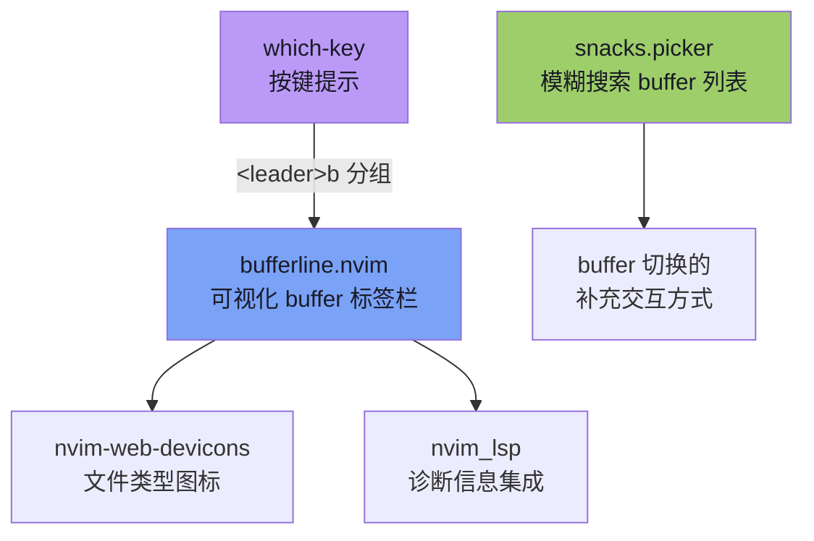
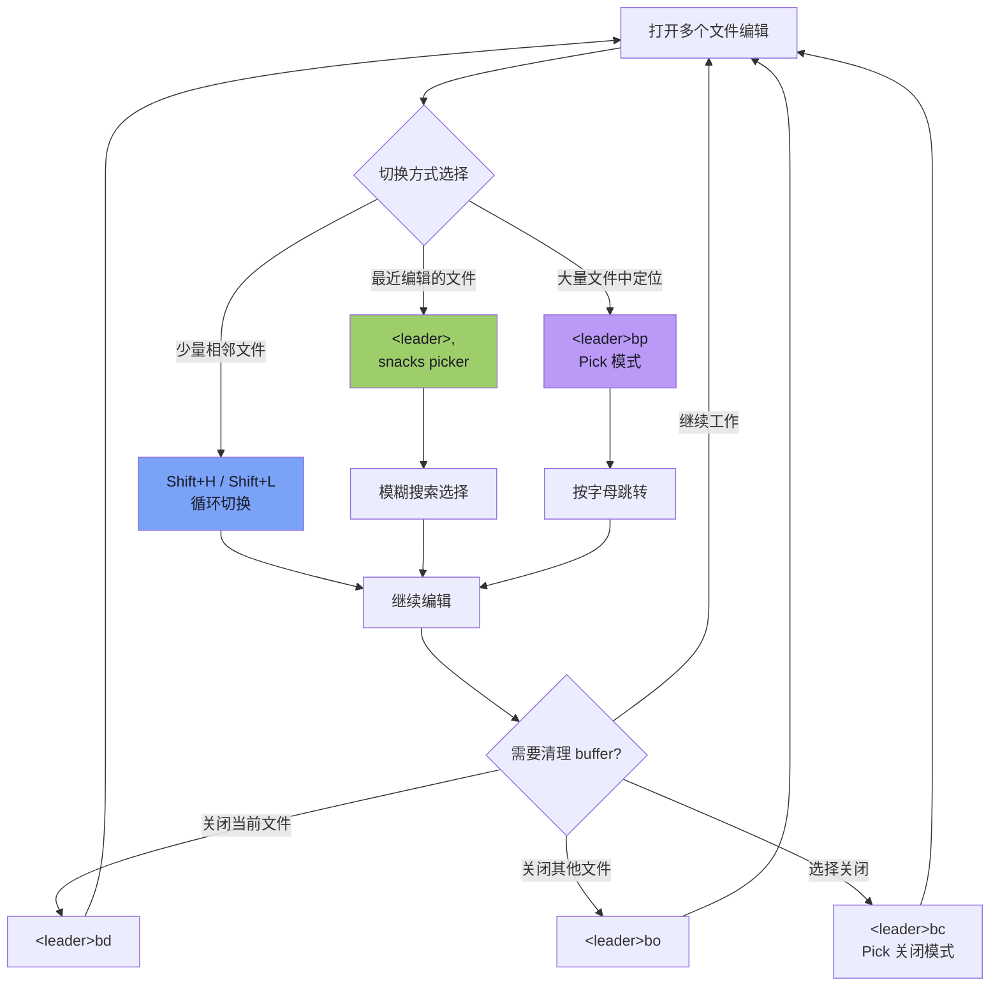

在 Neovim 中，**buffer（缓冲区）** 是文件编辑的基本单元——每打开一个文件就创建一个 buffer。本配置使用 **bufferline.nvim** 将所有已打开的 buffer 以可视化标签页的形式排列在编辑器顶部，让你直观地看到当前打开了哪些文件，并通过快捷键在它们之间高效切换。与此同时，`snacks.picker` 提供了模糊搜索式的 buffer 选择器，两者配合构成了完整的 buffer 管理体系。

Sources: [bufferline.lua](lua/plugins/bufferline.lua#L1-L39), [snacks.lua](lua/plugins/snacks.lua#L54-L59)

## 插件架构与依赖关系

bufferline 在本配置中属于 **启动时加载** 的 UI 插件（`lazy = false`），因为它提供的是始终可见的界面元素。以下是它的依赖链与协作关系：

**核心组件一览**：

| 组件 | 来源文件 | 职责 | 加载方式 |
|------|---------|------|---------|
| bufferline.nvim | [bufferline.lua](lua/plugins/bufferline.lua) | 顶部标签栏渲染、buffer 切换/关闭命令 | 启动加载 (`lazy = false`) |
| nvim-web-devicons | [bufferline.lua](lua/plugins/bufferline.lua#L3-L5) | 为每个文件类型显示对应图标 | bufferline 依赖自动加载 |
| snacks.picker | [snacks.lua](lua/plugins/snacks.lua#L54-L59) | 模糊搜索式 buffer 列表与切换 | VeryLazy |
| which-key | [whichkey.lua](lua/plugins/whichkey.lua#L31-L37) | `<leader>b` 按键分组提示 | VeryLazy |

Sources: [bufferline.lua](lua/plugins/bufferline.lua#L1-L39), [snacks.lua](lua/plugins/snacks.lua#L54-L59), [whichkey.lua](lua/plugins/whichkey.lua#L31-L37)

## 诊断信息集成：LSP 状态一目了然

bufferline 的一个关键特性是集成了 **nvim_lsp 诊断信息**，在每个 buffer 标签上直接显示该文件的错误、警告数量。配置通过 `diagnostics_indicator` 自定义函数实现，它会遍历 LSP 返回的诊断字典，将不同级别的诊断数量以图标形式拼接到标签上：

| 诊断级别 | 图标 | 含义 |
|---------|------|------|
| error |  | 编译错误或严重问题 |
| warning |  | 警告信息 |
| info / hint |  | 提示信息 |

例如，当一个 C# 文件有 2 个错误和 1 个警告时，标签上会显示 `2 1 `，让你在不切换到该 buffer 的情况下就能判断文件状态。这对于同时打开多个文件的 C# 项目开发尤为实用——当 Roslyn LSP 完成分析后，所有文件的诊断状态会实时反映在标签栏上。

Sources: [bufferline.lua](lua/plugins/bufferline.lua#L7-L24)

## 快捷键参考：完整的 Buffer 操作体系

本配置为 buffer 操作设计了 **双层快捷键策略**：快速访问键（无需 Leader）和发现式键（Leader 分组），兼顾效率与可发现性。

### 快速访问键（无 Leader 前缀）

| 快捷键 | 命令 | 功能说明 |
|--------|------|---------|
| `Shift + H` | `:BufferLineCyclePrev` | 切换到上一个 buffer |
| `Shift + L` | `:BufferLineCycleNext` | 切换到下一个 buffer |

这两个快捷键的设计理念是 **高频操作零延迟**：在编辑代码时频繁切换 buffer 是常见操作，使用 `Shift + H/L` 无需先按 Leader 键，单手即可完成。它与 Vim 传统习惯保持一致（类似 vim-unimpaired 的 `[b` / `]b`），降低记忆成本。

### 发现式键（Leader b 分组）

| 快捷键 | 命令 | 功能说明 |
|--------|------|---------|
| `<leader>bh` | `:BufferLineCyclePrev` | 切换到上一个 buffer |
| `<leader>bl` | `:BufferLineCycleNext` | 切换到下一个 buffer |
| `<leader>bp` | `:BufferLinePick` | **选择模式**：按字母快速跳转到指定 buffer |
| `<leader>bc` | `:BufferLinePickClose` | **选择关闭**：按字母选择要关闭的 buffer |
| `<leader>bo` | `:BufferLineCloseOthers` | 关闭除当前 buffer 外的所有 buffer |
| `<leader>bd` | `:bdelete` | 关闭当前 buffer |

其中 `<leader>bp` 的 **Pick 模式** 是 bufferline 的高级功能——按下后，每个 buffer 标签上会出现一个字母标识（如 `a`, `b`, `c`...），再按对应字母即可直接跳转。当你打开了十几个文件时，这比逐个循环切换高效得多。同样，`<leader>bc` 的 Pick 关闭模式让你精准选择要关闭的 buffer，而不会误关其他文件。

`<leader>b` 分组已注册到 [which-key](lua/plugins/whichkey.lua#L31-L37) 的按键提示系统中。当你按下 `<leader>b` 后稍作停留，which-key 会自动弹出该分组下所有可用的 buffer 操作，非常适合初学者探索和学习。

Sources: [bufferline.lua](lua/plugins/bufferline.lua#L26-L37), [whichkey.lua](lua/plugins/whichkey.lua#L31-L37)

## 模糊搜索式 Buffer 切换：snacks.picker 补充

除了 bufferline 的标签式切换，本配置还通过 snacks.picker 提供了 **模糊搜索式 buffer 切换**，适用于打开了大量文件时快速定位的场景：

| 快捷键 | 命令 | 功能 |
|--------|------|------|
| `<leader>,` | `Snacks.picker.buffers({ sort = { "lastused", "bufnr" } })` | 按最近使用排序的 buffer 列表 |
| `<leader>fb` | `Snacks.picker.buffers({ sort = { "lastused", "bufnr" } })` | 同上（file 分组入口） |
| `<leader>fB` | `Snacks.picker.buffers()` | 显示所有 buffer（无排序偏好） |

`<leader>,` 是一个精心设计的 **快捷入口**：逗号键在键盘上位置便捷，加上按最近使用（`lastused`）排序，意味着你最近编辑过的文件总是排在列表最前面。这形成了一个高效的工作流：当你需要回到刚刚编辑的文件时，按下 `<leader>,` 然后第一个选项通常就是目标文件，直接按回车即可。

这两种 buffer 切换方式的关系是互补的：**bufferline 适合少量 buffer 的循环切换**（`Shift+H/L`），**snacks picker 适合大量 buffer 的精确查找**（`<leader>,`）。

Sources: [snacks.lua](lua/plugins/snacks.lua#L55-L59)

## Buffer 与 Tab：理解两个不同的概念

在 Neovim 中，**buffer** 和 **tab** 是两个容易混淆的概念，本配置对两者都有完整支持：

- **Buffer**（缓冲区）：内存中加载的文件实例。多个 buffer 共享同一个编辑区域，通过 bufferline 标签栏可视化。关闭 buffer 意味着从内存中卸载该文件。
- **Tab**（标签页）：包含一组窗口（window）的独立工作区。每个 tab 可以有不同的窗口布局。适合同时处理多个独立任务（如同时查看前端和后端代码）。

Tab 相关操作在 [keymap.lua](lua/core/keymap.lua#L60-L67) 中定义，使用 `<leader><Tab>` 前缀分组：

| 快捷键 | 功能 |
|--------|------|
| `<leader><Tab><Tab>` | 新建 Tab |
| `<leader><Tab>]` | 下一个 Tab |
| `<leader><Tab>[` | 上一个 Tab |
| `<leader><Tab>d` | 关闭当前 Tab |
| `<leader><Tab>o` | 关闭其他 Tab |
| `<leader><Tab>l` | 跳转到最后一个 Tab |
| `<leader><Tab>f` | 跳转到第一个 Tab |

**使用建议**：日常开发中，大多数场景使用 buffer 切换（bufferline + snacks picker）即可。当需要同时查看多个文件的不同位置，或者想为不同任务保持独立的窗口布局时，再使用 Tab 功能。

Sources: [keymap.lua](lua/core/keymap.lua#L60-L67)

## 常见工作流示例

以下流程图展示了典型的 buffer 管理工作流：

Sources: [bufferline.lua](lua/plugins/bufferline.lua#L26-L37), [snacks.lua](lua/plugins/snacks.lua#L55-L59)

## 延伸阅读

- **Buffer 与窗口管理**密切相关，窗口操作快捷键见 [快捷键体系：Leader 键分组与 buffer-local 绑定策略](12-kuai-jie-jian-ti-xi-leader-jian-fen-zu-yu-buffer-local-bang-ding-ce-lue)。
- bufferline 的诊断信息来源于 LSP，LSP 配置详见 [Roslyn LSP 配置：语言服务器管理与解决方案定位](7-roslyn-lsp-pei-zhi-yu-yan-fu-wu-qi-guan-li-yu-jie-jue-fang-an-ding-wei) 和 [Mason LSP 管理：服务器自动安装与 capabilities 注册](28-mason-lsp-guan-li-fu-wu-qi-zi-dong-an-zhuang-yu-capabilities-zhu-ce)。
- bufferline 是界面美化系统的一部分，相关页面：[界面美化系统：tokyonight 主题、noice 命令行、lualine 状态栏](18-jie-mian-mei-hua-xi-tong-tokyonight-zhu-ti-noice-ming-ling-xing-lualine-zhuang-tai-lan)。