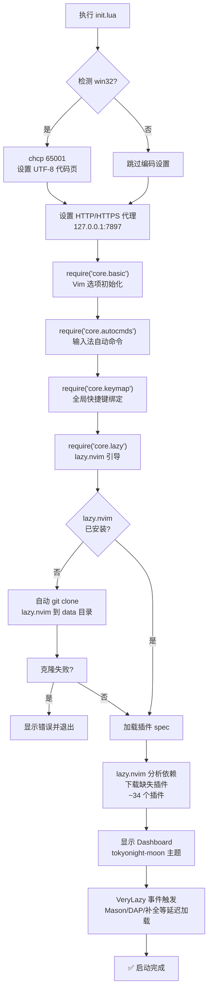

本文是 C#/.NET 开发者专用 Neovim 配置框架的**环境搭建指南**，覆盖从系统前置条件检查到首次启动验证的完整流程。你将了解需要安装哪些外部工具、如何获取配置文件、首次启动时发生了什么，以及如何确认一切就绪。

## 系统前置条件

本配置专为 **Windows 平台**优化，在 `init.lua` 入口处即检测 `win32` 环境并设置 UTF-8 代码页，`basic.lua` 中将默认 Shell 绑定为 PowerShell 7。所有路径、编码和剪贴板策略都围绕 Windows 生态设计，虽然理论上也可在其他系统上运行，但未经测试。

以下是必须与可选的外部依赖总览：

| 依赖项 | 类别 | 是否必须 | 用途 | 验证命令 |
|---|---|---|---|---|
| **Neovim ≥ 0.10** | 编辑器 | ✅ 必须 | 配置运行的基础环境 | `nvim --version` |
| **Git** | 版本控制 | ✅ 必须 | 克隆配置、lazy.nvim 插件下载 | `git --version` |
| **.NET SDK 8.0+** | 开发工具链 | ✅ 必须 | C# 编译、调试、Roslyn LSP | `dotnet --version` |
| **PowerShell 7 (pwsh)** | Shell | ✅ 必须 | 内置终端、Shell 命令执行 | `pwsh --version` |
| **C 编译器 (gcc/zig)** | 编译工具 | ⚠️ 推荐 | treesitter 解析器原生编译 | `gcc --version` |
| **lazygit** | Git 工具 | 🔲 可选 | Git 工作流集成 | `lazygit --version` |
| **yazi** | 文件管理 | 🔲 可选 | 终端文件管理器集成 | `yazi --version` |
| **Nerd Font** | 字体 | ⚠️ 推荐 | 图标渲染、状态栏美化 | 安装后终端设置中选用 |
| **im-select** | 输入法 | 🔲 可选 | 自动切换中英文输入法 | — |

Sources: [init.lua](init.lua#L1-L23), [basic.lua](lua/core/basic.lua#L29-L36), [treesitter.lua](lua/plugins/treesitter.lua#L6-L18), [toggleterm.lua](lua/plugins/toggleterm.lua#L9-L10), [lazygit.lua](lua/plugins/lazygit.lua#L1-L10), [yazi.lua](lua/plugins/yazi.lua#L1-L39), [autocmds.lua](lua/core/autocmds.lua#L1-L23)

### 必须依赖的安装说明

**Neovim** 建议通过 [官方 Release 页面](https://github.com/neovim/neovim/releases) 下载最新稳定版的 Windows ZIP 包，解压后将 `bin/` 目录添加到系统 `PATH`。确认版本号 ≥ 0.10：

```
nvim --version
```

**Git** 从 [git-scm.com](https://git-scm.com/download/win) 安装。安装时建议选择"添加到 PATH"选项。

**.NET SDK** 从 [dotnet.microsoft.com](https://dotnet.microsoft.com/download) 安装 8.0 或更高版本。Roslyn LSP 和 DAP 调试器均依赖 `dotnet` CLI。

**PowerShell 7** 从 [GitHub Release](https://github.com/PowerShell/PowerShell/releases) 安装，或通过 `winget install Microsoft.PowerShell` 安装。注意配置中通过 `pwsh` 命令调用，而非 Windows 自带的 `powershell`（5.x 版本）。

Sources: [basic.lua](lua/core/basic.lua#L29-L36), [toggleterm.lua](lua/plugins/toggleterm.lua#L9-L10)

### 推荐依赖的安装说明

**C 编译器**用于编译 Treesitter 解析器的原生模块。Windows 上推荐安装 [Zig](https://ziglang.org/download/)（配置中 `CC` 环境变量可指向 `zig cc`），或安装 MinGW-w64（gcc）。如果缺少编译器，Treesitter 仍可使用预编译的 WASM 解析器，但性能可能受影响。

**Nerd Font** 是正确显示状态栏图标、文件图标（nvim-web-devicons）和 Dashboard ASCII Art 的前提。推荐安装 [JetBrains Mono Nerd Font](https://www.nerdfonts.com/font-downloads)，安装后在终端设置中将字体切换为 `JetBrainsMono Nerd Font`。

**lazygit** 和 **yazi** 是可选但推荐的工具。lazygit 通过 `winget install lazygit` 或 `scoop install lazygit` 安装；yazi 从 [GitHub Release](https://github.com/sxyazi/yazi/releases) 下载。缺少它们不影响核心编辑功能，只是对应的 `<leader>gg`（lazygit）和 `<leader>-`（yazi）快捷键将无法使用。

Sources: [treesitter.lua](lua/plugins/treesitter.lua#L6-L18), [snacks.lua](lua/plugins/snacks.lua#L6-L13), [lazygit.lua](lua/plugins/lazygit.lua#L7-L9), [yazi.lua](lua/plugins/yazi.lua#L9-L28)

## 获取配置文件

### 方式一：直接克隆到 Neovim 配置目录

在 Windows 上，Neovim 的本地配置目录默认为 `C:\Users\<用户名>\AppData\Local\nvim`。将本仓库直接克隆到该路径即可：

```powershell
# 备份已有配置（如果存在）
if (Test-Path "$env:LOCALAPPDATA\nvim") {
    Rename-Item "$env:LOCALAPPDATA\nvim" "nvim.bak"
}

# 克隆配置仓库
git clone <仓库地址> "$env:LOCALAPPDATA\nvim"
```

### 方式二：使用现有目录

如果你已在 `C:\Users\<用户名>\AppData\Local\nvim` 目录下工作（即当前工作目录），则配置文件已就位，无需额外操作。

### 配置目录结构速览

克隆完成后，目录结构如下：

```
~\AppData\Local\nvim\
├── init.lua              ← 入口文件：编码设置、代理、模块加载
├── lua\
│   ├── core\             ← 核心配置层
│   │   ├── basic.lua     ← Vim 选项（编码、Shell、剪贴板）
│   │   ├── autocmds.lua  ← 自动命令（输入法切换）
│   │   ├── keymap.lua    ← 全局快捷键
│   │   ├── lazy.lua      ← lazy.nvim 引导与插件加载
│   │   ├── dap.lua       ← DAP 调试核心逻辑
│   │   └── dap_config.lua← 调试器后端选择
│   └── plugins\          ← 插件声明层（34 个插件 spec 文件）
├── .neoconf.json         ← neodev 开发辅助配置
├── stylua.toml           ← Lua 代码格式化规则
├── lazy-lock.json        ← 插件版本锁定文件
└── nvim_edit.ps1         ← 外部编辑器远程打开脚本
```

其中 `lua/core/` 是**基础层**，定义编辑器行为；`lua/plugins/` 是**扩展层**，每个 `.lua` 文件对应一个 lazy.nvim 插件声明。加载顺序由 lazy.nvim 自动管理，详见 [配置文件加载流程与启动顺序](3-pei-zhi-wen-jian-jia-zai-liu-cheng-yu-qi-dong-shun-xu)。

Sources: [init.lua](init.lua#L1-L23), [lua/core/](lua/core/), [lua/plugins/](lua/plugins/)

## 首次启动流程

启动 Neovim 时，无需传入任何参数：

```
nvim
```

首次启动会触发一系列自动化操作。下图展示了完整的启动时序：



### 阶段一：入口初始化（init.lua）

`init.lua` 是整个配置的起点，它执行四项关键任务：

1. **Windows 编码修正** — 检测 `win32` 平台后执行 `chcp 65001`，确保子进程（如 lazygit）输出不出现中文乱码。
2. **代理设置** — 将 `HTTP_PROXY` 和 `HTTPS_PROXY` 环境变量指向 `http://127.0.0.1:7897`。如果你的代理地址不同，需要修改此行。
3. **核心模块加载** — 按顺序加载 `basic` → `autocmds` → `keymap` → `lazy` 四个核心模块。
4. **DAP 延迟初始化** — 注册 `VeryLazy` 事件回调，在所有插件加载完毕后再初始化调试系统。

Sources: [init.lua](init.lua#L1-L23)

### 阶段二：lazy.nvim 引导与插件安装

`core/lazy.lua` 检查 `~\AppData\Local\nvim-data\lazy\lazy.nvim` 路径是否存在。若不存在，自动从 GitHub 克隆 lazy.nvim 稳定版到该位置。克隆失败时会显示错误信息并退出。

引导完成后，lazy.nvim 扫描 `lua/plugins/` 目录下所有 `.lua` 文件（共 34 个插件声明），分析依赖关系，并**自动下载**所有尚未安装的插件。首次启动由于需要下载所有插件，可能需要 **2-5 分钟**（取决于网络环境）。插件数据存储在 `~\AppData\Local\nvim-data\lazy\` 目录下。

> **⚠️ 代理配置提示**：`init.lua` 中硬编码了代理地址 `127.0.0.1:7897`。如果你不使用代理或代理端口不同，请修改或删除这三行：
> ```lua
> vim.env.HTTP_PROXY = "http://127.0.0.1:7897"
> vim.env.HTTPS_PROXY = "http://127.0.0.1:7897"
> vim.env.NO_PROXY = "localhost,127.0.0.1"
> ```

Sources: [lazy.lua](lua/core/lazy.lua#L1-L35), [init.lua](init.lua#L8-L10)

### 阶段三：Dashboard 与主题

所有插件下载完成后，snacks.nvim 的 Dashboard 将显示一个自定义 ASCII Art 启动界面（Neovim 官方 Logo），配合 **tokyonight-moon** 主题。Dashboard 提供以下快捷入口：

| 按键 | 功能 | 说明 |
|---|---|---|
| `f` | Find File | 打开文件搜索器 |
| `n` | New File | 新建空文件 |
| `p` | Projects | 项目切换 |
| `g` | Find Text | 全局文本搜索 |
| `r` | Recent Files | 最近打开的文件 |
| `c` | Config | 浏览 Neovim 配置目录 |
| `s` | Restore Session | 恢复上次会话 |
| `l` | Lazy | 打开 lazy.nvim 管理界面 |
| `q` | Quit | 退出 Neovim |

Sources: [snacks.lua](lua/plugins/snacks.lua#L6-L52), [tokyonight.lua](lua/plugins/tokyonight.lua#L1-L10)

## 首次启动后的验证

首次启动完成后，按以下步骤确认关键功能正常工作。

### 步骤一：检查插件安装状态

在 Dashboard 界面按 `l` 打开 lazy.nvim 管理界面，确认所有插件状态为 **✓ 已安装**。如果有插件安装失败，按 `S` 进行同步（Sync）重试。

### 步骤二：检查 Treesitter 解析器

打开任意 Lua 文件（如 `:e init.lua`），Treesitter 会自动下载并编译配置中声明的解析器（`c`、`lua`、`vim`、`vimdoc`、`query`、`javascript`、`python`、`c_sharp`、`markdown`、`razor`）。如果遇到编译错误，确保系统已安装 C 编译器。

Sources: [treesitter.lua](lua/plugins/treesitter.lua#L6-L18)

### 步骤三：检查 LSP 服务

在 Neovim 中执行以下命令确认 Mason 和 LSP 状态：

| 检查项 | 命令 | 预期结果 |
|---|---|---|
| Mason 面板 | `:Mason` | 显示已安装的 LSP 服务器 |
| LSP 信息 | `:LspInfo` | 在打开 `.cs` 文件后显示 roslyn 状态 |
| Lua LSP | `:LspInfo` | 在打开 `.lua` 文件后显示 lua-ls 状态 |

Mason 会自动安装 `lua-language-server`（首次打开 Lua 文件时）。Roslyn LSP 仅在打开 `.cs` 文件时才触发加载（懒加载策略）。

Sources: [mason.lua](lua/plugins/mason.lua#L36-L56), [roslyn.lua](lua/plugins/roslyn.lua#L1-L13)

### 步骤四：打开 C# 项目验证完整工具链

创建或打开一个 C# 项目，验证完整开发工具链：

```powershell
# 在 Neovim 中打开一个 .cs 文件
nvim MyProject/Program.cs
```

打开后应观察到：
- **Roslyn LSP** 自动启动（底部状态栏显示 LSP 状态，`fidget.nvim` 显示进度）
- **代码补全** 在输入时触发（`blink.cmp`，支持 `super-tab` 模式）
- **语法高亮** 通过 Treesitter 提供
- 按 `K` 悬停文档、`gd` 跳转定义、`<leader>ca` 代码操作均可用

Sources: [roslyn.lua](lua/plugins/roslyn.lua#L1-L66), [blink.lua](lua/plugins/blink.lua#L1-L126), [mason.lua](lua/plugins/mason.lua#L63-L83)

## 常见问题排查

| 问题 | 可能原因 | 解决方案 |
|---|---|---|
| 插件下载超时/失败 | 代理配置不正确 | 修改 `init.lua` 中的代理地址，或删除代理设置 |
| 乱码（中文显示异常） | 终端编码非 UTF-8 | 确保使用 Windows Terminal，检查终端编码设置 |
| 图标显示为方框 | 未安装 Nerd Font | 安装 Nerd Font 并在终端中启用 |
| `pwsh` 命令找不到 | PowerShell 7 未安装 | 安装 PowerShell 7 并确认 `pwsh` 在 PATH 中 |
| Treesitter 解析器编译失败 | 缺少 C 编译器 | 安装 Zig 或 MinGW-w64 |
| Roslyn 不启动 | .NET SDK 未安装 | 安装 .NET SDK 8.0+，确认 `dotnet` 命令可用 |
| 剪贴板不工作（SSH） | 终端不支持 OSC 52 | 使用支持 OSC 52 的终端（Windows Terminal 1.18+） |
| DAP 调试报 "sharpdbg not found" | sharpdbg 未编译 | 在 sharpdbg 插件目录执行 `dotnet build` |

Sources: [init.lua](init.lua#L1-L10), [basic.lua](lua/core/basic.lua#L19-L61), [dap.lua](lua/core/dap.lua#L134-L157)

## 下一步

环境搭建完成后，建议按以下顺序深入了解本配置的架构设计：

1. **[配置文件加载流程与启动顺序](3-pei-zhi-wen-jian-jia-zai-liu-cheng-yu-qi-dong-shun-xu)** — 理解 `init.lua` → `core/*` → `plugins/*` 的完整加载链路
2. **[双模块分层设计：core 基础层与 plugins 扩展层](4-shuang-mo-kuai-fen-ceng-she-ji-core-ji-chu-ceng-yu-plugins-kuo-zhan-ceng)** — 掌握配置的整体架构思想
3. **[lazy.nvim 插件管理：懒加载策略与 spec 规范](5-lazy-nvim-cha-jian-guan-li-lan-jia-zai-ce-lue-yu-spec-gui-fan)** — 了解 34 个插件的加载时机和依赖关系