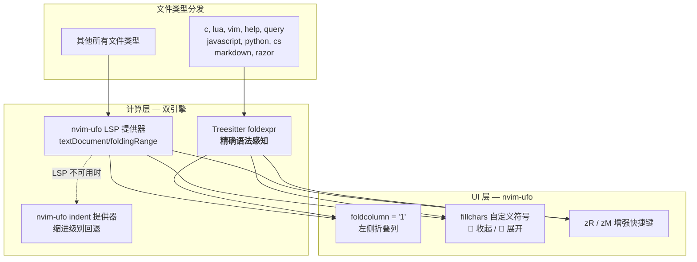
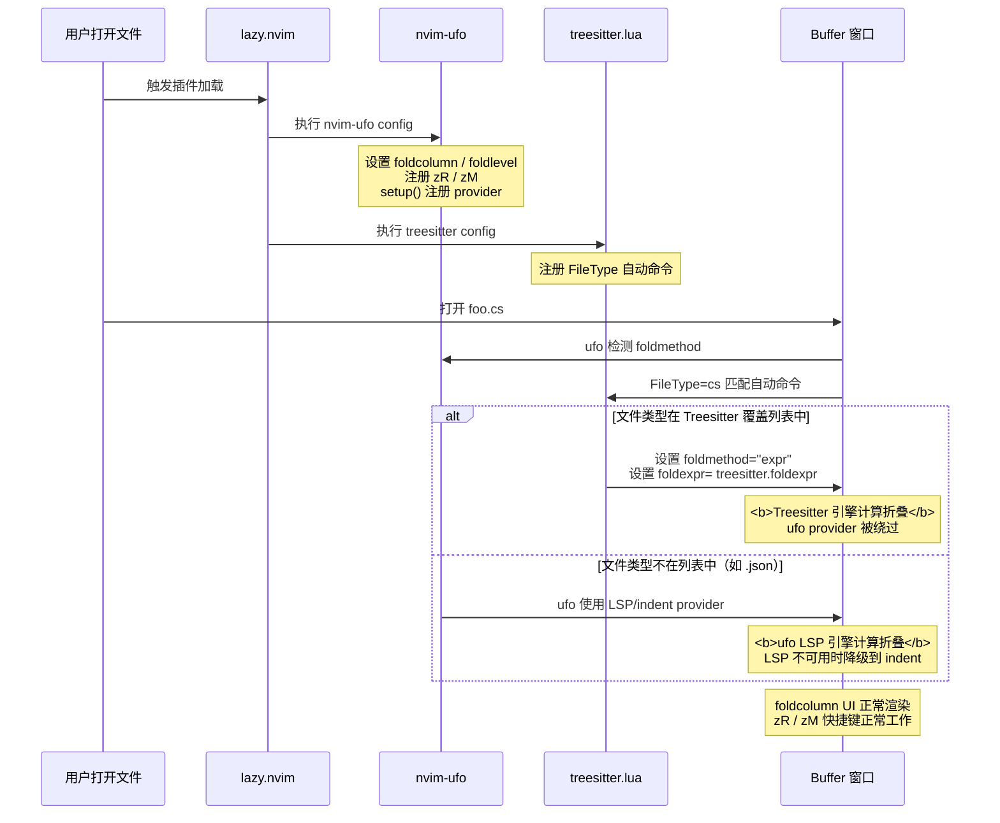

本文解析当前 Neovim 配置中**双引擎代码折叠**的架构设计——由 `nvim-ufo` 提供 UI 增强与全局折叠管理，由 Treesitter 的 `foldexpr()` 为已安装解析器的语言提供精确的语法感知折叠。两者在文件类型维度形成互补：Treesitter 覆盖 10 种核心语言的高质量折叠，nvim-ufo 的 LSP/indent 提供器则兜底处理其余所有文件类型。阅读本文前，建议先了解 [Treesitter 配置：语法高亮、代码折叠与 Razor 文件支持](14-treesitter-pei-zhi-yu-fa-gao-liang-dai-ma-zhe-die-yu-razor-wen-jian-zhi-chi) 中关于解析器安装和 FileType 自动命令的基础设定。

Sources: [nvim-ufo.lua](lua/plugins/nvim-ufo.lua#L1-L25), [treesitter.lua](lua/plugins/treesitter.lua#L1-L49)

## 架构总览：两层分离的折叠系统

本配置的折叠方案遵循**UI 层与计算层分离**的设计原则。`nvim-ufo` 负责所有用户可见的折叠界面元素（折叠列、展开/收起符号、增强快捷键），而实际的折叠区域计算由两套独立引擎按文件类型分发：对安装了 Treesitter 解析器的语言，直接使用 Neovim 内置的 `vim.treesitter.foldexpr()`；对其他语言，回退到 nvim-ufo 默认的 LSP 提供器（主）与缩进提供器（备）。



上图揭示了系统的核心设计意图：**UI 体验统一，折叠策略按语言能力分级**。无论底层使用哪种计算引擎，用户看到的折叠列样式、符号图标、以及 zR/zM 操作行为完全一致。

Sources: [nvim-ufo.lua](lua/plugins/nvim-ufo.lua#L1-L25), [treesitter.lua](lua/plugins/treesitter.lua#L27-L46)

## nvim-ufo：折叠 UI 层的四个配置环节

`nvim-ufo` 在本配置中承担了四个明确职责，每个职责对应插件文件中的一段配置：

**第一，原生折叠选项初始化。** 四个 `vim.o` 选项构成了 nvim-ufo 运行的前提条件。`foldcolumn = "1"` 在编辑区左侧渲染一列折叠指示器，让用户直观感知折叠区域的存在。`foldlevel = 99` 和 `foldlevelstart = 99` 是 nvim-ufo 文档明确要求的设置——它们确保文件打开时所有折叠默认展开，避免初次加载时内容被意外隐藏。`foldenable = true` 则是折叠功能的总开关。

**第二，折叠符号自定义。** 通过 `vim.o.fillchars` 设置了四组字符映射：`foldopen:` 表示折叠已展开的向下箭头，`foldclose:` 表示折叠已收起的向右箭头，`foldsep` 和 `fold` 使用空格保持视觉整洁。这组符号需要 Nerd Font 字体支持才能正确显示。

**第三，快捷键重映射。** 原生 `zR`（展开所有折叠）和 `zM`（收起所有折叠）会改变 `foldlevel` 全局值，而 nvim-ufo 提供的 `require("ufo").openAllFolds` 和 `require("ufo").closeAllFolds` 直接操作折叠状态而不影响 `foldlevel`，这意味着切换后的折叠行为更加可预测。

**第四，默认 provider 策略。** `require("ufo").setup()` 不传参数时采用默认配置，主提供器为 `lsp`（利用 `textDocument/foldingRange` 协议），备用提供器为 `indent`（基于缩进级别推断折叠）。这一策略对未覆盖到 Treesitter 折叠表达式的文件类型生效。

| 配置项 | 值 | 作用 |
|--------|------|------|
| `vim.o.foldcolumn` | `"1"` | 显示一列宽度的折叠指示列 |
| `vim.o.foldlevel` | `99` | 当前折叠级别，设大值使折叠默认展开 |
| `vim.o.foldlevelstart` | `99` | 文件打开时的初始折叠级别 |
| `vim.o.foldenable` | `true` | 启用折叠功能 |
| `fillchars` | `foldopen:, foldclose:` | 折叠图标（需 Nerd Font） |
| `zR` 重映射 | `ufo.openAllFolds` | 展开所有折叠（不改变 foldlevel） |
| `zM` 重映射 | `ufo.closeAllFolds` | 收起所有折叠（不改变 foldlevel） |

Sources: [nvim-ufo.lua](lua/plugins/nvim-ufo.lua#L1-L24)

## Treesitter 折叠表达式：精确的语法感知折叠

在 [Treesitter 配置：语法高亮、代码折叠与 Razor 文件支持](14-treesitter-pei-zhi-yu-fa-gao-liang-dai-ma-zhe-die-yu-razor-wen-jian-zhi-chi) 中已经介绍了解析器的安装与 FileType 自动命令的注册。本节聚焦该自动命令中与折叠直接相关的两行配置：

```lua
vim.wo[0][0].foldexpr = "v:lua.vim.treesitter.foldexpr()"
vim.wo[0][0].foldmethod = "expr"
```

这两行设置了 Neovim 内置的 **Treesitter 折叠表达式**。`vim.treesitter.foldexpr()` 是 Neovim 0.10+ 提供的原生函数，它直接查询当前 buffer 的 Treesitter 语法树，根据语法节点的嵌套层级计算折叠边界。与 nvim-ufo 的 LSP 提供器相比，Treesitter 折叠具有三个显著优势：**零延迟**（无需等待 LSP 服务器响应 `foldingRange` 请求）、**离线可用**（不依赖运行中的语言服务器）、**粒度精确**（基于语法树节点而非启发式缩进）。

覆盖范围包括 10 种文件类型，与 Treesitter 解析器安装列表完全对齐：

| 文件类型 | Treesitter 解析器 | 语言场景 |
|----------|-------------------|----------|
| `c` | `c` | C 语言 |
| `lua` | `lua` | Lua 脚本（含 Neovim 配置） |
| `vim` | `vim` | VimScript |
| `help` | `vimdoc` | Neovim 帮助文档 |
| `query` | `query` | Treesitter 查询文件 |
| `javascript` | `javascript` | JavaScript |
| `python` | `python` | Python |
| `cs` | `c_sharp` | C#（核心开发语言） |
| `markdown` | `markdown` | Markdown 文档 |
| `razor` | `razor` | Razor 视图文件 |

值得注意的是，这两行配置使用 `vim.wo[0][0]`（当前窗口选项）而非 `vim.o`（全局选项），这是 buffer-local 设置的正确写法，确保每个 buffer 的折叠表达式独立管理，不会交叉污染。

Sources: [treesitter.lua](lua/plugins/treesitter.lua#L27-L46)

## 双引擎协作：运行时行为分析

理解两层系统如何协作的关键在于明确**配置加载时序**。以下是文件打开时的完整执行流程：



核心时序逻辑：nvim-ufo 的 `setup()` 先执行，注册了全局的 provider 系统；随后 treesitter 的 `FileType` 自动命令在匹配的文件类型上**覆盖** `foldmethod` 和 `foldexpr`，将折叠计算权交给 Treesitter。对于 C# 开发者而言，这意味着日常编辑的 `.cs` 文件和 `.razor` 文件始终使用 Treesitter 折叠——响应更快、离线可用、折叠边界与语法结构精确对齐。

一个需要理解的细节：即使 Treesitter 接管了折叠计算，nvim-ufo 的 UI 层组件（foldcolumn 渲染、fillchars 符号、zR/zM 增强）依然生效。这是因为这些组件依赖于 `foldmethod = "expr"` 和 `foldenable = true` 等 Neovim 原生选项，而非 nvim-ufo 的 provider 系统——只要折叠方法为 `expr` 且折叠已启用，UI 增强就持续工作。

Sources: [nvim-ufo.lua](lua/plugins/nvim-ufo.lua#L5-L23), [treesitter.lua](lua/plugins/treesitter.lua#L40-L45)

## 常用折叠操作速查

以下是本配置中可用的折叠操作。原生 Neovim 折叠命令全部可用，`zR` 和 `zM` 已被 nvim-ufo 增强版本替换。`which-key` 插件将 `z` 前缀注册为 `fold` 分组，按下 `z` 后等待片刻即可看到所有折叠相关快捷键的提示面板。

| 操作 | 快捷键 | 来源 | 说明 |
|------|--------|------|------|
| 展开所有折叠 | `zR` | nvim-ufo 增强 | 不改变 foldlevel，行为更可预测 |
| 收起所有折叠 | `zM` | nvim-ufo 增强 | 不改变 foldlevel，行为更可预测 |
| 切换当前行折叠 | `za` | Neovim 原生 | 展开/收起切换 |
| 递归展开 | `zr` | Neovim 原生 | 增加一级 foldlevel |
| 递归收起 | `zm` | Neovim 原生 | 减少一级 foldlevel |
| 完全展开当前折叠 | `zO` | Neovim 原生 | 递归展开嵌套折叠 |
| 完全收起当前折叠 | `zC` | Neovim 原生 | 递归收起嵌套折叠 |
| 折叠提示 | `z` 等待 | which-key | 显示所有 z 前缀快捷键 |

Sources: [nvim-ufo.lua](lua/plugins/nvim-ufo.lua#L17-L18), [whichkey.lua](lua/plugins/whichkey.lua#L30)

## 设计权衡与扩展方向

当前的双引擎方案是一个务实的架构选择，下表总结了各方案的权衡：

| 方案 | 精确度 | 响应速度 | 离线可用 | 覆盖范围 |
|------|--------|----------|----------|----------|
| **Treesitter foldexpr**（当前主引擎） | ★★★★★ | ★★★★★ | ✅ | 仅已安装解析器的语言 |
| **nvim-ufo LSP provider**（当前备引擎） | ★★★★ | ★★★（需 LSP 响应） | ❌ | 所有有 LSP 的语言 |
| **nvim-ufo indent provider**（最终回退） | ★★ | ★★★★★ | ✅ | 所有语言 |
| 纯 nvim-ufo（移除 Treesitter 折叠） | ★★★★ | ★★★ | 部分 | 所有语言 |

若需为新的语言启用 Treesitter 折叠，需要在 `treesitter.lua` 的两个位置同步添加：`install()` 列表中添加解析器名称，`FileType` 自动命令的 `pattern` 中添加对应的文件类型。若仅需 nvim-ufo 的 LSP/indent 折叠，则无需修改——只要对应语言的 LSP 服务器在 [Mason LSP 管理：服务器自动安装与 capabilities 注册](28-mason-lsp-guan-li-fu-wu-qi-zi-dong-an-zhuang-yu-capabilities-zhu-ce) 中正确配置，折叠将自动生效。

Sources: [treesitter.lua](lua/plugins/treesitter.lua#L7-L18), [treesitter.lua](lua/plugins/treesitter.lua#L27-L39)

## 相关页面

- [Treesitter 配置：语法高亮、代码折叠与 Razor 文件支持](14-treesitter-pei-zhi-yu-fa-gao-liang-dai-ma-zhe-die-yu-razor-wen-jian-zhi-chi) — 了解解析器安装与 FileType 自动命令的完整上下文
- [快捷键体系：Leader 键分组与 buffer-local 绑定策略](12-kuai-jie-jian-ti-xi-leader-jian-fen-zu-yu-buffer-local-bang-ding-ce-lue) — 理解 buffer-local 选项设置模式
- [快捷键发现：which-key 按键提示系统](23-kuai-jie-jian-fa-xian-which-key-an-jian-ti-shi-xi-tong) — `z` 折叠分组提示的实现机制
- [界面美化系统：tokyonight 主题、noice 命令行、lualine 状态栏](18-jie-mian-mei-hua-xi-tong-tokyonight-zhu-ti-noice-ming-ling-xing-lualine-zhuang-tai-lan) — 折叠列图标与整体主题的视觉一致性