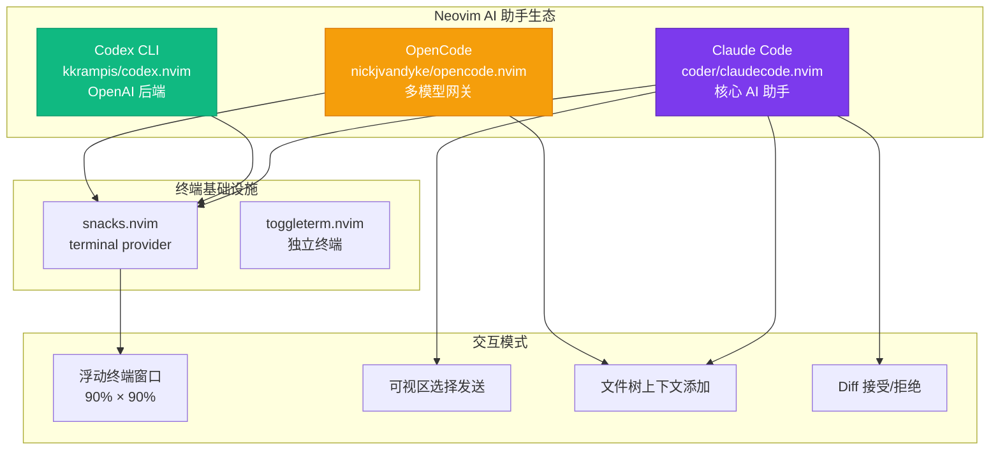
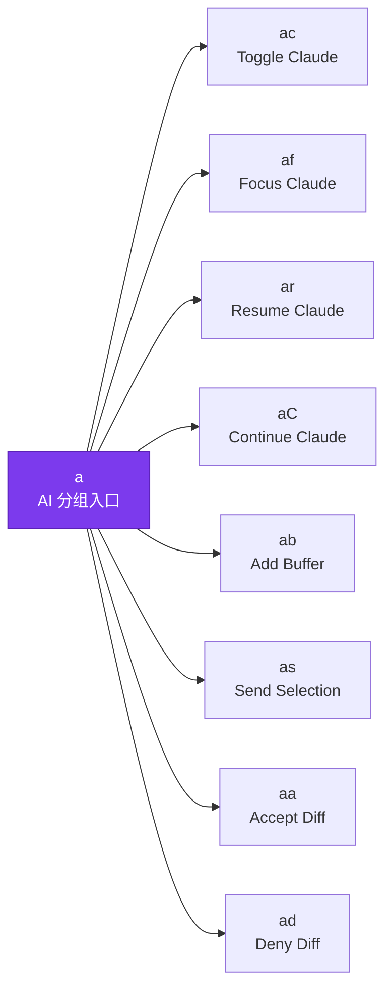
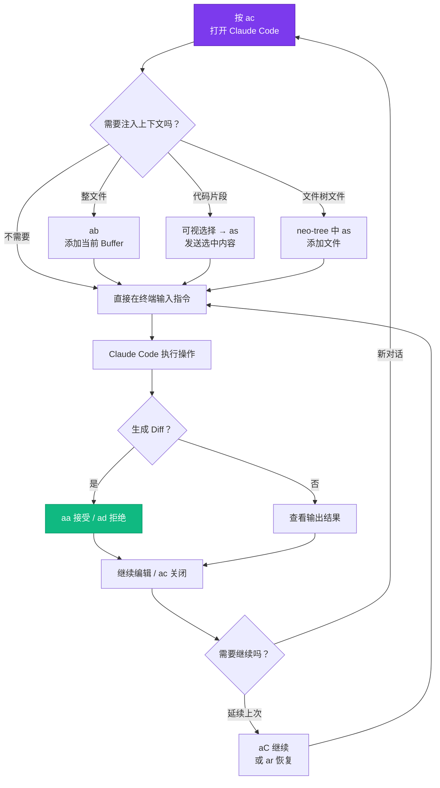

本配置框架集成了三款 AI 编码助手——**Claude Code**、**OpenAI Codex** 与 **OpenCode**——以统一的 `<leader>` 快捷键前缀与 snacks 终端基础设施，构建了从代码生成、上下文发送到 Diff 管理的完整 AI 辅助工作流。本文将深入解析 Claude Code 作为核心 AI 助手的配置架构、快捷键体系与实际使用模式，并概述 Codex 和 OpenCode 的定位差异，帮助开发者根据场景选择合适的工具。

Sources: [claudecode.lua](lua/plugins/claudecode.lua#L1-L34), [codex.lua](lua/plugins/codex.lua#L1-L29), [opencode.lua](lua/plugins/opencode.lua#L1-L80)

## AI 助手生态总览

本配置同时集成了三个独立的 AI 编码助手插件，各自面向不同的使用场景和 AI 后端。理解它们之间的定位差异是高效使用的前提。



三者核心差异对比：

| 特性 | Claude Code | Codex CLI | OpenCode |
|---|---|---|---|
| **插件** | `coder/claudecode.nvim` | `kkrampis/codex.nvim` | `nickjvandyke/opencode.nvim` |
| **AI 后端** | Anthropic Claude | OpenAI 系列 | 多模型网关（`--port`） |
| **Leader 前缀** | `<leader>a` | `<leader>c` | `<leader>o` |
| **终端提供者** | snacks（可配置） | 内置浮动窗口 | snacks |
| **Diff 管理** | ✅ 接受/拒绝内置 | ❌ | ❌ |
| **上下文添加** | Buffer / 选择 / 文件树 | ❌ | `@this:` 上下文 |
| **Picker 集成** | ❌ | ❌ | ✅ snacks picker 发送 |
| **懒加载** | 按键触发 | `cmd` + `keys` 触发 | 按键触发 |

Sources: [claudecode.lua](lua/plugins/claudecode.lua#L1-L34), [codex.lua](lua/plugins/codex.lua#L1-L29), [opencode.lua](lua/plugins/opencode.lua#L1-L80)

## Claude Code 配置架构

Claude Code 插件采用 `coder/claudecode.nvim`，通过 lazy.nvim 的 `opts` 机制完成声明式配置。其核心设计理念是**终端即界面**——将 Claude Code CLI 嵌入 snacks 浮动终端窗口，实现编辑器内的无缝交互。

### 终端提供者与窗口布局

配置中指定 `terminal.provider = "snacks"`，这意味着 Claude Code 使用 [snacks.nvim](lua/plugins/snacks.lua) 的终端模块而非 Neovim 原生终端。snacks 终端提供了更精细的窗口控制能力，包括浮窗定位、自定义边框和终端生命周期管理。

窗口尺寸设置为视口的 90% 宽高（`width = 0.90, height = 0.90`），配合 `border = "rounded"` 圆角边框，在保持编辑器可见性的同时最大化 AI 交互区域。浮动窗口模式（`position = "float"`）确保 Claude Code 不会永久占据编辑器布局空间。

Sources: [claudecode.lua](lua/plugins/claudecode.lua#L5-L13)

### 权限跳过标志

配置中使用了 `terminal_cmd = "claude --dangerously-skip-permissions"` 参数。该标志使 Claude Code 在执行文件读写、命令运行等操作时跳过逐次权限确认，实现**无中断的流畅工作流**。这个设计选择在可信开发环境中极大地提升了交互效率——当你向 Claude Code 发送指令后，它可以连续执行多步骤操作（创建文件、修改代码、运行测试）而无需人工逐次批准。

> ⚠️ **安全提示**：`--dangerously-skip-permissions` 适合本地开发环境使用。在处理敏感代码库或生产环境时，建议移除此标志以启用交互式权限确认。

Sources: [claudecode.lua](lua/plugins/claudecode.lua#L4)

## 快捷键体系：`<leader>a` 分组

Claude Code 的所有快捷键统一挂载在 `<leader>a`（即 `空格 + a`）前缀下，`a` 取自 "AI" 的首字母。该分组同时注册了 Normal 模式和 Visual 模式的入口，确保在可视选择状态下也能直接调用 AI 功能。



### 核心交互快捷键

| 快捷键 | 命令 | 模式 | 功能说明 |
|---|---|---|---|
| `<leader>ac` | `ClaudeCode` | n | **切换 Claude Code 窗口**——首次按下启动，再次按下关闭 |
| `<leader>af` | `ClaudeCodeFocus` | n | **聚焦到 Claude Code 窗口**——在多窗口布局中将光标移至 AI 终端 |
| `<leader>ar` | `ClaudeCode --resume` | n | **恢复上次会话**——加载历史对话上下文，继续上次未完成的工作 |
| `<leader>aC` | `ClaudeCode --continue` | n | **继续上次对话**——以新的用户输入延续最近一次对话 |

这四个命令构成了 Claude Code 的**会话生命周期管理**链：`ac` 启动新会话 → `af` 在窗口间切换焦点 → `ar` 恢复特定历史会话 → `aC` 快速延续最近对话。在日常工作流中，`<leader>ac` 是最高频使用的入口。

Sources: [claudecode.lua](lua/plugins/claudecode.lua#L15-L21)

### 上下文注入快捷键

| 快捷键 | 命令 | 模式 | 功能说明 |
|---|---|---|---|
| `<leader>ab` | `ClaudeCodeAdd %` | n | **将当前 Buffer 全文添加**到 Claude Code 上下文 |
| `<leader>as` | `ClaudeCodeSend` | v | **发送可视选择内容**到 Claude Code（仅 Visual 模式） |
| `<leader>as` | `ClaudeCodeTreeAdd` | n | **从文件树添加文件**（仅在 NvimTree/neo-tree/oil 中生效） |

上下文注入是 AI 编码助手的核心能力之一。三组快捷键覆盖了从**整文件级**（`ab`）到**代码片段级**（`as` Visual）到**文件树级**（`as` 文件树 filetype）的完整粒度。

值得注意的是 `<leader>as` 存在**双模态绑定**：在 Visual 模式下发送选中文本给 Claude，而在 neo-tree 等 Side Panel 文件浏览器中则变为添加指定文件。这种设计利用了 lazy.nvim 的 `ft`（filetype）条件绑定和 `mode` 过滤，在同一按键空间内实现了语义不冲突的多功能复用。

Sources: [claudecode.lua](lua/plugins/claudecode.lua#L21-L28)

### Diff 管理快捷键

| 快捷键 | 命令 | 功能说明 |
|---|---|---|
| `<leader>aa` | `ClaudeCodeDiffAccept` | **接受** Claude Code 提议的代码变更 |
| `<leader>ad` | `ClaudeCodeDiffDeny` | **拒绝** Claude Code 提议的代码变更 |

Claude Code 修改文件时会生成 Diff 视图，允许开发者在应用前审阅每处变更。这对协同编码场景至关重要——你可以逐个审阅 AI 的修改建议，只接受符合预期的部分。`aa`（Accept）与 `ad`（Deny）的按键设计遵循了左手区域操作原则，配合 Diff 视图使用时无需移动右手。

Sources: [claudecode.lua](lua/plugins/claudecode.lua#L29-L31)

## 典型工作流

将上述快捷键组合起来，可以构建高效的 AI 辅助编码工作流。以下流程图展示了一个完整的 Claude Code 使用场景：



### 场景一：代码重构辅助

在重构一个 C# 服务类时，工作流通常如下：先用 `<leader>ac` 打开 Claude Code，再用 `<leader>ab` 将当前文件加入上下文，然后输入重构指令（例如"将此方法提取为接口并实现依赖注入"）。Claude Code 执行后生成 Diff，通过 `<leader>aa` / `<leader>ad` 逐个审阅变更。

### 场景二：Bug 诊断

面对复杂 Bug 时，可以先在 Visual 模式下选中可疑代码段，按 `<leader>as` 发送给 Claude Code 并附上错误信息。也可以通过 `<leader>ar` 恢复之前的诊断会话，保留历史上下文继续排查。

Sources: [claudecode.lua](lua/plugins/claudecode.lua#L15-L32)

## Codex CLI 与 OpenCode 定位

虽然本文聚焦 Claude Code，但了解同配置中的其他 AI 工具有助于在需要时快速切换。

### Codex CLI（OpenAI 后端）

Codex 插件通过 `kkrampis/codex.nvim` 集成 OpenAI 的 Codex CLI 工具。它使用**懒加载策略**（`lazy = true`），仅在执行 `Codex` 或 `CodexToggle` 命令时才加载，最小化启动开销。快捷键为 `<leader>cc`，配置了 0.9 × 0.9 的浮动窗口，支持自动安装（`autoinstall = true`）和可选的模型指定（如 `o3-mini`）。

与 Claude Code 不同，Codex 当前不提供 Diff 管理和上下文注入功能，定位更偏向于**快速问答式交互**。

Sources: [codex.lua](lua/plugins/codex.lua#L1-L29)

### OpenCode（多模型网关）

OpenCode 插件是最复杂的 AI 集成，通过 `nickjvandyke/opencode.nvim` 实现。它的核心特色是**深度 snacks picker 集成**——在 snacks 文件选择器中可以通过 `<A-a>`（Alt+A）直接将选中内容发送给 OpenCode，实现从文件搜索到 AI 提问的无缝衔接。

OpenCode 使用 `opencode --port` 命令启动本地服务器模式，通过 snacks 终端管理完整的生命周期（start / stop / toggle）。快捷键绑定在 `<leader>o` 分组下：`<leader>oo` 带上下文提问（`@this:` 前缀），`<leader>ox` 执行操作选择，`<leader>og` 切换终端窗口。

Sources: [opencode.lua](lua/plugins/opencode.lua#L1-L80)

## 终端基础设施与集成点

三个 AI 助手插件均依赖 [snacks.nvim](lua/plugins/snacks.lua) 作为终端提供者。snacks 在本配置中以 `lazy = false` 和 `priority = 1000` 加载（即最高优先级的无条件加载），确保 AI 工具在任何时刻都能唤起终端窗口。

Claude Code 通过 `terminal.provider = "snacks"` 显式声明依赖；OpenCode 通过 `require("snacks.terminal")` 直接调用 snacks 的终端 API；Codex 则使用内置浮动窗口实现（不依赖 snacks 终端，但共享相似的窗口布局参数）。

这种**统一终端基础设施**的架构选择带来了两个好处：一是 AI 窗口与编辑器窗口的行为一致（如 `<leader><TAB>` 从 [keymap.lua](lua/core/keymap.lua#L53) 定义的终端转义映射在所有 AI 终端中均生效）；二是窗口尺寸、边框样式等视觉参数可以在 snacks 层面统一调控。

Sources: [claudecode.lua](lua/plugins/claudecode.lua#L6), [opencode.lua](lua/plugins/opencode.lua#L46-L63), [snacks.lua](lua/plugins/snacks.lua#L1-L5), [keymap.lua](lua/core/keymap.lua#L53)

## 配置定制指南

### 修改窗口尺寸

在 [claudecode.lua](lua/plugins/claudecode.lua) 中调整 `snacks_win_opts` 参数即可改变 Claude Code 的窗口布局。例如，将窗口缩小到 70% 以便同时查看编辑内容：

```lua
snacks_win_opts = {
  position = "float",
  width = 0.70,
  height = 0.70,
  border = "rounded",
},
```

### 启用权限确认

如果在团队或敏感项目中使用，建议移除 `--dangerously-skip-permissions` 标志：

```lua
terminal_cmd = "claude",  -- 移除 --dangerously-skip-permissions
```

### 添加自定义快捷键

在 `keys` 表中追加绑定即可扩展功能。例如，添加一个快捷键来快速询问当前函数的解释：

```lua
{ "<leader>a?", function()
    vim.cmd("ClaudeCodeSend")
    -- 在 Claude 终端中自动输入提示词
end, mode = "v", desc = "Explain selection" },
```

Sources: [claudecode.lua](lua/plugins/claudecode.lua#L1-L34)

## 相关页面

- [快捷键体系：Leader 键分组与 buffer-local 绑定策略](12-kuai-jie-jian-ti-xi-leader-jian-fen-zu-yu-buffer-local-bang-ding-ce-lue)——理解 `<leader>a` 分组在整个快捷键体系中的位置
- [终端集成：toggleterm 浮动终端与 PowerShell 7](16-zhong-duan-ji-cheng-toggleterm-fu-dong-zhong-duan-yu-powershell-7)——了解 AI 终端之外的通用终端集成方案
- [文件浏览与项目管理：neo-tree、yazi 与 snacks picker](13-wen-jian-liu-lan-yu-xiang-mu-guan-li-neo-tree-yazi-yu-snacks-picker)——理解 `<leader>as` 在文件树中的上下文添加机制
- [界面美化系统：tokyonight 主题、noice 命令行、lualine 状态栏](18-jie-mian-mei-hua-xi-tong-tokyonight-zhu-ti-noice-ming-ling-xing-lualine-zhuang-tai-lan)——AI 终端窗口继承全局主题配置