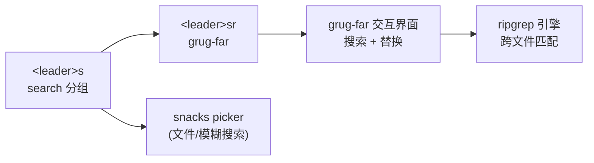
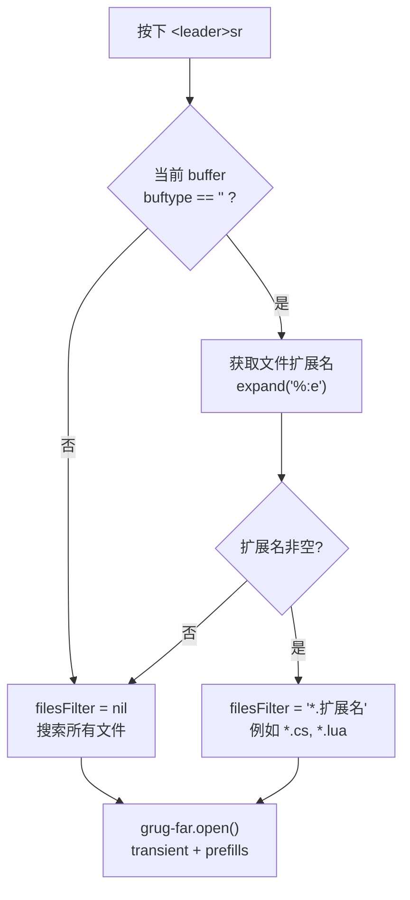
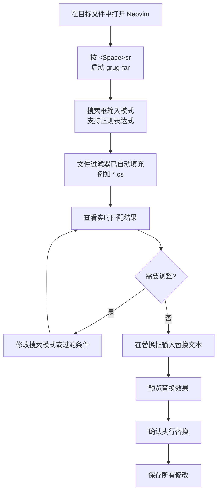

本页解析 `grug-far.nvim` 在本配置中的集成方式——一个基于 `replace` 引擎（ripgrep）的 Neovim 跨文件搜索与替换工具。文档涵盖其懒加载策略、智能文件类型过滤机制、以及 `<leader>sr` 快捷键的完整调用链路。

## 插件定位与架构角色

在 Neovim 生态中，跨文件搜索替换是一个高频需求。原生 `:vimgrep` 和 `:cdo` 组合虽然功能完备，但操作链冗长、缺乏即时反馈。`grug-far.nvim` 采用**交互式 REPL 界面**设计——用户在一个专属 buffer 中输入搜索模式、替换文本和文件过滤条件，所有匹配结果实时呈现，确认后批量执行替换。

在本配置的整体架构中，grug-far 属于 **plugins 扩展层** 的搜索能力补充，与 which-key 的 `<leader>s` 分组协同工作：

如图所示，`<leader>s` 分组下辖多条搜索路径，其中 `<leader>sr` 专责**带替换功能的跨文件搜索**，而模糊文件查找等由 [snacks picker](13-wen-jian-liu-lan-yu-xiang-mu-guan-li-neo-tree-yazi-yu-snacks-picker) 承担。

Sources: [grug-far.lua](lua/plugins/grug-far.lua#L1-L23), [whichkey.lua](lua/plugins/whichkey.lua#L23)

## 懒加载策略：命令与按键双重触发

grug-far 采用 lazy.nvim 的**命令 + 按键**双重懒加载机制，仅在用户实际调用时才加载插件代码：

| 触发方式 | 配置项 | 说明 |
|---------|--------|------|
| 命令触发 | `cmd = { "GrugFar", "GrugFarWithin" }` | 执行 `:GrugFar` 或 `:GrugFarWithin` 时加载 |
| 按键触发 | `keys = { "<leader>sr" }` | 按下 `<Space>sr` 时加载并执行 |

这种设计确保 grug-far 不会在 Neovim 启动时拖慢加载速度。用户首次按下 `<leader>sr` 时，lazy.nvim 会完成插件下载（如未缓存）、模块加载和回调执行的全流程。`GrugFarWithin` 命令作为备选入口保留，用于在**已有 grug-far 实例**中追加新搜索。

Sources: [grug-far.lua](lua/plugins/grug-far.lua#L5-L22)

## 智能文件类型过滤：上下文感知的搜索范围

`<leader>sr` 的回调函数是该配置中最精巧的部分。它不仅仅是简单调用 `grug-far.open()`，而是**自动检测当前 buffer 的文件扩展名**，并将其作为预填充的文件过滤器：

核心逻辑拆解如下：

1. **`vim.bo.buftype == ""`** — 判断当前 buffer 是否为普通文件 buffer。像终端、帮助文档、quickfix 等特殊 buffer 的 `buftype` 不为空字符串，此时跳过文件类型推断，避免对非文件 buffer 做无意义的过滤。

2. **`vim.fn.expand("%:e")`** — 提取当前文件扩展名。例如编辑 `Program.cs` 时返回 `cs`，编辑 `init.lua` 时返回 `lua`。

3. **三元链式判断** — `ext and ext ~= "" and "*." .. ext or nil`，仅当扩展名存在且非空时才生成 `*.cs` 形式的 glob 模式，否则传 `nil` 让 grug-far 搜索所有文件。

这种设计的实际效果是：当你在 `.cs` 文件中发起搜索时，搜索范围自动限定为 `*.cs`；在 `.lua` 文件中则限定为 `*.lua`。**这大幅减少了不相关的匹配噪音**，对 C#/.NET 项目尤为实用——在一个包含 `.cs`、`.csproj`、`.sln`、`.json` 等多种文件类型的解决方案中，精准过滤到代码文件意味着更快的结果返回和更清晰的替换预览。

Sources: [grug-far.lua](lua/plugins/grug-far.lua#L9-L17)

## Transient 模式：一次性搜索实例

`transient = true` 参数控制 grug-far 窗口的生命周期。启用后，每次按下 `<leader>sr` 都会**创建全新的搜索实例**而非复用已有窗口。这意味着：

- 前一次搜索的输入内容不会被保留，每次启动都是空白状态
- 避免旧搜索参数干扰新的搜索意图
- 关闭窗口后 buffer 自动清理，不会在 buffer 列表中堆积

如果需要**持久化的搜索会话**（如逐步调整搜索条件），可以直接使用 `:GrugFar` 命令——它创建的是非 transient 实例，搜索参数在窗口关闭后仍然保留，可通过 `:GrugFarWithin` 在同一实例中继续操作。

Sources: [grug-far.lua](lua/plugins/grug-far.lua#L13)

## 全局配置与 headerMaxWidth

`opts = { headerMaxWidth = 80 }` 是本配置为 grug-far 设置的唯一全局选项。该参数限制 grug-far 交互界面中**帮助头部的最大显示宽度为 80 字符**，确保在宽屏显示器上帮助文本不会拉伸得过长而难以阅读。其余所有 grug-far 行为均采用插件默认值，包括 ripgrep 作为后端搜索引擎、同步替换模式等。

Sources: [grug-far.lua](lua/plugins/grug-far.lua#L4)

## 快捷键体系中的位置

在 which-key 注册的快捷键分组中，`<leader>s` 被定义为 **search** 组。当用户按下 `<Space>s` 后，which-key 弹出提示面板，其中 `r` 条目显示为 `Search and Replace`——这正是 grug-far 的 `desc` 字段值。这一分组设计使搜索相关功能形成**语义聚合**，用户可通过 [快捷键发现：which-key 按键提示系统](23-kuai-jie-jian-fa-xian-which-key-an-jian-ti-shi-xi-tong) 自然发现并使用 grug-far。

值得注意的是，`<leader>sr` 同时支持**普通模式 (`n`)** 和**可视模式 (`x`)**。在可视模式下选中一段文本后按下 `<Space>sr`，选中的文本可以作为搜索的起点内容（具体行为取决于 grug-far 的 visual 模式处理）。

Sources: [grug-far.lua](lua/plugins/grug-far.lua#L18-L19), [whichkey.lua](lua/plugins/whichkey.lua#L23)

## 使用流程与操作参考

以下是一个典型的跨文件搜索替换工作流：

grug-far 交互界面内的关键字段说明：

| 字段 | 作用 | 本配置行为 |
|------|------|-----------|
| Search | 搜索模式，支持 ripgrep 正则 | 用户手动输入 |
| Replace | 替换文本，支持捕获组引用 | 用户手动输入 |
| Files Filter | 文件 glob 过滤 | **自动填充**当前文件扩展名 |
| Paths | 搜索根路径 | 默认当前工作目录 |

操作完成后，grug-far 会显示替换统计（匹配文件数、替换处数），所有修改通过 Neovim 的 buffer 机制完成，可通过 `:wa` 一次性保存或逐个审查后保存。

Sources: [grug-far.lua](lua/plugins/grug-far.lua#L1-L23)

## 相关导航

- **搜索功能的另一种形态**：[文件浏览与项目管理：neo-tree、yazi 与 snacks picker](13-wen-jian-liu-lan-yu-xiang-mu-guan-li-neo-tree-yazi-yu-snacks-picker) — snacks picker 提供模糊文件搜索，与 grug-far 形成互补
- **按键发现入口**：[快捷键发现：which-key 按键提示系统](23-kuai-jie-jian-fa-xian-which-key-an-jian-ti-shi-xi-tong) — 理解 `<leader>s` 分组如何帮助记忆搜索快捷键
- **编辑增强**：[编辑增强：flash 快速跳转、nvim-surround、autopairs](25-bian-ji-zeng-qiang-flash-kuai-su-tiao-zhuan-nvim-surround-autopairs) — 单文件内的快速跳转与文本对象操作