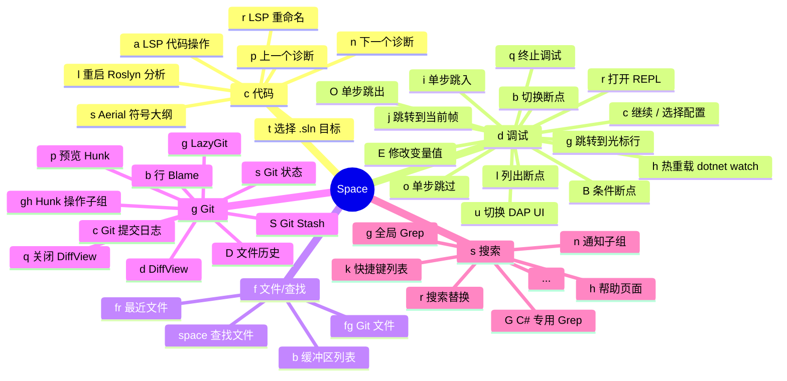

**which-key.nvim** 是本配置中的快捷键发现引擎。当你在 Normal 模式下按下前缀键（如 `<leader>`、`g`、`z`）后，它会弹出一个浮窗，实时列出所有可用的后续操作及其描述文本。本文将解析该插件在本项目中的配置策略、分组架构、插件集成模式，以及两个动态扩展（expand）机制的实现细节。

Sources: [whichkey.lua](lua/plugins/whichkey.lua#L1-L75)

## 插件加载策略

which-key 使用 lazy.nvim 的 `event = "VeryLazy"` 加载机制，这意味着它在 Neovim 完成基础初始化、所有插件 spec 被解析之后才激活。这是一个精确的设计选择：此时所有插件通过 `keys` 字段声明的快捷键及其 `desc` 描述文本已经注册完毕，which-key 启动时即可采集完整的映射信息。配置采用 `opts` + 自定义 `config` 函数的双层模式——`opts` 表会被 lazy.nvim 深度合并后传入 `config`，而 `config` 函数中显式调用 `wk.setup(opts)` 完成初始化，并在 `opts.defaults` 非空时将其作为旧式注册兜底。

Sources: [whichkey.lua](lua/plugins/whichkey.lua#L3-L74), [init.lua](init.lua#L12-L15)

## Helix 预设与显示风格

```lua
preset = "helix"
```

which-key 内置多种视觉布局预设（`classic`、`modern`、`helix`）。本项目选用 **helix** 预设——该预设将弹出面板渲染在编辑器底部，采用水平排列的快捷键列表，视觉干扰最小。与 classic 预设（居中浮窗）或 modern 预设（右侧面板）相比，helix 预设不会遮挡编辑区域中央的代码内容，特别适合高频触发场景（每次按下 `<leader>` 后都会短暂出现）。

Sources: [whichkey.lua](lua/plugins/whichkey.lua#L8)

## 快捷键分组架构

which-key 的核心能力在于**分组（group）**机制：为一个前缀键指定语义化的组名后，按下该前缀时弹出窗口会先显示组名而非原始键位，帮助用户快速定位功能域。本配置在 `spec` 中定义了完整的分组体系，涵盖 Leader 前缀和非 Leader 前缀两大类，所有分组声明作用于 `{ "n", "x" }` 两种模式（Normal 和 Visual-select）。

Sources: [whichkey.lua](lua/plugins/whichkey.lua#L10-L48)

### Leader 前缀分组

所有以 `<leader>`（Space 键）开头的快捷键被组织为以下功能域：

| 前缀 | 组名 | 语义域 | 主要提供者 |
|------|------|--------|-----------|
| `<leader><tab>` | tabs | 标签页管理 | [keymap.lua](lua/core/keymap.lua#L61-L67) |
| `<leader>b` | buffer | 缓冲区操作（含动态列表） | [bufferline.lua](lua/plugins/bufferline.lua#L26-L37) |
| `<leader>c` | code | 代码 / LSP 操作 | [lspsaga.lua](lua/plugins/lspsaga.lua#L11-L15), [roslyn.lua](lua/plugins/roslyn.lua#L43-L62), [aerial.lua](lua/plugins/aerial.lua#L118-L120), [mason.lua](lua/plugins/mason.lua#L63-L83) |
| `<leader>d` | debug | 调试（DAP） | [dap.lua](lua/core/dap.lua#L280-L342) |
| `<leader>dp` | profiler | 调试子组：性能分析 | [whichkey.lua](lua/plugins/whichkey.lua#L18) |
| `<leader>f` | file/find | 文件查找 | [snacks.lua](lua/plugins/snacks.lua#L56-L61) |
| `<leader>g` | git | Git 操作 | [lazygit.lua](lua/plugins/lazygit.lua#L7-L9), [diffview.lua](lua/plugins/diffview.lua#L4-L8), [gitsigns.lua](lua/plugins/gitsigns.lua#L21-L29), [snacks.lua](lua/plugins/snacks.lua#L63-L67) |
| `<leader>gh` | hunks | Git 子组：行级变更 | [gitsigns.lua](lua/plugins/gitsigns.lua#L25-L29) |
| `<leader>q` | quit/session | 退出 / 会话 | [keymap.lua](lua/core/keymap.lua#L50) |
| `<leader>s` | search | 搜索 | [snacks.lua](lua/plugins/snacks.lua#L69-L133), [grug-far.lua](lua/plugins/grug-far.lua#L6-L22) |
| `<leader>sn` | +notify | 搜索子组：通知 | [snacks.lua](lua/plugins/snacks.lua#L131-L133) |
| `<leader>u` | ui | 界面切换 | 各 UI 插件 |
| `<leader>w` | windows | 窗口管理（含 proxy） | [keymap.lua](lua/core/keymap.lua#L56-L58) |
| `<leader>x` | diagnostics/quickfix | 诊断 / 快速修复 | 诊断相关插件 |

Sources: [whichkey.lua](lua/plugins/whichkey.lua#L11-L48)

### 非 Leader 前缀分组

which-key 不仅服务于 Leader 快捷键。本配置还注册了多个单键前缀的分组语义：

| 前缀 | 组名 | 覆盖模式 | 用途 |
|------|------|----------|------|
| `[` | prev | n, x | 跳转到上一个目标（hunk、诊断等） |
| `]` | next | n, x | 跳转到下一个目标 |
| `g` | goto | n, x | 跳转类操作（定义、引用、声明等） |
| `gs` | surround | n, x | 环绕编辑（nvim-surround） |
| `z` | fold | n, x | 折叠操作（nvim-ufo） |

按下对应键后 which-key 会展示该前缀下所有已注册的后续操作。例如按下 `]` 后会显示 `]h`（Next Hunk，来自 Gitsigns）；按下 `g` 后会显示 `gd`（Goto Definition）、`gr`（Goto References）等由 Mason LspAttach 回调注册的跳转命令。此外，`gx` 被单独标记为 "Open with system app"，用于使用系统默认程序打开光标下的链接。

Sources: [whichkey.lua](lua/plugins/whichkey.lua#L26-L30), [gitsigns.lua](lua/plugins/gitsigns.lua#L22-L23), [mason.lua](lua/plugins/mason.lua#L71-L81)

## 插件集成模式：去中心化的描述注册

which-key 的强大之处在于其**被动发现**机制：无需在每个插件中显式调用 which-key API，只要快捷键绑定时附带了 `desc` 字段，which-key 就会自动采集并展示。本项目的架构正是充分利用了这一模式——每个插件文件只负责声明自己的快捷键和描述，完全不需要知道 which-key 的存在。

```mermaid
flowchart TB
    subgraph 核心层["核心层（加载时即注册）"]
        KM["keymap.lua<br/>全局快捷键 + desc"]
        WK["whichkey.lua<br/>分组定义 + 专属键"]
    end

    subgraph 插件层["插件层（各自声明 keys）"]
        SN["snacks.lua"]
        GS["gitsigns.lua"]
        DV["diffview.lua"]
        FL["flash.lua"]
        NO["noice.lua"]
        BL["bufferline.lua"]
        NT["neo-tree.lua"]
        AE["aerial.lua"]
        GF["grug-far.lua"]
        LG["lazygit.lua"]
    end

    subgraph 条件层["条件层（Buffer-local，按需注册）"]
        DAP["dap.lua<br/>LspAttach → leader d*"]
        ROS["roslyn.lua<br/>LspAttach → leader c*"]
        MSP["mason.lua<br/>LspAttach → g*, leader c*"]
    end

    KM -->|"desc 自动采集"| WK
    SN -->|"desc 自动采集"| WK
    GS -->|"desc 自动采集"| WK
    DV -->|"desc 自动采集"| WK
    FL -->|"desc 自动采集"| WK
    NO -->|"desc 自动采集"| WK
    BL -->|"desc 自动采集"| WK
    NT -->|"desc 自动采集"| WK
    AE -->|"desc 自动采集"| WK
    GF -->|"desc 自动采集"| WK
    LG -->|"desc 自动采集"| WK
    DAP -->|"buffer-local desc"| WK
    ROS -->|"buffer-local desc"| WK
    MSP -->|"buffer-local desc"| WK

    style WK fill:#7aa2f7,stroke:#3b4261,color:#1a1b26
    style DAP fill:#bb9af7,stroke:#3b4261,color:#1a1b26
    style ROS fill:#bb9af7,stroke:#3b4261,color:#1a1b26
    style MSP fill:#bb9af7,stroke:#3b4261,color:#1a1b26
```



Sources: [whichkey.lua](lua/plugins/whichkey.lua#L1-L75), [keymap.lua](lua/core/keymap.lua#L1-L68)

### 三层注册时机

本项目中快捷键的注册分为三个时机层级，每一层都会向 which-key 提供描述信息：

**即时层（Startup）**：[keymap.lua](lua/core/keymap.lua#L1-L68) 在 `init.lua` 加载阶段同步执行，注册窗口导航（`<C-h/j/k/l>`）、行移动（`<A-j/k>`）、保存（`<C-s>`）、标签页管理（`<leader><tab>*`）等全局快捷键。这些映射带有 `desc` 字段，which-key 在 VeryLazy 时即刻可见。

**插件层（Plugin Load）**：各插件通过 lazy.nvim 的 `keys` 字段声明快捷键。lazy.nvim 在对应键被首次按下时触发插件加载，但在 `keys` 数组中直接声明的 `desc` 文本在启动时即被注册为"占位映射"——which-key 能在插件未加载时就展示该描述，按下的瞬间才触发实际加载。例如 [snacks.lua](lua/plugins/snacks.lua#L56-L133) 中的 30+ 个搜索/查找命令全部通过这种模式注册。

**条件层（Buffer-local）**：DAP 调试键（[dap.lua](lua/core/dap.lua#L226-L342)）、Roslyn LSP 键（[roslyn.lua](lua/plugins/roslyn.lua#L32-L63)）和通用 LSP 键（[mason.lua](lua/plugins/mason.lua#L63-L83)）通过 `LspAttach` 自动命令注册，只在特定 buffer 中且 LSP 客户端 attach 后才存在。这类键的 `desc` 以功能域前缀标记（如 `"DAP: Continue"`、`"Roslyn: Select Solution Target"`、`"LSP: [G]oto [D]efinition"`），在 which-key 弹窗中清晰区分来源。

Sources: [init.lua](init.lua#L12-L22), [dap.lua](lua/core/dap.lua#L226-L342), [roslyn.lua](lua/plugins/roslyn.lua#L32-L63), [mason.lua](lua/plugins/mason.lua#L63-L83)

## 两个专属触发键

除了自动弹出的被动模式，which-key 配置中还声明了两个主动触发键，提供了不同维度的快捷键浏览能力。

### `<leader>?` — Buffer Keymaps 查看器

```lua
{
  "<leader>?",
  function()
    require("which-key").show({ global = false })
  end,
  desc = "Buffer Keymaps (which-key)",
}
```

这个快捷键调用 `which-key.show()` 并设置 `global = false`，意味着它**只展示当前 buffer 的局部映射**。由于 DAP 调试键和 LSP 跳转键都是 buffer-local 的，在普通 Lua 文件中按下 `<leader>?` 不会显示 C# 专属的调试操作；而在 C# buffer 中，你会看到完整的 DAP 和 Roslyn 操作列表。这是排查"为什么某个快捷键不生效"的首选工具。

Sources: [whichkey.lua](lua/plugins/whichkey.lua#L52-L58)

### `<C-w><Space>` — 窗口 Hydra 模式

```lua
{
  "<c-w><space>",
  function()
    require("which-key").show({ keys = "<c-w>", loop = true })
  end,
  desc = "Window Hydra Mode (which-key)",
}
```

这是 which-key 的 **Hydra 模式**：按下 `<C-w><Space>` 后，which-key 弹出 `<C-w>` 前缀下所有窗口操作的浮窗，执行完一个操作后弹窗**不会消失**，而是继续等待下一次操作。`loop = true` 让这个循环持续到你按下 `<Esc>` 或一个不属于该前缀的键为止。这对连续调整窗口布局（先水平分割、再垂直分割、再调整大小）极为高效。`<leader>w` 也通过 `proxy = "<c-w>"` 映射到相同的操作集，但不是 loop 模式——两种交互风格并存，适用于不同场景。

Sources: [whichkey.lua](lua/plugins/whichkey.lua#L59-L66)

## Expand 动态扩展

配置中为两个分组启用了 `expand` 函数，实现动态内容生成——按下对应前缀时，which-key 不仅展示静态的子命令，还会动态展开当前编辑器状态中的实时数据。

### `<leader>b` — 动态 Buffer 列表

```lua
{
  "<leader>b",
  group = "buffer",
  expand = function()
    return require("which-key.extras").expand.buf()
  end,
}
```

按下 `<leader>b` 时，which-key 不仅展示静态的缓冲区操作（如 `bh` 上一个、`bl` 下一个、`bp` 选择、`bc` 关闭、`bd` 删除、`bo` 关闭其他），还会动态展开当前打开的 buffer 列表，每个 buffer 以编号形式出现，允许直接跳转。这是 which-key 内置的 `expand.buf()` 扩展提供的功能，将 bufferline 的可视标签页与 which-key 的键盘选择无缝融合。

Sources: [whichkey.lua](lua/plugins/whichkey.lua#L32-L37), [bufferline.lua](lua/plugins/bufferline.lua#L26-L37)

### `<leader>w` — 动态窗口列表与 Proxy 代理

```lua
{
  "<leader>w",
  group = "windows",
  proxy = "<c-w>",
  expand = function()
    return require("which-key.extras").expand.win()
  end,
}
```

`<leader>w` 同时使用了 `proxy` 和 `expand` 两个高级特性。`proxy = "<c-w>"` 让 which-key 将所有 `<C-w>` 前缀的原生 Vim 窗口命令（如 `<C-w>s` 水平分割、`<C-w>v` 垂直分割、`<C-w>h/j/k/l` 窗口切换）也纳入展示，无需重复声明。而 `expand.win()` 则动态列出当前所有窗口的编号和名称。这使得 `<leader>w` 成为窗口管理的统一入口——同时涵盖了自定义映射（如 `<leader>wd` 关闭窗口）、原生 Vim 命令和动态窗口列表。

Sources: [whichkey.lua](lua/plugins/whichkey.lua#L39-L45), [keymap.lua](lua/core/keymap.lua#L56-L58)

## C# 开发者的完整分组映射

对于 C# / .NET 开发场景，which-key 展示的快捷键树最为丰富，特别是在 C# buffer 中 `LspAttach` 触发后。以下是在 C# buffer 中 `<leader>` 下的核心功能域映射：



Sources: [dap.lua](lua/core/dap.lua#L280-L342), [roslyn.lua](lua/plugins/roslyn.lua#L43-L62), [lspsaga.lua](lua/plugins/lspsaga.lua#L11-L15), [aerial.lua](lua/plugins/aerial.lua#L118-L120), [snacks.lua](lua/plugins/snacks.lua#L54-L133), [gitsigns.lua](lua/plugins/gitsigns.lua#L21-L29)

## 配置文件关系总览

which-key 的运行依赖多个文件的协作。下表梳理了每个文件在快捷键生态中的角色和贡献方式：

| 文件 | 角色 | 向 which-key 贡献的方式 |
|------|------|------------------------|
| [whichkey.lua](lua/plugins/whichkey.lua) | 中枢配置 | 定义分组、预设、专属触发键、expand/proxy 函数 |
| [keymap.lua](lua/core/keymap.lua) | 全局映射 | 窗口导航、行移动、标签页管理、保存等，附带 `desc` |
| [snacks.lua](lua/plugins/snacks.lua) | 查找器/搜索 | `<leader>f*`、`<leader>s*`、`<leader>g*` 系列（30+ 命令） |
| [gitsigns.lua](lua/plugins/gitsigns.lua) | Git 行级 | `]h`/`[h`、`<leader>gp`、`<leader>gb`、`<leader>gh*` |
| [dap.lua](lua/core/dap.lua) | 调试 | buffer-local `<leader>d*`，C# 文件 LspAttach 后注册 |
| [roslyn.lua](lua/plugins/roslyn.lua) | LSP | buffer-local `<leader>ct`、`<leader>cl`，C# 文件专属 |
| [mason.lua](lua/plugins/mason.lua) | LSP 通用 | buffer-local `gd`、`gr`、`gI`、`gy`、`<leader>cs`、`<leader>cr`、`<leader>ca` |
| [lspsaga.lua](lua/plugins/lspsaga.lua) | LSP 增强 | `<leader>cn` 下一个诊断、`<leader>cp` 上一个诊断 |
| [noice.lua](lua/plugins/noice.lua) | 消息 UI | `<C-f>`/`<C-b>` LSP 文档滚动，`<S-Enter>` 命令行重定向 |
| [bufferline.lua](lua/plugins/bufferline.lua) | 缓冲区 | `<leader>b*` 缓冲区切换、选择、关闭 |
| [diffview.lua](lua/plugins/diffview.lua) | 差异查看 | `<leader>gd`、`<leader>gD`、`<leader>gq` |
| [flash.lua](lua/plugins/flash.lua) | 快速跳转 | `s`、`S`、`r`、`R`、`<C-s>` 等非 Leader 键 |
| [aerial.lua](lua/plugins/aerial.lua) | 代码大纲 | `<leader>cs` 符号大纲 |
| [grug-far.lua](lua/plugins/grug-far.lua) | 搜索替换 | `<leader>sr` 跨文件搜索替换 |
| [neo-tree.lua](lua/plugins/neo-tree.lua) | 文件树 | `<leader>e` 切换、`<leader>o` 聚焦 |
| [lazygit.lua](lua/plugins/lazygit.lua) | Git UI | `<leader>gg` |
| [easy-dotnet.lua](lua/plugins/easy-dotnet.lua) | .NET 工具 | `<leader>n*` 系列（build、run、test、debug 等） |
| [yazi.lua](lua/plugins/yazi.lua) | 文件管理器 | `<leader>-` 打开、`<leader>cw` 工作目录 |

Sources: [whichkey.lua](lua/plugins/whichkey.lua#L1-L75)

## 延伸阅读

- **快捷键体系的完整参考**：参见 [快捷键体系：Leader 键分组与 buffer-local 绑定策略](12-kuai-jie-jian-ti-xi-leader-jian-fen-zu-yu-buffer-local-bang-ding-ce-lue) 了解 Leader 键定义和全局操作的完整速查表。
- **DAP 调试快捷键的详细说明**：参见 [DAP 调试系统架构：多调试器后端切换与适配器注册](8-dap-diao-shi-xi-tong-jia-gou-duo-diao-shi-qi-hou-duan-qie-huan-yu-gua-pei-qi-zhu-ce) 了解调试命令的架构背景。
- **插件管理的按文件组织模式**：参见 [lazy.nvim 插件管理：懒加载策略与 spec 规范](5-lazy-nvim-cha-jian-guan-li-lan-jia-zai-ce-lue-yu-spec-gui-fan) 了解各插件文件的加载时序与 `keys` 字段机制。
- **编辑增强快捷键**：参见 [编辑增强：flash 快速跳转、nvim-surround、autopairs](25-bian-ji-zeng-qiang-flash-kuai-su-tiao-zhuan-nvim-surround-autopairs) 了解非 Leader 前缀下的跳转和环绕编辑操作。